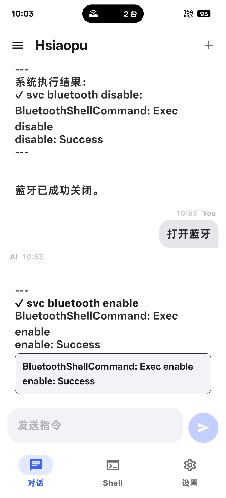
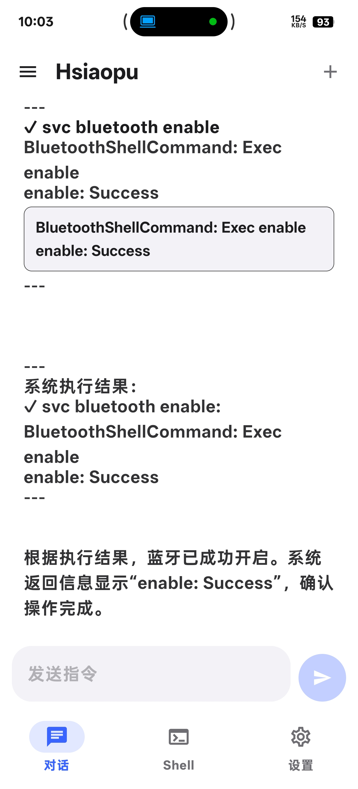
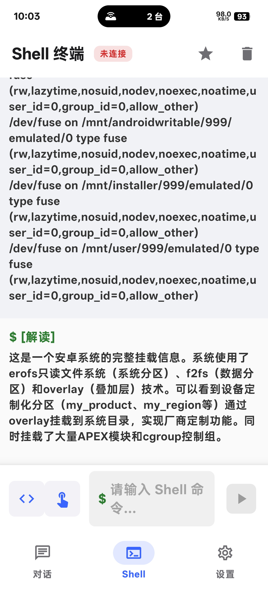
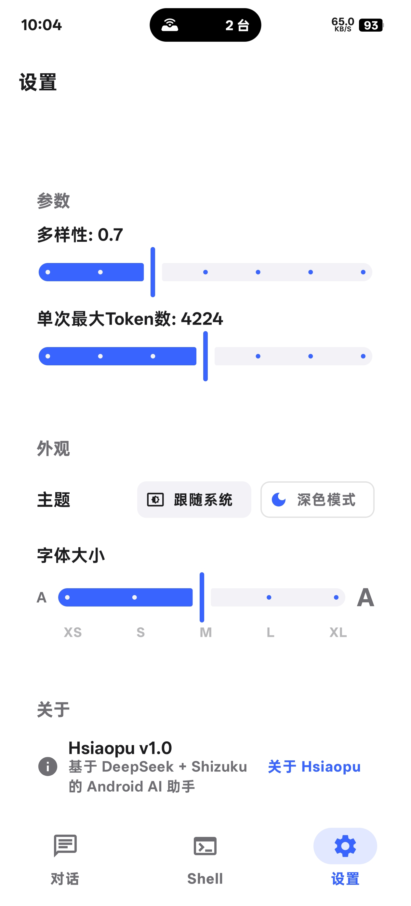

# Hsiaopu (小不衣橱)

> 面向 Android 极客开发者的全功能 AI 工作台 — 集成多模型对话、代码审查、Shizuku Shell 终端、设备工具箱于一体

---

## 应用预览

| AI 对话 | 代码审查 | Shell 终端 | 设备工具箱 |
|:-------:|:--------:|:----------:|:----------:|
|  |  |  |  |

---

## 功能特性

| 模块 | 功能 | 技术亮点 |
|------|------|----------|
| **AI 对话** | 多轮流式对话、Markdown 渲染、多会话管理、导入导出 | OkHttp SSE 流式解析、Room 持久化 |
| **代码审查** | 粘贴代码 → 6 维度 AI 分析 → 改进建议 | 独立 Prompt 工程，不污染对话历史 |
| **Shell 终端** | 自定义命令 + 20 个预定义系统命令、输出折叠/复制 | Shizuku 提权执行、实时 stdout/stderr 分离 |
| **设备工具箱** | 设备信息、网络状态、存储、电池、传感器 | Android 系统 API 直接读取 |
| **AI 工具调用** | WiFi/蓝牙/热点控制、亮度/音量调节、应用管理 | [TOOL:xxx] 标记解析、命令执行后状态验证 |
| **多 Provider** | DeepSeek / OpenAI 兼容 / Ollama 任意切换 | 策略模式 `AiProvider` 接口，插件化注册 |
| **自适应布局** | 手机底部导航 / 平板侧栏双栏 | Material3 Adaptive + WindowSizeClass |
| **主题系统** | 明/暗/跟随系统 + 强调色 | DataStore 持久化偏好 |

---

## 技术栈

| 分类 | 技术 | 版本 |
|------|------|------|
| 语言 | Kotlin | 2.3.x |
| UI 框架 | Jetpack Compose (Material 3) | 1.7.x |
| 依赖注入 | Hilt | 2.52 |
| 数据库 | Room | 2.6.x |
| 网络 | OkHttp + Retrofit | 4.12 / 2.11 |
| 系统权限 | Shizuku | 13.1 |
| 构建工具 | Gradle | 9.4 |

---

## 项目结构

```
app/src/main/java/com/example/hsiaopu/
├── data/                          # 数据层
│   ├── local/                     # Room 数据库 (Entities, DAOs)
│   ├── repository/                # Repository 层
│   ├── Models.kt                  # 数据模型
│   └── SettingsDataStore.kt       # DataStore 设置存储
├── di/                            # 依赖注入
│   └── DatabaseModule.kt          # Room + Hilt 配置
├── network/                       # 网络层
│   ├── ChatApi.kt                 # API 接口定义
│   └── ChatClient.kt              # OkHttp 客户端
├── system/                        # 系统控制
│   ├── ShellExecutor.kt           # Shell 命令执行器
│   ├── ShizukuHelper.kt           # Shizuku 辅助类
│   └── SystemControlExecutor.kt   # AI 工具调用实现
├── ui/
│   ├── screen/                    # 界面层
│   │   ├── HomeScreen.kt          # 对话页面
│   │   ├── ShellScreen.kt         # Shell 终端页面
│   │   ├── SettingsScreen.kt      # 设置页面
│   │   ├── OnboardingScreen.kt    # 引导页
│   │   └── ConversationDrawerContent.kt  # 对话抽屉
│   └── theme/                     # 主题配置 (Color / Theme / Type)
├── viewmodel/
│   └── ChatViewModel.kt           # 核心 ViewModel
├── HsiaopuApp.kt                  # 应用入口
└── MainActivity.kt                # 主 Activity
```

---

## 快速开始

### 环境要求

- Android Studio Hedgehog (2023.1.1) 或更高
- Android SDK 30+
- JDK 11+

### 构建运行

```bash
# 克隆项目
git clone https://github.com/morchalen/Hsiaopu.git

# 在 Android Studio 中打开项目，选择设备后点击 Run
```

### 配置 AI 服务

1. 安装并启动 [Shizuku](https://shizuku.rikka.app/)，授权 Hsiaopu
2. 进入设置页面，配置 AI 服务：

**DeepSeek**：
- Provider: `DeepSeek`
- API Key: 从 [platform.deepseek.com](https://platform.deepseek.com) 获取

**Ollama / OpenAI 兼容**：
- Provider: `OpenAI Compatible`
- Endpoint: `http://<IP>:11434/v1`
- API Key: 任意值（如 `ollama`）

> **隐私优先**：API Key 通过 Android DataStore 加密存储，仅本地使用，不上传任何第三方。

---

## 详细文档

- [产品介绍与使用说明书](Hsiaopu产品介绍与使用说明书.md) — 完整功能说明和操作指南
- [UI 设计规范](DesignGuidelines.md) — Apple HIG 视角的设计规范文档

---

## 许可证

MIT License

---

> Built with Kotlin & Jetpack Compose · 2026 · Hsiaopu Team
