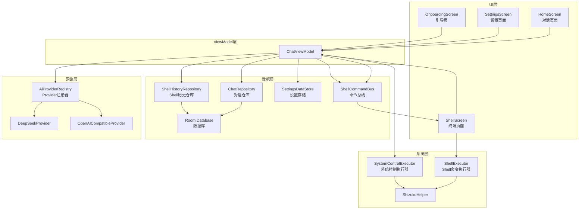
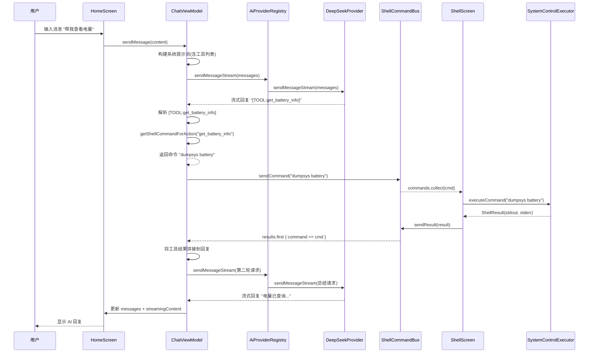
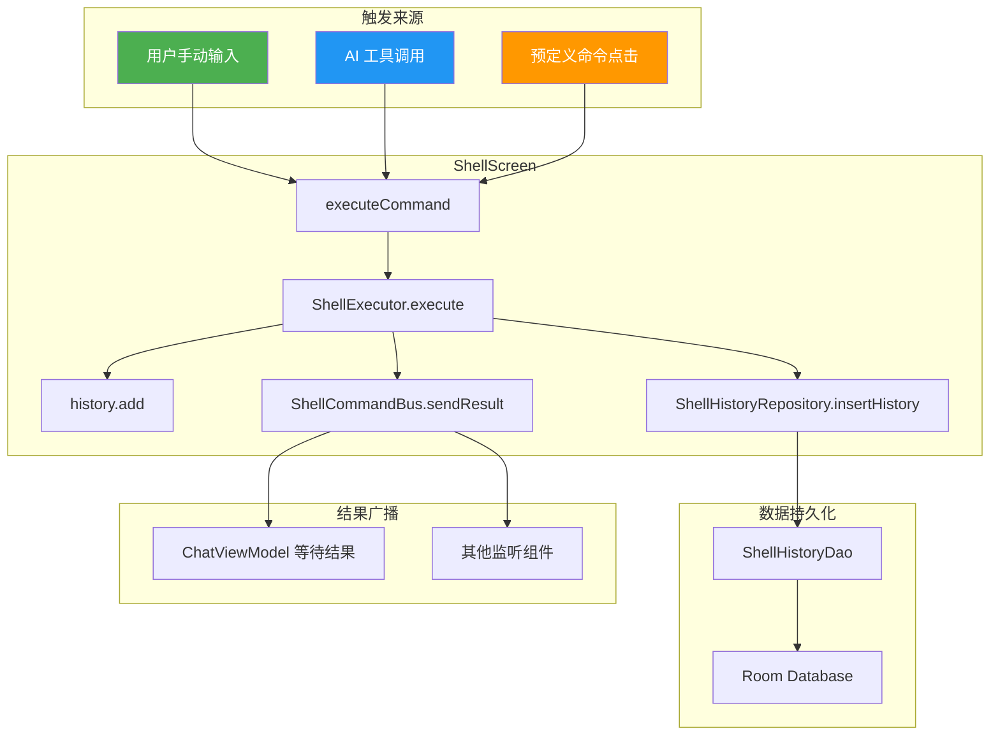

好的，我来给你画三个图，从不同维度理解整个项目的逻辑。

## 图 1：项目架构分层图

## 图 2：AI 对话与工具调用流程图

## 图 3：Shell 命令执行与历史记录流程图

把这三个图贴到支持 Mermaid 的地方（比如 VS Code 装 Markdown Preview Mermaid Support 插件）就能渲染查看了。

如果你想看某个具体模块的更详细流程图，比如 AI Provider 的切换逻辑、主题系统的数据流，告诉我就行。

