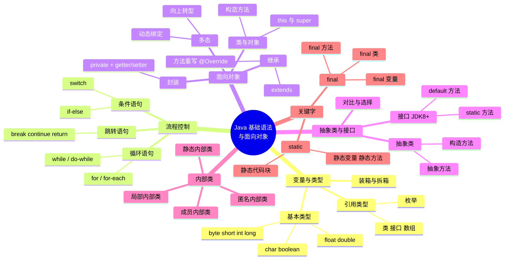
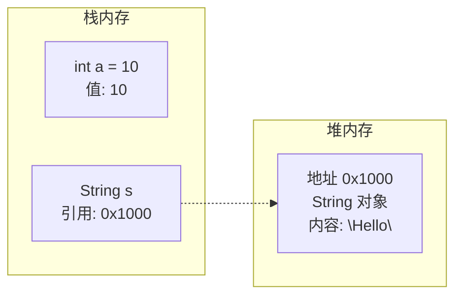
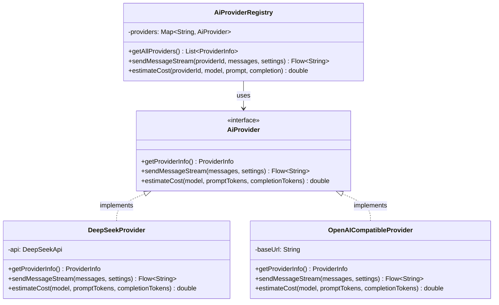
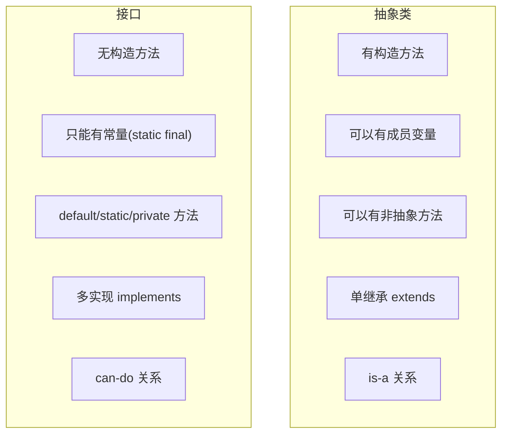
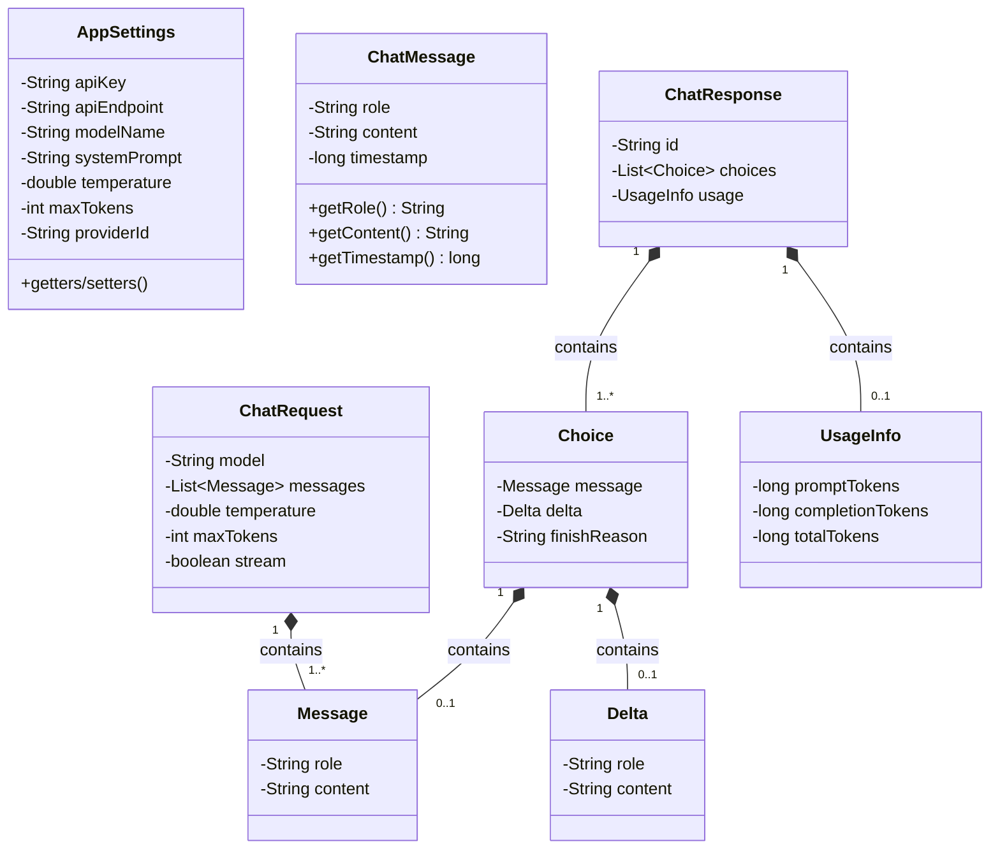

# 01 — Java 基础语法与面向对象

> 本章覆盖 Java 变量类型、流程控制、面向对象三大特性、抽象类与接口、内部类、关键字等核心基础，并结合 Hsiaopu 项目中的数据模型、Provider 接口等实际代码进行讲解。

---

## 📌 本章脑图



---

## 1. 变量类型

### 1.1 基本类型（Primitive Types）

Java 有 8 种基本数据类型，它们直接存储在栈内存中，不属于对象。

| 类型 | 大小 | 默认值 | 范围 | 示例 |
|------|------|--------|------|------|
| `byte` | 1 字节 | 0 | -128 ~ 127 | `byte b = 100;` |
| `short` | 2 字节 | 0 | -32768 ~ 32767 | `short s = 1000;` |
| `int` | 4 字节 | 0 | 约 ±21 亿 | `int i = 100000;` |
| `long` | 8 字节 | 0L | 约 ±9×10¹⁸ | `long l = 100L;` |
| `float` | 4 字节 | 0.0f | 单精度 | `float f = 3.14f;` |
| `double` | 8 字节 | 0.0d | 双精度 | `double d = 3.14;` |
| `char` | 2 字节 | '\u0000' | 0 ~ 65535 | `char c = 'A';` |
| `boolean` | JVM 依赖 | false | true/false | `boolean flag = true;` |

```java
// 自动类型提升：byte → short → int → long → float → double
int a = 10;
double b = a;  // 自动类型转换（隐式）

// 强制类型转换（可能丢失精度）
double pi = 3.14159;
int ipi = (int) pi;  // 结果为 3

// 包装类（装箱/拆箱）
Integer num = 100;       // 自动装箱：int → Integer
int val = num;           // 自动拆箱：Integer → int
```

### 1.2 引用类型（Reference Types）

引用类型存储的是对象在堆内存中的地址引用。

```java
// 类类型
String str = "Hello";
AppSettings settings = new AppSettings();

// 数组类型
int[] arr = new int[5];
String[] names = {"Alice", "Bob"};

// 接口类型
List<String> list = new ArrayList<>();
```

**基本类型 vs 引用类型 对比：**



| 对比维度 | 基本类型 | 引用类型 |
|----------|----------|----------|
| 存储位置 | 栈内存（直接存储值） | 栈存引用，堆存对象 |
| 默认值 | 数值型为 0，boolean 为 false | `null` |
| `==` 比较 | 比较值 | 比较引用地址 |
| `.equals()` | 不可用 | 比较内容（需重写） |
| 内存占用 | 固定、较小 | 不固定、有对象头开销 |

---

### 1.3 Hsiaopu 项目中的数据模型

Hsiaopu 项目中大量使用 `data class`（Kotlin），对应 Java 中的 POJO 类。以下是 Kotlin 版本与 Java 等价写法对照：

**Kotlin 源码（`app/src/main/java/com/example/hsiaopu/data/Models.kt`）：**

```kotlin
data class AppSettings(
    val apiKey: String = "",
    val apiEndpoint: String = "https://api.deepseek.com/v1/chat/completions",
    val modelName: String = "deepseek-chat",
    val systemPrompt: String = "你是一个智能AI助手，请用简洁、专业的方式回答用户的问题。",
    val temperature: Double = 0.7,
    val maxTokens: Int = 2048,
    val providerId: String = "deepseek"
)
```

**等价 Java 写法：**

```java
import java.util.Objects;

public class AppSettings {
    private String apiKey;
    private String apiEndpoint;
    private String modelName;
    private String systemPrompt;
    private double temperature;
    private int maxTokens;
    private String providerId;

    // 无参构造
    public AppSettings() {
        this.apiKey = "";
        this.apiEndpoint = "https://api.deepseek.com/v1/chat/completions";
        this.modelName = "deepseek-chat";
        this.systemPrompt = "你是一个智能AI助手，请用简洁、专业的方式回答用户的问题。";
        this.temperature = 0.7;
        this.maxTokens = 2048;
        this.providerId = "deepseek";
    }

    // 全参构造
    public AppSettings(String apiKey, String apiEndpoint, String modelName,
                       String systemPrompt, double temperature, int maxTokens,
                       String providerId) {
        this.apiKey = apiKey;
        this.apiEndpoint = apiEndpoint;
        this.modelName = modelName;
        this.systemPrompt = systemPrompt;
        this.temperature = temperature;
        this.maxTokens = maxTokens;
        this.providerId = providerId;
    }

    // Getter / Setter（封装）
    public String getApiKey() { return apiKey; }
    public void setApiKey(String apiKey) { this.apiKey = apiKey; }
    public String getApiEndpoint() { return apiEndpoint; }
    public void setApiEndpoint(String apiEndpoint) { this.apiEndpoint = apiEndpoint; }
    public String getModelName() { return modelName; }
    public void setModelName(String modelName) { this.modelName = modelName; }
    public String getSystemPrompt() { return systemPrompt; }
    public void setSystemPrompt(String systemPrompt) { this.systemPrompt = systemPrompt; }
    public double getTemperature() { return temperature; }
    public void setTemperature(double temperature) { this.temperature = temperature; }
    public int getMaxTokens() { return maxTokens; }
    public void setMaxTokens(int maxTokens) { this.maxTokens = maxTokens; }
    public String getProviderId() { return providerId; }
    public void setProviderId(String providerId) { this.providerId = providerId; }

    // equals / hashCode
    @Override
    public boolean equals(Object o) {
        if (this == o) return true;
        if (o == null || getClass() != o.getClass()) return false;
        AppSettings that = (AppSettings) o;
        return Double.compare(that.temperature, temperature) == 0
            && maxTokens == that.maxTokens
            && Objects.equals(apiKey, that.apiKey)
            && Objects.equals(apiEndpoint, that.apiEndpoint)
            && Objects.equals(modelName, that.modelName)
            && Objects.equals(systemPrompt, that.systemPrompt)
            && Objects.equals(providerId, that.providerId);
    }

    @Override
    public int hashCode() {
        return Objects.hash(apiKey, apiEndpoint, modelName, systemPrompt,
                            temperature, maxTokens, providerId);
    }

    // toString
    @Override
    public String toString() {
        return "AppSettings{" +
            "apiKey='" + apiKey + '\'' +
            ", apiEndpoint='" + apiEndpoint + '\'' +
            ", modelName='" + modelName + '\'' +
            ", temperature=" + temperature +
            ", maxTokens=" + maxTokens +
            ", providerId='" + providerId + '\'' +
            '}';
    }
}
```

> 💡 **要点**：Kotlin 的 `data class` 一行代码等同于 Java 中近百行代码，自动生成了 `equals()`、`hashCode()`、`toString()`、`copy()` 等方法。

---

## 2. 流程控制

### 2.1 if-else / switch

```java
// if-else 分支
int score = 85;
if (score >= 90) {
    System.out.println("优秀");
} else if (score >= 80) {
    System.out.println("良好");
} else if (score >= 60) {
    System.out.println("及格");
} else {
    System.out.println("不及格");
}

// JDK 14+ 增强 switch 表达式
String grade = switch (score / 10) {
    case 10, 9 -> "优秀";
    case 8 -> "良好";
    case 7, 6 -> "及格";
    default -> "不及格";
};

// 传统 switch（支持 fall-through）
switch (score / 10) {
    case 10:
    case 9:
        System.out.println("优秀");
        break;
    case 8:
        System.out.println("良好");
        break;
    default:
        System.out.println("其他");
        break;
}
```

### 2.2 循环语句

```java
// ============ for 循环 ============
// 传统 for
for (int i = 0; i < 5; i++) {
    System.out.println(i);
}

// for-each（增强 for）
String[] names = {"Alice", "Bob", "Charlie"};
for (String name : names) {
    System.out.println(name);
}

// ============ while 循环 ============
int count = 0;
while (count < 5) {
    System.out.println(count);
    count++;
}

// do-while（至少执行一次）
int num = 0;
do {
    System.out.println(num);
    num++;
} while (num < 5);

// ============ break / continue ============
for (int i = 0; i < 10; i++) {
    if (i == 3) continue; // 跳过本次循环
    if (i == 7) break;    // 终止循环
    System.out.println(i); // 输出: 0,1,2,4,5,6
}
```

### 2.3 Hsiaopu 项目中的流程控制示例

查看 `ChatViewModel.kt` 中的 `executeToolAction` 方法（Kotlin `when` 等价于 Java `switch`）：

**Kotlin 源码：**

```kotlin
// ChatViewModel.kt:446-528
private suspend fun executeToolAction(action: String, params: Map<String, String>): SysResult {
    return when (action) {
        "enable_wifi" -> SystemControlExecutor.enableWifi()
        "disable_wifi" -> SystemControlExecutor.disableWifi()
        "enable_bluetooth" -> SystemControlExecutor.enableBluetooth()
        "disable_bluetooth" -> SystemControlExecutor.disableBluetooth()
        // ... 50+ 条分支
        else -> SysResult(action, false, "未知命令: $action", "", false)
    }
}
```

**对应 Java 写法：**

```java
private SysResult executeToolAction(String action, Map<String, String> params) {
    switch (action) {
        case "enable_wifi":
            return SystemControlExecutor.enableWifi();
        case "disable_wifi":
            return SystemControlExecutor.disableWifi();
        case "enable_bluetooth":
            return SystemControlExecutor.enableBluetooth();
        case "disable_bluetooth":
            return SystemControlExecutor.disableBluetooth();
        // ... 更多分支
        default:
            return new SysResult(action, false, "未知命令: " + action, "", false);
    }
}
```

---

## 3. 面向对象三大特性

### 3.1 封装（Encapsulation）

**核心思想**：隐藏内部实现细节，只暴露必要的接口。

```java
public class User {
    // 1. 私有化字段（private）
    private String name;
    private int age;

    // 2. 公共构造方法
    public User(String name, int age) {
        this.name = name;
        this.setAge(age); // 通过 setter 做校验
    }

    // 3. Getter / Setter（公共访问方法）
    public String getName() {
        return name;
    }

    public void setName(String name) {
        this.name = name;
    }

    public int getAge() {
        return age;
    }

    public void setAge(int age) {
        // 4. 在 setter 中做数据校验
        if (age < 0 || age > 150) {
            throw new IllegalArgumentException("年龄不合法: " + age);
        }
        this.age = age;
    }
}
```

**封装的好处：**
- 保护数据不被外部随意修改
- 可以在 setter 中加入校验逻辑
- 内部实现变化时不影响外部调用者

---

### 3.2 继承（Inheritance）

```java
// ============ 父类 ============
public class Animal {
    protected String name;

    public Animal(String name) {
        this.name = name;
    }

    public void eat() {
        System.out.println(name + " is eating");
    }

    // 可被子类重写的方法
    public void makeSound() {
        System.out.println("Animal makes sound");
    }
}

// ============ 子类 ============
public class Dog extends Animal {

    public Dog(String name) {
        super(name); // 调用父类构造方法
    }

    @Override
    public void makeSound() {
        System.out.println(name + " barks: Woof!");
    }

    public void wagTail() {
        System.out.println(name + " wags tail");
    }
}

// 使用
public class Main {
    public static void main(String[] args) {
        Dog dog = new Dog("Buddy");
        dog.eat();        // 继承自 Animal: "Buddy is eating"
        dog.makeSound();  // 重写的方法: "Buddy barks: Woof!"
        dog.wagTail();    // 子类特有方法
    }
}
```

**继承的关键规则：**
- Java 是**单继承**（一个类只能有一个直接父类）
- 子类通过 `super` 关键字调用父类构造方法和方法
- `@Override` 注解用于标识方法重写
- `final` 类不可被继承，`final` 方法不可被重写

---

### 3.3 多态（Polymorphism）

多态的核心是**父类引用指向子类对象**，方法调用由运行时实际类型决定（动态绑定）。

```java
// ============ 多态示例 ============
public class PolymorphismDemo {
    public static void main(String[] args) {
        // 父类引用指向子类对象
        Animal animal = new Dog("Buddy");  // 向上转型（自动）
        animal.makeSound();  // 输出: "Buddy barks: Woof!"（动态绑定）

        // 编译看左边，运行看右边
        // animal.wagTail();  // ❌ 编译错误：Animal 类没有 wagTail 方法

        // 向下转型（需强制，有风险）
        if (animal instanceof Dog) {
            Dog dog = (Dog) animal;  // 强制向下转型
            dog.wagTail();           // 正确
        }

        // 多态在方法参数中的应用
        printSound(new Dog("Buddy"));
        printSound(new Cat("Kitty"));
    }

    public static void printSound(Animal animal) {
        animal.makeSound();  // 实际调用的是子类重写的方法
    }
}

class Cat extends Animal {
    public Cat(String name) { super(name); }

    @Override
    public void makeSound() {
        System.out.println(name + " meows: Meow~");
    }
}
```

---

### 3.4 Hsiaopu 项目中的多态实践

Hsiaopu 的多 Provider 架构是**多态**的经典应用。`AiProvider` 是接口，`DeepSeekProvider` 和 `OpenAICompatibleProvider` 是具体实现。



**Kotlin 源码（`app/src/main/java/com/example/hsiaopu/network/AiProvider.kt`）：**

```kotlin
interface AiProvider {
    fun getProviderInfo(): ProviderInfo
    fun sendMessageStream(messages: List<ChatMessage>, settings: AppSettings): Flow<String>
    fun estimateCost(model: String, promptTokens: Long, completionTokens: Long): Double
}
```

**对应 Java 写法：**

```java
public interface AiProvider {
    ProviderInfo getProviderInfo();
    Flow<String> sendMessageStream(List<ChatMessage> messages, AppSettings settings);
    double estimateCost(String model, long promptTokens, long completionTokens);
}
```

**Java 实现类：**

```java
public class DeepSeekProvider implements AiProvider {
    private final DeepSeekApi api;

    public DeepSeekProvider(DeepSeekApi api) {
        this.api = api;
    }

    @Override
    public ProviderInfo getProviderInfo() {
        return new ProviderInfo("deepseek", "DeepSeek", "免费注册，性价比极高");
    }

    @Override
    public Flow<String> sendMessageStream(List<ChatMessage> messages, AppSettings settings) {
        // 构建请求，调用 DeepSeek API 进行 SSE 流式请求
        ChatRequest request = new ChatRequest(
            settings.getModelName(), messages, settings.getTemperature(),
            settings.getMaxTokens(), true
        );
        return api.sendMessageStream(request);
    }

    @Override
    public double estimateCost(String model, long promptTokens, long completionTokens) {
        // DeepSeek 定价计算
        double promptPrice = "deepseek-chat".equals(model) ? 0.14 : 1.0;
        double completionPrice = "deepseek-chat".equals(model) ? 0.28 : 2.0;
        return (promptTokens / 1_000_000.0) * promptPrice
             + (completionTokens / 1_000_000.0) * completionPrice;
    }
}
```

**多态调用示例（AiProviderRegistry）：**

```java
public class AiProviderRegistry {
    private final Map<String, AiProvider> providers = new HashMap<>();

    public void register(AiProvider provider) {
        providers.put(provider.getProviderInfo().getId(), provider);
    }

    // 多态：根据 providerId 动态选择具体实现
    public Flow<String> sendMessageStream(String providerId,
            List<ChatMessage> messages, AppSettings settings) {
        AiProvider provider = providers.get(providerId);
        if (provider == null) {
            throw new IllegalArgumentException("Unknown provider: " + providerId);
        }
        return provider.sendMessageStream(messages, settings);
    }
}
```

---

## 4. 抽象类 vs 接口

### 4.1 抽象类（Abstract Class）

```java
// 抽象类：可以有构造方法、成员变量、非抽象方法
public abstract class Shape {
    protected String color;

    // 抽象类可以有构造方法（供子类调用）
    public Shape(String color) {
        this.color = color;
    }

    // 抽象方法（无方法体）
    public abstract double area();

    // 普通方法（有方法体，可被子类继承）
    public void printColor() {
        System.out.println("Color: " + color);
    }
}

public class Circle extends Shape {
    private double radius;

    public Circle(String color, double radius) {
        super(color); // 调用抽象类构造方法
        this.radius = radius;
    }

    @Override
    public double area() {
        return Math.PI * radius * radius;
    }
}
```

### 4.2 接口（Interface，JDK 8+）

```java
// JDK 8+ 接口新特性
public interface Drawable {
    // 抽象方法（默认 public abstract）
    void draw();

    // JDK 8: default 方法（有默认实现）
    default void print() {
        System.out.println("Default print implementation");
    }

    // JDK 8: static 方法
    static Drawable create() {
        // 工厂方法
        return () -> System.out.println("Lambda Drawable");
    }

    // JDK 9+: private 方法（辅助 default 方法）
    private void log(String msg) {
        System.out.println("[Drawable] " + msg);
    }

    default void drawWithLog() {
        log("Starting draw...");
        draw();
        log("Draw completed.");
    }
}
```

### 4.3 抽象类 vs 接口 对比表



| 对比维度 | 抽象类 | 接口（JDK 8+） |
|----------|--------|-----------------|
| 关键字 | `abstract class` | `interface` |
| 构造方法 | ✅ 有 | ❌ 无 |
| 成员变量 | 任意类型 | 只能 `public static final` 常量 |
| 方法实现 | 可以有非抽象方法 | `default`/`static`/`private` 方法 |
| 继承 | 单继承（`extends`） | 多实现（`implements` 多个） |
| 设计意图 | "是什么"（is-a） | "能做什么"（can-do） |
| 访问修饰符 | 任意 | 方法默认 `public` |
| 使用场景 | 共享代码、模板方法 | 定义行为契约、多态 |

### 4.4 面试高频题：什么时候用抽象类，什么时候用接口？

**选抽象类：**
- 多个类共享大量代码（字段、方法实现）
- 需要构造方法或非 public 成员
- 需要 `protected` 方法供子类调用
- 设计"模板方法模式"时

**选接口：**
- 定义行为契约，不关心具体实现
- 需要多实现（一个类可以有多个行为）
- 对不同层次的类定义共同行为
- 需要函数式接口（Lambda 表达式）

**Hsiaopu 项目示例**：`AiProvider` 使用接口而非抽象类，因为：
- 不同 Provider 之间没有共享的状态/字段
- 每个 Provider 实现方式完全不同
- 需要保证所有 Provider 遵循统一契约
- 未来可能支持动态加载 Provider（插件化）

---

## 5. 内部类

### 5.1 成员内部类（Member Inner Class）

```java
public class Outer {
    private String name = "Outer";

    // 成员内部类（非静态）
    public class Inner {
        // 可以直接访问外部类的私有成员
        public void print() {
            System.out.println("Outer.name = " + name);
            System.out.println("Outer.this = " + Outer.this);
        }
    }

    public Inner createInner() {
        return new Inner();
    }
}

// 使用
Outer outer = new Outer();
Outer.Inner inner = outer.new Inner(); // 必须先有外部类实例
inner.print();
```

### 5.2 静态内部类（Static Nested Class）

```java
public class Outer {
    private static String staticName = "StaticOuter";
    private String instanceName = "InstanceOuter";

    // 静态内部类（不依赖外部类实例）
    public static class StaticInner {
        public void print() {
            System.out.println(staticName);   // ✅ 可访问静态成员
            // System.out.println(instanceName); // ❌ 不可访问实例成员
        }
    }
}

// 使用（无需外部类实例）
Outer.StaticInner inner = new Outer.StaticInner();
```

### 5.3 匿名内部类（Anonymous Inner Class）

```java
// 最常用的场景：作为回调/事件监听器
public class AnonymousDemo {
    public static void main(String[] args) {
        // ============ 方式 1：实现接口 ============
        Runnable task = new Runnable() {
            @Override
            public void run() {
                System.out.println("Running in anonymous class");
            }
        };
        new Thread(task).start();

        // ============ 方式 2：继承抽象类 ============
        Shape circle = new Shape("Red") {
            @Override
            public double area() {
                return Math.PI * 5 * 5;
            }
        };
        System.out.println("Area: " + circle.area());

        // ============ JDK 8+ Lambda 替代 ============
        Runnable lambdaTask = () -> System.out.println("Lambda style");
        new Thread(lambdaTask).start();
    }
}
```

### 5.4 局部内部类（Local Inner Class）

```java
public class LocalInnerDemo {
    public void process(final String prefix) {
        // 局部内部类：定义在方法内部
        class LocalProcessor {
            public void print(String value) {
                System.out.println(prefix + ": " + value);
            }
        }

        LocalProcessor processor = new LocalProcessor();
        processor.print("Hello");
        processor.print("World");
    }
}
```

### 5.5 内部类总结

| 类型 | 定义位置 | 访问外部类 | 创建方式 | 常用场景 |
|------|----------|-----------|---------|---------|
| 成员内部类 | 类中方法外 | 可访问所有成员 | `outer.new Inner()` | 紧密关联的逻辑 |
| 静态内部类 | 类中 + `static` | 只能访问静态成员 | `new Outer.Inner()` | 辅助类、Builder |
| 匿名内部类 | 表达式/参数中 | 同成员内部类 | `new 接口/类(){}` | 回调、事件监听 |
| 局部内部类 | 方法内部 | 同成员内部类 | 方法内直接 new | 局部逻辑封装 |

---

## 6. 关键字详解

### 6.1 static 关键字

```java
public class StaticDemo {
    // 静态变量（类变量，所有实例共享）
    public static int counter = 0;

    // 实例变量
    private String name;

    // 静态代码块（类加载时执行一次）
    static {
        System.out.println("Static block executed");
        counter = 100;
    }

    // 构造方法
    public StaticDemo(String name) {
        this.name = name;
        counter++; // 每次创建实例，counter +1
    }

    // 静态方法（无需创建实例即可调用）
    public static int getCounter() {
        return counter;
    }

    // 实例方法
    public String getName() {
        return name;
    }
}

// 使用
StaticDemo.counter = 10;          // 直接通过类名访问
StaticDemo.getCounter();          // 调用静态方法
StaticDemo demo = new StaticDemo("test");
demo.getName();                   // 通过实例调用实例方法
```

**static 关键规则：**
- 静态方法中**不能**直接访问实例变量/实例方法
- 静态方法中**不能**使用 `this` / `super`
- 静态内部类**不持有**外部类引用（防止内存泄漏）

### 6.2 final 关键字

```java
// ============ final 变量 ============
final int MAX_VALUE = 100;                // 基本类型：值不可变
final StringBuilder sb = new StringBuilder(); // 引用类型：引用不可变，对象内容可变
sb.append("Hello"); // ✅ 允许
// sb = new StringBuilder(); // ❌ 不允许

// ============ final 方法 ============
public class Parent {
    public final void cannotOverride() {
        System.out.println("Subclass cannot override this method");
    }
}

// ============ final 类 ============
public final class StringUtils { /* 不可被继承 */ }

// final 与 static 结合 → 常量
public static final double PI = 3.141592653589793;
```

---

## 7. OOP 关系图（Mermaid 类图）

以下展示 Hsiaopu 项目中数据模型与网络层的 OOP 关系：



---

## 8. 面试高频题

### Q1: 重载（Overload）vs 重写（Override）

| 维度 | 重载（Overload） | 重写（Override） |
|------|-----------------|-----------------|
| 发生位置 | 同一个类中 | 父子类之间 |
| 方法签名 | 方法名相同，**参数列表不同** | 方法名、参数列表、返回类型**完全相同** |
| 返回类型 | 可不同 | 相同或协变返回类型 |
| 访问修饰符 | 可任意 | 不能比父类更严格 |
| 异常 | 可任意 | 不能抛出比父类更宽泛的异常 |
| 多态性 | 编译时多态（静态绑定） | 运行时多态（动态绑定） |
| 注解 | 无需 | `@Override` |

```java
public class OverloadOverrideDemo extends Parent {
    // 重载：同一个类中，参数不同
    public int add(int a, int b) { return a + b; }
    public double add(double a, double b) { return a + b; }
    public int add(int a, int b, int c) { return a + b + c; }

    // 重写：重写父类方法
    @Override
    public void print() {
        System.out.println("Subclass print");
    }
}
```

### Q2: 接口 vs 抽象类（JDK 8+）

**核心区别：**
- 抽象类是**单继承**，接口是**多实现**
- 抽象类可以有**构造方法**和**实例变量**，接口不能
- JDK 8 后接口可以写 `default` 方法，但本质仍是接口
- 抽象类代表"is-a"，接口代表"can-do"

**JDK 8 为什么给接口加 default 方法？**
- 为了向后兼容：在已有的接口（如 `Collection`）中新增 `stream()` 方法时，如果不用 `default`，所有实现类都会报错
- 如果接口和抽象类功能趋于一致，优先选**接口**（更灵活，支持多实现）

### Q3: `==` 和 `equals()` 的区别

```java
String s1 = new String("hello");
String s2 = new String("hello");

System.out.println(s1 == s2);      // false（比较引用地址）
System.out.println(s1.equals(s2)); // true（String 重写了 equals，比较内容）

// 基本类型：== 比较值
int a = 10, b = 10;
System.out.println(a == b); // true
```

### Q4: static 方法可以重写吗？

**不能**。static 方法属于类，不属于实例。子类可以声明同名 static 方法，但这叫"隐藏（hiding）"而非重写。

```java
class Parent {
    public static void hello() { System.out.println("Parent"); }
}
class Child extends Parent {
    public static void hello() { System.out.println("Child"); } // 隐藏，不是重写
}
Parent p = new Child();
p.hello(); // 输出 "Parent"（静态绑定，看引用类型）
```

### Q5: 为什么匿名内部类访问局部变量需要 final？

```java
public void test() {
    int num = 10; // 在 JDK 8+ 中，如果 num 不被修改，则自动视为 effectively final
    Runnable r = new Runnable() {
        @Override
        public void run() {
            System.out.println(num); // OK，num 是 effectively final
        }
    };
    // num = 20; // ❌ 如果有这行，上面的引用就会报错
}
```

**原因**：匿名内部类会复制一份局部变量的副本，如果变量可变，就会出现内外不一致的问题。Java 通过要求 final 来解决此问题。

---

## 9. 本章小结

| 知识点 | 掌握标准 |
|--------|----------|
| 基本类型 vs 引用类型 | 能说出 8 种基本类型及内存区别 |
| 流程控制 | 能写 if-else / switch / for / while |
| 封装 | 理解 private + getter/setter 的意义 |
| 继承 | 理解 extends、super、方法重写 |
| 多态 | 理解父类引用指向子类对象、动态绑定 |
| 抽象类 vs 接口 | 能说出核心区别和选型原则 |
| 内部类 | 能写出 4 种内部类的创建方式 |
| static / final | 理解类变量 vs 实例变量、final 的三层含义 |

---

## 10. 练习题

1. 用 Java 写出 `Hsiaopu` 项目中 `ChatMessage` 数据类的等价 Java POJO 类（含 getter/setter/equals/hashCode/toString）
2. 设计一个 `Animal` 抽象类，包含 `name` 字段和 `makeSound()` 抽象方法，然后派生出 `Dog`、`Cat` 两个子类并演示多态
3. 写一个 `Calculator` 接口，包含 `add(int a, int b)` 和 `multiply(int a, int b)` 两个抽象方法，以及一个 `default` 方法 `power(int a, int b)`，然后实现它
4. 用匿名内部类实现 `Runnable` 接口，并用 Lambda 表达式改写
5. 解释以下代码输出结果：
```java
class A {
    static { System.out.print("1"); }
    public A() { System.out.print("2"); }
}
class B extends A {
    static { System.out.print("3"); }
    public B() { System.out.print("4"); }
}
// new B(); → 输出: 1324（先父类静态→子类静态→父类构造→子类构造）
```