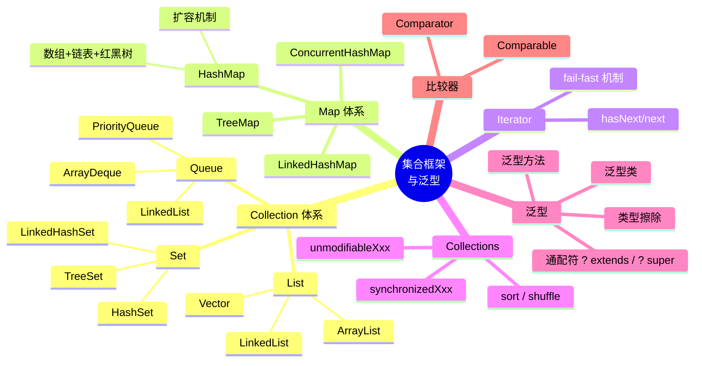
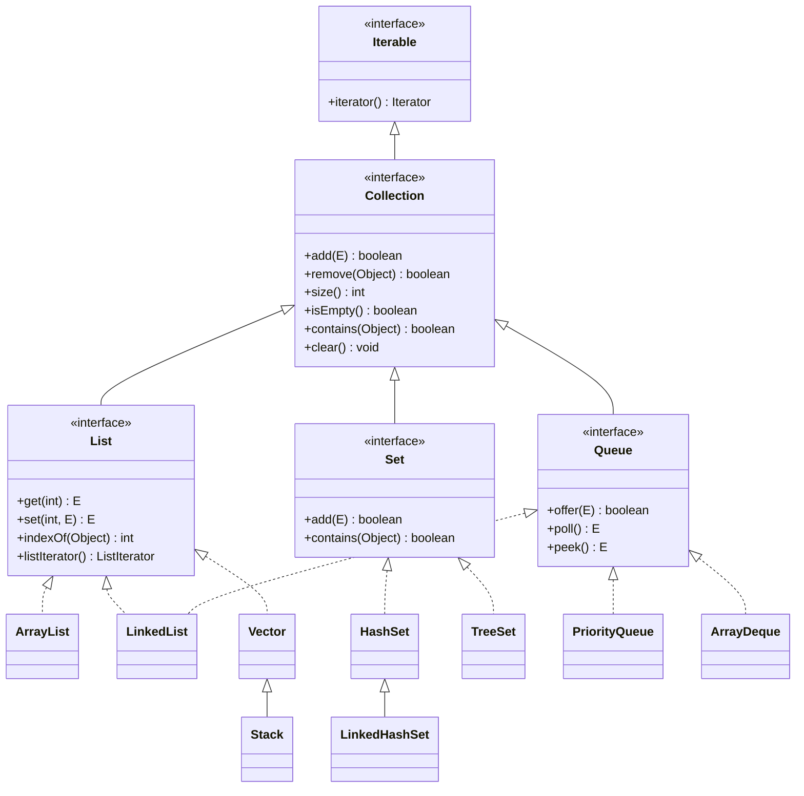
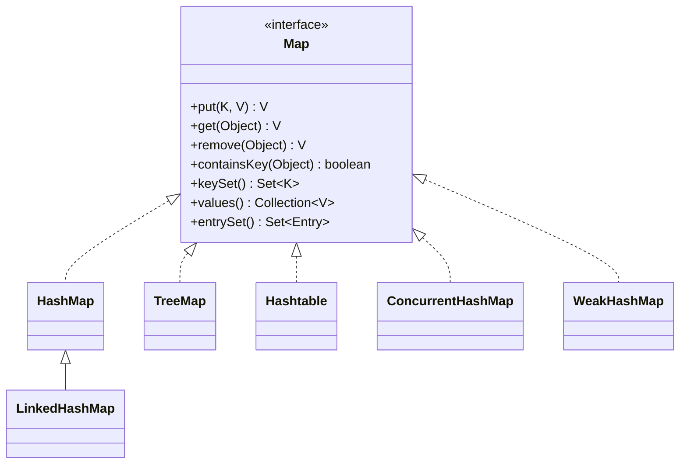
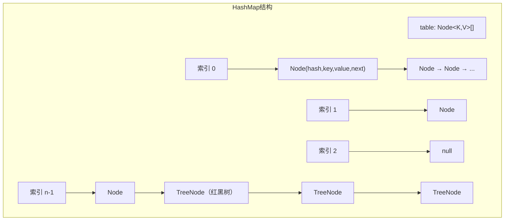
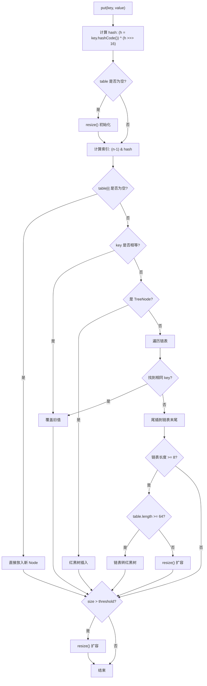

# 02 — 集合框架与泛型

> 本章详解 Java 集合框架体系（List/Set/Map/Queue）、泛型原理、HashMap 底层实现、Collections 工具类、Comparable/Comparator 比较器，并结合 Hsiaopu 项目中消息列表、会话列表、Provider 注册表等实际场景进行讲解。

---

## 📌 本章脑图



---

## 1. Collection 体系总览



---

## 1.1 List — 有序可重复

### ArrayList（动态数组）

```java
// 底层：Object[] 数组，默认容量 10
// 扩容：1.5 倍扩容（newCapacity = oldCapacity + (oldCapacity >> 1)）
// 特性：随机访问 O(1)，插入/删除 O(n)
// 线程不安全

List<String> list = new ArrayList<>();
list.add("Alice");
list.add("Bob");
list.add("Charlie");
list.add(0, "Zero"); // 在索引 0 插入，后面元素后移

String name = list.get(1);   // O(1) 随机访问
list.remove("Bob");          // O(n) 需要移动元素
list.contains("Alice");      // O(n) 遍历查找

// 遍历方式
for (int i = 0; i < list.size(); i++) { /* 传统 for */ }
for (String s : list) { /* for-each */ }
list.forEach(System.out::println); // JDK 8 Lambda
```

### LinkedList（双向链表）

```java
// 底层：双向链表（Node 包含 prev/data/next）
// 特性：随机访问 O(n)，头尾插入/删除 O(1)
// 同时实现了 List 和 Deque 接口

LinkedList<String> linkedList = new LinkedList<>();
linkedList.add("Alice");         // 尾部添加
linkedList.addFirst("First");    // 头部添加
linkedList.addLast("Last");      // 尾部添加
linkedList.removeFirst();        // 头部删除
linkedList.removeLast();         // 尾部删除

// 作为队列使用
linkedList.offer("Queue1");      // 入队
linkedList.poll();               // 出队
linkedList.peek();               // 查看队首
```

### ArrayList vs LinkedList 对比

| 维度 | ArrayList | LinkedList |
|------|-----------|------------|
| 底层结构 | 动态数组 `Object[]` | 双向链表 |
| 随机访问 | O(1) ✅ | O(n) ❌ |
| 头部插入 | O(n) ❌ | O(1) ✅ |
| 尾部插入 | 均摊 O(1) | O(1) |
| 中间插入 | O(n) | O(n)（需要先遍历找到位置） |
| 内存占用 | 连续内存，有预留空间 | 每个节点有额外 prev/next 指针 |
| 实现接口 | `List` | `List` + `Deque` |
| 使用场景 | 读多写少 | 频繁增删、队列/栈操作 |

---

## 1.2 Set — 无序不重复

```java
// ============ HashSet ============
// 底层：HashMap（元素作为 key，PRESENT 常量作为 value）
// 无序，允许 null（最多一个）
Set<String> hashSet = new HashSet<>();
hashSet.add("Apple");
hashSet.add("Banana");
hashSet.add("Apple"); // 重复，不生效
hashSet.contains("Apple"); // O(1)

// ============ LinkedHashSet ============
// 底层：LinkedHashMap（HashSet + 双向链表）
// 保持插入顺序
Set<String> linkedSet = new LinkedHashSet<>();
linkedSet.add("C");
linkedSet.add("A");
linkedSet.add("B");
// 遍历顺序: C → A → B（插入顺序）

// ============ TreeSet ============
// 底层：TreeMap（红黑树）
// 自动排序（自然顺序或 Comparator）
Set<Integer> treeSet = new TreeSet<>();
treeSet.add(5);
treeSet.add(1);
treeSet.add(3);
// 遍历顺序: 1 → 3 → 5（升序）

// 自定义排序
Set<String> reverseSet = new TreeSet<>(Comparator.reverseOrder());
reverseSet.add("C");
reverseSet.add("A");
reverseSet.add("B");
// 遍历顺序: C → B → A
```

---

## 2. Map 体系



### 2.1 HashMap 底层原理（面试核心）



**JDK 1.8 HashMap 核心数据结构：数组 + 链表 + 红黑树**

```java
// HashMap 源码关键常量（简化）
public class HashMap<K,V> {
    static final int DEFAULT_INITIAL_CAPACITY = 1 << 4; // 默认容量 16
    static final int MAXIMUM_CAPACITY = 1 << 30;         // 最大容量
    static final float DEFAULT_LOAD_FACTOR = 0.75f;      // 默认负载因子
    static final int TREEIFY_THRESHOLD = 8;              // 链表转红黑树阈值
    static final int UNTREEIFY_THRESHOLD = 6;            // 红黑树转链表阈值
    static final int MIN_TREEIFY_CAPACITY = 64;          // 最小树化容量

    // 核心存储结构
    transient Node<K,V>[] table;

    // Node 节点定义
    static class Node<K,V> {
        final int hash;
        final K key;
        V value;
        Node<K,V> next;
    }
}
```

**put 流程：**



**关键机制：**

1. **Hash 计算**：`(h = key.hashCode()) ^ (h >>> 16)` — 高 16 位与低 16 位异或，减少碰撞
2. **索引计算**：`(n - 1) & hash` — 等价于 `hash % n`，但效率更高（n 是 2 的幂）
3. **扩容机制**：容量翻倍，重新计算每个元素的位置（原位置 或 原位置 + 旧容量）
4. **链表转红黑树**：链表长度 ≥ 8 且数组长度 ≥ 64 时触发
5. **线程不安全**：多线程并发 put 可能导致死循环（JDK 1.7 头插法）或数据丢失

### 2.2 HashMap vs TreeMap vs LinkedHashMap

| 维度 | HashMap | TreeMap | LinkedHashMap |
|------|---------|---------|---------------|
| 底层结构 | 数组+链表+红黑树 | 红黑树 | HashMap + 双向链表 |
| 排序 | 无序 | 按 key 排序（自然/自定义） | 插入顺序或访问顺序 |
| null 键/值 | 允许 1 个 null 键 | 不允许 null 键 | 允许 1 个 null 键 |
| 时间复杂度 | O(1) ~ O(log n) | O(log n) | O(1) ~ O(log n) |
| 线程安全 | ❌ | ❌ | ❌ |
| 使用场景 | 通用键值存储 | 需要排序 | 需要保持顺序/LRU 缓存 |

### 2.3 ConcurrentHashMap（面试高频）

```java
// JDK 1.7: Segment 分段锁（继承 ReentrantLock）
// JDK 1.8: CAS + synchronized 锁链表头节点

// 核心特性：
// 1. 线程安全，读操作不加锁（volatile 保证可见性）
// 2. 分段锁 → 细粒度锁（只锁桶的头节点）
// 3. 不支持 null 键和 null 值
// 4. 迭代器是弱一致性（fail-safe），不抛 ConcurrentModificationException

ConcurrentHashMap<String, Integer> map = new ConcurrentHashMap<>();
map.put("key1", 1);
map.put("key2", 2);

// 原子操作
map.putIfAbsent("key3", 3);  // 不存在才放入
map.replace("key1", 1, 10);  // 只有值为 1 时才替换为 10
map.computeIfAbsent("key4", k -> k.length()); // 不存在才计算
```

**HashMap vs Hashtable vs ConcurrentHashMap：**

| 维度 | HashMap | Hashtable | ConcurrentHashMap |
|------|---------|-----------|-------------------|
| 线程安全 | ❌ | ✅ (synchronized 锁整个表) | ✅ (CAS + 分段锁) |
| 效率 | 高 | 低（全表锁） | 高（并发读，分段锁） |
| null 键/值 | 允许 | 不允许 | 不允许 |
| JDK 版本 | 1.2 | 1.0 | 1.5 |

---

## 3. 泛型

### 3.1 泛型类

```java
// 泛型类：类名后跟 <T>
public class Box<T> {
    private T value;

    public void set(T value) { this.value = value; }
    public T get() { return value; }
}

// 使用
Box<String> stringBox = new Box<>();
stringBox.set("Hello");
String str = stringBox.get(); // 无需强制类型转换

Box<Integer> intBox = new Box<>();
intBox.set(100);
```

### 3.2 泛型方法

```java
public class GenericMethod {
    // 泛型方法：返回值前声明 <T>
    public static <T> T getMiddle(T... array) {
        return array[array.length / 2];
    }

    // 多个类型参数
    public static <K, V> Map<K, V> newHashMap() {
        return new HashMap<>();
    }
}

// 使用
String middle = GenericMethod.getMiddle("A", "B", "C"); // 返回 "B"
```

### 3.3 通配符

```java
// ============ 无界通配符 ? ============
void printList(List<?> list) {
    for (Object obj : list) {
        System.out.println(obj);
    }
}

// ============ 上界通配符 ? extends T ============
// 只读不写（Producer Extends）
double sum(List<? extends Number> numbers) {
    double total = 0;
    for (Number n : numbers) {
        total += n.doubleValue(); // ✅ 可以读（当作 Number）
    }
    // numbers.add(1); // ❌ 不能写（编译器不知道具体是哪种 Number）
    return total;
}

// 使用
List<Integer> ints = Arrays.asList(1, 2, 3);
List<Double> doubles = Arrays.asList(1.1, 2.2, 3.3);
sum(ints);    // ✅
sum(doubles); // ✅

// ============ 下界通配符 ? super T ============
// 只写不读（Consumer Super）
void addNumbers(List<? super Integer> list) {
    for (int i = 0; i < 5; i++) {
        list.add(i); // ✅ 可以写（Integer 是 Number 的子类）
    }
    // Integer x = list.get(0); // ❌ 不能读（返回类型是 Object）
}

// 使用
List<Number> numbers = new ArrayList<>();
List<Object> objects = new ArrayList<>();
addNumbers(numbers); // ✅
addNumbers(objects); // ✅
```

**PECS 原则**：Producer Extends, Consumer Super

| 通配符 | 读取 | 写入 | 场景 |
|--------|------|------|------|
| `? extends T` | ✅ 读为 T | ❌ | 生产者（数据来源） |
| `? super T` | ❌ 读为 Object | ✅ 写 T 及子类 | 消费者（数据去向） |
| `?` | 读为 Object | ❌ | 纯读取 |

### 3.4 类型擦除

```java
// Java 泛型是编译时机制，运行时被擦除
List<String> list1 = new ArrayList<>();
List<Integer> list2 = new ArrayList<>();

// 运行时两者类型相同
System.out.println(list1.getClass() == list2.getClass()); // true

// 类型擦除后：
// List<String> → List
// List<Integer> → List
// 泛型信息在编译后消失，只在编译期做类型检查
```

**类型擦除的影响：**
- 不能创建泛型数组：`new T[10]` ❌
- 不能实例化泛型类型：`new T()` ❌
- 不能用 `instanceof` 检查泛型：`obj instanceof List<String>` ❌
- 不能重载泛型方法（签名相同）

---

## 4. Collections 工具类

```java
import java.util.Collections;
import java.util.List;
import java.util.ArrayList;

List<Integer> list = new ArrayList<>();
Collections.addAll(list, 3, 1, 4, 1, 5, 9, 2, 6);

// ============ 排序 ============
Collections.sort(list);                           // 自然排序
Collections.sort(list, Comparator.reverseOrder()); // 反向排序

// ============ 查找 ============
int idx = Collections.binarySearch(list, 5); // 二分查找（需先排序）
int max = Collections.max(list);
int min = Collections.min(list);

// ============ 其他 ============
Collections.reverse(list);    // 反转
Collections.shuffle(list);    // 随机打乱
Collections.fill(list, 0);    // 填充
Collections.rotate(list, 2);  // 旋转

// ============ 线程安全包装 ============
List<Integer> syncList = Collections.synchronizedList(new ArrayList<>());
Map<String, String> syncMap = Collections.synchronizedMap(new HashMap<>());
Set<String> syncSet = Collections.synchronizedSet(new HashSet<>());

// 注意：遍历时仍需手动加锁
synchronized (syncList) {
    for (Integer i : syncList) {
        System.out.println(i);
    }
}

// ============ 不可变集合 ============
List<String> unmodifiable = Collections.unmodifiableList(list);
// unmodifiable.add("x"); // ❌ UnsupportedOperationException

// JDK 9+ 更简洁的写法
List<String> immutableList = List.of("A", "B", "C");
Set<String> immutableSet = Set.of("A", "B", "C");
Map<String, Integer> immutableMap = Map.of("A", 1, "B", 2);
```

---

## 5. Comparable vs Comparator

| 维度 | Comparable | Comparator |
|------|-----------|------------|
| 包 | `java.lang` | `java.util` |
| 核心方法 | `compareTo(T o)` | `compare(T o1, T o2)` |
| 排序依据 | 自然排序（内部） | 自定义排序（外部） |
| 耦合度 | 修改类本身 | 不修改类 |
| 使用方式 | `Collections.sort(list)` | `Collections.sort(list, comparator)` |
| 典型场景 | 类的默认排序 | 多维度排序、第三方类排序 |

```java
// ============ Comparable ============
public class Person implements Comparable<Person> {
    private String name;
    private int age;

    // 按年龄自然排序
    @Override
    public int compareTo(Person other) {
        return Integer.compare(this.age, other.age);
    }
}

// ============ Comparator ============
// 方式 1：实现 Comparator 接口
class NameComparator implements Comparator<Person> {
    @Override
    public int compare(Person p1, Person p2) {
        return p1.getName().compareTo(p2.getName());
    }
}

// 方式 2：Lambda 表达式
Comparator<Person> byAge = Comparator.comparingInt(Person::getAge);
Comparator<Person> byName = Comparator.comparing(Person::getName);

// 方式 3：链式组合
Comparator<Person> byAgeThenName = byAge.thenComparing(byName);
```

---

## 6. Hsiaopu 项目中的集合应用

### 6.1 消息列表（List + Flow）

**源码（`app/src/main/java/com/example/hsiaopu/viewmodel/ChatViewModel.kt`）：**

```kotlin
// ChatUiState 中的消息列表
data class ChatUiState(
    val conversations: List<ConversationEntity> = emptyList(),
    val messages: List<ChatMessage> = emptyList(),
    // ...
)
```

**对应 Java 写法：**

```java
public class ChatUiState {
    private List<ConversationEntity> conversations = new ArrayList<>();
    private List<ChatMessage> messages = new ArrayList<>();

    // 添加消息
    public void addMessage(ChatMessage message) {
        this.messages = new ArrayList<>(this.messages);
        this.messages.add(message);
    }

    // 获取消息（不可变视图）
    public List<ChatMessage> getMessages() {
        return Collections.unmodifiableList(messages);
    }
}
```

### 6.2 Provider 注册表（Map）

**源码（`app/src/main/java/com/example/hsiaopu/network/AiProviderRegistry.kt`）：**

```kotlin
@Singleton
class AiProviderRegistry @Inject constructor(
    private val deepSeekProvider: DeepSeekProvider,
    private val openAICompatibleProvider: OpenAICompatibleProvider
) {
    private val providers: Map<String, AiProvider> = mapOf(
        "deepseek" to deepSeekProvider,
        "openai" to openAICompatibleProvider
    )
}
```

**对应 Java 写法：**

```java
@Singleton
public class AiProviderRegistry {
    private final Map<String, AiProvider> providers = new HashMap<>();

    @Inject
    public AiProviderRegistry(DeepSeekProvider deepSeekProvider,
                              OpenAICompatibleProvider openAICompatibleProvider) {
        providers.put("deepseek", deepSeekProvider);
        providers.put("openai", openAICompatibleProvider);
    }

    public List<ProviderInfo> getAllProviders() {
        List<ProviderInfo> list = new ArrayList<>();
        for (AiProvider provider : providers.values()) {
            list.add(provider.getProviderInfo());
        }
        return list;
    }

    public AiProvider getProvider(String id) {
        AiProvider provider = providers.get(id);
        if (provider == null) {
            throw new IllegalArgumentException("Unknown provider: " + id);
        }
        return provider;
    }
}
```

### 6.3 会话列表（Room + Flow）

**源码（`app/src/main/java/com/example/hsiaopu/data/local/Daos.kt`）：**

```kotlin
@Dao
interface ConversationDao {
    @Query("SELECT * FROM conversations ORDER BY updatedAt DESC")
    fun getAllConversations(): Flow<List<ConversationEntity>>
}
```

**对应 Java 写法：**

```java
@Dao
public interface ConversationDao {
    @Query("SELECT * FROM conversations ORDER BY updatedAt DESC")
    Flow<List<ConversationEntity>> getAllConversations();
}
```

**ConversationEntity 的 Java 写法：**

```java
@Entity(tableName = "conversations")
public class ConversationEntity {
    @PrimaryKey(autoGenerate = true)
    private long id = 0;

    @ColumnInfo(name = "title")
    private String title = "New Chat";

    @ColumnInfo(name = "createdAt")
    private long createdAt = System.currentTimeMillis();

    @ColumnInfo(name = "updatedAt")
    private long updatedAt = System.currentTimeMillis();

    // 使用 List 存储消息（一对多关系）
    // Room 中通过 @Relation 或单独查询获取
}
```

### 6.4 工具命令 - 参数解析（Map）

**源码（`ChatViewModel.kt:436-444`）：**

```kotlin
private fun parseParams(paramsStr: String): Map<String, String> {
    if (paramsStr.isBlank()) return emptyMap()
    return paramsStr.split(",").mapNotNull { part ->
        val eq = part.indexOf('=')
        if (eq > 0) {
            part.substring(0, eq).trim() to part.substring(eq + 1).trim()
        } else null
    }.toMap()
}
```

**对应 Java 写法：**

```java
private Map<String, String> parseParams(String paramsStr) {
    if (paramsStr == null || paramsStr.isBlank()) {
        return Collections.emptyMap();
    }
    Map<String, String> params = new HashMap<>();
    for (String part : paramsStr.split(",")) {
        int eq = part.indexOf('=');
        if (eq > 0) {
            String key = part.substring(0, eq).trim();
            String value = part.substring(eq + 1).trim();
            params.put(key, value);
        }
    }
    return params;
}
```

---

## 7. 面试高频题

### Q1: HashMap 的 put 流程（高频必问）

**回答要点：**
1. 计算 key 的 hashCode，高位与低位异或得到 hash 值
2. 通过 `(n-1) & hash` 计算桶索引
3. 如果桶为空，直接插入
4. 如果桶不为空，判断 key 是否相等：相等则覆盖；不相等则判断是树节点还是链表节点
5. 链表节点：遍历查找，找到相同 key 则覆盖，否则尾插
6. 链表长度 ≥ 8 且数组长度 ≥ 64 时，链表转红黑树
7. 插入后判断是否需要扩容（size > threshold）

### Q2: HashMap 为什么容量是 2 的幂？

**回答：**
- `(n-1) & hash` 等价于 `hash % n`，但位运算效率更高
- 当 n 是 2 的幂时，`n-1` 的二进制全是 1，与 hash 做 & 运算可以均匀分布
- 扩容时只需判断 hash 的某一位是 0 还是 1，即可确定在新数组中的位置（原位置 或 原位置 + 旧容量）

### Q3: HashMap 线程不安全的表现

**回答：**
- **JDK 1.7**：扩容时使用头插法，多线程并发扩容可能形成**环形链表**，导致 `get()` 时死循环
- **JDK 1.8**：使用尾插法解决了死循环问题，但仍有**数据覆盖**问题（两个线程同时 put 可能丢失数据）
- **解决**：使用 `ConcurrentHashMap` 或 `Collections.synchronizedMap()`

### Q4: ConcurrentHashMap 实现原理（JDK 1.7 vs 1.8）

**JDK 1.7 — Segment 分段锁：**
- 内部维护一个 Segment 数组，每个 Segment 继承 `ReentrantLock`
- 并发度 = Segment 数量（默认 16）
- 不同 Segment 之间可以并发操作

**JDK 1.8 — CAS + synchronized：**
- 抛弃 Segment，改用 `CAS + synchronized` 锁桶的头节点
- 锁粒度更细（每个桶一个锁）
- 读操作不加锁（volatile 保证可见性）
- 扩容时支持多线程并发扩容（通过 `transferIndex` 分配任务）

### Q5: 泛型类型擦除带来了什么问题？如何解决？

```java
// 问题 1：无法获取泛型类型信息
List<String> list = new ArrayList<>();
// 运行时无法判断 list 是 List<String> 还是 List<Integer>

// 问题 2：无法创建泛型数组
// T[] array = new T[10]; // ❌ 编译错误

// 解决：使用 Gson 的 TypeToken 保留泛型信息
Type type = new TypeToken<List<ChatMessage>>(){}.getType();
List<ChatMessage> messages = new Gson().fromJson(json, type);
```

### Q6: ArrayList 扩容机制

```java
// 默认容量 10，扩容为原来的 1.5 倍
// newCapacity = oldCapacity + (oldCapacity >> 1)

// 源码简化：
private void grow(int minCapacity) {
    int oldCapacity = elementData.length;
    int newCapacity = oldCapacity + (oldCapacity >> 1);
    if (newCapacity - minCapacity < 0)
        newCapacity = minCapacity;
    if (newCapacity - MAX_ARRAY_SIZE > 0)
        newCapacity = hugeCapacity(minCapacity);
    elementData = Arrays.copyOf(elementData, newCapacity);
}
```

---

## 8. 本章小结

| 知识点 | 掌握标准 |
|--------|----------|
| ArrayList vs LinkedList | 能说出底层结构和时间复杂度差异 |
| HashMap 原理 | 能画出 put 流程图，解释扩容/树化 |
| ConcurrentHashMap | 能说出 JDK 1.7 和 1.8 的实现差异 |
| 泛型 | 能写出泛型类/方法，理解 PECS 原则 |
| 类型擦除 | 能解释运行时泛型信息丢失的原因 |
| Comparable vs Comparator | 能说出区别和使用场景 |
| Collections 工具类 | 能使用 sort/synchronized/unmodifiable |

---

## 9. 练习题

1. 用 Java 实现一个简单的 LRU 缓存（利用 `LinkedHashMap` 的 `accessOrder` 属性）
2. 手动实现一个简化版的 `HashMap`（数组 + 链表），包含 `put` 和 `get` 方法
3. 写一个泛型方法 `swap`，交换数组中任意两个位置的元素
4. 用 `Comparator` 对 `Hsiaopu` 中的 `ConversationEntity` 列表按 `updatedAt` 降序排列
5. 解释以下代码的输出：
```java
Map<String, Integer> map = new HashMap<>();
map.put("a", 1);
map.put("b", 2);
map.put("a", 3);
System.out.println(map.get("a")); // 3
System.out.println(map.size());   // 2
```