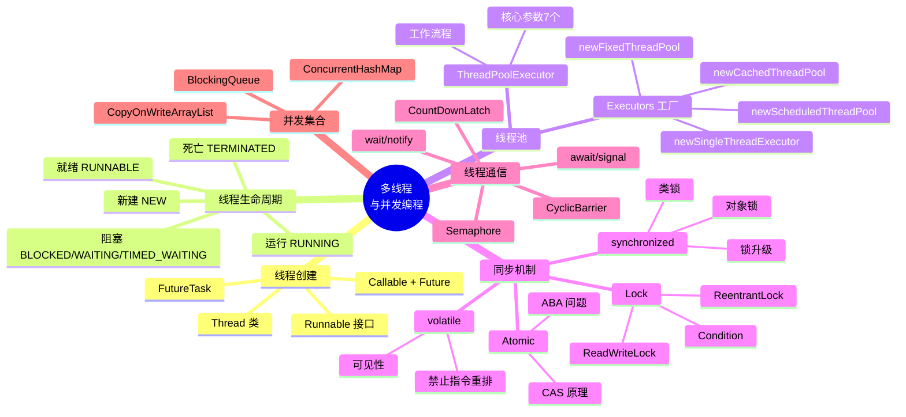
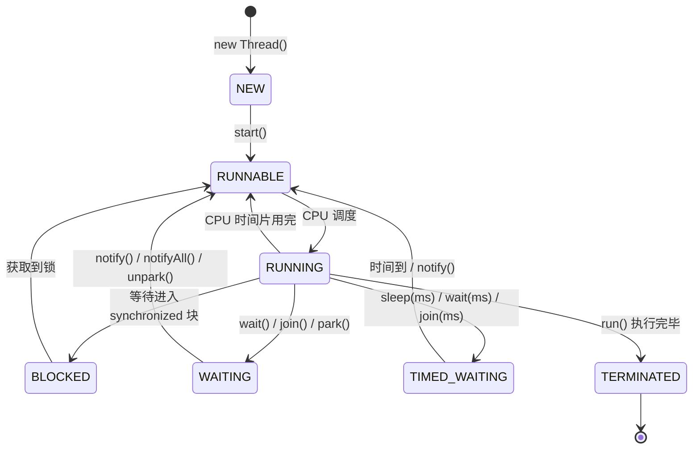
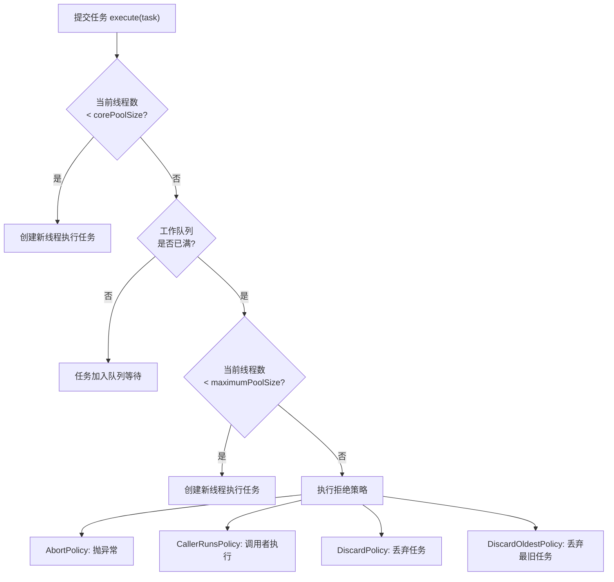
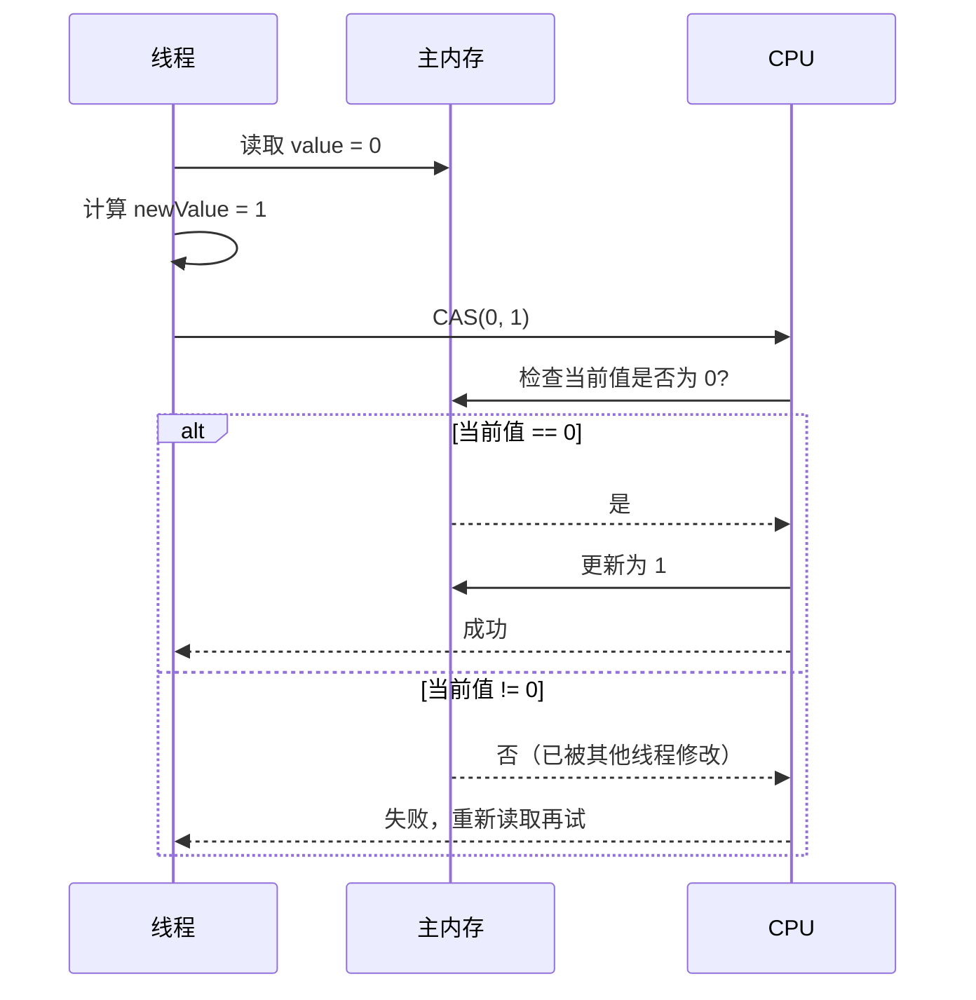

# 03 — 多线程与并发编程

> 本章详解 Java 多线程核心知识：线程创建方式、生命周期、线程池、同步机制（synchronized/Lock/volatile）、并发集合，并结合 Hsiaopu 项目中 SSE 流式解析的异步处理、协程（Kotlin 对应 Java 的线程池）等实际场景进行讲解。

---

## 📌 本章脑图



---

## 1. 线程创建方式

### 1.1 继承 Thread 类

```java
public class MyThread extends Thread {
    @Override
    public void run() {
        System.out.println("Thread running: " + Thread.currentThread().getName());
    }

    public static void main(String[] args) {
        MyThread thread = new MyThread();
        thread.setName("Worker-1");
        thread.start(); // 启动线程（调用 start()，不是 run()）
    }
}
```

### 1.2 实现 Runnable 接口

```java
public class MyRunnable implements Runnable {
    @Override
    public void run() {
        System.out.println("Runnable running: " + Thread.currentThread().getName());
    }

    public static void main(String[] args) {
        // 方式 1：传统写法
        Thread thread = new Thread(new MyRunnable());
        thread.start();

        // 方式 2：Lambda 表达式
        new Thread(() -> {
            System.out.println("Lambda thread running");
        }).start();
    }
}
```

### 1.3 实现 Callable + Future

```java
import java.util.concurrent.*;

public class CallableDemo {
    public static void main(String[] args) throws Exception {
        // Callable：有返回值，可抛出异常
        Callable<String> task = () -> {
            Thread.sleep(1000);
            return "Task completed!";
        };

        // 方式 1：通过线程池提交
        ExecutorService executor = Executors.newSingleThreadExecutor();
        Future<String> future = executor.submit(task);

        // 方式 2：FutureTask 包装
        FutureTask<String> futureTask = new FutureTask<>(task);
        new Thread(futureTask).start();

        // 获取结果（阻塞等待）
        System.out.println("Waiting for result...");
        String result = future.get(); // 阻塞直到任务完成
        System.out.println("Result: " + result);

        executor.shutdown();
    }
}
```

### 1.4 三种创建方式对比

| 方式 | 优点 | 缺点 | 使用场景 |
|------|------|------|---------|
| `Thread` | 简单直接 | 无法继承其他类，耦合度高 | 简单的独立任务 |
| `Runnable` | 可继承其他类，解耦 | 无返回值，不能抛异常 | 无返回值的异步任务 |
| `Callable` | 有返回值，可抛异常 | 使用稍复杂 | 需要返回结果的异步任务 |

**推荐**：优先使用 `Runnable` / `Callable` + 线程池，避免直接继承 `Thread`。

---

## 2. 线程生命周期



**线程状态详解：**

| 状态 | 说明 | 触发条件 |
|------|------|---------|
| `NEW` | 新建，尚未启动 | `new Thread()` |
| `RUNNABLE` | 可运行（就绪 + 运行中） | `start()` 调用后 |
| `BLOCKED` | 阻塞，等待锁 | 未获取到 `synchronized` 锁 |
| `WAITING` | 无限等待 | `wait()`、`join()`、`LockSupport.park()` |
| `TIMED_WAITING` | 限时等待 | `sleep(ms)`、`wait(ms)`、`join(ms)` |
| `TERMINATED` | 终止 | `run()` 执行完毕或异常退出 |

```java
public class ThreadStateDemo {
    public static void main(String[] args) throws InterruptedException {
        Thread thread = new Thread(() -> {
            try {
                Thread.sleep(1000);
            } catch (InterruptedException e) {
                e.printStackTrace();
            }
        });

        System.out.println(thread.getState()); // NEW

        thread.start();
        System.out.println(thread.getState()); // RUNNABLE

        Thread.sleep(100); // 让主线程等待一会儿
        System.out.println(thread.getState()); // TIMED_WAITING（sleep 中）

        thread.join(); // 等待子线程结束
        System.out.println(thread.getState()); // TERMINATED
    }
}
```

---

## 3. 线程池

### 3.1 ThreadPoolExecutor 核心参数

```java
public ThreadPoolExecutor(
    int corePoolSize,      // 核心线程数
    int maximumPoolSize,   // 最大线程数
    long keepAliveTime,    // 空闲线程存活时间
    TimeUnit unit,         // 时间单位
    BlockingQueue<Runnable> workQueue, // 任务队列
    ThreadFactory threadFactory,       // 线程工厂
    RejectedExecutionHandler handler   // 拒绝策略
)
```

**七个参数详解：**

| 参数 | 说明 | 常用值 |
|------|------|--------|
| `corePoolSize` | 核心线程数（常驻线程） | CPU 核数 + 1 |
| `maximumPoolSize` | 最大线程数 | CPU 核数 × 2 |
| `keepAliveTime` | 非核心线程空闲存活时间 | 60 秒 |
| `unit` | 时间单位 | `TimeUnit.SECONDS` |
| `workQueue` | 阻塞队列 | `LinkedBlockingQueue`、`ArrayBlockingQueue` |
| `threadFactory` | 线程工厂（命名、优先级） | `Executors.defaultThreadFactory()` |
| `handler` | 拒绝策略 | `AbortPolicy`（默认抛异常） |

### 3.2 线程池工作流程



### 3.3 Executors 工厂方法

```java
// ============ 1. FixedThreadPool ============
// 固定大小线程池，corePoolSize = maxPoolSize
// 使用无界队列 LinkedBlockingQueue（可能 OOM）
ExecutorService fixedPool = Executors.newFixedThreadPool(4);
for (int i = 0; i < 10; i++) {
    final int taskId = i;
    fixedPool.execute(() -> {
        System.out.println("Task " + taskId + " by " + Thread.currentThread().getName());
    });
}
fixedPool.shutdown();

// ============ 2. CachedThreadPool ============
// 可缓存线程池，corePoolSize=0, maxPoolSize=Integer.MAX_VALUE
// 使用 SynchronousQueue（不存储，直接交付）
// 适合短时间大量任务
ExecutorService cachedPool = Executors.newCachedThreadPool();

// ============ 3. SingleThreadExecutor ============
// 单线程池，保证任务顺序执行
ExecutorService singlePool = Executors.newSingleThreadExecutor();

// ============ 4. ScheduledThreadPool ============
// 定时任务线程池
ScheduledExecutorService scheduledPool = Executors.newScheduledThreadPool(2);
scheduledPool.schedule(() -> System.out.println("延迟 3 秒执行"), 3, TimeUnit.SECONDS);
scheduledPool.scheduleAtFixedRate(
    () -> System.out.println("每 2 秒执行一次"),
    1, 2, TimeUnit.SECONDS
);
```

> ⚠️ **《阿里巴巴 Java 开发手册》强制要求**：线程池不允许使用 `Executors` 创建，必须通过 `ThreadPoolExecutor` 手动创建，以明确线程池参数，避免 OOM 风险。

### 3.4 手动创建线程池（推荐）

```java
// 推荐：手动指定所有参数
ThreadPoolExecutor executor = new ThreadPoolExecutor(
    4,                          // 核心线程数
    8,                          // 最大线程数
    60L, TimeUnit.SECONDS,      // 空闲存活时间
    new LinkedBlockingQueue<>(100),  // 有界队列
    new ThreadFactory() {
        private final AtomicInteger count = new AtomicInteger(1);
        @Override
        public Thread newThread(Runnable r) {
            return new Thread(r, "worker-" + count.getAndIncrement());
        }
    },
    new ThreadPoolExecutor.CallerRunsPolicy() // 拒绝策略：调用者线程执行
);

// 使用
try {
    Future<String> future = executor.submit(() -> {
        // 执行任务
        return "result";
    });
    String result = future.get(5, TimeUnit.SECONDS); // 带超时的获取
} catch (TimeoutException e) {
    System.out.println("任务超时");
} finally {
    executor.shutdown();
}
```

---

## 4. 同步机制

### 4.1 synchronized 关键字

```java
public class SynchronizedDemo {
    private int count = 0;
    private final Object lock = new Object();

    // ============ 1. 同步实例方法（锁的是 this） ============
    public synchronized void increment() {
        count++;
    }

    // 等价于：
    public void increment2() {
        synchronized (this) {
            count++;
        }
    }

    // ============ 2. 同步静态方法（锁的是 Class 对象） ============
    public static synchronized void staticMethod() {
        // 锁的是 SynchronizedDemo.class
    }

    // ============ 3. 同步代码块（指定锁对象） ============
    public void doSomething() {
        synchronized (lock) { // 使用私有锁对象，避免外部干扰
            // 临界区代码
        }
    }
}
```

**synchronized 锁升级过程（JDK 1.6+）：**


- **偏向锁**：只有一个线程访问时，在该线程的栈帧中记录锁偏向信息
- **轻量级锁**：多个线程交替访问时，通过 CAS 自旋尝试获取锁
- **重量级锁**：竞争激烈时，升级为操作系统互斥量（线程阻塞/唤醒开销大）

### 4.2 Lock 接口（ReentrantLock）

```java
import java.util.concurrent.locks.*;

public class LockDemo {
    private final ReentrantLock lock = new ReentrantLock();
    private int count = 0;

    public void increment() {
        lock.lock(); // 获取锁
        try {
            count++;
        } finally {
            lock.unlock(); // 必须在 finally 中释放锁
        }
    }

    // ============ 可中断获取锁 ============
    public void interruptibleLock() throws InterruptedException {
        lock.lockInterruptibly(); // 可被中断
        try {
            // 临界区
        } finally {
            lock.unlock();
        }
    }

    // ============ 尝试获取锁（非阻塞） ============
    public boolean tryLock() {
        if (lock.tryLock()) {
            try {
                // 获取锁成功
                return true;
            } finally {
                lock.unlock();
            }
        }
        return false; // 获取锁失败
    }

    // ============ 带超时的尝试获取锁 ============
    public boolean tryLockWithTimeout() throws InterruptedException {
        if (lock.tryLock(3, TimeUnit.SECONDS)) {
            try {
                return true;
            } finally {
                lock.unlock();
            }
        }
        return false;
    }
}
```

### synchronized vs Lock

| 维度 | synchronized | Lock（ReentrantLock） |
|------|-------------|----------------------|
| 实现 | JVM 层面，C++ 实现 | JDK 层面，Java 实现 |
| 锁释放 | 自动释放 | 必须手动 `unlock()`（finally） |
| 可中断 | ❌ 不可中断 | ✅ `lockInterruptibly()` |
| 非阻塞获取 | ❌ | ✅ `tryLock()` |
| 公平锁 | ❌ 非公平 | ✅ 可选公平/非公平 |
| 条件变量 | 一个 `wait/notify` | 多个 `Condition` |
| 性能 | JDK 1.6+ 优化后接近 | 略快（但差异不大） |
| 使用建议 | 简单场景，自动释放 | 需要可中断/超时/多条件 |

### 4.3 ReadWriteLock

```java
public class ReadWriteLockDemo {
    private final ReadWriteLock rwLock = new ReentrantReadWriteLock();
    private final Lock readLock = rwLock.readLock();
    private final Lock writeLock = rwLock.writeLock();
    private Map<String, String> cache = new HashMap<>();

    // 读操作（多个线程可同时读）
    public String get(String key) {
        readLock.lock();
        try {
            return cache.get(key);
        } finally {
            readLock.unlock();
        }
    }

    // 写操作（独占锁，其他读写线程等待）
    public void put(String key, String value) {
        writeLock.lock();
        try {
            cache.put(key, value);
        } finally {
            writeLock.unlock();
        }
    }
}
```

**读写锁规则：**
- 读-读：不互斥（可并发）
- 读-写：互斥
- 写-写：互斥

### 4.4 volatile 关键字

```java
public class VolatileDemo {
    // volatile 保证可见性和禁止指令重排，但不保证原子性
    private volatile boolean running = true;

    public void stop() {
        running = false; // 修改后立即对其他线程可见
    }

    public void run() {
        while (running) {
            // 循环中读取 volatile 变量，每次从主内存读取最新值
            System.out.println("Running...");
        }
        System.out.println("Stopped!");
    }
}
```

**volatile 三大特性：**
1. **可见性**：volatile 变量修改后立即刷新到主内存，其他线程读取时从主内存获取
2. **禁止指令重排**：通过内存屏障防止指令重排序
3. **不保证原子性**：`i++` 这种复合操作仍然不安全

**典型应用场景：**
- 状态标志位（如 `running`）
- 双重检查锁定（DCL 单例模式）
- `CopyOnWriteArrayList` 内部数组

### 4.5 Atomic 原子类（CAS）

```java
import java.util.concurrent.atomic.*;

public class AtomicDemo {
    // 原子整型（基于 CAS：Compare and Swap）
    private AtomicInteger counter = new AtomicInteger(0);

    public void increment() {
        counter.incrementAndGet(); // 线程安全的自增
    }

    public int get() {
        return counter.get();
    }

    // CAS 操作
    public void casOperation() {
        int expected = counter.get();
        boolean success = counter.compareAndSet(expected, expected + 1);
        // 如果当前值等于 expected，则设置为 expected + 1
    }

    // 其他原子类
    // AtomicLong、AtomicBoolean、AtomicReference
    // LongAdder（高并发下性能更好）
    // AtomicIntegerArray、AtomicReferenceFieldUpdater
}
```

**CAS 原理：**



**CAS 的 ABA 问题：**
```
时间线：
T1: 读取 A
T2: 读取 A → 修改为 B → 修改回 A
T1: CAS(A, C) → 成功！但中间已经被改过
```

**解决：** `AtomicStampedReference` 带版本号，或 `AtomicMarkableReference`。

---

## 5. 线程通信

### 5.1 wait() / notify() / notifyAll()

```java
public class WaitNotifyDemo {
    private final Object lock = new Object();
    private boolean condition = false;

    public void producer() {
        synchronized (lock) {
            while (!condition) {
                // 条件不满足，等待
                lock.wait(); // 释放锁，进入 WAITING 状态
            }
            // 条件满足，执行逻辑
            System.out.println("Producer: condition met");
        }
    }

    public void consumer() {
        synchronized (lock) {
            condition = true;
            lock.notifyAll(); // 唤醒所有等待线程
            // lock.notify(); // 唤醒一个（随机）
        }
    }
}
```

> ⚠️ **关键规则：**
> - `wait()` / `notify()` 必须在 `synchronized` 块中调用
> - 使用 `while` 循环检查条件（防止虚假唤醒）
> - `notifyAll()` 比 `notify()` 更安全

### 5.2 await() / signal()（Condition）

```java
public class ConditionDemo {
    private final ReentrantLock lock = new ReentrantLock();
    private final Condition notEmpty = lock.newCondition();
    private final Condition notFull = lock.newCondition();
    private final Queue<String> queue = new LinkedList<>();
    private final int capacity = 10;

    public void produce(String item) throws InterruptedException {
        lock.lock();
        try {
            while (queue.size() == capacity) {
                notFull.await(); // 队列满，等待
            }
            queue.add(item);
            notEmpty.signalAll(); // 唤醒消费者
        } finally {
            lock.unlock();
        }
    }

    public String consume() throws InterruptedException {
        lock.lock();
        try {
            while (queue.isEmpty()) {
                notEmpty.await(); // 队列空，等待
            }
            String item = queue.poll();
            notFull.signalAll(); // 唤醒生产者
            return item;
        } finally {
            lock.unlock();
        }
    }
}
```

### 5.3 并发工具类

```java
// ============ CountDownLatch（倒计数门闩） ============
// 一个线程等待多个线程完成
CountDownLatch latch = new CountDownLatch(3);
for (int i = 0; i < 3; i++) {
    new Thread(() -> {
        System.out.println("Worker done");
        latch.countDown(); // 计数 -1
    }).start();
}
latch.await(); // 等待计数归零
System.out.println("All workers done");

// ============ CyclicBarrier（循环屏障） ============
// 多个线程互相等待，到达屏障后一起执行
CyclicBarrier barrier = new CyclicBarrier(3, () -> {
    System.out.println("All parties arrived, barrier action!");
});
for (int i = 0; i < 3; i++) {
    new Thread(() -> {
        try {
            barrier.await(); // 等待其他线程
            System.out.println("Passed barrier");
        } catch (Exception e) { e.printStackTrace(); }
    }).start();
}

// ============ Semaphore（信号量） ============
// 控制并发访问数量
Semaphore semaphore = new Semaphore(3); // 最多 3 个并发
for (int i = 0; i < 10; i++) {
    new Thread(() -> {
        try {
            semaphore.acquire(); // 获取许可
            System.out.println("Running");
            Thread.sleep(1000);
        } catch (InterruptedException e) {
            e.printStackTrace();
        } finally {
            semaphore.release(); // 释放许可
        }
    }).start();
}
```

---

## 6. 并发集合

```java
// ============ ConcurrentHashMap ============
// 线程安全的 HashMap，JDK 1.8 使用 CAS + synchronized
ConcurrentHashMap<String, Integer> concurrentMap = new ConcurrentHashMap<>();
concurrentMap.put("key", 1);
concurrentMap.putIfAbsent("key", 2); // 不存在才放
concurrentMap.compute("key", (k, v) -> v == null ? 1 : v + 1);

// ============ CopyOnWriteArrayList ============
// 写时复制，适合读多写少的场景
// 写操作：复制整个数组，在新数组上修改，再替换引用
// 读操作：直接读，不需要加锁
CopyOnWriteArrayList<String> cowList = new CopyOnWriteArrayList<>();
cowList.add("A");
cowList.addIfAbsent("B");
for (String s : cowList) {
    // 迭代过程中修改不会抛 ConcurrentModificationException
    cowList.add("C"); // 迭代的是旧数组的快照
}

// ============ BlockingQueue ============
// 阻塞队列，生产者-消费者模式
BlockingQueue<String> blockingQueue = new LinkedBlockingQueue<>(10);
// 生产者
blockingQueue.put("item"); // 队列满时阻塞
// 消费者
String item = blockingQueue.take(); // 队列空时阻塞
// 非阻塞方法
blockingQueue.offer("item"); // 队列满时返回 false
blockingQueue.poll();        // 队列空时返回 null
```

---

## 7. Hsiaopu 项目中的并发实践

### 7.1 SSE 流式解析的异步处理

Hsiaopu 项目中，AI 对话使用 SSE（Server-Sent Events）流式接收数据。在 Kotlin 中使用协程，对应 Java 中的线程池。

**Kotlin 源码（`app/src/main/java/com/example/hsiaopu/viewmodel/ChatViewModel.kt:241-332`）：**

```kotlin
private fun doSendWithTools(convId: Long, content: String, settings: AppSettings) {
    // ...
    viewModelScope.launch { // 在 ViewModel 协程作用域中启动
        try {
            // 流式接收 AI 响应
            providerRegistry.sendMessageStream(settings.providerId, messages, settings)
                .collect { chunk ->  // 逐个收集流式数据块
                    fullContent += chunk
                    _uiState.update { it.copy(streamingContent = fullContent) }
                }
            // ... 工具执行与结果处理
        } catch (e: Exception) {
            _uiState.update { it.copy(isLoading = false, error = e.message) }
        }
    }
}
```

**对应 Java 写法（线程池 + 回调）：**

```java
public class ChatViewModel {
    private final ExecutorService executor = new ThreadPoolExecutor(
        2, 4, 60L, TimeUnit.SECONDS,
        new LinkedBlockingQueue<>(100),
        new ThreadFactory() {
            private final AtomicInteger count = new AtomicInteger(1);
            @Override
            public Thread newThread(Runnable r) {
                return new Thread(r, "chat-worker-" + count.getAndIncrement());
            }
        }
    );

    private volatile boolean isLoading = false;
    private volatile String streamingContent = "";

    public void sendMessage(String content, AppSettings settings) {
        isLoading = true;
        streamingContent = "";

        executor.execute(() -> {
            try {
                // 模拟 SSE 流式接收
                AiProvider provider = providerRegistry.getProvider(settings.getProviderId());
                // 使用回调方式处理流式数据
                provider.sendMessageStream(messages, settings, new StreamCallback() {
                    @Override
                    public void onChunk(String chunk) {
                        // 注意：回调在后台线程，需要切换到主线程更新 UI
                        streamingContent += chunk;
                        // 通过 Handler 切换到主线程
                        mainHandler.post(() -> {
                            updateUI(streamingContent);
                        });
                    }

                    @Override
                    public void onComplete(String fullContent) {
                        isLoading = false;
                        mainHandler.post(() -> updateUI(fullContent));
                    }

                    @Override
                    public void onError(Exception e) {
                        isLoading = false;
                        mainHandler.post(() -> showError(e.getMessage()));
                    }
                });
            } catch (Exception e) {
                isLoading = false;
                mainHandler.post(() -> showError(e.getMessage()));
            }
        });
    }
}
```

### 7.2 网络状态监控（轮询线程）

**Kotlin 源码（`ChatViewModel.kt:75-82`）：**

```kotlin
// Monitor network
viewModelScope.launch {
    val cm = context.getSystemService(Context.CONNECTIVITY_SERVICE) as? ConnectivityManager
    while (true) {
        val caps = cm?.activeNetwork?.let { cm.getNetworkCapabilities(it) }
        _uiState.update { it.copy(isOnline = caps != null) }
        kotlinx.coroutines.delay(5000) // 每 5 秒检查一次
    }
}
```

**对应 Java 写法（ScheduledExecutorService）：**

```java
public class NetworkMonitor {
    private final ScheduledExecutorService scheduler = Executors.newSingleThreadScheduledExecutor();
    private volatile boolean isOnline = true;
    private final ConnectivityManager connectivityManager;

    public NetworkMonitor(Context context) {
        this.connectivityManager = (ConnectivityManager)
            context.getSystemService(Context.CONNECTIVITY_SERVICE);
    }

    public void startMonitoring() {
        scheduler.scheduleAtFixedRate(() -> {
            NetworkCapabilities caps = connectivityManager
                .getNetworkCapabilities(connectivityManager.getActiveNetwork());
            boolean online = caps != null;
            if (online != isOnline) {
                isOnline = online;
                // 通知 UI 更新
            }
        }, 0, 5, TimeUnit.SECONDS);
    }

    public void stopMonitoring() {
        scheduler.shutdown();
    }
}
```

### 7.3 多 Provider 并发场景（线程安全）

Hsiaopu 的 `AiProviderRegistry` 中的 `providers` Map 在初始化后不再修改，但如果在运行时动态注册 Provider，需要考虑线程安全：

```java
@Singleton
public class AiProviderRegistry {
    // 使用 ConcurrentHashMap 保证线程安全
    private final ConcurrentHashMap<String, AiProvider> providers = new ConcurrentHashMap<>();

    @Inject
    public AiProviderRegistry(DeepSeekProvider deepSeekProvider,
                              OpenAICompatibleProvider openAIProvider) {
        providers.put("deepseek", deepSeekProvider);
        providers.put("openai", openAIProvider);
    }

    // 线程安全的注册方法
    public void registerProvider(AiProvider provider) {
        providers.put(provider.getProviderInfo().getId(), provider);
    }

    public AiProvider getProvider(String id) {
        AiProvider provider = providers.get(id);
        if (provider == null) {
            throw new IllegalArgumentException("Unknown provider: " + id);
        }
        return provider;
    }

    public List<ProviderInfo> getAllProviders() {
        // 获取快照（线程安全）
        List<ProviderInfo> result = new ArrayList<>();
        for (AiProvider provider : providers.values()) {
            result.add(provider.getProviderInfo());
        }
        return result;
    }
}
```

---

## 8. 面试高频题

### Q1: 线程的创建方式有哪些？区别是什么？

**回答：**
- **继承 Thread**：简单直接，但 Java 单继承局限
- **实现 Runnable**：无返回值，不能抛异常，解耦性好
- **实现 Callable + Future**：有返回值，可抛异常，通过 `Future.get()` 获取结果
- **线程池**：推荐方式，复用线程，控制资源

### Q2: synchronized 和 Lock 的区别？

参见上文 4.2 节的对比表。核心差异：`synchronized` 自动释放锁，`Lock` 需要手动释放；`Lock` 支持可中断、超时、多条件、公平锁。

### Q3: volatile 的作用和原理？

**回答：**
- **可见性**：修改后立即刷新到主内存，读取时从主内存获取
- **禁止指令重排**：通过内存屏障（Memory Barrier）实现
- **不保证原子性**：复合操作（如 `i++`）不是原子的
- **底层实现**：汇编层面的 `lock` 前缀指令，触发 MESI 缓存一致性协议

### Q4: ThreadLocal 原理及内存泄漏问题？

```java
// ThreadLocal：每个线程拥有独立的变量副本
ThreadLocal<String> threadLocal = new ThreadLocal<>();
threadLocal.set("value"); // 存入当前线程的 ThreadLocalMap
String value = threadLocal.get(); // 从当前线程的 ThreadLocalMap 获取

// 内存泄漏原因：
// ThreadLocalMap 的 Entry 继承 WeakReference，key 是弱引用
// 当 ThreadLocal 被 GC 回收后，key 变为 null，但 value 无法被回收
// 解决：使用完后调用 remove()
threadLocal.remove();
```

### Q5: 线程池的核心参数及拒绝策略？

参见上文 3.1 和 3.2 节。七个核心参数：corePoolSize、maximumPoolSize、keepAliveTime、unit、workQueue、threadFactory、handler。四种拒绝策略：AbortPolicy（抛异常）、CallerRunsPolicy（调用者执行）、DiscardPolicy（丢弃）、DiscardOldestPolicy（丢弃最旧）。

### Q6: CAS 的 ABA 问题及解决方案？

**回答：**
- ABA 问题：线程 T1 读取 A，T2 将 A 改为 B 再改回 A，T1 的 CAS 操作仍然成功
- 解决方案：`AtomicStampedReference`（带版本号）、`AtomicMarkableReference`（带布尔标记）

### Q7: 死锁的四个必要条件？如何避免？

**死锁四条件（缺一不可）：**
1. **互斥**：资源不能共享
2. **持有并等待**：持有资源的同时等待其他资源
3. **不可剥夺**：资源不能被强制释放
4. **循环等待**：多个线程形成循环等待链

**避免方法：**
- 固定加锁顺序
- 使用 `tryLock` 带超时
- 使用 `synchronized` 时避免嵌套锁
- 使用 `jstack` 或 `jconsole` 检测死锁

---

## 9. 本章小结

| 知识点 | 掌握标准 |
|--------|----------|
| 线程创建 | 能写出 3 种创建方式及区别 |
| 线程生命周期 | 能画出状态转换图，解释各状态 |
| 线程池 | 能说出 7 个核心参数和工作流程 |
| synchronized | 理解锁升级过程，能正确使用 |
| Lock | 理解与 synchronized 的区别 |
| volatile | 理解可见性、禁止重排、不保证原子性 |
| Atomic/CAS | 理解 CAS 原理和 ABA 问题 |
| wait/notify | 理解 Object 的等待/通知机制 |
| 并发集合 | 理解 ConcurrentHashMap、CopyOnWriteArrayList |

---

## 10. 练习题

1. 用 Java 实现一个生产者-消费者模型（使用 `BlockingQueue`）
2. 手动实现一个固定大小的线程池（简化版 ThreadPoolExecutor）
3. 用 `synchronized` 实现线程安全的计数器，再用 `AtomicInteger` 重写
4. 写出 DCL（双重检查锁定）单例模式的完整代码，并解释为什么需要 `volatile`
5. 模拟 Hsiaopu 中 SSE 流式接收的场景：用线程池提交一个 Callable 任务，模拟逐块返回数据（每隔 200ms 返回一个 chunk），用 Future 获取结果