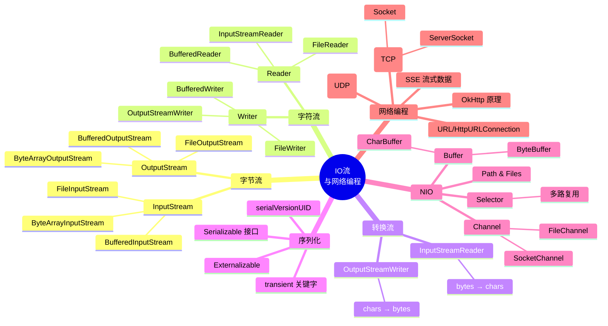
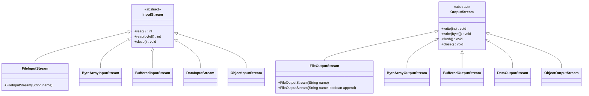
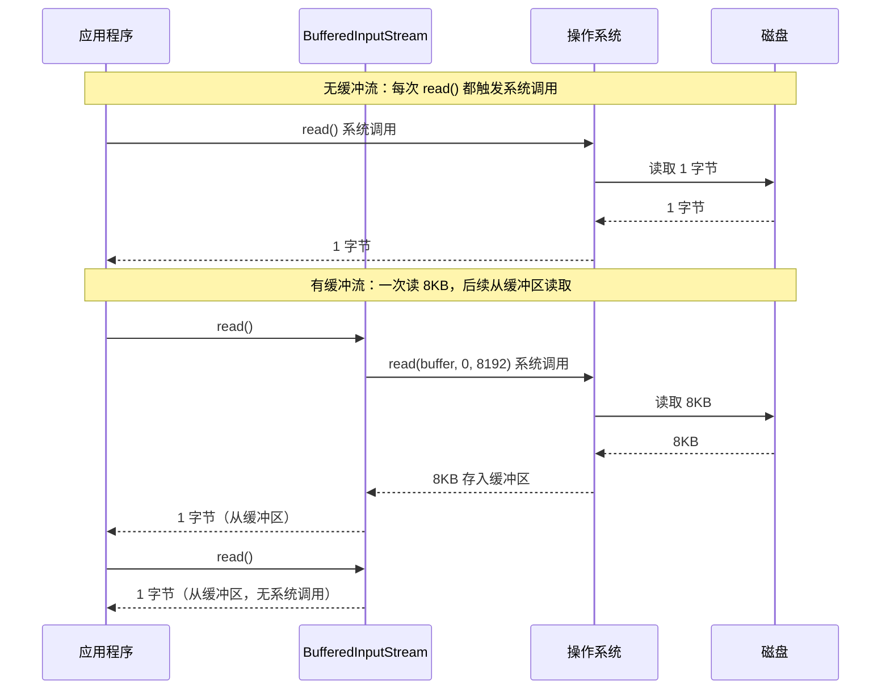
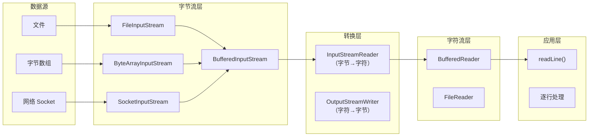
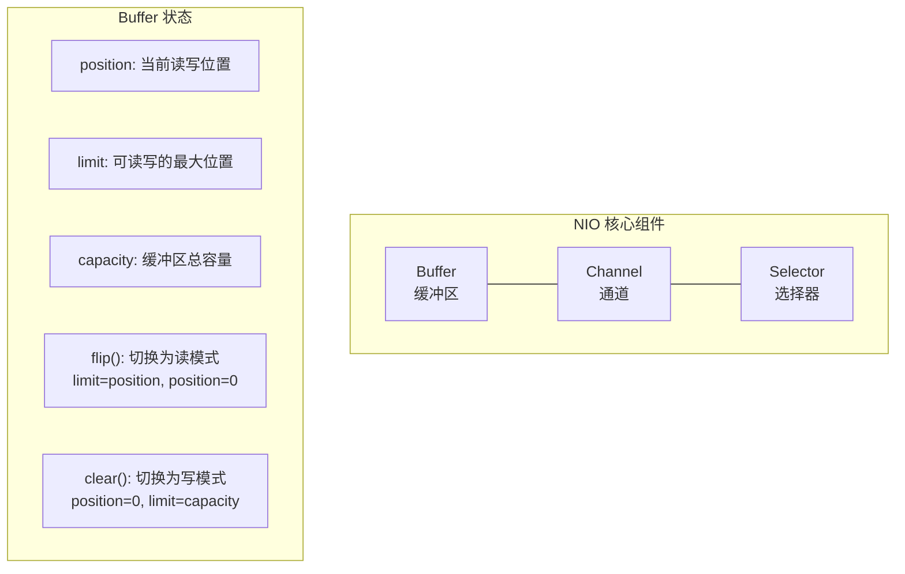
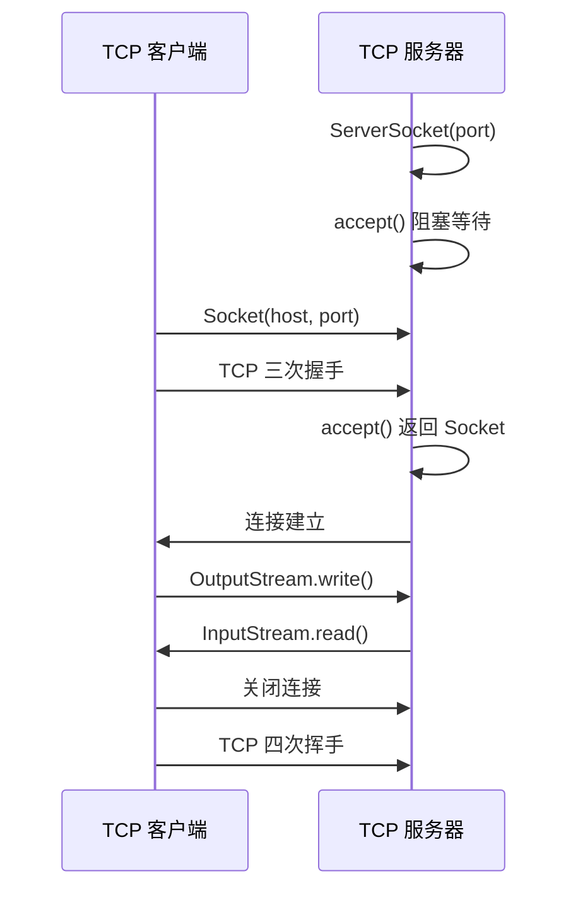
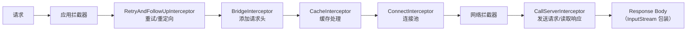

# 04 — IO 流与网络编程

> 本章详解 Java IO 流体系（字节流/字符流/缓冲流/转换流）、序列化、NIO（Buffer/Channel/Selector）、Socket 编程（TCP/UDP），并结合 Hsiaopu 项目中的网络请求（OkHttp SSE 流式）、Shell 命令执行等实际场景进行讲解。

---

## 📌 本章脑图



---

## 1. 字节流（InputStream / OutputStream）

### 1.1 核心类层次



### 1.2 字节流基本操作

```java
import java.io.*;

public class ByteStreamDemo {
    public static void main(String[] args) {
        // ============ FileInputStream / FileOutputStream ============
        // 文件读取
        try (FileInputStream fis = new FileInputStream("input.txt");
             FileOutputStream fos = new FileOutputStream("output.txt")) {

            // 方式 1：逐字节读取
            int byteData;
            while ((byteData = fis.read()) != -1) {
                fos.write(byteData);
            }

        } catch (IOException e) {
            e.printStackTrace();
        }

        // 方式 2：缓冲区批量读取
        try (FileInputStream fis = new FileInputStream("input.txt");
             FileOutputStream fos = new FileOutputStream("output.txt")) {

            byte[] buffer = new byte[8192]; // 8KB 缓冲区
            int bytesRead;
            while ((bytesRead = fis.read(buffer)) != -1) {
                fos.write(buffer, 0, bytesRead);
            }

        } catch (IOException e) {
            e.printStackTrace();
        }

        // ============ ByteArrayInputStream / ByteArrayOutputStream ============
        byte[] data = "Hello, Hsiaopu!".getBytes();
        try (ByteArrayInputStream bais = new ByteArrayInputStream(data);
             ByteArrayOutputStream baos = new ByteArrayOutputStream()) {

            byte[] buf = new byte[1024];
            int len;
            while ((len = bais.read(buf)) != -1) {
                baos.write(buf, 0, len);
            }

            byte[] result = baos.toByteArray();
            System.out.println(new String(result)); // "Hello, Hsiaopu!"

        } catch (IOException e) {
            e.printStackTrace();
        }
    }
}
```

### 1.3 缓冲流（Buffered Stream）

```java
// 缓冲流：包装普通流，提供内部缓冲区，减少系统调用次数
public class BufferedStreamDemo {
    public static void main(String[] args) {
        // 缓冲字节输入流（默认缓冲区 8192 字节）
        try (BufferedInputStream bis = new BufferedInputStream(
                 new FileInputStream("large_file.bin"));
             BufferedOutputStream bos = new BufferedOutputStream(
                 new FileOutputStream("copy.bin"))) {

            byte[] buffer = new byte[4096];
            int len;
            while ((len = bis.read(buffer)) != -1) {
                bos.write(buffer, 0, len);
            }
            bos.flush(); // 确保缓冲区数据写入磁盘

        } catch (IOException e) {
            e.printStackTrace();
        }
    }
}
```

**为什么需要缓冲流？**



---

## 2. 字符流（Reader / Writer）

### 2.1 核心类层次

```java
// 字符流：处理文本数据，自动处理字符编码

// ============ FileReader / FileWriter ============
try (FileReader reader = new FileReader("input.txt");
     FileWriter writer = new FileWriter("output.txt")) {

    char[] buffer = new char[1024];
    int len;
    while ((len = reader.read(buffer)) != -1) {
        writer.write(buffer, 0, len);
    }

} catch (IOException e) {
    e.printStackTrace();
}

// ============ BufferedReader / BufferedWriter ============
try (BufferedReader br = new BufferedReader(new FileReader("input.txt"));
     BufferedWriter bw = new BufferedWriter(new FileWriter("output.txt"))) {

    // 逐行读取
    String line;
    while ((line = br.readLine()) != null) {
        bw.write(line);
        bw.newLine(); // 写入换行符
    }

} catch (IOException e) {
    e.printStackTrace();
}
```

### 2.2 转换流（InputStreamReader / OutputStreamWriter）

```java
// 转换流：字节流 ↔ 字符流的桥梁，指定字符编码
public class ConvertStreamDemo {
    public static void main(String[] args) {
        // ============ 字节流 → 字符流（解码） ============
        try (FileInputStream fis = new FileInputStream("utf8_file.txt");
             // 字节流包装为字符流，指定 UTF-8 编码
             InputStreamReader isr = new InputStreamReader(fis, StandardCharsets.UTF_8);
             BufferedReader br = new BufferedReader(isr)) {

            String line;
            while ((line = br.readLine()) != null) {
                System.out.println(line);
            }

        } catch (IOException e) {
            e.printStackTrace();
        }

        // ============ 字符流 → 字节流（编码） ============
        try (FileOutputStream fos = new FileOutputStream("output.txt");
             OutputStreamWriter osw = new OutputStreamWriter(fos, StandardCharsets.UTF_8);
             BufferedWriter bw = new BufferedWriter(osw)) {

            bw.write("你好，Hsiaopu！");
            bw.newLine();
            bw.write("Hello, World!");

        } catch (IOException e) {
            e.printStackTrace();
        }
    }
}
```

**IO 流体系总结：**



---

## 3. 序列化与反序列化

### 3.1 Serializable 接口

```java
import java.io.*;

// 实现 Serializable 接口（标记接口，无方法）
public class User implements Serializable {
    // 显式声明 serialVersionUID（推荐）
    private static final long serialVersionUID = 1L;

    private String name;
    private int age;
    // transient 关键字：该字段不参与序列化
    private transient String password;

    public User(String name, int age, String password) {
        this.name = name;
        this.age = age;
        this.password = password;
    }

    // ============ 序列化 ============
    public static void serialize(User user, String filePath) {
        try (FileOutputStream fos = new FileOutputStream(filePath);
             ObjectOutputStream oos = new ObjectOutputStream(fos)) {
            oos.writeObject(user);
            System.out.println("Serialized: " + user);
        } catch (IOException e) {
            e.printStackTrace();
        }
    }

    // ============ 反序列化 ============
    public static User deserialize(String filePath) {
        try (FileInputStream fis = new FileInputStream(filePath);
             ObjectInputStream ois = new ObjectInputStream(fis)) {
            User user = (User) ois.readObject();
            System.out.println("Deserialized: " + user);
            return user;
        } catch (IOException | ClassNotFoundException e) {
            e.printStackTrace();
            return null;
        }
    }

    @Override
    public String toString() {
        return "User{name='" + name + "', age=" + age + ", password='" + password + "'}";
    }

    public static void main(String[] args) {
        User user = new User("Alice", 25, "secret123");
        serialize(user, "user.ser");
        // 反序列化后 password 为 null（transient 不序列化）
        User loaded = deserialize("user.ser");
        // 输出: User{name='Alice', age=25, password='null'}
    }
}
```

### 3.2 serialVersionUID 的作用

```java
// serialVersionUID 用于版本控制
// 序列化时写入 serialVersionUID
// 反序列化时比对：如果不同则抛 InvalidClassException

// 如果没有显式声明，JVM 会根据类结构自动生成
// 但类结构变化后自动生成的 UID 会变，导致反序列化失败

// 最佳实践：显式声明 serialVersionUID
private static final long serialVersionUID = 20240101L;
```

### 3.3 Gson 序列化（Hsiaopu 项目使用）

Hsiaopu 项目使用 Gson 进行 JSON 序列化，而不是 Java 原生序列化：

```java
import com.google.gson.Gson;
import com.google.gson.annotations.SerializedName;

// Gson 序列化：更灵活，跨平台
public class ChatRequest {
    private String model;
    private List<Message> messages;
    private double temperature;
    @SerializedName("max_tokens") // 自定义 JSON 字段名
    private int maxTokens;
    private boolean stream;

    // 序列化
    public String toJson() {
        return new Gson().toJson(this);
    }

    // 反序列化
    public static ChatRequest fromJson(String json) {
        return new Gson().fromJson(json, ChatRequest.class);
    }
}
```

**Java 原生序列化 vs Gson/Jackson：**

| 维度 | Serializable | Gson / Jackson |
|------|-------------|----------------|
| 格式 | 二进制（不可读） | JSON / XML（可读） |
| 跨语言 | ❌ 仅 Java | ✅ 跨语言 |
| 性能 | 较快 | 略慢（文本格式） |
| 安全性 | 有反序列化漏洞风险 | 相对安全（不支持任意代码执行） |
| 使用场景 | JVM 内部传输 | 网络传输、API 通信 |

---

## 4. NIO（New IO）

### 4.1 NIO 三大核心组件



### 4.2 Buffer 操作

```java
import java.nio.*;

public class BufferDemo {
    public static void main(String[] args) {
        // ============ ByteBuffer 基本操作 ============
        // 分配 10 字节的缓冲区
        ByteBuffer buffer = ByteBuffer.allocate(10);

        System.out.println("初始状态:");
        System.out.println("  position=" + buffer.position() + " limit=" + buffer.limit()); // 0, 10

        // 写入数据
        buffer.put("Hello".getBytes()); // 写入 5 字节
        System.out.println("写入后:");
        System.out.println("  position=" + buffer.position()); // 5

        // 切换为读模式
        buffer.flip();
        System.out.println("flip 后:");
        System.out.println("  position=" + buffer.position() + " limit=" + buffer.limit()); // 0, 5

        // 读取数据
        byte[] dst = new byte[5];
        buffer.get(dst);
        System.out.println("读取: " + new String(dst)); // "Hello"

        // 清除缓冲区（准备写入）
        buffer.clear();
        System.out.println("clear 后:");
        System.out.println("  position=" + buffer.position() + " limit=" + buffer.limit()); // 0, 10

        // ============ 堆外内存（DirectByteBuffer）============
        // 直接内存，减少一次拷贝（零拷贝），适合高频 IO
        ByteBuffer directBuffer = ByteBuffer.allocateDirect(1024);

        // ============ 其他 Buffer 类型 ============
        CharBuffer charBuffer = CharBuffer.allocate(100);
        IntBuffer intBuffer = IntBuffer.allocate(100);
    }
}
```

### 4.3 Channel 操作

```java
import java.io.*;
import java.nio.*;
import java.nio.channels.*;

public class ChannelDemo {
    public static void main(String[] args) throws IOException {
        // ============ FileChannel 文件复制 ============
        try (FileInputStream fis = new FileInputStream("source.txt");
             FileOutputStream fos = new FileOutputStream("dest.txt");
             FileChannel srcChannel = fis.getChannel();
             FileChannel destChannel = fos.getChannel()) {

            // 方式 1：transferTo（零拷贝，高效）
            srcChannel.transferTo(0, srcChannel.size(), destChannel);

            // 方式 2：手动 Buffer 读写
            // ByteBuffer buffer = ByteBuffer.allocate(8192);
            // while (srcChannel.read(buffer) != -1) {
            //     buffer.flip();
            //     destChannel.write(buffer);
            //     buffer.clear();
            // }
        }

        // ============ 使用 Path 和 Files（JDK 7+）============
        // 更简洁的读写方式
        Path path = Paths.get("example.txt");

        // 读取所有行
        List<String> lines = Files.readAllLines(path, StandardCharsets.UTF_8);

        // 写入文件
        Files.write(Paths.get("output.txt"),
            Arrays.asList("Line 1", "Line 2"),
            StandardCharsets.UTF_8);

        // 复制文件
        Files.copy(Paths.get("src.txt"), Paths.get("dst.txt"),
            StandardCopyOption.REPLACE_EXISTING);

        // 文件遍历
        try (var stream = Files.walk(Paths.get("."), 2)) {
            stream.filter(Files::isRegularFile)
                  .forEach(System.out::println);
        }
    }
}
```

### 4.4 Selector 多路复用

```java
public class SelectorDemo {
    public static void main(String[] args) throws IOException {
        Selector selector = Selector.open();

        // 创建 ServerSocketChannel
        ServerSocketChannel serverChannel = ServerSocketChannel.open();
        serverChannel.bind(new InetSocketAddress(8080));
        serverChannel.configureBlocking(false); // 必须设为非阻塞

        // 注册到 Selector，监听 ACCEPT 事件
        serverChannel.register(selector, SelectionKey.OP_ACCEPT);

        System.out.println("Server started on port 8080...");

        while (true) {
            // 阻塞等待事件（可设置超时）
            selector.select();

            // 获取就绪的 key
            Set<SelectionKey> selectedKeys = selector.selectedKeys();
            Iterator<SelectionKey> iterator = selectedKeys.iterator();

            while (iterator.hasNext()) {
                SelectionKey key = iterator.next();
                iterator.remove(); // 必须手动移除

                if (key.isAcceptable()) {
                    // 接受新连接
                    ServerSocketChannel server = (ServerSocketChannel) key.channel();
                    SocketChannel client = server.accept();
                    client.configureBlocking(false);
                    client.register(selector, SelectionKey.OP_READ);
                    System.out.println("New client connected: " + client.getRemoteAddress());

                } else if (key.isReadable()) {
                    // 读取数据
                    SocketChannel client = (SocketChannel) key.channel();
                    ByteBuffer buffer = ByteBuffer.allocate(1024);
                    int bytesRead = client.read(buffer);

                    if (bytesRead == -1) {
                        // 客户端断开连接
                        client.close();
                        System.out.println("Client disconnected");
                    } else {
                        buffer.flip();
                        byte[] data = new byte[buffer.remaining()];
                        buffer.get(data);
                        System.out.println("Received: " + new String(data));

                        // 回显
                        buffer.flip();
                        client.write(buffer);
                    }
                }
            }
        }
    }
}
```

---

## 5. Socket 网络编程

### 5.1 TCP 通信



**TCP 服务端：**

```java
public class TCPServer {
    public static void main(String[] args) throws IOException {
        try (ServerSocket serverSocket = new ServerSocket(8888)) {
            System.out.println("TCP Server started on port 8888");

            while (true) {
                // 阻塞等待客户端连接
                Socket clientSocket = serverSocket.accept();
                System.out.println("Client connected: " + clientSocket.getInetAddress());

                // 为每个客户端创建新线程
                new Thread(() -> handleClient(clientSocket)).start();
            }
        }
    }

    private static void handleClient(Socket socket) {
        try (
            BufferedReader in = new BufferedReader(
                new InputStreamReader(socket.getInputStream(), StandardCharsets.UTF_8));
            PrintWriter out = new PrintWriter(
                new OutputStreamWriter(socket.getOutputStream(), StandardCharsets.UTF_8), true)
        ) {
            String line;
            while ((line = in.readLine()) != null) {
                System.out.println("Received: " + line);
                out.println("Echo: " + line); // 回显
            }
        } catch (IOException e) {
            e.printStackTrace();
        } finally {
            try { socket.close(); } catch (IOException e) { e.printStackTrace(); }
        }
    }
}
```

**TCP 客户端：**

```java
public class TCPClient {
    public static void main(String[] args) {
        try (Socket socket = new Socket("localhost", 8888);
             PrintWriter out = new PrintWriter(
                 new OutputStreamWriter(socket.getOutputStream(), StandardCharsets.UTF_8), true);
             BufferedReader in = new BufferedReader(
                 new InputStreamReader(socket.getInputStream(), StandardCharsets.UTF_8))) {

            // 发送消息
            out.println("Hello, Server!");
            // 接收响应
            String response = in.readLine();
            System.out.println("Server response: " + response);

        } catch (IOException e) {
            e.printStackTrace();
        }
    }
}
```

### 5.2 UDP 通信

```java
public class UDPDemo {
    // ============ UDP 发送端 ============
    public static void send() throws IOException {
        DatagramSocket socket = new DatagramSocket();
        String message = "Hello, UDP!";
        byte[] data = message.getBytes(StandardCharsets.UTF_8);

        DatagramPacket packet = new DatagramPacket(
            data, data.length,
            InetAddress.getByName("localhost"), 9999
        );
        socket.send(packet);
        socket.close();
    }

    // ============ UDP 接收端 ============
    public static void receive() throws IOException {
        DatagramSocket socket = new DatagramSocket(9999);
        byte[] buffer = new byte[1024];
        DatagramPacket packet = new DatagramPacket(buffer, buffer.length);

        System.out.println("UDP Server waiting...");
        socket.receive(packet); // 阻塞等待

        String received = new String(packet.getData(), 0, packet.getLength(), StandardCharsets.UTF_8);
        System.out.println("Received: " + received);
        System.out.println("From: " + packet.getAddress() + ":" + packet.getPort());

        socket.close();
    }
}
```

**TCP vs UDP 对比：**

| 维度 | TCP | UDP |
|------|-----|-----|
| 连接 | 面向连接（三次握手） | 无连接 |
| 可靠性 | 可靠（确认重传） | 不可靠（可能丢包） |
| 顺序 | 保证顺序 | 不保证顺序 |
| 速度 | 较慢 | 较快 |
| 数据边界 | 无（流式） | 有（数据报） |
| 开销 | 头部 20 字节 | 头部 8 字节 |
| 使用场景 | HTTP、FTP、SSH | 视频直播、DNS、游戏 |

---

## 6. OkHttp 中的 IO 概念

### 6.1 OkHttp 拦截器链（装饰器模式 + IO 流包装）



### 6.2 OkHttp 的 ResponseBody 与 IO 流

```java
// OkHttp 的 ResponseBody 本质上是 InputStream 的封装
public abstract class ResponseBody implements Closeable {
    // 核心方法：返回 InputStream
    public abstract InputStream byteStream();

    // 便捷方法：转为字符串
    public final String string() throws IOException {
        // 内部使用 BufferedSource（Okio 的缓冲流包装）
        BufferedSource source = source();
        try {
            return source.readString(charset());
        } finally {
            source.close();
        }
    }
}

// 在 OkHttp 内部，网络数据流经过多层包装：
// Socket InputStream
//   → Okio BufferedSource（类似 BufferedInputStream）
//     → GzipSource（如果是 gzip 压缩）
//       → ResponseBody.byteStream()
```

### 6.3 SSE 流式数据读取（Hsiaopu 核心场景）

Hsiaopu 的 AI 对话功能使用 SSE（Server-Sent Events）协议，从 OkHttp 的 ResponseBody 中逐行读取流式数据：

**Kotlin 源码（简化逻辑）：**

```kotlin
// 流式读取 SSE 数据
fun sendMessageStream(request: ChatRequest): Flow<String> = flow {
    val response = okHttpClient.newCall(okHttpRequest).execute()
    val source = response.body?.source() ?: throw IOException("Empty body")

    while (!source.exhausted()) {
        val line = source.readUtf8Line() ?: continue
        if (line.startsWith("data: ")) {
            val data = line.removePrefix("data: ")
            if (data == "[DONE]") break
            // 解析 JSON，提取 delta.content
            val chunk = parseChunk(data)
            if (chunk != null) emit(chunk)
        }
    }
}
```

**对应 Java 实现：**

```java
import java.io.*;
import java.net.HttpURLConnection;
import java.net.URL;

public class SSEStreamReader {
    /**
     * 使用 HttpURLConnection 读取 SSE 流式数据
     * 对应 Hsiaopu 中 OkHttp + Okio 的 SSE 流式读取
     */
    public void readSSEStream(String apiUrl, String jsonBody, StreamCallback callback) {
        try {
            URL url = new URL(apiUrl);
            HttpURLConnection conn = (HttpURLConnection) url.openConnection();
            conn.setRequestMethod("POST");
            conn.setRequestProperty("Content-Type", "application/json");
            conn.setRequestProperty("Accept", "text/event-stream");
            conn.setDoOutput(true);
            conn.setConnectTimeout(30000);
            conn.setReadTimeout(60000); // SSE 长连接，需要较长超时

            // 发送请求体
            try (OutputStream os = conn.getOutputStream();
                 // 包装为缓冲流提高效率
                 BufferedOutputStream bos = new BufferedOutputStream(os)) {
                bos.write(jsonBody.getBytes(StandardCharsets.UTF_8));
                bos.flush();
            }

            // 读取 SSE 流式响应
            int responseCode = conn.getResponseCode();
            if (responseCode == 200) {
                try (InputStream is = conn.getInputStream();
                     BufferedInputStream bis = new BufferedInputStream(is);
                     // 字节流 → 字符流 → 缓冲流（逐行读取）
                     InputStreamReader isr = new InputStreamReader(bis, StandardCharsets.UTF_8);
                     BufferedReader reader = new BufferedReader(isr)) {

                    String line;
                    StringBuilder fullContent = new StringBuilder();

                    while ((line = reader.readLine()) != null) {
                        if (line.startsWith("data: ")) {
                            String data = line.substring(6); // 去掉 "data: " 前缀

                            if ("[DONE]".equals(data)) {
                                break; // SSE 流结束
                            }

                            // 解析 JSON 提取内容
                            String chunk = extractContent(data);
                            if (chunk != null) {
                                fullContent.append(chunk);
                                callback.onChunk(chunk); // 逐块回调
                            }
                        }
                    }

                    callback.onComplete(fullContent.toString());
                }
            } else {
                // 读取错误响应
                try (InputStream errorStream = conn.getErrorStream();
                     BufferedReader reader = new BufferedReader(
                         new InputStreamReader(errorStream, StandardCharsets.UTF_8))) {
                    StringBuilder errorBody = new StringBuilder();
                    String line;
                    while ((line = reader.readLine()) != null) {
                        errorBody.append(line);
                    }
                    callback.onError(new IOException("HTTP " + responseCode + ": " + errorBody));
                }
            }

            conn.disconnect();

        } catch (IOException e) {
            callback.onError(e);
        }
    }

    private String extractContent(String jsonData) {
        // 简化：从 JSON 中提取 delta.content
        // {"choices":[{"delta":{"content":"Hello"}}]}
        try {
            int start = jsonData.indexOf("\"content\":\"");
            if (start == -1) return null;
            start += 11; // "\"content\":\"" 的长度
            int end = jsonData.indexOf("\"", start);
            if (end == -1) return null;
            return jsonData.substring(start, end)
                .replace("\\n", "\n")
                .replace("\\\"", "\"");
        } catch (Exception e) {
            return null;
        }
    }

    // 回调接口（对应 Kotlin Flow 的 emit）
    public interface StreamCallback {
        void onChunk(String chunk);
        void onComplete(String fullContent);
        void onError(Exception e);
    }
}
```

### 6.4 Hsiaopu 项目中的文件操作

**ShellExecutor — 进程 IO 流读取：**

```java
// Hsiaopu 中执行 Shell 命令时的 IO 操作（对应 ShellExecutor.kt）
public class ShellCommandExecutor {
    /**
     * 执行 Shell 命令并读取输出
     * 使用 InputStream 读取进程的输出流和错误流
     */
    public static String execute(String command) {
        try {
            Process process = Runtime.getRuntime().exec(command);

            // 读标准输出
            StringBuilder output = new StringBuilder();
            try (InputStream is = process.getInputStream();
                 BufferedInputStream bis = new BufferedInputStream(is);
                 InputStreamReader isr = new InputStreamReader(bis, StandardCharsets.UTF_8);
                 BufferedReader reader = new BufferedReader(isr)) {

                String line;
                while ((line = reader.readLine()) != null) {
                    output.append(line).append("\n");
                }
            }

            // 读取错误流（另起线程避免阻塞）
            try (InputStream es = process.getErrorStream();
                 BufferedReader errReader = new BufferedReader(
                     new InputStreamReader(es, StandardCharsets.UTF_8))) {

                String line;
                while ((line = errReader.readLine()) != null) {
                    output.append("[ERROR] ").append(line).append("\n");
                }
            }

            process.waitFor();
            return output.toString();

        } catch (IOException | InterruptedException e) {
            return "Error: " + e.getMessage();
        }
    }
}
```

---

## 7. 面试高频题

### Q1: 字节流和字符流的区别？什么时候用哪个？

**回答：**
- **字节流**（InputStream/OutputStream）：处理原始二进制数据，以字节（8 bit）为单位。适合图片、视频、音频等二进制文件。
- **字符流**（Reader/Writer）：处理文本数据，以字符（16 bit Unicode）为单位，自动处理字符编码转换。适合文本文件。
- **转换流**（InputStreamReader/OutputStreamWriter）：字节流和字符流之间的桥梁，可以指定字符编码。

**Hsiaopu 项目中的应用**：SSE 网络流先通过字节流读取原始数据，再包装为字符流逐行解析。

### Q2: 什么是序列化？serialVersionUID 的作用？

**回答：**
- **序列化**：将对象状态转换为字节序列的过程，用于存储或传输
- **serialVersionUID**：版本控制标识符
  - 序列化时写入 UID
  - 反序列化时比对：相同则成功，不同则抛出 `InvalidClassException`
  - 显式声明可避免类结构微调后反序列化失败

### Q3: BIO、NIO、AIO 的区别？

| 维度 | BIO | NIO | AIO（NIO 2.0） |
|------|-----|-----|---------------|
| 全称 | Blocking IO | Non-blocking IO | Asynchronous IO |
| 模型 | 一请求一线程 | 一个线程处理多个请求 | 回调/通知 |
| 阻塞 | 阻塞读写 | 非阻塞 + Selector | 异步非阻塞 |
| 复杂度 | 简单 | 较复杂 | 中等 |
| 吞吐量 | 低 | 高 | 高 |
| 使用场景 | 连接数少的场景 | 高并发连接 | 高并发连接 |

### Q4: NIO 的 Buffer 三种状态：position、limit、capacity？

```
初始状态（写模式）：  position=0, limit=capacity=10
写入 5 字节后：      position=5, limit=10
flip() 切换读模式：  position=0, limit=5
读取 3 字节后：      position=3, limit=5
clear() 切换写模式： position=0, limit=10
compact() 压缩：     position=2, limit=10（将未读数据移到开头）
```

### Q5: TCP 三次握手和四次挥手？

**三次握手：**
```
Client → Server: SYN=1, seq=x
Server → Client: SYN=1, ACK=1, seq=y, ack=x+1
Client → Server: ACK=1, seq=x+1, ack=y+1
```

**四次挥手：**
```
Client → Server: FIN=1, seq=u
Server → Client: ACK=1, seq=v, ack=u+1
Server → Client: FIN=1, ACK=1, seq=w, ack=u+1
Client → Server: ACK=1, seq=u+1, ack=w+1
```

### Q6: OkHttp 中拦截器链是如何工作的？

**回答：**
OkHttp 使用**责任链模式（Chain of Responsibility）**：
- 每个拦截器持有下一个拦截器的引用
- 调用 `chain.proceed(request)` 前执行预处理逻辑
- 调用后获取 Response，执行后处理逻辑
- 形成 `Request → I1 → I2 → I3 → Server → I3 → I2 → I1 → Response` 的嵌套调用链

---

## 8. 本章小结

| 知识点 | 掌握标准 |
|--------|----------|
| 字节流 vs 字符流 | 能说出区别、使用场景和转换方式 |
| 缓冲流 | 理解缓冲区原理，能使用 BufferedInputStream |
| 转换流 | 理解字节→字符的编码转换过程 |
| 序列化 | 能写出 Serializable 实现，理解 transient 和 serialVersionUID |
| NIO Buffer | 理解 position/limit/capacity 三种状态 |
| NIO Channel | 能使用 FileChannel 进行文件复制 |
| Selector | 理解多路复用原理 |
| TCP vs UDP | 能说出区别、适用场景 |
| SSE 流式读取 | 理解逐行读取 SSE 数据的 IO 流包装方式 |

---

## 9. 练习题

1. 用 Java 实现文件复制：分别用字节流（FileInputStream/FileOutputStream）和 NIO（FileChannel.transferTo）两种方式，比较性能差异
2. 用 `BufferedReader` 逐行读取一个文本文件，统计文件中每个单词出现的次数
3. 实现一个支持 `Serializable` 的 `ConversationEntity` 类，包含 `transient` 字段，测试序列化与反序列化
4. 用 `ServerSocket` 和 `Socket` 实现一个简单的 Echo 服务器（客户端发送消息，服务器原样返回）
5. 模拟 Hsiaopu 的 SSE 流式读取：写一个假数据生成器，模拟逐行返回 SSE 格式数据，用 `BufferedReader.readLine()` 逐行解析