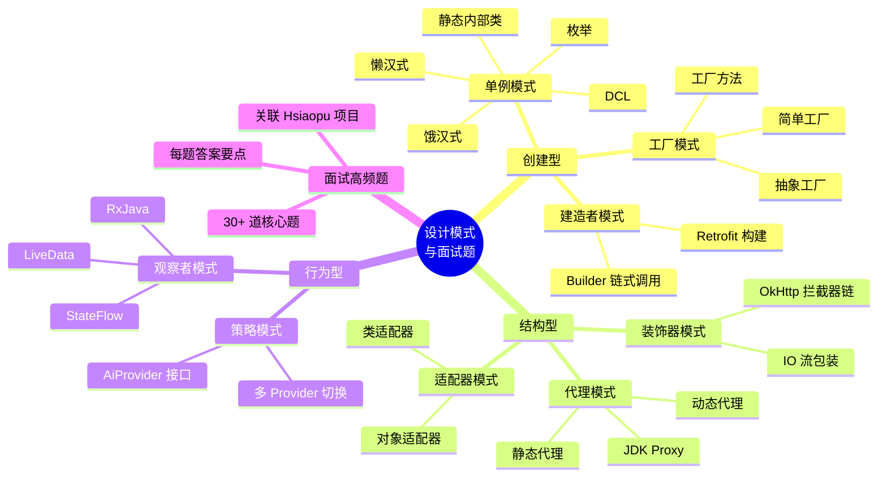
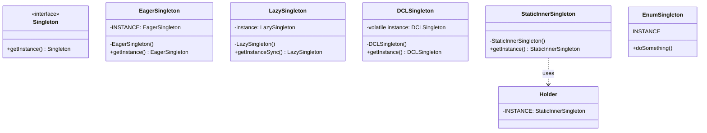
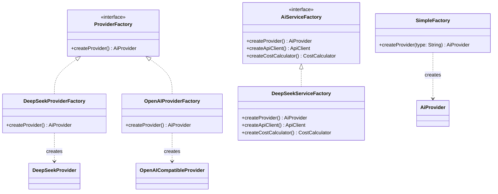
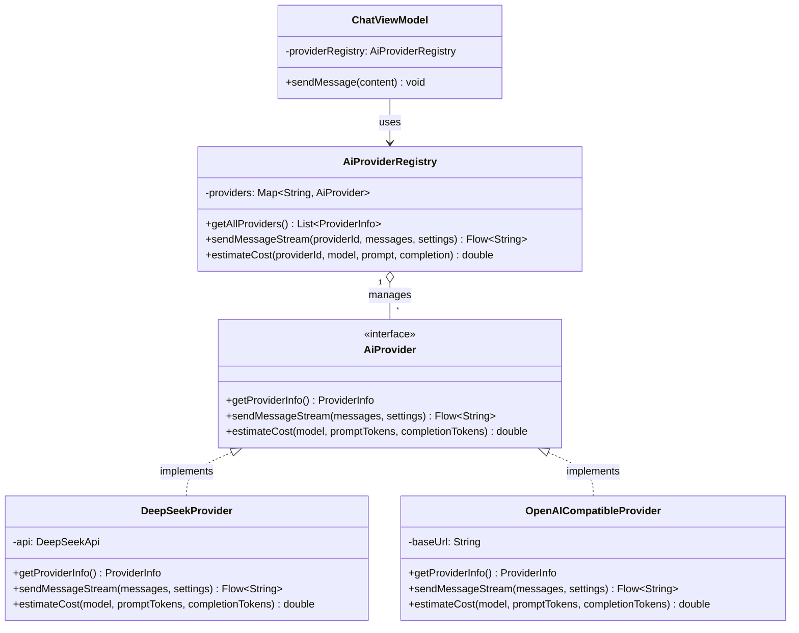
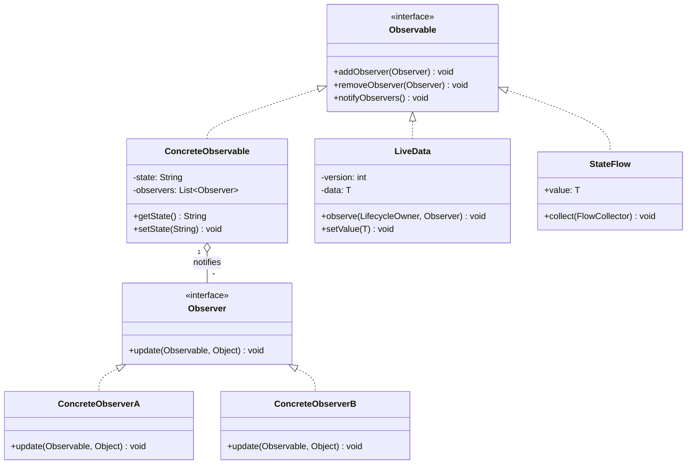
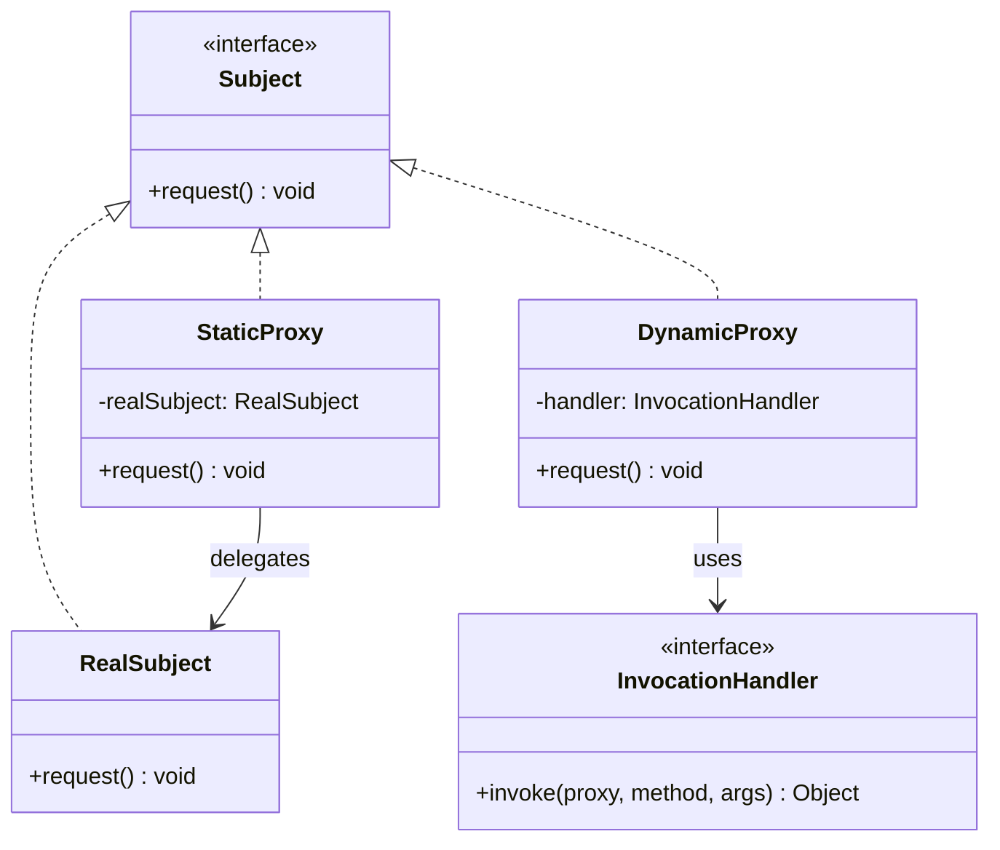
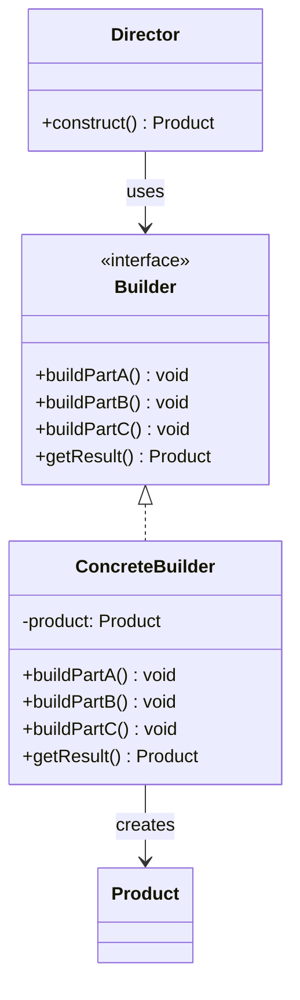
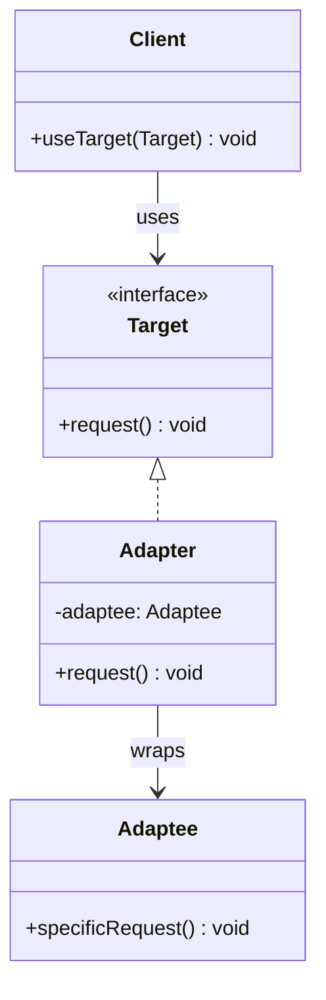
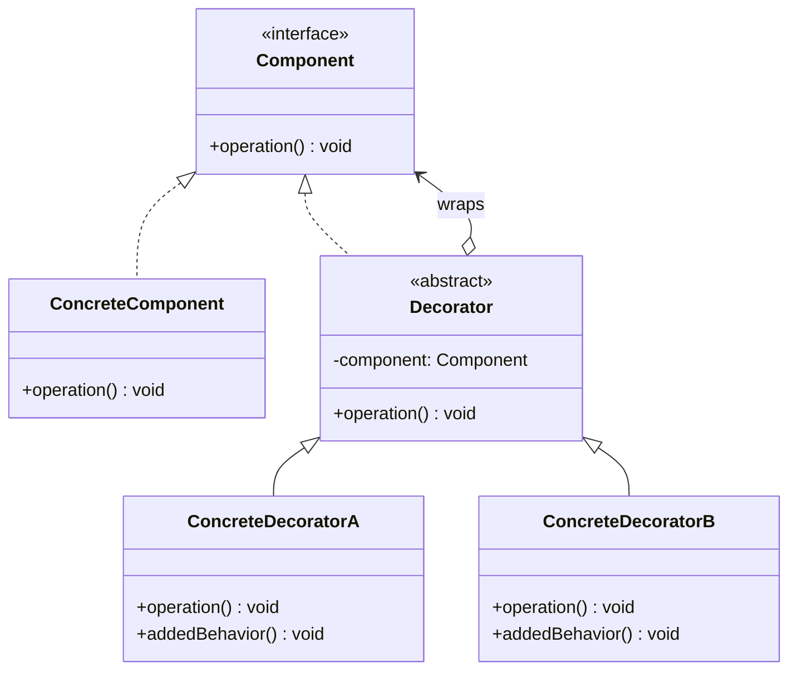
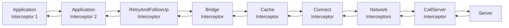

# 05 — 设计模式与面试高频题

> 本章详解 Java 面试中 8 种核心设计模式：单例、工厂、策略、观察者、代理、建造者、适配器、装饰器，每种模式配 Mermaid 类图，结合 Hsiaopu 项目中的实际代码示例，最后汇总 30+ 道 Java 面试高频题。

---

## 📌 本章脑图



---

## 1. 单例模式（Singleton）

### 1.1 饿汉式（Eager Initialization）

```java
// 饿汉式：类加载时就创建实例，线程安全，但可能浪费内存
public class EagerSingleton {
    // 1. 私有静态实例（类加载时创建）
    private static final EagerSingleton INSTANCE = new EagerSingleton();

    // 2. 私有构造方法
    private EagerSingleton() {
        // 防止反射破坏
        if (INSTANCE != null) {
            throw new RuntimeException("Singleton already created!");
        }
    }

    // 3. 公共静态获取方法
    public static EagerSingleton getInstance() {
        return INSTANCE;
    }
}
```

### 1.2 懒汉式（Lazy Initialization）

```java
// 懒汉式（线程不安全版）
public class LazySingleton {
    private static LazySingleton instance;

    private LazySingleton() {}

    // 线程不安全！
    public static LazySingleton getInstance() {
        if (instance == null) {
            instance = new LazySingleton();
        }
        return instance;
    }

    // 线程安全版（synchronized 方法）
    public static synchronized LazySingleton getInstanceSync() {
        if (instance == null) {
            instance = new LazySingleton();
        }
        return instance;
    }
}
```

### 1.3 DCL（Double-Checked Locking）— 面试必问

```java
// DCL：双重检查锁定，线程安全 + 懒加载 + 高性能
public class DCLSingleton {
    // volatile 必须！防止指令重排导致返回未初始化对象
    private static volatile DCLSingleton instance;

    private DCLSingleton() {
        if (instance != null) {
            throw new RuntimeException("Singleton already created!");
        }
    }

    public static DCLSingleton getInstance() {
        if (instance == null) {                    // 第一次检查（无锁）
            synchronized (DCLSingleton.class) {     // 获取锁
                if (instance == null) {             // 第二次检查（有锁）
                    instance = new DCLSingleton();  // 创建实例
                }
            }
        }
        return instance;
    }
}
```

**为什么 DCL 需要 `volatile`？**

`new DCLSingleton()` 不是原子操作，分为三步：
1. 分配内存空间
2. 初始化对象（执行构造方法）
3. 将引用指向内存地址

JVM 可能**指令重排**为 1→3→2。如果线程 A 执行完 1→3 后（instance 不为 null 但尚未初始化），线程 B 执行第一次检查发现 instance 不为 null，直接返回**未初始化的对象**。`volatile` 禁止指令重排，保证 1→2→3 的顺序执行。

### 1.4 静态内部类（推荐）

```java
// 静态内部类：利用 JVM 类加载机制的延迟加载，线程安全，简洁
public class StaticInnerSingleton {

    private StaticInnerSingleton() {}

    // 静态内部类：只有在调用 getInstance() 时才会被加载
    private static class Holder {
        private static final StaticInnerSingleton INSTANCE = new StaticInnerSingleton();
    }

    public static StaticInnerSingleton getInstance() {
        return Holder.INSTANCE;
    }
}
```

### 1.5 枚举单例（最安全）

```java
// 枚举：天然线程安全，防止反射和序列化破坏
public enum EnumSingleton {
    INSTANCE;

    private String config;

    public void doSomething() {
        System.out.println("Enum singleton working");
    }

    public String getConfig() { return config; }
    public void setConfig(String config) { this.config = config; }
}

// 使用
EnumSingleton.INSTANCE.doSomething();
```

### 1.6 五种单例对比



| 方式 | 线程安全 | 懒加载 | 防反射 | 防序列化 | 推荐度 |
|------|----------|--------|--------|----------|--------|
| 饿汉式 | ✅ | ❌ | ❌ | ❌ | ⭐⭐ |
| 懒汉式 synchronized | ✅ | ✅ | ❌ | ❌ | ⭐⭐ |
| DCL | ✅ | ✅ | ❌ | ❌ | ⭐⭐⭐⭐ |
| 静态内部类 | ✅ | ✅ | ❌ | ❌ | ⭐⭐⭐⭐⭐ |
| 枚举 | ✅ | ❌ | ✅ | ✅ | ⭐⭐⭐⭐⭐ |

### 1.7 Hsiaopu 项目中的单例

Hsiaopu 使用 Hilt（依赖注入框架）管理单例，相当于自动化的单例模式：

**Kotlin 源码（`app/src/main/java/com/example/hsiaopu/di/DatabaseModule.kt`）：**

```kotlin
@Module
@InstallIn(SingletonComponent::class)
object DatabaseModule {
    @Provides
    @Singleton
    fun provideDatabase(@ApplicationContext context: Context): AppDatabase {
        return Room.databaseBuilder(context, AppDatabase::class.java, "hsiaopu_db").build()
    }
}

// AiProviderRegistry 也是单例
@Singleton
class AiProviderRegistry @Inject constructor(...) { ... }
```

**对应 Java 写法（DCL 单例版）：**

```java
public class AppDatabaseManager {
    private static volatile AppDatabaseManager instance;
    private final AppDatabase database;

    private AppDatabaseManager(Context context) {
        database = Room.databaseBuilder(
            context.getApplicationContext(),
            AppDatabase.class,
            "hsiaopu_db"
        ).build();
    }

    public static AppDatabaseManager getInstance(Context context) {
        if (instance == null) {
            synchronized (AppDatabaseManager.class) {
                if (instance == null) {
                    instance = new AppDatabaseManager(context);
                }
            }
        }
        return instance;
    }

    public AppDatabase getDatabase() { return database; }
}
```

---

## 2. 工厂模式（Factory）

### 2.1 简单工厂模式

```java
// 简单工厂：一个工厂类根据参数创建不同产品
public class SimpleFactory {
    public static AiProvider createProvider(String type) {
        switch (type) {
            case "deepseek":
                return new DeepSeekProvider();
            case "openai":
                return new OpenAICompatibleProvider();
            default:
                throw new IllegalArgumentException("Unknown provider: " + type);
        }
    }
}
```

### 2.2 工厂方法模式

```java
// 工厂方法：每个产品对应一个工厂，符合开闭原则
interface ProviderFactory {
    AiProvider createProvider();
}

class DeepSeekProviderFactory implements ProviderFactory {
    @Override
    public AiProvider createProvider() {
        return new DeepSeekProvider();
    }
}

class OpenAIProviderFactory implements ProviderFactory {
    @Override
    public AiProvider createProvider() {
        return new OpenAICompatibleProvider();
    }
}
```

### 2.3 抽象工厂模式

```java
// 抽象工厂：创建一组相关产品
interface AiServiceFactory {
    AiProvider createProvider();
    ApiClient createApiClient();
    CostCalculator createCostCalculator();
}

class DeepSeekServiceFactory implements AiServiceFactory {
    @Override
    public AiProvider createProvider() { return new DeepSeekProvider(); }
    @Override
    public ApiClient createApiClient() { return new DeepSeekApiClient(); }
    @Override
    public CostCalculator createCostCalculator() { return new DeepSeekCostCalculator(); }
}
```

### 2.4 工厂模式类图



---

## 3. 策略模式（Strategy）— Hsiaopu 核心模式

### 3.1 模式定义

**意图**：定义一系列算法，把它们封装起来，使它们可以相互替换。

Hsiaopu 项目中，`AiProvider` 接口定义了 AI 调用的策略，`DeepSeekProvider` 和 `OpenAICompatibleProvider` 是具体策略实现。

### 3.2 策略模式类图



### 3.3 Java 实现

```java
// ============ 策略接口 ============
public interface AiProvider {
    ProviderInfo getProviderInfo();
    Flow<String> sendMessageStream(List<ChatMessage> messages, AppSettings settings);
    double estimateCost(String model, long promptTokens, long completionTokens);
}

// ============ 具体策略 1：DeepSeek ============
public class DeepSeekProvider implements AiProvider {
    private final DeepSeekApi api;

    public DeepSeekProvider(DeepSeekApi api) {
        this.api = api;
    }

    @Override
    public ProviderInfo getProviderInfo() {
        return new ProviderInfo("deepseek", "DeepSeek",
            "免费注册，性价比极高，中文能力强");
    }

    @Override
    public Flow<String> sendMessageStream(List<ChatMessage> messages, AppSettings settings) {
        ChatRequest request = new ChatRequest(
            settings.getModelName(), messages,
            settings.getTemperature(), settings.getMaxTokens(), true
        );
        return api.sendMessageStream(request);
    }

    @Override
    public double estimateCost(String model, long promptTokens, long completionTokens) {
        double promptPrice = "deepseek-chat".equals(model) ? 0.14 : 1.0;
        double completionPrice = "deepseek-chat".equals(model) ? 0.28 : 2.0;
        return (promptTokens / 1_000_000.0) * promptPrice
             + (completionTokens / 1_000_000.0) * completionPrice;
    }
}

// ============ 具体策略 2：OpenAI 兼容 ============
public class OpenAICompatibleProvider implements AiProvider {
    private final OkHttpClient httpClient;

    public OpenAICompatibleProvider(OkHttpClient httpClient) {
        this.httpClient = httpClient;
    }

    @Override
    public ProviderInfo getProviderInfo() {
        return new ProviderInfo("openai", "OpenAI Compatible",
            "兼容 OpenAI API 格式的第三方服务");
    }

    @Override
    public Flow<String> sendMessageStream(List<ChatMessage> messages, AppSettings settings) {
        // 使用 OpenAI 兼容的 API 格式发送请求
        // ...
    }

    @Override
    public double estimateCost(String model, long promptTokens, long completionTokens) {
        // 不同模型的定价策略
        // ...
    }
}

// ============ 策略上下文（注册表）============
public class AiProviderRegistry {
    private final Map<String, AiProvider> providers = new ConcurrentHashMap<>();

    public void register(AiProvider provider) {
        providers.put(provider.getProviderInfo().getId(), provider);
    }

    // 策略模式的核心：根据 providerId 选择具体策略
    public Flow<String> sendMessageStream(String providerId,
            List<ChatMessage> messages, AppSettings settings) {
        AiProvider provider = providers.get(providerId);
        if (provider == null) {
            throw new IllegalArgumentException("Unknown provider: " + providerId);
        }
        return provider.sendMessageStream(messages, settings);
    }

    public double estimateCost(String providerId, String model,
            long promptTokens, long completionTokens) {
        AiProvider provider = providers.get(providerId);
        if (provider == null) return 0;
        return provider.estimateCost(model, promptTokens, completionTokens);
    }
}
```

---

## 4. 观察者模式（Observer）

### 4.1 模式定义

**意图**：定义一对多依赖关系，当一个对象状态改变时，所有依赖者自动收到通知。

Android 中 `LiveData`、Kotlin `StateFlow`、RxJava 都是观察者模式的实现。

### 4.2 观察者模式类图



### 4.3 Java 实现

```java
// ============ 传统观察者模式 ============
import java.util.*;

// 观察者接口
interface Observer {
    void update(String message);
}

// 被观察者
class ChatMessageObservable {
    private final List<Observer> observers = new ArrayList<>();
    private String latestMessage;

    public void addObserver(Observer observer) {
        observers.add(observer);
    }

    public void removeObserver(Observer observer) {
        observers.remove(observer);
    }

    public void notifyObservers() {
        for (Observer observer : observers) {
            observer.update(latestMessage);
        }
    }

    public void newMessage(String message) {
        this.latestMessage = message;
        notifyObservers(); // 状态变化时通知所有观察者
    }
}

// ============ LiveData 风格实现 ============
class SimpleLiveData<T> {
    private T value;
    private final List<Observer<T>> observers = new ArrayList<>();

    public void observe(Observer<T> observer) {
        observers.add(observer);
        // 立即通知当前值
        if (value != null) {
            observer.onChanged(value);
        }
    }

    public void setValue(T newValue) {
        this.value = newValue;
        for (Observer<T> observer : observers) {
            observer.onChanged(newValue);
        }
    }

    public T getValue() {
        return value;
    }

    interface Observer<T> {
        void onChanged(T value);
    }
}
```

### 4.4 Hsiaopu 项目中的观察者模式

**Kotlin 源码（StateFlow 驱动的 UI 更新）：**

```kotlin
// ChatViewModel.kt
class ChatViewModel @Inject constructor(...) : ViewModel() {
    private val _uiState = MutableStateFlow(ChatUiState())
    val uiState: StateFlow<ChatUiState> = _uiState.asStateFlow()

    // 状态变化 → 自动通知所有 collect 的观察者
    fun sendMessage(content: String) {
        _uiState.update { it.copy(isLoading = true) }
        // ...
    }
}

// HomeScreen.kt（观察者）
@Composable
fun HomeScreen(viewModel: ChatViewModel) {
    val uiState by viewModel.uiState.collectAsState() // 自动订阅，自动更新 UI
    // 当 uiState 变化时，Compose 自动重组 UI
}
```

**对应 Java 回调风格：**

```java
public class ChatViewModel {
    private final SimpleLiveData<ChatUiState> uiState = new SimpleLiveData<>();

    public SimpleLiveData<ChatUiState> getUiState() {
        return uiState;
    }

    public void sendMessage(String content) {
        ChatUiState current = uiState.getValue();
        uiState.setValue(current.withLoading(true));
        // 异步处理...
        // 完成后
        uiState.setValue(current.withLoading(false).withMessages(newMessages));
    }
}

// UI 层观察
viewModel.getUiState().observe(state -> {
    // 更新 UI（状态变化时自动回调）
    updateConversationList(state.getConversations());
    updateMessageList(state.getMessages());
    showLoading(state.isLoading());
});
```

---

## 5. 代理模式（Proxy）

### 5.1 静态代理

```java
// 接口
interface Subject {
    void request();
}

// 真实对象
class RealSubject implements Subject {
    @Override
    public void request() {
        System.out.println("RealSubject: Handling request");
    }
}

// 静态代理
class StaticProxy implements Subject {
    private final RealSubject realSubject;

    public StaticProxy(RealSubject realSubject) {
        this.realSubject = realSubject;
    }

    @Override
    public void request() {
        System.out.println("Proxy: Before request"); // 前置增强
        realSubject.request();
        System.out.println("Proxy: After request");  // 后置增强
    }
}
```

### 5.2 JDK 动态代理

```java
import java.lang.reflect.*;

// JDK 动态代理：基于接口，运行时生成代理类
public class DynamicProxyDemo {
    public static void main(String[] args) {
        RealSubject realSubject = new RealSubject();

        // 创建动态代理
        Subject proxy = (Subject) Proxy.newProxyInstance(
            Subject.class.getClassLoader(),        // 类加载器
            new Class<?>[] { Subject.class },       // 代理的接口
            new InvocationHandler() {               // 调用处理器
                @Override
                public Object invoke(Object proxy, Method method, Object[] args)
                        throws Throwable {
                    System.out.println("Dynamic Proxy: Before " + method.getName());
                    Object result = method.invoke(realSubject, args);
                    System.out.println("Dynamic Proxy: After " + method.getName());
                    return result;
                }
            }
        );

        proxy.request();
        // 输出:
        // Dynamic Proxy: Before request
        // RealSubject: Handling request
        // Dynamic Proxy: After request
    }
}
```

### 5.3 代理模式类图



### 5.4 代理模式在 Android 中的应用

- **Retrofit**：通过动态代理，将接口方法调用转换为 HTTP 请求
- **AOP（面向切面编程）**：日志、权限检查、事务管理
- **Hilt**：依赖注入的代理对象生成

```java
// Retrofit 动态代理示例（简化）
public class Retrofit {
    public <T> T create(Class<T> service) {
        return (T) Proxy.newProxyInstance(
            service.getClassLoader(),
            new Class<?>[] { service },
            (proxy, method, args) -> {
                // 1. 解析方法上的注解（@GET, @POST）
                // 2. 构建 OkHttp Request
                // 3. 执行网络请求
                // 4. 解析响应并返回
                return executeRequest(method, args);
            }
        );
    }
}
```

---

## 6. 建造者模式（Builder）

### 6.1 模式定义

**意图**：将复杂对象的构建与表示分离，使同样的构建过程可以创建不同的表示。

### 6.2 建造者模式类图



### 6.3 Java 实现（链式 Builder）

```java
// 链式 Builder 模式（最常用）
public class ChatRequest {
    private final String model;
    private final List<Message> messages;
    private final double temperature;
    private final int maxTokens;
    private final boolean stream;

    // 私有构造方法（通过 Builder 创建）
    private ChatRequest(Builder builder) {
        this.model = builder.model;
        this.messages = builder.messages;
        this.temperature = builder.temperature;
        this.maxTokens = builder.maxTokens;
        this.stream = builder.stream;
    }

    // Builder 静态内部类
    public static class Builder {
        private String model;
        private List<Message> messages = new ArrayList<>();
        private double temperature = 0.7;
        private int maxTokens = 2048;
        private boolean stream = true;

        public Builder model(String model) {
            this.model = model;
            return this; // 返回 this 实现链式调用
        }

        public Builder messages(List<Message> messages) {
            this.messages = messages;
            return this;
        }

        public Builder addMessage(Message message) {
            this.messages.add(message);
            return this;
        }

        public Builder temperature(double temperature) {
            this.temperature = temperature;
            return this;
        }

        public Builder maxTokens(int maxTokens) {
            this.maxTokens = maxTokens;
            return this;
        }

        public Builder stream(boolean stream) {
            this.stream = stream;
            return this;
        }

        public ChatRequest build() {
            if (model == null) throw new IllegalStateException("model is required");
            return new ChatRequest(this);
        }
    }

    // 使用 Builder 模式
    public static void main(String[] args) {
        ChatRequest request = new ChatRequest.Builder()
            .model("deepseek-chat")
            .addMessage(new Message("user", "Hello!"))
            .temperature(0.8)
            .maxTokens(4096)
            .stream(true)
            .build();
    }
}
```

### 6.4 Retrofit 中的 Builder 模式

```java
// Retrofit 使用 Builder 模式构建复杂对象
Retrofit retrofit = new Retrofit.Builder()
    .baseUrl("https://api.deepseek.com/")
    .client(okHttpClient)
    .addConverterFactory(GsonConverterFactory.create())
    // .addCallAdapterFactory(RxJava3CallAdapterFactory.create())
    .build();

// OkHttpClient 也使用 Builder 模式
OkHttpClient client = new OkHttpClient.Builder()
    .connectTimeout(30, TimeUnit.SECONDS)
    .readTimeout(60, TimeUnit.SECONDS)
    .addInterceptor(new LoggingInterceptor())
    .build();
```

---

## 7. 适配器模式（Adapter）

### 7.1 模式定义

**意图**：将一个接口转换成客户期望的另一个接口，使原本不兼容的接口可以一起工作。

### 7.2 适配器模式类图



### 7.3 Java 实现

```java
// 旧接口（不兼容）
class LegacyChatAPI {
    public String sendMessageSync(String apiKey, String prompt) {
        // 旧的同步调用方式
        return "Response from legacy API";
    }
}

// 新接口（期望的接口）
interface ModernChatAPI {
    Flow<String> sendMessageStream(ChatRequest request);
}

// 适配器：将旧接口适配为新接口
class ChatAPIAdapter implements ModernChatAPI {
    private final LegacyChatAPI legacyAPI;
    private final ExecutorService executor;

    public ChatAPIAdapter(LegacyChatAPI legacyAPI) {
        this.legacyAPI = legacyAPI;
        this.executor = Executors.newSingleThreadExecutor();
    }

    @Override
    public Flow<String> sendMessageStream(ChatRequest request) {
        // 将流式接口适配为同步调用（在后台线程执行）
        return Flow.create(emitter -> {
            executor.execute(() -> {
                try {
                    String response = legacyAPI.sendMessageSync(
                        "api-key", request.getMessages().get(0).getContent()
                    );
                    emitter.emit(response); // 模拟流式返回
                    emitter.complete();
                } catch (Exception e) {
                    emitter.error(e);
                }
            });
        });
    }
}
```

### 7.4 Android 中的适配器

```java
// RecyclerView.Adapter：将数据适配为 UI 视图
public class ConversationAdapter extends RecyclerView.Adapter<ConversationAdapter.ViewHolder> {

    private List<ConversationEntity> conversations = new ArrayList<>();

    @Override
    public ViewHolder onCreateViewHolder(ViewGroup parent, int viewType) {
        View view = LayoutInflater.from(parent.getContext())
            .inflate(R.layout.item_conversation, parent, false);
        return new ViewHolder(view);
    }

    @Override
    public void onBindViewHolder(ViewHolder holder, int position) {
        // 将数据适配到 View
        ConversationEntity conversation = conversations.get(position);
        holder.titleText.setText(conversation.getTitle());
        holder.timeText.setText(formatTime(conversation.getUpdatedAt()));
    }

    @Override
    public int getItemCount() {
        return conversations.size();
    }

    public void setConversations(List<ConversationEntity> conversations) {
        this.conversations = conversations;
        notifyDataSetChanged();
    }

    static class ViewHolder extends RecyclerView.ViewHolder {
        TextView titleText, timeText;
        ViewHolder(View itemView) {
            super(itemView);
            titleText = itemView.findViewById(R.id.conversation_title);
            timeText = itemView.findViewById(R.id.conversation_time);
        }
    }
}
```

---

## 8. 装饰器模式（Decorator）

### 8.1 模式定义

**意图**：动态地给对象添加额外的职责，比继承更灵活。Java IO 流是装饰器模式的经典应用。

### 8.2 装饰器模式类图



### 8.3 Java IO 流中的装饰器模式

```java
// Java IO 流：层层包装，装饰器模式的经典应用
InputStream rawInput = new FileInputStream("data.txt");        // 原始组件
InputStream bufferedInput = new BufferedInputStream(rawInput); // 装饰 1：缓冲
InputStream dataInput = new DataInputStream(bufferedInput);    // 装饰 2：数据类型

// 等价于：
DataInputStream dis = new DataInputStream(
    new BufferedInputStream(
        new FileInputStream("data.txt")
    )
);
// 每一层包装都添加了新的功能（缓冲、类型读取），但接口不变
```

### 8.4 OkHttp 拦截器链中的装饰器模式

```java
// OkHttp 拦截器链：类似装饰器模式
// 每个拦截器包装下一个拦截器，形成链条

interface Interceptor {
    Response intercept(Chain chain);
}

class Chain {
    private final List<Interceptor> interceptors;
    private int index = 0;

    public Response proceed(Request request) {
        if (index >= interceptors.size()) {
            throw new AssertionError("No more interceptors");
        }
        // 获取下一个拦截器，index 递增
        Interceptor next = interceptors.get(index++);
        return next.intercept(this);
    }
}

// 日志拦截器（装饰器）
class LoggingInterceptor implements Interceptor {
    @Override
    public Response intercept(Chain chain) {
        Request request = chain.request();
        System.out.println("Sending request: " + request.url());

        long startTime = System.currentTimeMillis();
        Response response = chain.proceed(request); // 调用下一个拦截器
        long duration = System.currentTimeMillis() - startTime;

        System.out.println("Received response in " + duration + "ms");
        return response;
    }
}
```



---

## 9. 面试高频 Java 题汇总（30+ 题）

### 9.1 Java 基础

| # | 题目 | 答案要点 |
|---|------|----------|
| 1 | **Java 基本类型有哪些？** | byte(1)、short(2)、int(4)、long(8)、float(4)、double(8)、char(2)、boolean(JVM依赖) |
| 2 | **`==` 和 `equals()` 的区别？** | `==` 比较引用地址（基本类型比值），`equals()` 比较内容（需重写） |
| 3 | **String、StringBuilder、StringBuffer 区别？** | String 不可变；StringBuilder 可变、线程不安全；StringBuffer 可变、线程安全 |
| 4 | **重载（Overload）和重写（Override）区别？** | 重载：同方法名、不同参数列表、编译时多态；重写：父子类、相同签名、运行时多态 |
| 5 | **接口和抽象类的区别？** | 接口：多实现、无构造方法、JDK 8+ default 方法；抽象类：单继承、有构造方法、有成员变量 |
| 6 | **final、finally、finalize 区别？** | final：修饰类/方法/变量；finally：异常处理中必执行块；finalize：GC 前调用（已废弃） |
| 7 | **static 关键字的作用？** | 修饰变量/方法：类级别共享；修饰代码块：类加载时执行；静态内部类：不持有外部引用 |
| 8 | **Java 是值传递还是引用传递？** | **值传递**。基本类型传值副本，引用类型传引用地址的副本（指向同一对象） |
| 9 | **深拷贝 vs 浅拷贝？** | 浅拷贝：复制引用（指向同一对象）；深拷贝：复制整个对象图（需实现 Cloneable 或序列化） |
| 10 | **异常体系？checked vs unchecked？** | Throwable → Error（不可恢复）/Exception（可处理）；Exception → RuntimeException（unchecked）/其他（checked） |

### 9.2 集合与泛型

| # | 题目 | 答案要点 |
|---|------|----------|
| 11 | **ArrayList vs LinkedList？** | ArrayList：数组、O(1)随机访问、O(n)增删；LinkedList：双向链表、O(n)随机访问、O(1)头尾操作 |
| 12 | **HashMap 的 put 流程？** | 计算 hash → 计算索引 → 判断是否为空 → 为空直接插入 → 不为空判断 key 相等 → 相等覆盖 → 不等遍历链表/树 → 尾插 → 链表长度 ≥ 8 且数组 ≥ 64 时树化 → 判断扩容 |
| 13 | **HashMap 为什么容量是 2 的幂？** | `(n-1) & hash` 等价于 `hash % n`，位运算更快；扩容时只需判断 hash 某一位 |
| 14 | **HashMap 线程不安全的表现？** | JDK 1.7：头插法扩容可能形成环形链表；JDK 1.8：并发 put 可能数据覆盖 |
| 15 | **ConcurrentHashMap 原理？** | JDK 1.7：Segment 分段锁；JDK 1.8：CAS + synchronized 锁桶头节点，读不加锁 |
| 16 | **HashSet 底层是什么？** | HashMap（元素作为 key，PRESENT 常量作为 value） |
| 17 | **泛型类型擦除是什么？** | 编译时泛型检查，运行时擦除为原始类型（List\<String\> → List） |
| 18 | **`? extends T` 和 `? super T` 的区别？** | extends：上界，只读（Producer）；super：下界，只写（Consumer）；PECS 原则 |
| 19 | **Comparable vs Comparator？** | Comparable：内部排序（compareTo），修改类本身；Comparator：外部排序（compare），不修改类 |

### 9.3 多线程

| # | 题目 | 答案要点 |
|---|------|----------|
| 20 | **线程创建方式？** | ①继承 Thread ②实现 Runnable ③实现 Callable + Future ④线程池（推荐） |
| 21 | **线程生命周期（状态）？** | NEW → RUNNABLE（就绪/运行）→ BLOCKED（等锁）/WAITING（wait/join）/TIMED_WAITING（sleep）→ TERMINATED |
| 22 | **synchronized 和 Lock 的区别？** | synchronized 自动释放、JVM 实现；Lock 手动释放、可中断、可超时、多条件、公平锁可选 |
| 23 | **volatile 的作用？** | 保证可见性、禁止指令重排；不保证原子性；底层用内存屏障实现 |
| 24 | **CAS 原理和 ABA 问题？** | CAS：Compare And Swap，比较并交换；ABA 问题：A→B→A，CAS 无法感知；解决：AtomicStampedReference |
| 25 | **线程池核心参数？** | corePoolSize、maximumPoolSize、keepAliveTime、unit、workQueue、threadFactory、handler |
| 26 | **死锁的四个必要条件？** | 互斥、持有并等待、不可剥夺、循环等待 |
| 27 | **wait() 和 sleep() 的区别？** | wait()：Object 方法，释放锁，需在 synchronized 中；sleep()：Thread 方法，不释放锁，任意位置 |
| 28 | **ThreadLocal 原理及内存泄漏？** | 每个线程有 ThreadLocalMap，Key 是弱引用；GC 后 Key 为 null 但 Value 无法回收；需调用 remove() |

### 9.4 IO 与网络

| # | 题目 | 答案要点 |
|---|------|----------|
| 29 | **字节流和字符流的区别？** | 字节流：处理二进制、8 bit；字符流：处理文本、16 bit Unicode、自动编码转换 |
| 30 | **BIO、NIO、AIO 区别？** | BIO：阻塞 IO、一请求一线程；NIO：非阻塞 + Selector 多路复用；AIO：异步回调 |
| 31 | **TCP 三次握手和四次挥手？** | 三次握手：SYN→SYN+ACK→ACK；四次挥手：FIN→ACK→FIN→ACK |
| 32 | **TCP 和 UDP 的区别？** | TCP：面向连接、可靠、有序、慢；UDP：无连接、不可靠、无序、快 |

### 9.5 设计模式

| # | 题目 | 答案要点 |
|---|------|----------|
| 33 | **DCL 单例为什么需要 volatile？** | 防止指令重排：`new` 不是原子操作（分配内存→初始化→赋值引用），重排后可能返回未初始化对象 |
| 34 | **你用过哪些设计模式？** | 结合 Hsiaopu 项目：策略模式（AiProvider）、观察者模式（StateFlow）、建造者模式（Retrofit Builder）、单例模式（Hilt @Singleton）、装饰器模式（OkHttp 拦截器链）、适配器模式（RecyclerView.Adapter） |
| 35 | **策略模式和工厂模式的区别？** | 工厂模式：关注对象的创建（创建什么）；策略模式：关注行为的选择（怎么执行） |
| 36 | **代理模式和装饰器模式的区别？** | 代理：控制访问（权限、延迟加载）；装饰器：增强功能（层层包装添加新功能） |

---

## 10. 综合面试题

### Q: 结合 Hsiaopu 项目，介绍你使用的设计模式

**建议回答结构：**

> 在 Hsiaopu 项目中，我使用了多种设计模式来保证代码的可维护性和可扩展性：
>
> 1. **策略模式**：核心是 `AiProvider` 接口，定义了 AI 调用的统一策略。`DeepSeekProvider` 和 `OpenAICompatibleProvider` 是具体策略实现。用户可以在设置中切换不同的 AI 服务商，`AiProviderRegistry` 根据 `providerId` 动态选择策略。这样做的好处是：新增 AI 服务商只需实现 `AiProvider` 接口并注册即可，完全符合开闭原则。
>
> 2. **观察者模式**：使用 Kotlin `StateFlow` 实现 MVVM 架构中的单向数据流。`ChatViewModel` 中的 `_uiState` 是 `MutableStateFlow`，`uiState` 是只读的 `StateFlow`。UI 层通过 `collectAsState()` 订阅状态变化，当 ViewModel 修改状态时，Compose UI 自动重组更新。这避免了手动管理回调的复杂性。
>
> 3. **建造者模式**：网络层的 `OkHttpClient` 和 `Retrofit` 都使用 Builder 模式构建，通过链式调用设置超时、拦截器、转换器等复杂配置。项目中 `ChatRequest` 的设计也采用了 Builder 模式思路。
>
> 4. **单例模式**：通过 Hilt 依赖注入框架管理单例。`AiProviderRegistry`、`SettingsDataStore`、`AppDatabase` 等都标注了 `@Singleton`，由 Hilt 容器保证全局唯一实例。
>
> 5. **装饰器模式**：OkHttp 的拦截器链是装饰器模式的经典应用。项目中可以添加日志拦截器、重试拦截器、缓存拦截器等，每个拦截器包装下一个拦截器，层层增强功能而不修改原有代码。

---

## 11. 本章小结

### 8 种设计模式速查表

| 模式 | 类型 | 意图 | Hsiaopu 应用 |
|------|------|------|-------------|
| 单例 | 创建型 | 全局唯一实例 | Hilt @Singleton |
| 工厂 | 创建型 | 封装对象创建 | Provider 创建 |
| 策略 | 行为型 | 算法族可替换 | AiProvider 接口 |
| 观察者 | 行为型 | 一对多通知 | StateFlow 驱动 UI |
| 代理 | 结构型 | 控制访问 | Hilt/AOP |
| 建造者 | 创建型 | 复杂对象构建 | OkHttp/Retrofit Builder |
| 适配器 | 结构型 | 接口转换 | RecyclerView.Adapter |
| 装饰器 | 结构型 | 动态增强功能 | OkHttp 拦截器链 |

---

## 12. 练习题

1. 写出 DCL 单例模式的完整代码，并解释为什么需要 `volatile`
2. 用策略模式重构一个简单的计算器程序（支持加减乘除四种运算）
3. 用观察者模式实现一个简单的事件总线（EventBus）
4. 用 JDK 动态代理实现一个方法执行时间统计的代理
5. 用 Builder 模式构建一个 `HttpRequest` 类（包含 url、method、headers、body 等字段）
6. 结合 Hsiaopu 项目，画出一张类图展示策略模式（AiProvider→DeepSeekProvider/OpenAICompatibleProvider→AiProviderRegistry→ChatViewModel）的关系