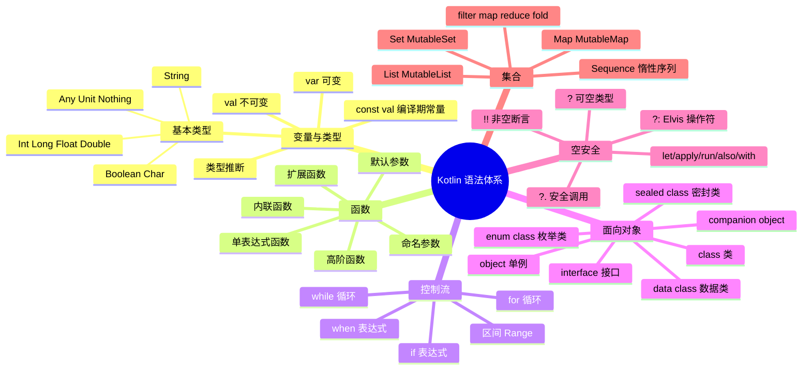
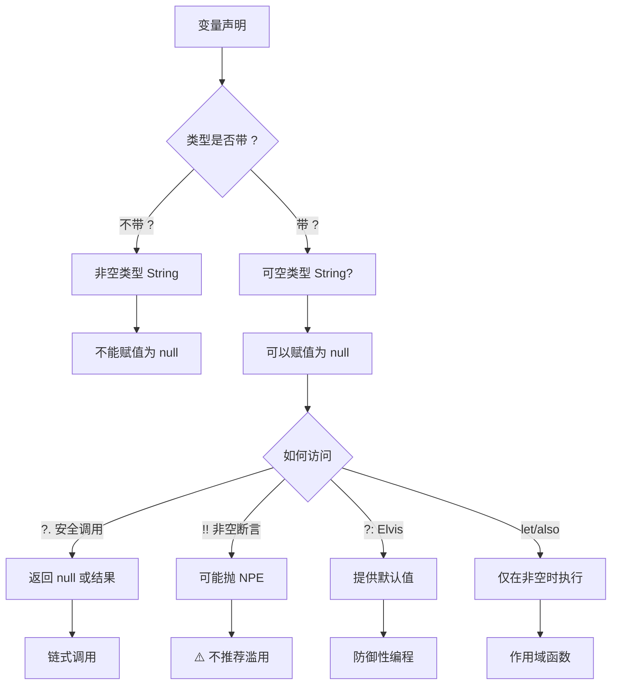
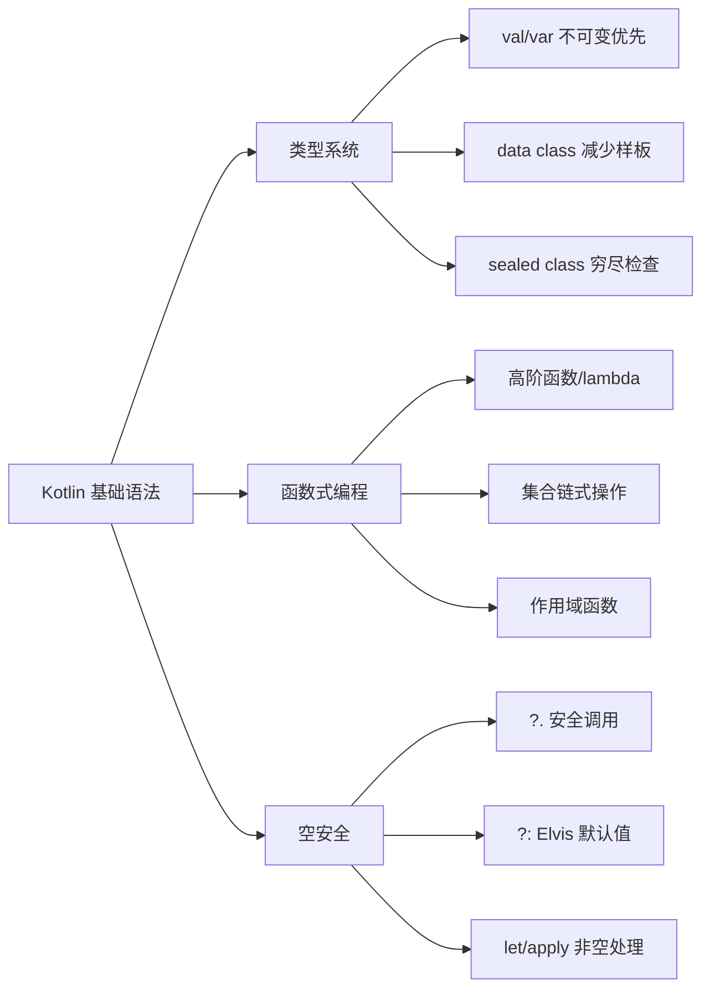

# 01 — Kotlin 基础语法与空安全

> 本章涵盖 Kotlin 核心语法，并结合 Hsiaopu 项目代码进行实战分析，适合 Android 面试准备。

---

## 1. Kotlin 语法体系总览



---

## 2. val vs var、基本类型

### 2.1 变量声明

| 关键字 | 含义 | 示例 |
|--------|------|------|
| `val` | 只读引用（不可重新赋值） | `val name = "Hsiaopu"` |
| `var` | 可变引用 | `var count = 0` |
| `const val` | 编译期常量（顶层/object 内） | `const val TAG = "Main"` |

```kotlin
// val：引用不可变，但对象内部状态可变
val list = mutableListOf(1, 2, 3)
list.add(4) // ✅ 可以修改内部状态
// list = mutableListOf(5) // ❌ 编译错误，不能重新赋值

// var：引用可变
var x = 10
x = 20 // ✅
```

### 2.2 基本类型

Kotlin 中一切皆对象，基本类型在运行时会被编译为 JVM 原生类型（`int`、`long` 等）。

```kotlin
val intVal: Int = 42
val longVal: Long = 42L
val doubleVal: Double = 3.14
val floatVal: Float = 3.14f
val boolVal: Boolean = true
val charVal: Char = 'A'
val stringVal: String = "Hello"

// 类型转换必须显式调用
val i: Int = 100
val l: Long = i.toLong()  // 不能隐式转换，必须显式
```

### 2.3 实战：Hsiaopu 中的使用

```kotlin
// Hsiaopu: data/Models.kt — data class 中的 val 属性
data class AppSettings(
    val apiKey: String = "",                    // val 不可变 + 默认参数
    val apiEndpoint: String = "https://...",
    val modelName: String = "deepseek-chat",
    val systemPrompt: String = "你是一个智能AI助手...",
    val temperature: Double = 0.7,               // Double 基本类型
    val maxTokens: Int = 2048,                   // Int 基本类型
    val providerId: String = "deepseek"
)
```

**‼️ 面试高频**：为什么 Kotlin 推荐用 `val` 而非 `var`？
- 不可变性提升代码安全性，避免意外修改
- 配合 data class 的 `copy()` 方法实现函数式更新
- 在多线程/协程环境中避免竞态条件

---

## 3. 函数定义

### 3.1 默认参数与命名参数

```kotlin
// 默认参数：调用时可省略有默认值的参数
fun greet(name: String = "World", greeting: String = "Hello"): String {
    return "$greeting, $name!"
}

greet()                       // "Hello, World!"
greet("Hsiaopu")              // "Hello, Hsiaopu!"
greet(greeting = "Hi")        // "Hi, World!" — 命名参数
greet(greeting = "Hi", name = "Hsiaopu") // "Hi, Hsiaopu!"
```

### 3.2 单表达式函数

```kotlin
// 函数体只有一个表达式时，可以省略花括号和 return
fun add(a: Int, b: Int): Int = a + b
fun max(a: Int, b: Int) = if (a > b) a else b  // 返回类型可推断
```

### 3.3 实战：Hsiaopu 中的函数

```kotlin
// Hsiaopu: data/Models.kt — 单表达式函数
data class ChatMessage(
    val role: String,
    val content: String,
    val timestamp: Long = System.currentTimeMillis()  // 默认参数
)

// Hsiaopu: system/ShellExecutor.kt — 带默认参数的函数
data class ShellResult(
    val command: String,
    val stdout: String,
    val stderr: String,
    val exitCode: Int = -1,          // 默认参数
    val timestamp: Long = System.currentTimeMillis()
) {
    val isSuccess: Boolean get() = exitCode == 0  // 单表达式属性
}
```

**Java 对比**：

```java
// Java：需要方法重载或 Builder 模式处理默认值
public class ShellResult {
    private int exitCode;
    public ShellResult(String cmd, String stdout, String stderr) {
        this(cmd, stdout, stderr, -1, System.currentTimeMillis());
    }
    public ShellResult(String cmd, String stdout, String stderr, int exitCode, long ts) {
        // 大量赋值代码...
    }
}
```

---

## 4. 字符串模板、区间、when 表达式

### 4.1 字符串模板

```kotlin
val name = "Hsiaopu"
val version = 1.0
// $变量名 或 ${表达式}
val info = "App: $name v$version"           // "App: Hsiaopu v1.0"
val detail = "Next: ${version + 0.1}"       // "Next: 1.1"

// 多行字符串（三引号，保留格式）
val json = """
    {
        "name": "$name",
        "version": $version
    }
""".trimIndent()
```

### 4.2 区间 (Range)

```kotlin
val range = 1..10           // [1, 10] 闭区间
val exclusive = 1 until 10  // [1, 10) 左闭右开
val down = 10 downTo 1      // 降序
val step = 1..10 step 2     // 步长

// 配合 for 循环
for (i in 1..5) { println(i) }       // 1 2 3 4 5
for (i in 1 until 5) { println(i) }  // 1 2 3 4
```

### 4.3 when 表达式

```kotlin
// when 替代 switch，功能更强大
fun describe(obj: Any): String = when (obj) {
    1          -> "One"
    is String  -> "String: ${obj.length}"
    in 1..10   -> "In range"
    !is Int    -> "Not Int"
    else       -> "Unknown"
}

// 无参数 when（替代 if-else if 链）
fun checkNumber(x: Int) = when {
    x < 0     -> "Negative"
    x == 0    -> "Zero"
    x % 2 == 0 -> "Even"
    else      -> "Odd"
}
```

### 4.4 实战：Hsiaopu 中的 when 表达式

```kotlin
// Hsiaopu: MainActivity.kt — when 用于 Tab 切换
AnimatedContent(targetState = selectedTab) { tab ->
    when (tab) {
        0 -> HomeScreen(viewModel = chatViewModel)
        1 -> ShellScreen(settingsDataStore = chatViewModel.dataStore)
        2 -> ToolsScreen(settingsDataStore = chatViewModel.dataStore)
        3 -> SettingsScreen(viewModel = chatViewModel)
    }
}
```

**Java 对比**：

```java
// Java switch 只支持有限的类型（int/char/String/enum）
switch (tab) {
    case 0: /* ... */ break;
    case 1: /* ... */ break;
    default: break;
}
// 不能用 in 范围、is 类型检查、无参数形式
```

---

## 5. data class 数据类

### 5.1 基本用法

```kotlin
data class User(val name: String, val age: Int)
```

编译器自动生成：
- `equals()` / `hashCode()`
- `toString()`（格式：`User(name=Hsiaopu, age=25)`）
- `copy()`（浅拷贝）
- `componentN()`（解构声明）

### 5.2 实战：Hsiaopu 中的 data class

```kotlin
// Hsiaopu: data/Models.kt — 核心数据类
data class ChatMessage(
    val role: String,       // "user" | "assistant" | "system"
    val content: String,
    val timestamp: Long = System.currentTimeMillis()
)

data class ChatRequest(
    val model: String,
    val messages: List<Message>,
    val temperature: Double = 0.7,
    @SerializedName("max_tokens") val maxTokens: Int = 2048,
    val stream: Boolean = true
)

data class ChatResponse(
    val id: String,
    val choices: List<Choice>,
    val usage: UsageInfo? = null
)

data class Choice(
    val message: Message?,
    val delta: Delta?,
    @SerializedName("finish_reason") val finishReason: String?
)

data class Delta(
    val role: String?,
    val content: String?
)

data class UsageInfo(
    @SerializedName("prompt_tokens") val promptTokens: Long = 0,
    @SerializedName("completion_tokens") val completionTokens: Long = 0,
    @SerializedName("total_tokens") val totalTokens: Long = 0
)
```

**Java 对比**：

```java
// Java 16+ 才有 record，之前需要手写大量样板代码
public class ChatMessage {
    private final String role;
    private final String content;
    private final long timestamp;

    public ChatMessage(String role, String content, long timestamp) {
        this.role = role; this.content = content; this.timestamp = timestamp;
    }
    // getters, equals, hashCode, toString... 至少 50+ 行
}
```

**‼️ 面试高频**：data class 的 `copy()` 方法
```kotlin
val msg = ChatMessage("user", "Hello")
val updated = msg.copy(content = "World")  // 浅拷贝，只修改 content
```

---

## 6. sealed class 密封类

### 6.1 基本概念

密封类表示受限的类层次结构，所有子类在编译期已知。

```kotlin
sealed class Result<out T> {
    data class Success<T>(val data: T) : Result<T>()
    data class Error(val message: String) : Result<Nothing>()
    object Loading : Result<Nothing>()
}

// when 表达式无需 else 分支（编译器检查穷尽性）
fun handle(result: Result<String>) = when (result) {
    is Result.Success -> "Got: ${result.data}"
    is Result.Error   -> "Error: ${result.message}"
    Result.Loading    -> "Loading..."
}
```

### 6.2 实战：Hsiaopu 中的密封类

```kotlin
// Hsiaopu: data/FeatureGuide.kt — 功能引导键枚举
// 虽然 Hsiaopu 使用了 enum class，但这是 sealed class 的典型场景
// 如果改用 sealed class，可以携带更多上下文信息：
sealed class FeatureGuideKeyExample {
    data class HomeQuickCommands(val count: Int) : FeatureGuideKeyExample()
    data class HomeLongPress(val hasClipboard: Boolean) : FeatureGuideKeyExample()
    object HomeExport : FeatureGuideKeyExample()
    object ShellPresetCommands : FeatureGuideKeyExample()
    object ShellCopy : FeatureGuideKeyExample()
    object ToolsDeviceCards : FeatureGuideKeyExample()
    data class SettingsProvider(val providerCount: Int) : FeatureGuideKeyExample()
    object SettingsTokenUsage : FeatureGuideKeyExample()
}
```

### 6.3 sealed class vs enum class

| 特性 | sealed class | enum class |
|------|-------------|------------|
| 子类数量 | 可多个实例 | 每个枚举常量是单例 |
| 子类携带状态 | 可以（data class 子类） | 可以（构造函数） |
| 文件位置 | 必须在同一文件/包 | 同一个类体 |
| 可扩展性 | 子类可被继承 | 不能继承 |

**‼️ 面试高频**：为什么 `when` 表达式配合 sealed class 不需要 `else`？
- 编译器能检查所有子类是否被覆盖，实现"穷尽性检查"（exhaustive checks）
- 当新增子类时，编译器会报错，强制开发者更新所有 when 分支
- 这是类型安全的一种体现

---

## 7. 空安全（Kotlin 最核心特性）

### 7.1 核心概念



### 7.2 安全调用 ?.

```kotlin
val str: String? = "Hello"
val length: Int? = str?.length          // 如果 str 为 null，返回 null
val upper: String? = str?.uppercase()   // 链式安全调用

// 嵌套安全调用
data class Choice(val message: Message?, val delta: Delta?)
val content: String? = choice?.message?.content  // 任意一层为 null 就返回 null
```

### 7.3 Elvis 操作符 ?:

```kotlin
val str: String? = null
val length: Int = str?.length ?: 0      // 如果为 null，使用默认值 0
val name: String = str ?: "Unknown"     // 等价于 str != null ? str : "Unknown"

// 也可以配合 throw 和 return
fun validate(input: String?): String {
    return input ?: throw IllegalArgumentException("input is null")
}
```

### 7.4 非空断言 !!

```kotlin
val str: String? = "Kotlin"
val notNull: String = str!!  // 我确定它不是 null，否则抛 NPE

// ⚠️ 谨慎使用：如果 str 为 null 会直接抛 KotlinNullPointerException
```

### 7.5 作用域函数

| 函数 | 接收者引用 | 返回值 | 适用场景 |
|------|-----------|--------|----------|
| `let` | `it` | Lambda 结果 | 非空执行、类型转换 |
| `run` | `this` | Lambda 结果 | 对象配置 + 计算结果 |
| `with` | `this` | Lambda 结果 | 对同一个对象多次操作 |
| `apply` | `this` | 对象本身 | 对象初始化/配置 |
| `also` | `it` | 对象本身 | 附加操作（日志、校验） |

```kotlin
// let：非空时执行
val nullable: String? = "Hsiaopu"
nullable?.let { println(it.length) }  // 只有非空时才执行

// apply：初始化对象
val settings = AppSettings().apply {
    // this = AppSettings 对象
    // apiKey = "xxx"  ← 实际项目中 AppSettings 是 val，不可修改
}

// run：对象配置 + 返回计算结果
val result = "Hsiaopu".run {
    // this = "Hsiaopu"
    length + 10  // 返回 Int
}

// also：附加操作
val msg = ChatMessage("user", "Hi").also {
    println("Created message: $it")
}

// with：对同一对象多次操作
val info = with(settings) {
    "Provider: $providerId, Model: $modelName"
}
```

### 7.6 实战：Hsiaopu 中的空安全

```kotlin
// Hsiaopu: data/Models.kt — 可空类型在 API 响应中
data class ChatResponse(
    val id: String,
    val choices: List<Choice>,
    val usage: UsageInfo? = null           // 可空 — 可能没有 usage 信息
)

data class Choice(
    val message: Message?,                  // 可空 — 流式响应时 message 为 null
    val delta: Delta?,                      // 可空 — 非流式响应时 delta 为 null
    @SerializedName("finish_reason") val finishReason: String?
)

// 安全访问嵌套属性
val content = choice.delta?.content ?: ""   // 安全调用 + Elvis 默认值

// Hsiaopu: system/ShellExecutor.kt — 空安全在异常处理中
} catch (e: Exception) {
    return@withContext ShellResult(
        command = command,
        stdout = "",
        stderr = "Error: ${e.message}",     // e.message 可能为 null
        exitCode = 1
    )
}
```

**Java 对比**：

```java
// Java：需要层层判空
String content = "";
if (choice != null) {
    Delta delta = choice.getDelta();
    if (delta != null) {
        String c = delta.getContent();
        if (c != null) {
            content = c;
        }
    }
}

// Kotlin 一行搞定
val content = choice?.delta?.content ?: ""
```

**‼️ 面试高频**：`?.`、`!!`、`?:` 的区别，以及何时使用 `!!` 是合理的？
- `!!` 仅在确信变量不可能为 null 时使用（如刚赋值、框架保证）
- 滥用 `!!` 是代码异味，说明空安全设计不完善

---

## 8. 集合操作

### 8.1 常用集合操作

```kotlin
val numbers = listOf(1, 2, 3, 4, 5, 6)

// filter：过滤
val evens = numbers.filter { it % 2 == 0 }  // [2, 4, 6]

// map：映射
val squared = numbers.map { it * it }       // [1, 4, 9, 16, 25, 36]

// reduce：累积（从左到右）
val sum = numbers.reduce { acc, i -> acc + i }  // 21

// fold：带初始值的累积
val sum10 = numbers.fold(10) { acc, i -> acc + i }  // 31

// 链式调用
val result = numbers
    .filter { it % 2 == 0 }
    .map { it * 10 }
    .fold(0) { acc, i -> acc + i }  // 60

// groupBy：分组
val grouped = listOf("apple", "banana", "apricot", "blueberry")
    .groupBy { it.first() }
// {a=[apple, apricot], b=[banana, blueberry]}

// flatMap：扁平化
val nested = listOf(listOf(1, 2), listOf(3, 4))
val flat = nested.flatMap { it }  // [1, 2, 3, 4]
```

### 8.2 实战：Hsiaopu 中的集合操作

```kotlin
// Hsiaopu: MainActivity.kt — forEach 遍历 NavItem
navItems.forEach { item ->
    NavigationBarItem(
        selected = selectedTab == item.index,
        onClick = { selectedTab = item.index },
        icon = { /* ... */ },
        label = { Text(item.label) }
    )
}

// Hsiaopu: ui/screen/SettingsScreen.kt — forEach 遍历 Provider 列表
providers.forEach { provider ->
    FilterChip(
        selected = settings.providerId == provider.id,
        onClick = { /* ... */ },
        label = { Text(provider.name) }
    )
}

// Hsiaopu: system/ShellExecutor.kt — listOf 创建不可变集合
val predefinedCommands: List<PredefinedCommand> = listOf(
    PredefinedCommand("CPU Info", "cat /proc/cpuinfo", "CPU 详细信息", "System"),
    PredefinedCommand("Memory", "cat /proc/meminfo", "内存信息", "System"),
    // ... 更多命令
)
```

---

## 9. 解构声明

```kotlin
// data class 自动支持解构
val msg = ChatMessage("user", "Hello")
val (role, content, timestamp) = msg  // 解构声明

// 也可用于 for 循环
val messages = listOf(
    ChatMessage("user", "Hi"),
    ChatMessage("assistant", "Hello!")
)
for ((role, content) in messages) {
    println("$role: $content")
}

// 从函数返回多个值
fun getPair(): Pair<String, Int> = "Hsiaopu" to 1
val (name, version) = getPair()
```

---

## 10. 面试高频题

### Q1：Kotlin 中 `val` 和 `var` 的区别？为什么推荐多用 `val`？
- `val` 是不可变引用（类似 Java `final`），`var` 是可变引用
- 推荐 `val` 的原因：不可变性 → 线程安全、避免意外修改、函数式编程风格

### Q2：`data class` 自动生成了哪些方法？
- `equals()`、`hashCode()`、`toString()`、`copy()`、`componentN()`

### Q3：`sealed class` 和 `enum class` 的区别？
- sealed class 子类可以有多个实例，enum 每个常量是单例
- sealed class 子类可以携带不同状态，更灵活
- sealed class 必须在同一文件声明子类

### Q4：`?.`、`!!`、`?:` 的区别？
- `?.` 安全调用，null 时不执行返回 null
- `!!` 非空断言，null 时抛 NPE
- `?:` Elvis 操作符，null 时取默认值

### Q5：`let`、`apply`、`run`、`also`、`with` 的区别？
- `let`/`also`：接收者是 `it`；`run`/`apply`/`with`：接收者是 `this`
- `let`/`run`/`with`：返回 lambda 结果；`apply`/`also`：返回对象本身
- `with` 不是扩展函数，是普通函数

### Q6：`when` 表达式比 Java `switch` 强在哪里？
- 支持任意类型、`is` 类型检查、`in` 范围、无参数形式
- 配合 sealed class 实现穷尽性检查

### Q7：`Sequence` 和 `List` 的 `filter`/`map` 有什么区别？
- `List` 是急切的：每个操作创建中间集合
- `Sequence` 是惰性的：元素逐个通过整个管道，不创建中间集合
- 大数据量推荐用 `Sequence` 减少内存开销

---

## 11. 本章小结



> **核心思想**：Kotlin 的设计哲学是"简洁、安全、实用"，通过类型系统（空安全）、语法糖（data class/when）和函数式特性（lambda/集合操作）大幅减少 Java 的样板代码，同时保持与 Java 的 100% 互操作。