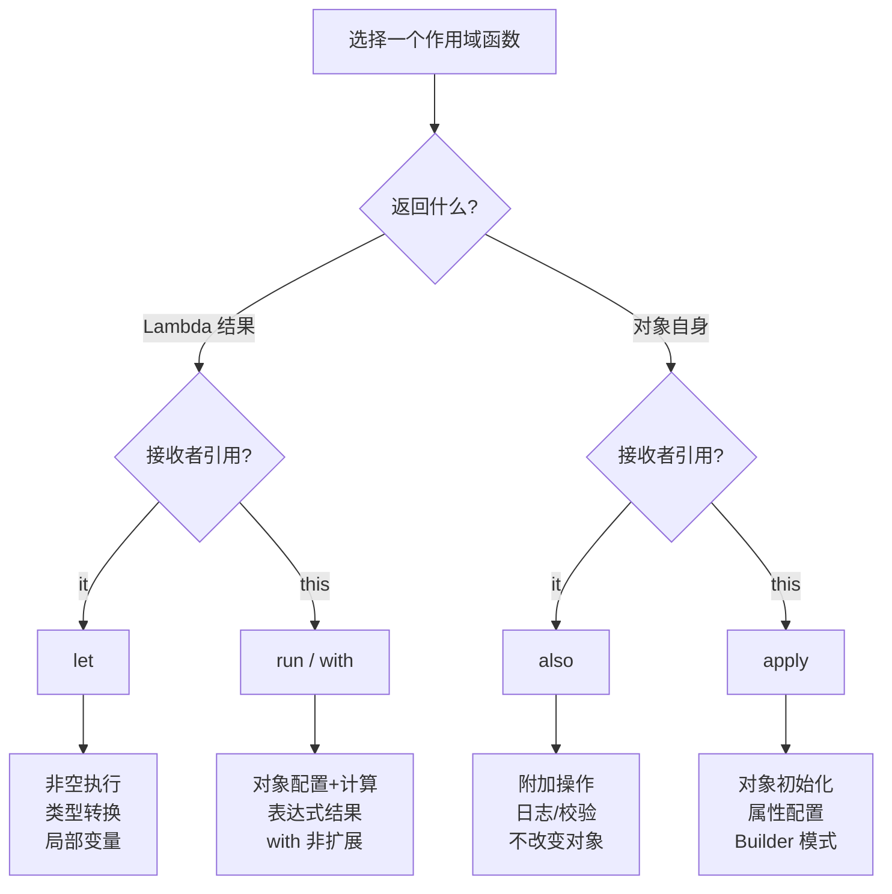
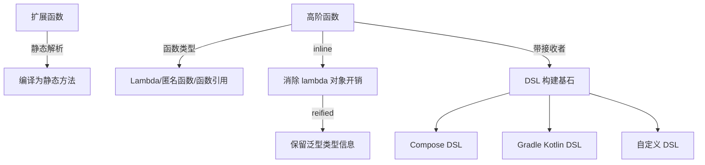

# 02 — 扩展函数与高阶函数

> 本章深入 Kotlin 的函数式编程特性，结合 Hsiaopu 项目中的 Compose Modifier 链式调用、lambda 表达式等实际场景，覆盖 Android 面试核心考点。

---

## 1. 函数式编程在 Kotlin 中的位置

```mermaid
mindmap
  root((Kotlin 函数式编程))
    扩展函数
      扩展函数
      扩展属性
      泛型扩展函数
      可空接收者扩展
    高阶函数
      函数类型 (T) -> R
      Lambda 表达式
      匿名函数
      函数引用 ::
      带接收者的函数类型
    内联函数
      inline 关键字
      noinline
      crossinline
      reified 类型参数
    作用域函数
      let it → 结果
      run this → 结果
      apply this → 自身
      also it → 自身
      with this → 结果
    类型别名
      typealias
      lambda 类型简化
    DSL 构建
      带接收者的 lambda
      Compose DSL
      Gradle Kotlin DSL
```

---

## 2. 扩展函数

### 2.1 基本概念

扩展函数让你在不修改类源码的情况下，为类添加新功能。

```kotlin
// 为 String 添加扩展函数
fun String.lastChar(): Char = this[this.length - 1]

// 使用
val ch = "Kotlin".lastChar()  // 'n'

// 泛型扩展函数
fun <T> List<T>.secondOrNull(): T? = if (size >= 2) this[1] else null
```

### 2.2 扩展属性

```kotlin
// 扩展属性（只能声明为 val，因为没有 backing field）
val String.lastChar: Char
    get() = this[length - 1]

val <T> List<T>.midIndex: Int
    get() = size / 2
```

### 2.3 可空接收者扩展

```kotlin
// 可空接收者：调用时不需要 ?. 判空
fun String?.isNullOrEmpty(): Boolean {
    return this == null || this.isEmpty()
}

val str: String? = null
str.isNullOrEmpty()  // true — 不需要 str?.isNullOrEmpty()
```

### 2.4 实战：Hsiaopu 中的扩展函数场景

```kotlin
// Hsiaopu: system/ShellExecutor.kt — 扩展属性
data class ShellResult(
    val command: String,
    val stdout: String,
    val stderr: String,
    val exitCode: Int = -1,
    val timestamp: Long = System.currentTimeMillis()
) {
    val isSuccess: Boolean get() = exitCode == 0  // 计算属性
}

// 可以改为扩展属性的形式
// val ShellResult.isSuccess: Boolean get() = exitCode == 0
```

```kotlin
// 使用扩展函数封装可空类型的默认值处理
// 可以为 Hsiaopu 的 Delta 添加扩展函数
fun Delta?.safeContent(): String = this?.content ?: ""

// 或者为 Choice 添加扩展
fun Choice?.effectiveContent(): String {
    return this?.message?.content ?: this?.delta?.content ?: ""
}
```

### 2.5 扩展函数 vs 成员函数

| 特性 | 扩展函数 | 成员函数 |
|------|---------|---------|
| 定义位置 | 类外部 | 类内部 |
| 访问私有成员 | ❌ 不能 | ✅ 能 |
| 继承/重写 | 静态调度（编译期） | 动态调度（运行时） |
| 修改原作者代码 | 不需要 | 需要 |

**‼️ 面试高频**：扩展函数是静态解析的！
```kotlin
open class Parent
class Child : Parent()

fun Parent.name() = "Parent"
fun Child.name() = "Child"

fun printName(parent: Parent) {
    println(parent.name())  // 总是输出 "Parent"（静态解析）
}
```

---

## 3. 高阶函数

### 3.1 函数类型

```kotlin
// 函数类型语法：(参数类型) -> 返回类型
val sum: (Int, Int) -> Int = { a, b -> a + b }
val greet: (String) -> String = { "Hello, $it" }
val noArg: () -> Unit = { println("Hi") }

// 调用
println(sum(1, 2))       // 3
println(greet("World"))  // "Hello, World"
```

### 3.2 Lambda 表达式语法

```kotlin
// 完整语法
val square: (Int) -> Int = { x: Int -> x * x }

// 类型推断
val square2 = { x: Int -> x * x }

// 单参数默认名 it
val double: (Int) -> Int = { it * 2 }

// 多参数 lambda
val add = { a: Int, b: Int -> a + b }
```

### 3.3 高阶函数示例

```kotlin
// 接受函数作为参数
fun <T> List<T>.customFilter(predicate: (T) -> Boolean): List<T> {
    val result = mutableListOf<T>()
    for (item in this) {
        if (predicate(item)) result.add(item)
    }
    return result
}

// 返回函数
fun createMultiplier(factor: Int): (Int) -> Int = { it * factor }

val triple = createMultiplier(3)
println(triple(5))  // 15
```

### 3.4 函数引用

```kotlin
fun isEven(x: Int) = x % 2 == 0

// 函数引用
val predicate: (Int) -> Boolean = ::isEven
val numbers = listOf(1, 2, 3, 4, 5)
numbers.filter(::isEven)  // [2, 4]

// 成员函数引用
val getLength = String::length
val lengths = listOf("a", "ab", "abc").map(String::length)  // [1, 2, 3]

// 构造函数引用
val createUser = ::User  // 类型为 (String, Int) -> User
```

### 3.5 实战：Hsiaopu 中的 lambda 使用

```kotlin
// Hsiaopu: MainActivity.kt — lambda 传递点击事件
NavigationBarItem(
    selected = selectedTab == item.index,
    onClick = { selectedTab = item.index },  // lambda 表达式
    icon = { Icon(...) },                     // 最后一个 lambda 可移到括号外
    label = { Text(item.label) }
)

// Hsiaopu: ui/screen/SettingsScreen.kt — 链式 lambda
FilterChip(
    selected = settings.providerId == provider.id,
    onClick = {
        viewModel.updateProviderId(provider.id)
        viewModel.updateApiEndpoint(provider.defaultEndpoint)
        viewModel.updateModelName(provider.defaultModel)
    },
    label = { Text(provider.name) }
)

// Hsiaopu: ui/screen/SettingsScreen.kt — 带接收者的 lambda (Compose 范式)
Card(
    modifier = Modifier.fillMaxWidth(),
    colors = CardDefaults.cardColors(containerColor = MaterialTheme.colorScheme.surface),
    shape = RoundedCornerShape(16.dp)
) {
    Column(modifier = Modifier.padding(16.dp)) {
        Text(title, ...)
        Spacer(modifier = Modifier.height(12.dp))
        content()  // 带接收者的 lambda
    }
}
```

---

## 4. 内联函数 (inline / noinline / crossinline)

### 4.1 为什么需要 inline？

```kotlin
// 每个 lambda 本质上是匿名类对象，频繁调用有对象创建开销
// inline 将函数体直接"粘贴"到调用处，消除 lambda 对象开销

inline fun <T> measureTime(block: () -> T): T {
    val start = System.currentTimeMillis()
    val result = block()
    val end = System.currentTimeMillis()
    println("Time: ${end - start}ms")
    return result
}

// 反编译后等价于：
// val start = System.currentTimeMillis()
// val result = { /* block 代码 */ }()
// val end = System.currentTimeMillis()
```

### 4.2 noinline 和 crossinline

```kotlin
// noinline：标记某个 lambda 参数不内联
inline fun foo(inlined: () -> Unit, noinline notInlined: () -> Unit) {
    // inlined 会被内联，notInlined 保持为对象
}

// crossinline：禁止 lambda 中的非局部返回
inline fun bar(crossinline block: () -> Unit) {
    // 可以在另一个 lambda 或非直接位置调用 block
    // 但不能在 block 中使用 return（非局部返回）
    Runnable { block() }.run()
}
```

### 4.3 reified 类型参数

```kotlin
// 普通泛型在运行时被擦除，无法获取类型信息
// inline + reified 可以保留类型信息

inline fun <reified T> List<*>.filterIsInstance(): List<T> {
    val result = mutableListOf<T>()
    for (item in this) {
        if (item is T) {  // ✅ 可以直接使用 T 做类型检查
            result.add(item)
        }
    }
    return result
}

val mixed = listOf(1, "hello", 2, "world")
val strings: List<String> = mixed.filterIsInstance<String>()  // ["hello", "world"]
```

### 4.4 实战：Hsiaopu 中的内联函数

```kotlin
// Hsiaopu 中大量使用 Compose 的内联函数
// MaterialTheme.colorScheme.primary 等属性访问在编译后内联
// Compose 的 Modifier 链式调用也是内联的

// 自定义内联函数示例
inline fun <T> T?.ifNotNull(block: (T) -> Unit) {
    if (this != null) block(this)
}

// 使用
val msg: ChatMessage? = ChatMessage("user", "Hi")
msg.ifNotNull { println(it.content) }
```

---

## 5. 带接收者的 lambda（最核心概念）

### 5.1 概念

```kotlin
// 普通 lambda: (String) -> Int
// 带接收者的 lambda: String.() -> Int

val normal: (String) -> Int = { it.length }
val withReceiver: String.() -> Int = { this.length }  // 或者直接 length

// 调用方式不同
normal("Hello")           // 作为参数传入
"Hello".withReceiver()   // 作为扩展函数调用
```

### 5.2 作用域函数 (Scope Functions)



### 5.3 源码对比

```kotlin
// 标准库源码
inline fun <T> T.also(block: (T) -> Unit): T {
    block(this)
    return this
}

inline fun <T, R> T.let(block: (T) -> R): R {
    return block(this)
}

inline fun <T> T.apply(block: T.() -> Unit): T {
    block()  // this.block()
    return this
}

inline fun <T, R> T.run(block: T.() -> R): R {
    return block()
}

inline fun <T, R> with(receiver: T, block: T.() -> R): R {
    return receiver.block()
}
```

### 5.4 实战：Hsiaopu 中的作用域函数

```kotlin
// Hsiaopu: 虽然没有直接在源码中使用作用域函数，但可以展示典型用法

// apply：初始化 ViewModel 状态
val newState = ChatUiState().apply {
    // 在 apply 中，this 是 ChatUiState 对象
    // 配置各种属性...
}

// let：非空安全处理
val deltaContent = choice.delta?.let { delta ->
    delta.content ?: ""
} ?: ""

// also：日志记录
val msg = ChatMessage("user", "Hello").also {
    println("Created message: ${it.role}")
}

// run：计算并转换
val summary = chatResponse.run {
    "Response $id has ${choices.size} choices, used ${usage?.totalTokens ?: 0} tokens"
}
```

---

## 6. 类型别名 typealias

```kotlin
// 简化复杂函数类型
typealias ClickHandler = (Int) -> Unit
typealias Predicate<T> = (T) -> Boolean

// 简化带接收者的函数类型
typealias ComposeContent = @Composable () -> Unit
typealias ComposableBlock = @Composable ColumnScope.() -> Unit

// 简化嵌套类型
typealias MessageMap = Map<String, List<ChatMessage>>

// 使用
val handler: ClickHandler = { index -> println("Clicked $index") }
```

---

## 7. Kotlin DSL 构建

### 7.1 DSL 原理

```kotlin
// DSL 的核心：带接收者的 lambda + 中缀函数
class HtmlBuilder {
    private val elements = StringBuilder()

    fun body(block: BodyBuilder.() -> Unit) {
        val builder = BodyBuilder()
        builder.block()
        elements.append("<body>${builder.build()}</body>")
    }

    fun build(): String = "<html>${elements}</html>"
}

class BodyBuilder {
    private val elements = StringBuilder()

    fun h1(text: String) { elements.append("<h1>$text</h1>") }
    fun p(text: String) { elements.append("<p>$text</p>") }

    fun build() = elements.toString()
}

fun html(block: HtmlBuilder.() -> Unit): String {
    val builder = HtmlBuilder()
    builder.block()
    return builder.build()
}

// DSL 使用
val page = html {
    body {
        h1("Welcome to Hsiaopu")
        p("An AI-powered Android assistant")
    }
}
```

### 7.2 实战：Hsiaopu 中的 Compose DSL

```kotlin
// Compose 本身就是 Kotlin DSL 的集大成者
// Hsiaopu: ui/screen/SettingsScreen.kt

SettingsSectionCard(title = "AI Provider") {
    // 这是一个带接收者的 lambda：@Composable ColumnScope.() -> Unit
    Text("Provider", style = MaterialTheme.typography.bodyLarge)
    Spacer(modifier = Modifier.height(8.dp))
    Row(horizontalArrangement = Arrangement.spacedBy(8.dp)) {
        providers.forEach { provider ->
            FilterChip(
                selected = settings.providerId == provider.id,
                onClick = { ... },
                label = { Text(provider.name) }
            )
        }
    }
}

// SettingsSectionCard 定义
@Composable
fun SettingsSectionCard(
    title: String,
    content: @Composable ColumnScope.() -> Unit  // 带接收者的 Composable lambda
) {
    Card(...) {
        Column(modifier = Modifier.padding(16.dp)) {
            Text(title, ...)
            Spacer(modifier = Modifier.height(12.dp))
            content()  // 在 ColumnScope 中调用
        }
    }
}
```

### 7.3 Modifier 链式调用

```kotlin
// Compose 的 Modifier 是函数式链式调用的典范
// 每个 Modifier 扩展函数返回新的 Modifier 对象

Modifier
    .fillMaxWidth()           // 扩展函数
    .padding(16.dp)           // 扩展函数
    .background(Color.White)  // 扩展函数
    .clip(RoundedCornerShape(12.dp))  // 扩展函数

// 这种设计模式被称为"不可变 Builder 模式"
// 每次调用都创建新对象，不修改原对象
```

**Java 对比**：

```java
// Java 的传统 Builder 模式
Modifier modifier = new Modifier.Builder()
    .fillMaxWidth()
    .padding(16)
    .background(Color.WHITE)
    .clip(new RoundedCornerShape(12))
    .build();

// Kotlin 的函数式链式调用更简洁、更安全
```

---

## 8. 面试高频题

### Q1：什么是扩展函数？它是如何实现的？
- 扩展函数是静态方法，第一个参数是接收者类型
- 编译后生成 `public static final void methodName(ReceiverType $this$methodName, ...)`
- 静态解析，不涉及运行时多态

### Q2：`inline` 关键字的作用？为什么不把所有函数都设为 inline？
- 作用：将函数体直接插入调用处，消除 lambda 对象创建开销
- 不建议所有函数都 inline：会增大字节码体积；大函数内联收益低；非内联函数参数无法传递

### Q3：`noinline` 和 `crossinline` 的区别？
- `noinline`：阻止 lambda 被内联，保持为对象（可传递给其他函数）
- `crossinline`：禁止 lambda 中的非局部返回（`return`），但允许内联

### Q4：`let`、`apply`、`run`、`also`、`with` 的区别？
- 按接收者引用：`let`/`also` 用 `it`，`run`/`apply`/`with` 用 `this`
- 按返回值：`let`/`run`/`with` 返回 lambda 结果，`apply`/`also` 返回对象
- `with` 不是扩展函数，是普通函数

### Q5：Kotlin 的 lambda 和 Java 的 lambda 有什么不同？
- Kotlin 的 lambda 支持带接收者（`T.() -> R`）
- Kotlin 支持内联 lambda（`inline`），消除对象开销
- Java 的 lambda 需要函数式接口（SAM），Kotlin 有独立的函数类型

### Q6：什么是带接收者的 lambda？在 Compose 中如何体现？
- 语法：`ReceiverType.() -> ReturnType`
- 在 lambda 内部，`this` 指向接收者
- Compose 中：`Column { ... }` — `{ ... }` 是 `ColumnScope.() -> Unit`
- 这是 Compose DSL 的基石

### Q7：`reified` 关键字的原理？
- 配合 `inline` 使用，在编译时将泛型类型替换为实际类型
- 消除类型擦除限制，可以在运行时判断泛型类型
- 原理：`inline` 展开后，调用处已知具体类型

### Q8：高阶函数在 Android 开发中的典型应用？
- `setOnClickListener { ... }` — 替代匿名内部类
- `viewModelScope.launch { ... }` — 协程启动
- `Modifier.clickable { ... }` — Compose 事件处理
- `list.filter { ... }.map { ... }` — 数据转换

---

## 9. 本章小结



> **核心思想**：Kotlin 的函数式编程特性是它与 Java 最大的差异化优势。扩展函数实现"零侵入"扩展，高阶函数 + 内联实现零开销抽象，带接收者的 lambda 是 DSL 构建的基石。这些特性在 Compose 中得到了极致运用。