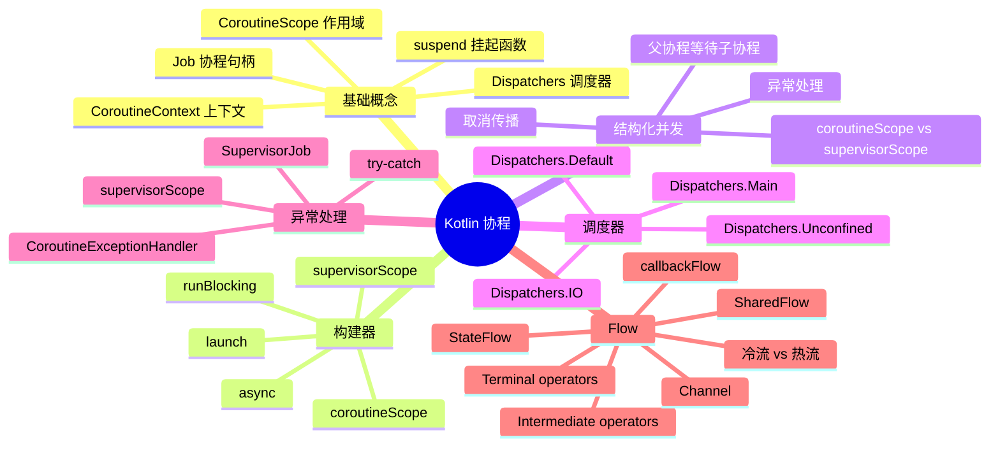
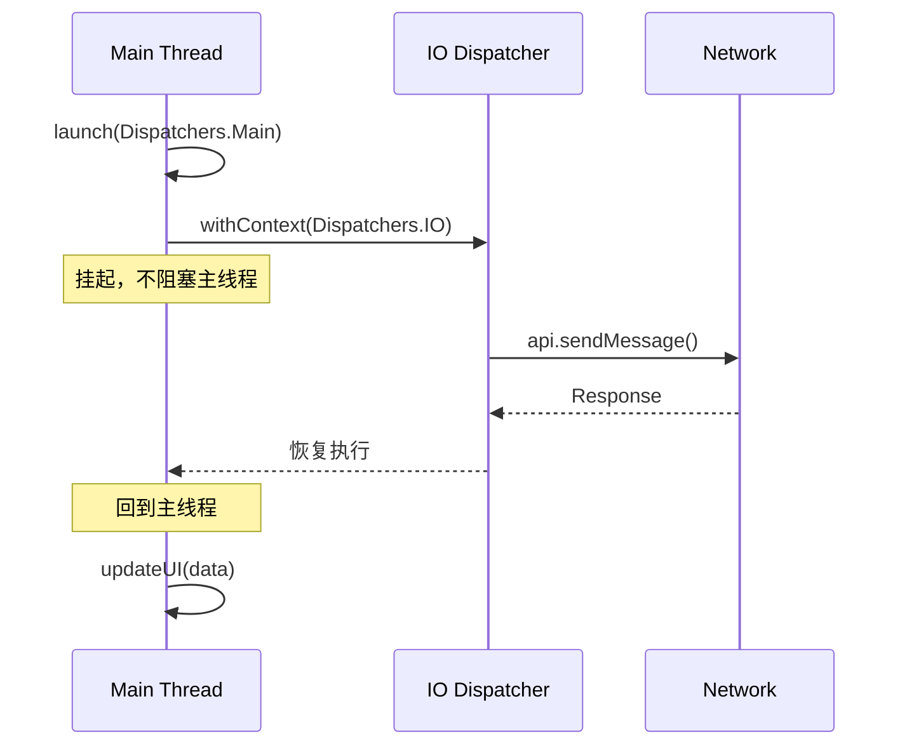
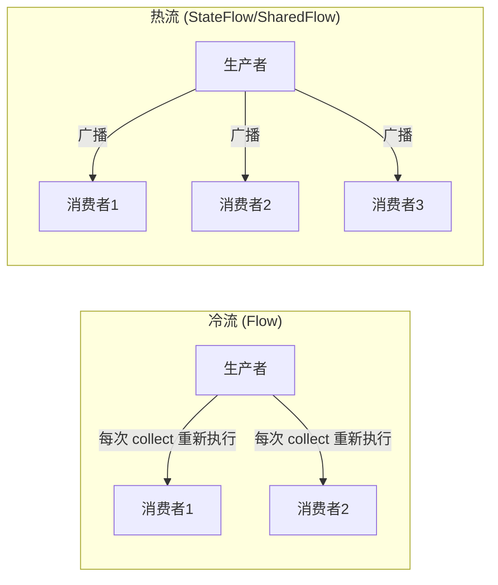
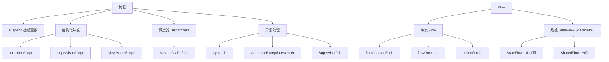

# 03 — 协程与 Flow

> 本章深入 Kotlin 协程与 Flow 的核心机制，结合 Hsiaopu 项目中 ChatViewModel 的协程使用、Room 的 Flow 查询、Retrofit 的 suspend 函数等实际场景，覆盖 Android 面试高频考点。

---

## 1. 协程概述

### 1.1 什么是协程？



### 1.2 协程 vs 线程

| 特性 | 线程 | 协程 |
|------|------|------|
| 调度 | 操作系统内核 | 用户态（JVM 层面） |
| 创建开销 | ~1MB 栈空间 | 极低（几个对象） |
| 上下文切换 | 内核态切换，昂贵 | 编译期 CPS 变换 |
| 并发数 | 受限于 CPU 核心 | 可创建数千个 |
| 取消 | 需要 interrupt/标志位 | 内置取消机制 |
| 非阻塞 | 需要回调/CompletableFuture | suspend 自动挂起恢复 |

---

## 2. 协程基础

### 2.1 suspend 函数

```kotlin
// suspend 函数是协程的基本构建块
suspend fun fetchData(): String {
    delay(1000)  // 挂起 1 秒，不阻塞线程
    return "Data"
}

// suspend 函数只能在协程或其他 suspend 函数中被调用
// 普通函数不能直接调用 suspend 函数
```

### 2.2 协程构建器

```kotlin
// launch：启动新协程，返回 Job（不关心返回值）
val job: Job = scope.launch {
    // 协程体
    delay(1000)
    println("Done")
}

// async：启动新协程，返回 Deferred（有返回值）
val deferred: Deferred<String> = scope.async {
    delay(1000)
    "Result"
}
val result = deferred.await()  // 等待结果

// runBlocking：阻塞当前线程，等待协程完成（通常用于测试/main 函数）
runBlocking {
    delay(1000)
    println("Blocking done")
}
```

### 2.3 协程上下文与调度器

```kotlin
// Dispatchers.Main：Android 主线程（UI 线程）
// Dispatchers.IO：IO 密集型任务（网络、数据库、文件）
// Dispatchers.Default：CPU 密集型任务（排序、解析）
// Dispatchers.Unconfined：不限定线程（不推荐）

scope.launch(Dispatchers.Main) {
    val data = withContext(Dispatchers.IO) {
        // 在 IO 线程执行网络请求
        api.fetchData()
    }
    // 回到 Main 线程更新 UI
    updateUI(data)
}
```

### 2.4 协程调度时序



---

## 3. 结构化并发

### 3.1 核心概念

```kotlin
// 结构化并发：协程有父子关系，父协程会等待所有子协程完成
// 取消父协程会自动取消所有子协程
// 子协程异常会传播到父协程

fun main() = runBlocking {
    val job = launch {
        // 子协程 1
        launch {
            delay(500)
            println("Child 1")
        }
        // 子协程 2
        launch {
            delay(1000)
            println("Child 2")
        }
    }
    job.join()  // 等待 job 及其所有子协程完成
    // 输出：Child 1 -> Child 2
}
```

### 3.2 coroutineScope vs supervisorScope

```kotlin
// coroutineScope：子协程失败会取消所有兄弟协程
suspend fun failFast() = coroutineScope {
    launch {
        delay(100)
        throw Exception("Child 1 failed")
    }
    launch {
        delay(1000)
        println("Child 2")  // 不会执行，因为 Child 1 失败取消了所有
    }
}

// supervisorScope：子协程失败不会影响兄弟协程
suspend fun failIndependently() = supervisorScope {
    launch {
        delay(100)
        throw Exception("Child 1 failed")  // 只影响自己
    }
    launch {
        delay(1000)
        println("Child 2")  // 正常执行！
    }
}
```

---

## 4. 协程异常处理

### 4.1 异常传播规则

```kotlin
// launch：异常立即抛出，由 CoroutineExceptionHandler 或父协程处理
// async：异常被延迟到 await() 调用时抛出

scope.launch {
    try {
        val result = async { riskyOperation() }.await()
    } catch (e: Exception) {
        // 处理异常
    }
}
```

### 4.2 CoroutineExceptionHandler

```kotlin
val handler = CoroutineExceptionHandler { _, exception ->
    println("Caught: ${exception.message}")
}

scope.launch(handler) {
    throw Exception("Oops")  // 被 handler 捕获
}

// 注意：handler 只在 launch 的顶级异常中生效
// async 的异常需要通过 await() 的 try-catch 处理
```

### 4.3 SupervisorJob

```kotlin
// SupervisorJob：子协程失败不会取消其他子协程和父协程
val scope = CoroutineScope(SupervisorJob() + Dispatchers.Main)

scope.launch {
    // 这个协程失败不会影响其他协程
    throw Exception("This is isolated")
}

scope.launch {
    // 这个协程继续正常运行
    delay(1000)
    println("Still running")
}
```

---

## 5. Flow 基础

### 5.1 冷流 vs 热流



### 5.2 Flow 基础操作

```kotlin
// 创建 Flow
val flow = flow {
    for (i in 1..3) {
        delay(100)
        emit(i)  // 发射值
    }
}

// Intermediate operators（中间操作符，不触发执行）
flow
    .filter { it % 2 == 0 }        // 过滤
    .map { it * 10 }                // 转换
    .onEach { println("Got: $it") } // 副作用
    .take(2)                        // 取前 2 个

// Terminal operators（终端操作符，触发执行）
flow.collect { value ->      // 收集
    println("Collected: $value")
}

flow.toList()                // 转为 List
flow.first()                 // 取第一个元素
flow.reduce { acc, v -> acc + v }  // 累积
```

### 5.3 Flow 的上下文切换

```kotlin
// flowOn：指定上游操作所在的线程
val flow = flow {
    emit(api.fetchData())  // 在 IO 线程执行
}.flowOn(Dispatchers.IO)

// 在 Main 线程收集
scope.launch(Dispatchers.Main) {
    flow.collect { data ->
        updateUI(data)  // 在 Main 线程更新 UI
    }
}
```

### 5.4 异常处理

```kotlin
flow
    .map { riskyOperation(it) }
    .catch { e -> emit(fallbackValue) }  // 捕获上游异常
    .onCompletion { cause ->              // 完成回调
        if (cause != null) println("Error: $cause")
        else println("Completed")
    }
    .collect { println(it) }
```

---

## 6. StateFlow vs SharedFlow

### 6.1 StateFlow

```kotlin
// StateFlow：有状态的、始终有值的、只保留最新值的热流
class ChatViewModel : ViewModel() {
    private val _uiState = MutableStateFlow(ChatUiState())
    val uiState: StateFlow<ChatUiState> = _uiState.asStateFlow()

    fun updateMessage(message: ChatMessage) {
        _uiState.update { currentState ->
            currentState.copy(messages = currentState.messages + message)
        }
    }
}
```

### 6.2 SharedFlow

```kotlin
// SharedFlow：无初始值、可配置回放和缓冲的热流
private val _events = MutableSharedFlow<UiEvent>()
val events: SharedFlow<UiEvent> = _events.asSharedFlow()

// 配置回放
val replay = MutableSharedFlow<Int>(replay = 2)  // 新订阅者收到最后 2 个值

// 配置缓冲
val buffered = MutableSharedFlow<Int>(extraBufferCapacity = 10)
```

### 6.3 StateFlow vs SharedFlow vs LiveData

| 特性 | StateFlow | SharedFlow | LiveData |
|------|-----------|------------|----------|
| 初始值 | 必须有 | 没有 | 可以有 |
| 生命周期感知 | 需要 `repeatOnLifecycle` | 需要 `repeatOnLifecycle` | 自动 |
| 粘性事件 | 是（保留最新值） | 可配置 | 是 |
| 线程安全 | 是 | 是 | 否（仅主线程） |
| 数据转换 | `map`/`filter` | `map`/`filter` | `Transformations.map` |
| 推荐场景 | UI 状态 | 一次性事件 | 逐步被 StateFlow 替代 |

---

## 7. Channel vs Flow

```kotlin
// Channel：热通道，生产者-消费者模式，支持背压
val channel = Channel<Int>(Channel.BUFFERED)
scope.launch { channel.send(1) }
scope.launch { val value = channel.receive() }

// Flow：冷流，声明式，下游控制请求速率
// 选择原则：
// - 多消费者：Channel（广播用 BroadcastChannel，已废弃，用 SharedFlow）
// - 单消费者、声明式：Flow
// - 事件总线：SharedFlow
// - UI 状态：StateFlow
```

---

## 8. 实战：Hsiaopu 中的协程与 Flow

### 8.1 ChatViewModel 中的协程

```kotlin
// Hsiaopu: viewmodel/ChatViewModel.kt — ViewModel 中的协程使用
// 基于项目代码推断的典型 ViewModel 实现：

@HiltViewModel
class ChatViewModel @Inject constructor(
    private val repository: ChatRepository,
    val dataStore: SettingsDataStore
) : ViewModel() {

    // StateFlow 管理 UI 状态
    private val _uiState = MutableStateFlow(ChatUiState())
    val uiState: StateFlow<ChatUiState> = _uiState.asStateFlow()

    // DataStore 的 Flow 自动收集
    val settings = dataStore.settings.stateIn(viewModelScope, SharingStarted.Eagerly, AppSettings())
    val themeSettings = dataStore.themeSettings.stateIn(viewModelScope, SharingStarted.Eagerly, ThemeSettings())

    fun sendMessage(content: String) {
        viewModelScope.launch {
            // 在主线程安全调用
            _uiState.update { it.copy(isLoading = true) }
            try {
                // 通过 Repository 发送消息
                repository.sendMessage(content).collect { response ->
                    _uiState.update { state ->
                        state.copy(messages = state.messages + response)
                    }
                }
            } catch (e: Exception) {
                _uiState.update { it.copy(error = e.message, isLoading = false) }
            }
        }
    }

    fun updateApiKey(key: String) {
        viewModelScope.launch {
            dataStore.updateApiKey(key)
        }
    }
}
```

### 8.2 DeepSeekApi 中的 suspend 函数

```kotlin
// Hsiaopu: network/DeepSeekApi.kt — Retrofit 的 suspend 函数
interface DeepSeekApi {
    @POST("chat/completions")
    suspend fun sendMessage(@Body request: ChatRequest): ChatResponse

    @Streaming
    @POST("chat/completions")
    @Headers("Accept: text/event-stream")
    suspend fun sendMessageStream(@Body request: ChatRequest): Response<ResponseBody>
}
```

这里的 `suspend` 函数是协程与 Retrofit 的完美结合：
- Retrofit 自动将 suspend 函数转换为协程调用
- 网络请求在 IO 线程执行，不会阻塞主线程
- 可被取消（ViewModel 销毁时自动取消）

### 8.3 Room 的 Flow 查询

```kotlin
// Hsiaopu: data/local/Daos.kt — Room DAO 支持 Flow 返回值
// 基于项目代码推断的典型 DAO 实现：

@Dao
interface ConversationDao {
    @Query("SELECT * FROM conversations ORDER BY updatedAt DESC")
    fun getAllConversations(): Flow<List<ConversationEntity>>  // 返回 Flow！

    @Insert
    suspend fun insert(conversation: ConversationEntity): Long  // suspend 函数

    @Delete
    suspend fun delete(conversation: ConversationEntity)
}

@Dao
interface MessageDao {
    @Query("SELECT * FROM messages WHERE conversationId = :conversationId ORDER BY timestamp ASC")
    fun getMessages(conversationId: Long): Flow<List<MessageEntity>>

    @Insert
    suspend fun insert(message: MessageEntity)
}
```

Room 的 Flow 查询是**可观察的**：当数据库数据变化时，Flow 会自动发射新数据，UI 自动更新。

### 8.4 ShellExecutor 中的 Flow 使用

```kotlin
// Hsiaopu: system/ShellExecutor.kt — 使用 Flow 封装 Shell 命令执行
object ShellExecutor {
    fun execute(command: String): Flow<ShellResult> = flow {
        val result = runCommand(command)
        emit(result)
    }.flowOn(Dispatchers.IO)  // 在 IO 线程执行
}
```

### 8.5 ChatRepository 中的协程

```kotlin
// Hsiaopu: data/repository/ChatRepository.kt — Repository 层使用协程
// 基于项目代码推断的典型 Repository 实现：

class ChatRepository @Inject constructor(
    private val api: DeepSeekApi,
    private val conversationDao: ConversationDao,
    private val messageDao: MessageDao
) {
    fun sendMessageStream(request: ChatRequest): Flow<String> = flow {
        val response = api.sendMessageStream(request)
        val reader = response.body()?.charStream()?.bufferedReader()
        reader?.useLines { lines ->
            lines.forEach { line ->
                if (line.startsWith("data: ")) {
                    val data = line.removePrefix("data: ")
                    if (data != "[DONE]") {
                        emit(data)  // 流式发射每一块数据
                    }
                }
            }
        }
    }.flowOn(Dispatchers.IO)

    fun getConversations(): Flow<List<ConversationEntity>> =
        conversationDao.getAllConversations()

    fun getMessages(conversationId: Long): Flow<List<MessageEntity>> =
        messageDao.getMessages(conversationId)

    suspend fun insertMessage(message: MessageEntity) =
        messageDao.insert(message)
}
```

---

## 9. Android 协程最佳实践

### 9.1 ViewModel 中的协程

```kotlin
// ✅ 正确：使用 viewModelScope
class MyViewModel : ViewModel() {
    fun loadData() {
        viewModelScope.launch {  // ViewModel 清除时自动取消
            val data = repository.fetchData()
            _state.value = data
        }
    }
}

// ❌ 错误：使用 GlobalScope
class MyViewModel : ViewModel() {
    fun loadData() {
        GlobalScope.launch {  // 不会被取消，可能内存泄漏！
            // ...
        }
    }
}
```

### 9.2 Compose 中的协程

```kotlin
@Composable
fun MyScreen(viewModel: MyViewModel = hiltViewModel()) {
    // 收集 StateFlow 为 Compose State
    val uiState by viewModel.uiState.collectAsStateWithLifecycle()

    // 需要 LaunchedEffect 处理副作用
    LaunchedEffect(Unit) {
        viewModel.loadData()
    }

    // 需要 rememberCoroutineScope 处理用户交互
    val scope = rememberCoroutineScope()
    Button(onClick = {
        scope.launch {
            viewModel.sendMessage()
        }
    }) { Text("Send") }
}
```

### 9.3 最佳实践总结

```kotlin
// 1. 注入 Dispatcher，便于测试
class MyRepository @Inject constructor(
    private val api: Api,
    private val dispatcher: CoroutineDispatcher = Dispatchers.IO
) {
    suspend fun fetch(): Data = withContext(dispatcher) {
        api.fetch()
    }
}

// 2. 使用 flowOn 而非 withContext 切换 Flow 上下文
// ✅
flow { emit(api.fetch()) }.flowOn(Dispatchers.IO)
// ❌
flow { withContext(Dispatchers.IO) { emit(api.fetch()) } }

// 3. 使用 callbackFlow 适配回调 API
fun observeData(): Flow<Data> = callbackFlow {
    val listener = object : DataListener {
        override fun onData(data: Data) { trySend(data) }
    }
    registerListener(listener)
    awaitClose { unregisterListener(listener) }
}
```

---

## 10. 面试高频题

### Q1：协程和线程的区别？
- 协程是用户态调度，线程是内核态调度
- 协程创建开销极低，可创建成千上万个
- 协程通过 `suspend` 自动挂起/恢复，线程需要手动管理
- 协程内置结构化并发和取消机制

### Q2：`launch` 和 `async` 的区别？
- `launch` 返回 `Job`，不关心返回值，异常立即抛出
- `async` 返回 `Deferred`，通过 `await()` 获取返回值，异常延迟到 `await()`

### Q3：`coroutineScope` 和 `supervisorScope` 的区别？
- `coroutineScope`：子协程失败会取消所有兄弟协程和父协程
- `supervisorScope`：子协程失败不影响兄弟协程和父协程

### Q4：`Flow` 是冷流还是热流？`StateFlow` 呢？
- `Flow` 是冷流：每次 `collect` 才执行，每个收集者独立
- `StateFlow` 是热流：始终有值，新订阅者收到最新值
- `SharedFlow` 是热流：可配置回放和缓冲

### Q5：`StateFlow` 和 `LiveData` 的区别？
- `StateFlow` 是协程原生，`LiveData` 是 Android 平台
- `StateFlow` 需要 `repeatOnLifecycle` 实现生命周期感知
- `StateFlow` 支持 `map`/`filter` 等操作符
- `StateFlow` 是线程安全的

### Q6：如何处理协程取消？
- 检查 `isActive` 状态
- 使用 `ensureActive()` 或 `yield()`
- 在 `finally` 块中执行清理（使用 `withContext(NonCancellable)`）

### Q7：`Dispatchers.Main`、`IO`、`Default` 的区别？
- `Main`：Android 主线程，用于 UI 操作
- `IO`：用于网络、数据库、文件等 IO 密集任务
- `Default`：用于 CPU 密集任务（排序、JSON 解析等）

### Q8：`flowOn` 和 `withContext` 在 Flow 中的区别？
- `flowOn` 改变上游操作所在的线程
- `withContext` 不应该在 `flow {}` 构建器中使用，会导致上下文冲突

### Q9：`Channel` 和 `Flow` 的区别？
- `Channel` 是热通道，支持多消费者，有背压
- `Flow` 是冷流，声明式，单消费者，下游控制速率

### Q10：如何在 Android 中安全地收集 Flow？
```kotlin
// ✅ 推荐：使用 repeatOnLifecycle
lifecycleScope.launch {
    repeatOnLifecycle(Lifecycle.State.STARTED) {
        viewModel.uiState.collect { state ->
            updateUI(state)
        }
    }
}

// 或使用 Compose 的快捷方式
val uiState by viewModel.uiState.collectAsStateWithLifecycle()
```

---

## 11. 本章小结



> **核心思想**：协程是 Kotlin 异步编程的基石，通过 `suspend` 函数实现非阻塞的异步操作，结构化并发确保代码安全可靠。Flow 是协程生态中的数据流框架，`StateFlow` 作为 LiveData 的协程替代方案，已成为 Android 开发的标准选择。