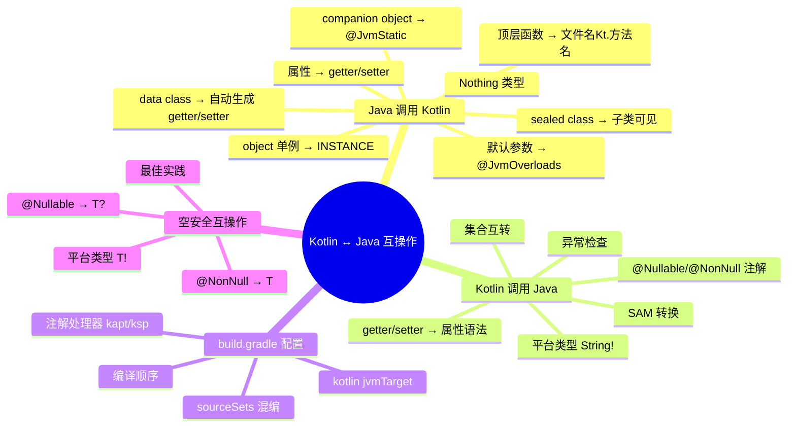
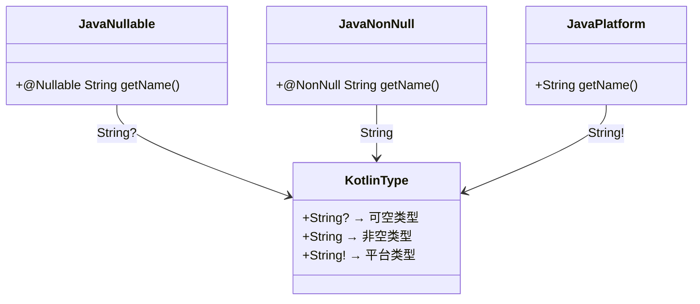
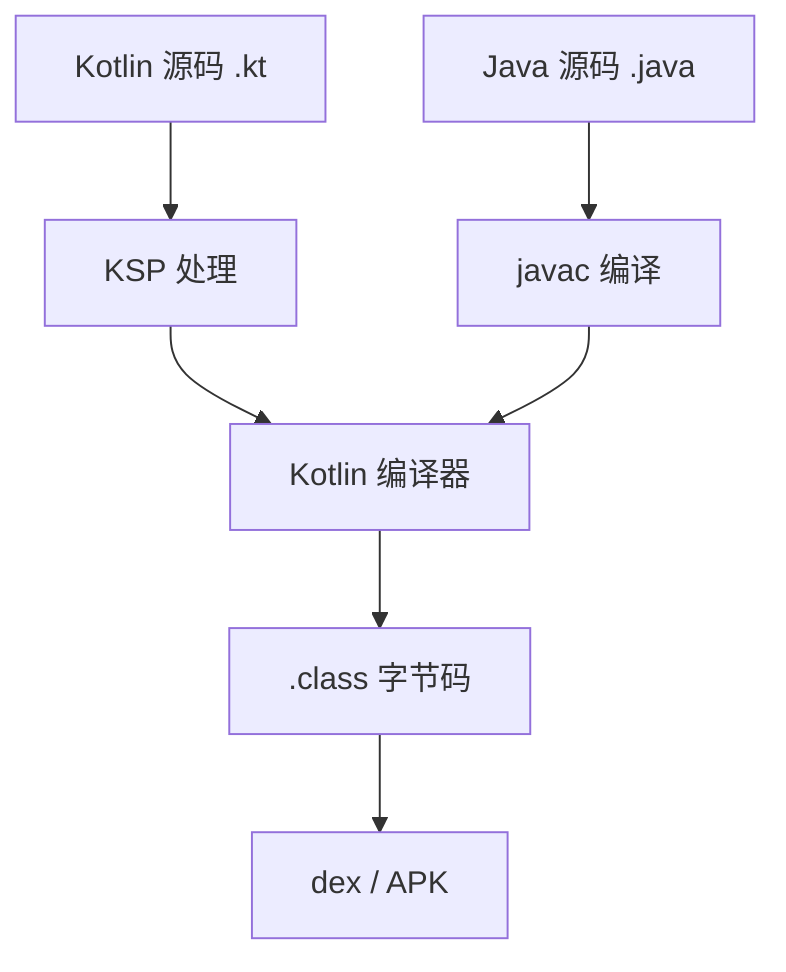

# 04 — Kotlin 与 Java 互操作

> 本章深入 Kotlin 与 Java 互操作的方方面面，结合 Hsiaopu 项目中 Hilt 生成的 Java 代码、Retrofit 接口、Room 注解处理等实际场景，覆盖 Android 面试高频考点。

---

## 1. 互操作全景图



---

## 2. 从 Java 调用 Kotlin

### 2.1 companion object 与 @JvmStatic

```kotlin
// Kotlin 代码
class MyClass {
    companion object {
        fun create(): MyClass = MyClass()

        @JvmStatic
        fun staticCreate(): MyClass = MyClass()
    }
}
```

```java
// Java 调用
MyClass obj1 = MyClass.Companion.create();       // 需要 .Companion
MyClass obj2 = MyClass.staticCreate();           // @JvmStatic 可直接调用
```

**实战：Hsiaopu 中的 Hilt 生成代码**

```java
// Hilt 生成的 Java 代码（Hilt_HsiaopuApp.java）
// 在 Hsiaopu 项目中，Hilt 使用 Java 生成代码，
// 这些代码会被 Kotlin 子类继承

public abstract class Hilt_HsiaopuApp extends Application
    implements GeneratedComponentManagerHolder {

    @Override
    public final ApplicationComponentManager componentManager() {
        return componentManager;
    }

    @CallSuper
    @Override
    public void onCreate() {
        hiltInternalInject();
        super.onCreate();
    }
}

// Kotlin 子类继承
@HiltAndroidApp
class HsiaopuApp : Hilt_HsiaopuApp()  // 继承 Java 生成的抽象类
```

### 2.2 @JvmOverloads

```kotlin
// Kotlin：默认参数
fun greet(name: String = "World", greeting: String = "Hello"): String {
    return "$greeting, $name!"
}

// Java 只能看到 greet(String, String)，不能省略参数
// greet("World")  // ❌ 编译错误

// 使用 @JvmOverloads 生成多个重载方法
@JvmOverloads
fun greetOverloaded(name: String = "World", greeting: String = "Hello"): String {
    return "$greeting, $name!"
}
```

```java
// Java 调用 @JvmOverloads 生成的方法
greetOverloaded("Hsiaopu");                // ✅ 生成 greetOverloaded(String)
greetOverloaded("Hsiaopu", "Hi");         // ✅ 生成 greetOverloaded(String, String)
greetOverloaded();                          // ✅ 生成 greetOverloaded()
```

### 2.3 属性 → getter/setter

```kotlin
// Kotlin 属性
class User {
    var name: String = "Hsiaopu"
    val age: Int = 25
}
```

```java
// Java 调用
User user = new User();
user.setName("New");       // var → getter + setter
String name = user.getName();
int age = user.getAge();   // val → getter only
// user.setAge(30);        // ❌ 编译错误，val 没有 setter
```

### 2.4 顶层函数

```kotlin
// File: Utils.kt
package com.example.hsiaopu.util

fun topLevelFunction(): String = "Hello from Kotlin"
val topLevelProperty: String = "Kotlin"
```

```java
// Java 调用
import com.example.hsiaopu.util.UtilsKt;

String result = UtilsKt.topLevelFunction();       // 文件名 + Kt
String prop = UtilsKt.getTopLevelProperty();

// 使用 @file:JvmName 自定义类名
// @file:JvmName("Utils")
// import com.example.hsiaopu.util.Utils;
```

### 2.5 object 单例

```kotlin
// Kotlin object
object ShellExecutor {
    fun execute(command: String): Flow<ShellResult> = flow { /* ... */ }
    val predefinedCommands: List<PredefinedCommand> = listOf(/* ... */)
}
```

```java
// Java 调用
ShellResult result = ShellExecutor.INSTANCE.execute("ls");
//                          ^^^^^^^^ 必须通过 INSTANCE
List<PredefinedCommand> cmds = ShellExecutor.INSTANCE.getPredefinedCommands();
```

### 2.6 data class 互操作

```kotlin
// Kotlin data class
data class ChatMessage(
    val role: String,
    val content: String,
    val timestamp: Long = System.currentTimeMillis()
)
```

```java
// Java 使用
ChatMessage msg = new ChatMessage("user", "Hello", System.currentTimeMillis());
String role = msg.getRole();          // val → getter
String content = msg.getContent();
long ts = msg.getTimestamp();

// copy() 方法
ChatMessage updated = msg.copy("assistant", "Hi", 0, 0);
// Java 调用 copy 时，默认参数不可用，必须传所有参数
```

---

## 3. 从 Kotlin 调用 Java

### 3.1 平台类型

```java
// Java 代码
public class User {
    public String getName() { return name; }  // 没有 @Nullable/@NonNull
}

// 使用了 @Nullable 注解
public class User {
    @Nullable
    public String getName() { return name; }
}
```

```kotlin
// Kotlin 调用
val user = User()
val name1: String? = user.name  // 安全：当作可空类型
val name2: String = user.name   // ⚠️ 危险：平台类型，可能 NPE

// 如果 Java 有 @Nullable 注解
val name3: String? = user.name  // 编译器识别为 String?

// 如果 Java 有 @NonNull 注解
val name4: String = user.name   // 编译器识别为 String (非空)
```

**平台类型 `T!`** 是 Kotlin 对 Java 类型的默认处理：
- 可以赋值给 `T`（非空），但运行时可能 NPE
- 可以赋值给 `T?`（可空），安全
- **最佳实践**：始终显式声明为可空类型，除非确定非空

### 3.2 SAM 转换

```java
// Java 接口（函数式接口）
public interface OnClickListener {
    void onClick(View view);
}

public class Button {
    public void setOnClickListener(OnClickListener listener) { }
}
```

```kotlin
// Kotlin 调用：SAM 转换
button.setOnClickListener { view ->
    println("Clicked: ${view.id}")
}
// 等价于：
button.setOnClickListener(OnClickListener { view -> println("Clicked: ${view.id}") })
```

```kotlin
// Kotlin 接口 SAM 转换需要 fun 关键字
fun interface KotlinCallback {
    fun onResult(data: String)
}

val callback = KotlinCallback { data -> println(data) }
```

### 3.3 getter/setter → 属性语法

```java
// Java 类
public class Settings {
    private String apiKey;
    public String getApiKey() { return apiKey; }
    public void setApiKey(String apiKey) { this.apiKey = apiKey; }
}
```

```kotlin
// Kotlin 调用
settings.apiKey = "new-key"      // 自动转为 setApiKey()
val key = settings.apiKey        // 自动转为 getApiKey()
```

### 3.4 异常处理

```kotlin
// Kotlin 不区分 checked 和 unchecked 异常
// Java 的 checked 异常在 Kotlin 中不需要 try-catch 或 throws 声明

// Java 方法
public void readFile() throws IOException { /* ... */ }

// Kotlin 调用：不需要 try-catch，但异常仍会抛出
// 需要 @Throws 注解才能让 Kotlin 方法在 Java 中触发 checked 异常
@Throws(IOException::class)
fun readFile() { /* ... */ }
```

---

## 4. 空安全互操作

### 4.1 注解映射



### 4.2 支持的注解

Kotlin 编译器识别以下注解来确定类型可空性：

| 来源 | 注解 |
|------|------|
| JetBrains | `@Nullable`, `@NotNull` |
| Android | `@Nullable`, `@NonNull` |
| JSR-305 | `@javax.annotation.Nullable`, `@javax.annotation.Nonnull` |
| JSpecify | `@org.jspecify.annotations.Nullable` |
| Lombok | `@lombok.NonNull` |
| FindBugs | `@edu.umd.cs.findbugs.annotations.Nullable` |
| Checker | `@org.checkerframework.checker.nullness.qual.Nullable` |

### 4.3 实战：Hsiaopu 中的空安全互操作

```java
// Hsiaopu: Hilt 生成的 Java 代码中使用 @NonNull 注解
import androidx.annotation.CallSuper;
import androidx.annotation.NonNull;

public abstract class Hilt_HsiaopuApp extends Application {
    @Override
    @CallSuper
    public void onCreate() { /* ... */ }
}
```

```kotlin
// Hsiaopu: Kotlin 代码中调用 Java 的 @NonNull 方法
// 编译器知道 Hilt 组件的返回值是非空的
@AndroidEntryPoint
class MainActivity : ComponentActivity() {
    override fun onCreate(savedInstanceState: Bundle?) {  // Bundle 是平台类型
        super.onCreate(savedInstanceState)
        // Hilt 注入的 ViewModel 是非空的（由框架保证）
    }
}
```

### 4.4 最佳实践

```kotlin
// ✅ 最佳实践：在 Kotlin 中接收 Java 返回值时显式声明类型
val text: String? = javaObject.getNullableText()  // 安全
val text: String = javaObject.getNonNullText()    // 信得过

// ❌ 危险：使用平台类型推断
val text = javaObject.getText()  // 类型是 String!，可能 NPE

// ✅ 在 Java 代码中始终使用 @Nullable/@NonNull 注解
public class User {
    @NonNull
    public String getName() { return name; }

    @Nullable
    public String getNickname() { return nickname; }
}
```

---

## 5. Kotlin 中 Java 集合的扩展

### 5.1 集合转换

```kotlin
// Java 集合 → Kotlin 集合
val javaList: java.util.ArrayList<String> = java.util.ArrayList()
val kotlinList: MutableList<String> = javaList  // 自动映射

// Kotlin 集合 → Java 集合
val kotlinList: List<String> = listOf("a", "b")
val javaList: java.util.List<String> = kotlinList  // 自动映射

// 平台集合的扩展函数
javaList.filter { it.length > 2 }  // ✅ 可以直接使用 Kotlin 扩展
javaList.map { it.uppercase() }    // ✅
```

### 5.2 集合类型映射

| Kotlin 类型 | Java 类型 |
|------------|----------|
| `List<T>` | `java.util.List<T>` |
| `MutableList<T>` | `java.util.ArrayList<T>` |
| `Set<T>` | `java.util.Set<T>` |
| `MutableSet<T>` | `java.util.LinkedHashSet<T>` |
| `Map<K,V>` | `java.util.Map<K,V>` |
| `MutableMap<K,V>` | `java.util.HashMap<K,V>` |

---

## 6. 混合项目构建配置

### 6.1 build.gradle.kts 配置

```kotlin
// Hsiaopu: app/build.gradle.kts — 混合项目构建配置
plugins {
    alias(libs.plugins.android.application)
    alias(libs.plugins.kotlin.compose)
    alias(libs.plugins.hilt.android)
    alias(libs.plugins.kotlin.ksp)  // KSP: Kotlin Symbol Processing
}

android {
    namespace = "com.example.hsiaopu"
    compileSdk = 35

    defaultConfig {
        minSdk = 30
        targetSdk = 36
    }

    buildFeatures {
        compose = true
    }
}

kotlin {
    jvmToolchain(11)  // 指定 JVM 目标版本
}

dependencies {
    // Hilt DI（使用 KSP 而非 kapt）
    implementation(libs.hilt.android)
    ksp(libs.hilt.compiler)  // KSP 替代 kapt

    // Room（使用 KSP 处理注解）
    implementation(libs.room.runtime)
    ksp(libs.room.compiler)
}
```

### 6.2 KSP vs kapt

| 特性 | KSP (Kotlin Symbol Processing) | kapt (Kotlin Annotation Processing Tool) |
|------|------|------|
| 速度 | 快（原生 Kotlin，无 Java 中间层） | 慢（需要生成 Java stub） |
| Kotlin 特性 | 原生支持 | 不完整支持 |
| 推荐 | ✅ 新项目推荐 | 逐步迁移到 KSP |

### 6.3 编译顺序



**关键点**：
- Kotlin 和 Java 源码可以互相引用
- Kotlin 编译器可以读取 Java 源码的符号
- KSP 在 Kotlin 编译前执行，生成代码
- 最终所有代码都编译为 JVM 字节码

---

## 7. 实战：Hsiaopu 中的互操作场景

### 7.1 Hilt DI 的互操作

```kotlin
// Hsiaopu: Kotlin 中使用 Hilt 注解
@HiltAndroidApp
class HsiaopuApp : Application()  // Hilt 生成 Java 代码作为父类

@AndroidEntryPoint
class MainActivity : ComponentActivity()  // Hilt 生成 Java 代码

@HiltViewModel
class ChatViewModel @Inject constructor(
    private val repository: ChatRepository
) : ViewModel()
```

Hilt 使用 Java 注解处理器生成代码，这些 Java 代码与 Kotlin 代码无缝集成：
- 生成的 `Hilt_HsiaopuApp.java` 被 Kotlin 的 `HsiaopuApp` 继承
- 生成的 `Hilt_MainActivity.java` 被 Kotlin 的 `MainActivity` 继承
- Dagger 的依赖注入代码在 Java 和 Kotlin 之间透明工作

### 7.2 Retrofit 接口

```kotlin
// Hsiaopu: network/DeepSeekApi.kt
// Retrofit 是 Java 库，但 Kotlin 可以完美使用
interface DeepSeekApi {
    @POST("chat/completions")
    suspend fun sendMessage(@Body request: ChatRequest): ChatResponse
    //       ^^^^^^^ Retrofit 支持 Kotlin 的 suspend 函数
}

// Kotlin 的 data class 可以直接作为 Retrofit 的请求/响应体
// 因为 data class 编译后生成标准的 Java getter/setter
// Gson 通过反射读取这些 getter/setter 进行序列化
```

### 7.3 Room 数据库

```kotlin
// Room 是 Java 库，但完美支持 Kotlin
// @Entity、@Dao、@Database 等注解在 Kotlin 中直接使用
@Entity(tableName = "conversations")
data class ConversationEntity(
    @PrimaryKey(autoGenerate = true) val id: Long = 0,
    val title: String = "New Chat",
    val createdAt: Long = System.currentTimeMillis(),
    val updatedAt: Long = System.currentTimeMillis()
)

@Dao
interface ConversationDao {
    @Query("SELECT * FROM conversations ORDER BY updatedAt DESC")
    fun getAllConversations(): Flow<List<ConversationEntity>>  // Kotlin Flow!
}
```

### 7.4 Shizuku API

```kotlin
// Hsiaopu: system/ShizukuHelper.kt
// Shizuku 是一个 Java API，Kotlin 中直接调用
object ShizukuHelper {
    fun isAvailable(): Boolean {
        // 调用 Java 方法
        return Shizuku.pingBinder()
    }

    fun hasPermission(): Boolean {
        return Shizuku.checkSelfPermission() == PackageManager.PERMISSION_GRANTED
    }

    fun exec(command: String): String {
        // 通过反射调用 Shizuku 的 Java API
        // 使用扩展函数简化调用
    }
}
```

### 7.5 Android 系统 API

```kotlin
// Hsiaopu: MainActivity.kt — 调用 Java 系统 API
class MainActivity : ComponentActivity() {
    override fun onCreate(savedInstanceState: Bundle?) {
        installSplashScreen()  // Java 方法，Kotlin 中直接调用
        super.onCreate(savedInstanceState)
        enableEdgeToEdge()     // Java 扩展函数
        setContent {
            HsiaopuTheme {
                MainScreen()
            }
        }
    }
}
```

---

## 8. 面试高频题

### Q1：Kotlin 的 `companion object` 在 Java 中如何调用？
- Java 通过 `ClassName.Companion.method()` 调用
- 使用 `@JvmStatic` 注解后可以直接 `ClassName.method()`
- 使用 `@JvmField` 注解后属性变为静态字段

### Q2：什么是平台类型？如何处理？
- 平台类型是 Kotlin 对没有 `@Nullable`/`@NonNull` 注解的 Java 类型的处理
- 记为 `T!`，表示"不确定是否可空"
- 最佳实践：在 Kotlin 中显式声明为 `T?`（安全）

### Q3：`@JvmOverloads` 的作用？
- 为有默认参数的 Kotlin 函数生成多个 Java 重载方法
- 例如：`fun foo(a: Int = 1, b: String = "x")` 生成 `foo()`、`foo(int)`、`foo(int, String)`

### Q4：Kotlin 的 `object` 单例在 Java 中如何访问？
- `ObjectName.INSTANCE`
- 方法调用：`ObjectName.INSTANCE.method()`

### Q5：KSP 和 kapt 的区别？为什么推荐 KSP？
- KSP 是 Kotlin 原生注解处理器，kapt 是 Java 注解处理器的桥接
- KSP 快 2-3 倍，不需要生成 Java stub
- 新项目推荐使用 KSP

### Q6：Kotlin 中如何调用 Java 的 checked 异常方法？
- Kotlin 不区分 checked/unchecked 异常
- 可以直接调用 Java 的 checked 异常方法，不需要 try-catch
- 如果需要让 Kotlin 方法在 Java 中触发 checked 异常，使用 `@Throws` 注解

### Q7：Kotlin 的 `data class` 在 Java 中如何使用？
- Java 可以通过构造函数创建对象
- 使用 getter 访问属性（`val` 没有 setter）
- `copy()` 方法在 Java 中需要传所有参数（默认参数不可用）

### Q8：Kotlin 的 `sealed class` 在 Java 中能用吗？
- 可以，但 Java 中 `when` 的穷尽性检查不生效
- Java 只能访问 `public` 的子类

### Q9：Kotlin 的 `Nothing` 类型在 Java 中是什么？
- `Nothing` 是所有类型的子类型
- 在 Java 中没有对应类型，编译为 `Void` 或直接抛出异常

### Q10：如何在混合项目中处理 Kotlin 和 Java 的编译顺序？
- Kotlin 编译器可以读取 Java 源码，自动处理依赖
- Kotlin 代码可以直接引用 Java 类
- Java 代码需要先编译 Kotlin（或使用 KSP 生成的代码）

---

## 9. 本章小结

```mermaid
graph TD
    A[Kotlin ↔ Java 互操作] --> B[Java 调用 Kotlin]
    A --> C[Kotlin 调用 Java]
    A --> D[构建配置]

    B --> B1[@JvmStatic / @JvmOverloads]
    B --> B2[companion object → INSTANCE]
    B --> B3[顶层函数 → 文件名Kt]
    B --> B4[data class → getter/setter]

    C --> C1[平台类型 String!]
    C --> C2[SAM 转换]
    C --> C3[getter/setter → 属性]
    C --> C4[@Nullable/@NonNull 处理]

    D --> D1[KSP 替代 kapt]
    D --> D2[jvmToolchain 配置]
    D --> D3[混合编译顺序]
```

> **核心思想**：Kotlin 与 Java 的互操作是 Kotlin 成功的关键因素之一。它允许渐进式迁移，无需一次性重写整个项目。理解互操作机制（特别是平台类型和注解处理）是 Android 开发者的必备技能。Hsiaopu 项目使用了 Hilt（Java 生成代码）、Retrofit（Java 库）、Room（Java 库）、Shizuku（Java API），完美展示了 Kotlin 与 Java 的协同工作能力。