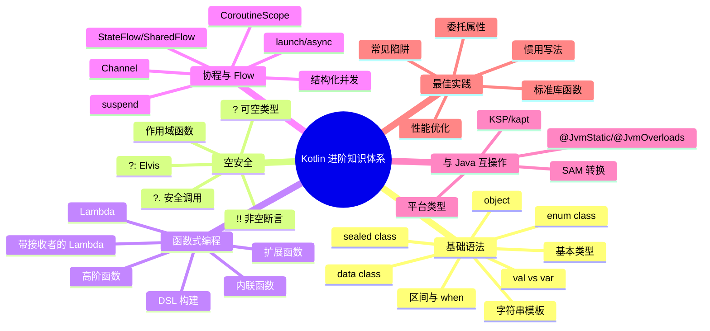
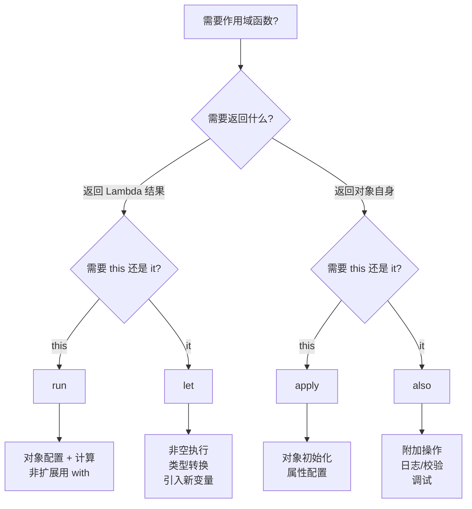

# 05 — Kotlin 最佳实践与面试题汇总

> 本章是 Kotlin 进阶篇的收官之作，涵盖 Kotlin 惯用写法、性能优化、委托属性、常见陷阱，并汇总 30+ 道面试高频题，结合 Hsiaopu 项目代码进行实战分析。

---

## 1. Kotlin 知识体系全景图



---

## 2. Kotlin 惯用写法

### 2.1 if/when 表达式代替 if-else if

```kotlin
// ❌ Java 风格
fun getGrade(score: Int): String {
    if (score >= 90) return "A"
    else if (score >= 80) return "B"
    else if (score >= 70) return "C"
    else return "D"
}

// ✅ Kotlin 惯用：when 表达式
fun getGrade(score: Int) = when {
    score >= 90 -> "A"
    score >= 80 -> "B"
    score >= 70 -> "C"
    else -> "D"
}

// ✅ 更 Kotlin 的写法：单表达式
fun getGrade(score: Int) = when (score) {
    in 90..100 -> "A"
    in 80..89  -> "B"
    in 70..79  -> "C"
    else       -> "D"
}
```

### 2.2 作用域函数选择指南



### 2.3 集合操作惯用写法

```kotlin
val users = listOf(User("Alice", 25), User("Bob", 30), User("Charlie", 20))

// ❌ Java 风格
val adults = mutableListOf<User>()
for (user in users) {
    if (user.age >= 18) {
        adults.add(user)
    }
}

// ✅ Kotlin 惯用
val adults = users.filter { it.age >= 18 }

// ✅ 链式调用
val adultNames = users
    .filter { it.age >= 18 }
    .sortedByDescending { it.age }
    .map { it.name.uppercase() }

// ✅ 分组
val byAge = users.groupBy { it.age >= 25 }

// ✅ 分区
val (adults2, minors) = users.partition { it.age >= 18 }
```

### 2.4 空安全惯用写法

```kotlin
// ❌ Java 风格
val result: String?
if (result != null) {
    println(result)
}

// ✅ Kotlin 惯用
result?.let { println(it) }

// ❌ Java 风格
val value = if (result != null) result else "default"

// ✅ Kotlin 惯用
val value = result ?: "default"

// ✅ 链式安全调用
val content = response?.choices?.firstOrNull()?.message?.content ?: ""
```

### 2.5 实战：Hsiaopu 中的惯用写法

```kotlin
// Hsiaopu: SettingsScreen.kt — 使用 when 表达式
when (tab) {
    0 -> HomeScreen(viewModel = chatViewModel)
    1 -> ShellScreen(settingsDataStore = chatViewModel.dataStore)
    2 -> ToolsScreen(settingsDataStore = chatViewModel.dataStore)
    3 -> SettingsScreen(viewModel = chatViewModel)
}

// Hsiaopu: SettingsScreen.kt — 使用 forEach 遍历
accentColors.forEach { (name, color) ->
    val isSelected = themeSettings.accentColor == name
    Surface(
        modifier = Modifier.size(36.dp),
        shape = RoundedCornerShape(18.dp),
        color = color,
        onClick = { viewModel.updateAccentColor(name) }
    ) { /* ... */ }
}
```

---

## 3. 性能优化

### 3.1 inline 函数

```kotlin
// 高阶函数的 lambda 参数默认为对象，有创建开销
// inline 将函数体直接插入调用处，消除开销

inline fun <T> measureTime(block: () -> T): T {
    val start = System.nanoTime()
    val result = block()
    println("Time: ${(System.nanoTime() - start) / 1_000_000}ms")
    return result
}

// 使用 reified 消除类型擦除开销
inline fun <reified T> List<*>.filterIsInstance(): List<T> {
    val result = mutableListOf<T>()
    for (item in this) {
        if (item is T) result.add(item)
    }
    return result
}
```

### 3.2 Sequence vs List

```kotlin
// List：急切求值，每个操作创建中间集合
val listResult = (1..1_000_000)
    .filter { it % 2 == 0 }        // 创建 500,000 个元素的中间集合
    .map { it * 2 }                 // 创建另一个 500,000 个元素的中间集合
    .take(10)                       // 取前 10 个
    .toList()

// Sequence：惰性求值，元素逐个通过整个管道
val sequenceResult = (1..1_000_000).asSequence()
    .filter { it % 2 == 0 }        // 惰性，不执行
    .map { it * 2 }                 // 惰性，不执行
    .take(10)                       // 惰性，不执行
    .toList()                       // 触发执行，只处理前 20 个元素

// Sequence 在处理大数据量时显著减少内存分配
```

### 3.3 @JvmField 和 @JvmStatic

```kotlin
// 默认情况下，Kotlin 属性生成 getter/setter
// @JvmField 将属性暴露为 Java 字段，避免方法调用开销
class MyClass {
    @JvmField
    val TAG = "MyClass"  // 在 Java 中作为 public final String TAG
}

// const val 是编译期常量，自动内联
const val MAX_RETRY = 3  // 等价于 Java 的 public static final int
```

### 3.4 避免不必要的对象创建

```kotlin
// ❌ 每次调用都创建 lambda 对象
fun doSomething() {
    list.forEach { println(it) }
}

// ✅ 使用函数引用
fun doSomething() {
    list.forEach(::println)
}

// ❌ 字符串拼接创建中间对象
val result = "Hello" + " " + "World" + " " + "2024"

// ✅ 使用字符串模板
val result = "Hello World 2024"
```

---

## 4. 委托属性

### 4.1 lazy 延迟初始化

```kotlin
// lazy：第一次访问时才初始化，线程安全（默认）
val expensiveData: String by lazy {
    println("Computing...")
    Thread.sleep(1000)
    "Expensive Result"
}

// 只在第一次访问时执行
println(expensiveData)  // 打印 "Computing..." 然后返回结果
println(expensiveData)  // 直接返回缓存结果

// 线程安全模式
val lazy1 by lazy(LazyThreadSafetyMode.SYNCHRONIZED) { "sync" }  // 默认
val lazy2 by lazy(LazyThreadSafetyMode.PUBLICATION) { "pub" }    // 允许并发初始化
val lazy3 by lazy(LazyThreadSafetyMode.NONE) { "none" }         // 不保证线程安全
```

### 4.2 observable 观察属性变化

```kotlin
// observable：每次属性变化时触发回调
var name: String by Delegates.observable("Initial") { _, old, new ->
    println("Name changed from $old to $new")
}

name = "Alice"  // 打印: Name changed from Initial to Alice
name = "Bob"    // 打印: Name changed from Alice to Bob
```

### 4.3 vetoable 可否决的赋值

```kotlin
// vetoable：在赋值前拦截，可以否决
var age: Int by Delegates.vetoable(0) { _, old, new ->
    new >= 0 && new <= 150  // 只有年龄合法时才允许赋值
}

age = 25   // ✅ 允许
age = -1   // ❌ 被否决，age 保持 25
age = 200  // ❌ 被否决，age 保持 25
```

### 4.4 notNull 非空委托

```kotlin
// notNull：延迟初始化但非空，类似 lateinit var
var database: Database by Delegates.notNull()

// 在初始化前访问会抛 IllegalStateException
// database.connect()  // ❌ 抛异常

// 先初始化
database = Database()
database.connect()  // ✅
```

### 4.5 map 委托

```kotlin
// 将属性委托给 Map，适合 JSON 解析场景
class User(map: Map<String, Any?>) {
    val name: String by map
    val age: Int by map
}

val user = User(mapOf("name" to "Alice", "age" to 25))
println(user.name)  // Alice
println(user.age)   // 25
```

---

## 5. 标准库实用函数

### 5.1 takeIf 和 takeUnless

```kotlin
// takeIf：满足条件返回自身，否则返回 null
val number = 42
val even = number.takeIf { it % 2 == 0 }  // 42
val odd = number.takeIf { it % 2 != 0 }   // null

// 配合 ?. 使用
number.takeIf { it > 0 }?.let { println("Positive: $it") }

// takeUnless：不满足条件返回自身
val negative = number.takeUnless { it > 0 }  // null
```

### 5.2 groupBy 和 partition

```kotlin
val words = listOf("apple", "banana", "apricot", "blueberry", "avocado")

// groupBy：按条件分组
val byFirstLetter: Map<Char, List<String>> = words.groupBy { it.first() }
// {a=[apple, apricot, avocado], b=[banana, blueberry]}

// 可以指定值的转换
val countByFirstLetter: Map<Char, Int> = words.groupBy(
    keySelector = { it.first() },
    valueTransform = { it.length }
).mapValues { it.value.sum() }

// partition：按条件分为两组
val (longWords, shortWords) = words.partition { it.length > 5 }
// longWords = [banana, apricot, blueberry, avocado]
// shortWords = [apple]
```

### 5.3 associateBy 和 associateWith

```kotlin
data class User(val id: Int, val name: String)

val users = listOf(User(1, "Alice"), User(2, "Bob"), User(3, "Charlie"))

// associateBy：以某属性为 key
val userMap: Map<Int, User> = users.associateBy { it.id }
// {1=User(1, Alice), 2=User(2, Bob), 3=User(3, Charlie)}

// associateWith：以元素为 key
val nameLengths: Map<User, Int> = users.associateWith { it.name.length }
```

### 5.4 zip 和 unzip

```kotlin
val names = listOf("Alice", "Bob", "Charlie")
val ages = listOf(25, 30, 20)

// zip：合并两个列表
val users: List<Pair<String, Int>> = names.zip(ages)
// [(Alice, 25), (Bob, 30), (Charlie, 20)]

// 带转换函数
val userObjects = names.zip(ages) { name, age -> User(0, name) }

// unzip：拆分 Pair 列表
val pairs = listOf(1 to "one", 2 to "two", 3 to "three")
val (numbers, words) = pairs.unzip()
```

### 5.5 windowed 和 chunked

```kotlin
val numbers = (1..10).toList()

// windowed：滑动窗口
numbers.windowed(3, step = 1)
// [[1,2,3], [2,3,4], [3,4,5], ...]

numbers.windowed(3, step = 2)
// [[1,2,3], [3,4,5], [5,6,7], ...]

// chunked：固定分块
numbers.chunked(3)
// [[1,2,3], [4,5,6], [7,8,9], [10]]
```

---

## 6. 常见陷阱

### 6.1 lateinit vs lazy

```kotlin
// lateinit：可变（var），运行时初始化，无自定义 getter
lateinit var database: Database

// lazy：只读（val），首次访问时初始化，线程安全
val repository: Repository by lazy {
    Repository(database)
}

// 选择指南：
// - 需要 var + 外部初始化（如 Dagger/Hilt） → lateinit
// - 需要 val + 惰性初始化 → lazy
// - 需要用户自定义初始化逻辑 → lazy
```

| 特性 | `lateinit` | `lazy` |
|------|-----------|--------|
| 修饰 | `var` | `val` |
| 初始化时机 | 手动赋值 | 首次访问 |
| 可否为空 | 非空 | 非空 |
| 线程安全 | 否 | 默认是 |
| 基础类型 | 不支持 | 支持 |
| 访问前检查 | `::db.isInitialized` | 自动 |
| 依赖注入 | ✅ 典型场景 | 不适用 |

### 6.2 内部类默认 static

```kotlin
// Kotlin 内部类默认是 static（嵌套类）
class Outer {
    class Nested {  // 等价于 Java 的 static class
        fun foo() = "Nested"
    }
}

// 需要持有外部类引用时，使用 inner 关键字
class Outer {
    inner class Inner {  // 等价于 Java 的非 static 内部类
        fun foo() = this@Outer.toString()
    }
}
```

**‼️ 面试高频**：Kotlin 内部类默认是静态的，Java 内部类默认是非静态的！

```java
// Java 对比
class Outer {
    class Nested { }        // 非静态内部类（默认）
    static class Static { } // 静态内部类
}
```

### 6.3 泛型型变

```kotlin
// 声明处型变
// out：协变（生产者），只能读取
interface Source<out T> {
    fun next(): T
}

// in：逆变（消费者），只能写入
interface Sink<in T> {
    fun put(item: T)
}

// 使用处型变
fun copy(from: List<out Number>, to: MutableList<in Number>) {
    for (item in from) {
        to.add(item)
    }
}
```

### 6.4 相等性判断

```kotlin
// == 调用 equals()（结构相等）
// === 比较引用（引用相等）

val a = "Hello"
val b = "Hello"
println(a == b)   // true（结构相等）
println(a === b)  // true（字符串常量池）

val list1 = listOf(1, 2, 3)
val list2 = listOf(1, 2, 3)
println(list1 == list2)   // true（结构相等）
println(list1 === list2)  // false（不同对象）
```

### 6.5 返回语句的歧义

```kotlin
// Lambda 中的 return 会导致非局部返回
fun process() {
    listOf(1, 2, 3).forEach {
        if (it == 2) return  // ⚠️ 从 process() 返回，不是 forEach
        println(it)
    }
}

// ✅ 使用标签返回
fun process() {
    listOf(1, 2, 3).forEach {
        if (it == 2) return@forEach  // 从 forEach 的 lambda 返回
        println(it)
    }
}

// ✅ 或使用匿名函数
fun process() {
    listOf(1, 2, 3).forEach(fun(it) {
        if (it == 2) return
        println(it)
    })
}
```

---

## 7. Kotlin 面试高频题汇总（30+ 题）

### 基础语法（8 题）

| # | 问题 | 难度 |
|---|------|------|
| 1 | `val` 和 `var` 的区别？为什么推荐多用 `val`？ | ⭐ |
| 2 | `data class` 自动生成哪些方法？`copy()` 的工作原理？ | ⭐⭐ |
| 3 | `sealed class` 和 `enum class` 的区别？何时用哪个？ | ⭐⭐ |
| 4 | `when` 表达式比 Java `switch` 强在哪里？ | ⭐⭐ |
| 5 | `object` 和 `companion object` 的区别？ | ⭐⭐ |
| 6 | Kotlin 中 `==` 和 `===` 的区别？ | ⭐ |
| 7 | `Nothing` 类型的作用？什么场景使用？ | ⭐⭐⭐ |
| 8 | `const val` 和 `val` 的区别？ | ⭐⭐ |

### 空安全（5 题）

| # | 问题 | 难度 |
|---|------|------|
| 9 | `?.`、`!!`、`?:` 的区别？何时使用 `!!` 是合理的？ | ⭐⭐ |
| 10 | `let`、`apply`、`run`、`also`、`with` 的区别和使用场景？ | ⭐⭐⭐ |
| 11 | 什么是平台类型？如何处理？ | ⭐⭐⭐ |
| 12 | `lateinit` 和 `lazy` 的区别？如何选择？ | ⭐⭐ |
| 13 | Kotlin 如何保证空安全？NPE 还可能发生吗？ | ⭐⭐ |

### 函数式编程（6 题）

| # | 问题 | 难度 |
|---|------|------|
| 14 | 什么是扩展函数？它是如何实现的（静态解析 vs 动态调度）？ | ⭐⭐ |
| 15 | 什么是高阶函数？函数类型和 Lambda 的区别？ | ⭐⭐ |
| 16 | `inline` 关键字的作用？`noinline` 和 `crossinline` 的区别？ | ⭐⭐⭐ |
| 17 | `reified` 关键字的作用？为什么需要配合 `inline`？ | ⭐⭐⭐ |
| 18 | 什么是带接收者的 Lambda？在 Compose 中如何体现？ | ⭐⭐⭐ |
| 19 | Kotlin DSL 的构建原理？ | ⭐⭐⭐ |

### 协程与 Flow（8 题）

| # | 问题 | 难度 |
|---|------|------|
| 20 | 协程和线程的区别？协程为什么更轻量？ | ⭐⭐ |
| 21 | `launch` 和 `async` 的区别？异常处理方式有何不同？ | ⭐⭐⭐ |
| 22 | `coroutineScope` 和 `supervisorScope` 的区别？ | ⭐⭐⭐ |
| 23 | `Dispatchers.Main`、`IO`、`Default` 的区别？ | ⭐⭐ |
| 24 | `Flow` 是冷流还是热流？`StateFlow` 和 `SharedFlow` 的区别？ | ⭐⭐⭐ |
| 25 | `StateFlow` 和 `LiveData` 的区别？如何选择？ | ⭐⭐ |
| 26 | `Channel` 和 `Flow` 的区别？如何选择？ | ⭐⭐⭐ |
| 27 | 结构化并发的核心原则是什么？ | ⭐⭐⭐ |

### 互操作与高级特性（6 题）

| # | 问题 | 难度 |
|---|------|------|
| 28 | `@JvmStatic`、`@JvmOverloads`、`@JvmField` 的作用？ | ⭐⭐ |
| 29 | KSP 和 kapt 的区别？为什么推荐 KSP？ | ⭐⭐ |
| 30 | Kotlin 内部类默认是 static 还是 non-static？ | ⭐⭐ |
| 31 | Kotlin 泛型的 `out` 和 `in` 关键字的作用？ | ⭐⭐⭐ |
| 32 | `Sequence` 和 `List` 的 `filter`/`map` 有什么区别？ | ⭐⭐ |
| 33 | 委托属性 `lazy`、`observable`、`vetoable` 的原理？ | ⭐⭐⭐ |

---

## 8. 面试题详解（精选）

### Q1：`let`、`apply`、`run`、`also`、`with` 的区别？

```kotlin
// 记忆口诀：按接收者引用（it/this）× 返回值（结果/自身）

// let: it → 结果
val length = "Hello".let { it.length }  // 返回 5

// apply: this → 自身
val user = User().apply { name = "Alice" }  // 返回配置后的 User

// run: this → 结果
val result = user.run { name.length }  // 返回 5

// also: it → 自身
val logged = user.also { println(it.name) }  // 返回 user 自身

// with: this → 结果（非扩展函数）
val greeting = with(user) { "Hello, $name" }  // 返回 "Hello, Alice"
```

### Q2：`inline`、`noinline`、`crossinline` 的区别？

```kotlin
// inline: 函数体和 lambda 都内联
inline fun <T> measure(block: () -> T): T {
    val start = System.nanoTime()
    return block().also { println("${System.nanoTime() - start}ns") }
}

// noinline: 阻止特定 lambda 被内联
inline fun foo(inlined: () -> Unit, noinline notInlined: () -> Unit) {
    // notInlined 保持为对象，可以存储、传递
    Handler().post(notInlined)
}

// crossinline: 允许内联但不允许非局部 return
inline fun bar(crossinline block: () -> Unit) {
    // block 可以在另一上下文中执行
    Runnable { block() }.run()
    // 但 block 内部不能使用 return
}
```

### Q3：`StateFlow` 和 `LiveData` 的区别？

```kotlin
// StateFlow
class MyViewModel : ViewModel() {
    private val _state = MutableStateFlow(UiState())
    val state: StateFlow<UiState> = _state.asStateFlow()
}

// 在 Compose 中收集
@Composable
fun Screen(viewModel: MyViewModel) {
    val state by viewModel.state.collectAsStateWithLifecycle()
}

// LiveData
class MyViewModel : ViewModel() {
    private val _state = MutableLiveData(UiState())
    val state: LiveData<UiState> = _state
}

// 在 Compose 中收集
@Composable
fun Screen(viewModel: MyViewModel) {
    val state by viewModel.state.observeAsState()
}
```

| 对比维度 | StateFlow | LiveData |
|---------|-----------|----------|
| 生命周期感知 | 需要手动处理 | 自动 |
| 线程安全 | ✅ | ❌（仅主线程） |
| 操作符 | map/filter/combine | Transformations |
| 测试 | 简单（协程测试） | 需要 InstantTaskExecutorRule |
| 推荐 | ✅ 新项目 | 逐步迁移 |

### Q4：`coroutineScope` 和 `supervisorScope` 的区别？

```kotlin
// coroutineScope: 一个子协程失败 → 取消所有
suspend fun failFast() = coroutineScope {
    launch {
        delay(100)
        throw Exception("Failed") // 取消所有子协程
    }
    launch {
        delay(1000)
        println("Never printed")  // 不会执行
    }
}

// supervisorScope: 一个子协程失败 → 不影响其他
suspend fun failIndependent() = supervisorScope {
    launch {
        delay(100)
        throw Exception("Failed") // 只影响自己
    }
    launch {
        delay(1000)
        println("Still printed")  // 正常执行！
    }
}

// Android 中的典型应用
// ViewModel 使用 supervisorScope 防止一个协程失败影响其他
class MyViewModel : ViewModel() {
    fun loadAll() {
        viewModelScope.launch {  // viewModelScope 内部使用 SupervisorJob
            launch { loadUsers() }
            launch { loadSettings() }  // loadUsers 失败不影响 loadSettings
        }
    }
}
```

### Q5：Kotlin 泛型的 `out` 和 `in` 关键字？

```kotlin
// out: 协变（生产者），只能读取 T
// 如果 A 是 B 的子类型，则 Source<A> 是 Source<B> 的子类型
interface Source<out T> {
    fun next(): T
    // fun put(item: T)  // ❌ 编译错误，不能消费 T
}

// in: 逆变（消费者），只能写入 T
// 如果 A 是 B 的子类型，则 Sink<B> 是 Sink<A> 的子类型
interface Sink<in T> {
    fun put(item: T)
    // fun next(): T  // ❌ 编译错误，不能生产 T
}

// 实际例子
val ints: Source<Int> = object : Source<Int> { /* ... */ }
val numbers: Source<Number> = ints  // ✅ 协变允许

val numberSink: Sink<Number> = object : Sink<Number> { /* ... */ }
val intSink: Sink<Int> = numberSink  // ✅ 逆变允许
```

---

## 9. 实战：Hsiaopu 项目最佳实践总结

### 9.1 项目架构

```kotlin
// 1. 使用 Hilt 进行依赖注入
@HiltAndroidApp class HsiaopuApp : Application()
@AndroidEntryPoint class MainActivity : ComponentActivity()
@HiltViewModel class ChatViewModel @Inject constructor(...) : ViewModel()

// 2. 使用 StateFlow 管理 UI 状态
private val _uiState = MutableStateFlow(ChatUiState())
val uiState: StateFlow<ChatUiState> = _uiState.asStateFlow()

// 3. 使用 Room + Flow 实现响应式数据层
@Dao
interface ConversationDao {
    @Query("SELECT * FROM conversations ORDER BY updatedAt DESC")
    fun getAllConversations(): Flow<List<ConversationEntity>>
}

// 4. 使用 Retrofit + suspend 函数进行网络请求
interface DeepSeekApi {
    @POST("chat/completions")
    suspend fun sendMessage(@Body request: ChatRequest): ChatResponse
}

// 5. 使用 Compose 声明式 UI
@Composable
fun SettingsScreen(viewModel: ChatViewModel) {
    val uiState by viewModel.uiState.collectAsState()
    // 声明式 UI 代码...
}
```

### 9.2 代码质量要点

```kotlin
// ✅ 使用 data class 替代 POJO
data class ChatMessage(val role: String, val content: String, val timestamp: Long)

// ✅ 使用 enum class 管理常量
enum class FeatureGuideKey(val key: String) {
    HOME_QUICK_COMMANDS("home_quick_commands"),
    HOME_LONG_PRESS("home_long_press"),
    // ...
}

// ✅ 使用 object 管理单例工具类
object ShellExecutor {
    fun execute(command: String): Flow<ShellResult> = flow { /* ... */ }
}

// ✅ 使用 val 优先，减少可变状态
val settings: StateFlow<AppSettings>  // 只读 StateFlow

// ✅ 使用 null 安全操作符
val content = choice.delta?.content ?: ""

// ✅ 使用 Flow 替代回调
fun getConversations(): Flow<List<ConversationEntity>>
```

---

## 10. 快速参考卡

### 作用域函数速查

| 函数 | 接收者 | 返回值 | 典型场景 |
|------|--------|--------|----------|
| `let` | `it` | Lambda 结果 | 非空执行、类型转换 |
| `run` | `this` | Lambda 结果 | 对象配置 + 计算 |
| `with` | `this` | Lambda 结果 | 对同一对象多次操作 |
| `apply` | `this` | 对象自身 | 对象初始化 |
| `also` | `it` | 对象自身 | 附加操作、日志 |

### 空安全操作符速查

| 操作符 | 含义 | 示例 |
|--------|------|------|
| `T?` | 可空类型 | `val s: String? = null` |
| `?.` | 安全调用 | `s?.length` |
| `?:` | Elvis（默认值） | `s ?: "default"` |
| `!!` | 非空断言 | `s!!` |
| `as?` | 安全转换 | `obj as? String` |

### 协程构建器速查

| 构建器 | 返回值 | 异常处理 | 用途 |
|--------|--------|----------|------|
| `launch` | `Job` | 立即抛出 | 不关心返回值 |
| `async` | `Deferred<T>` | `await()` 时抛出 | 需要返回值 |
| `runBlocking` | `T` | 立即抛出 | 测试/阻塞等待 |

---

## 11. 本章小结

```mermaid
graph TD
    A[Kotlin 最佳实践] --> B[惯用写法]
    A --> C[性能优化]
    A --> D[委托属性]
    A --> E[常见陷阱]

    B --> B1[when 表达式]
    B --> B2[作用域函数选择]
    B --> B3[集合链式操作]
    B --> B4[空安全惯用写法]

    C --> C1[inline 消除 lambda 开销]
    C --> C2[Sequence 惰性求值]
    C --> C3[@JvmField/@JvmStatic]

    D --> D1[lazy 延迟初始化]
    D --> D2[observable 属性监听]
    D --> D3[vetoable 值校验]

    E --> E1[lateinit vs lazy]
    E --> E2[内部类默认 static]
    E --> E3[泛型型变 out/in]
    E --> E4[Lambda 返回歧义]

    F[面试准备] --> F1[30+ 高频题]
    F --> F2[代码示例]
    F --> F3[实际项目经验]
```

> **核心思想**：Kotlin 不仅是 Java 的语法糖，它代表了一种全新的编程范式——函数式 + 响应式 + 声明式。掌握 Kotlin 的最佳实践不仅帮助你通过面试，更重要的是让你写出更安全、更简洁、更高效的 Android 代码。Hsiaopu 项目从架构到细节都体现了现代 Kotlin 开发的精髓，是面试中展示项目经验的绝佳素材。