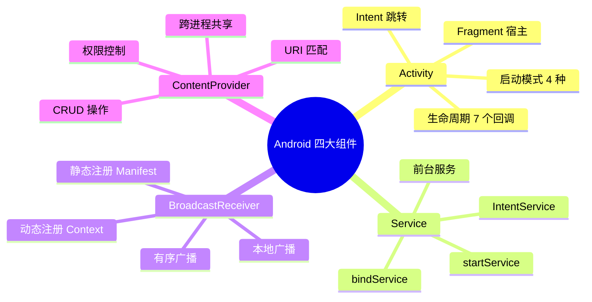
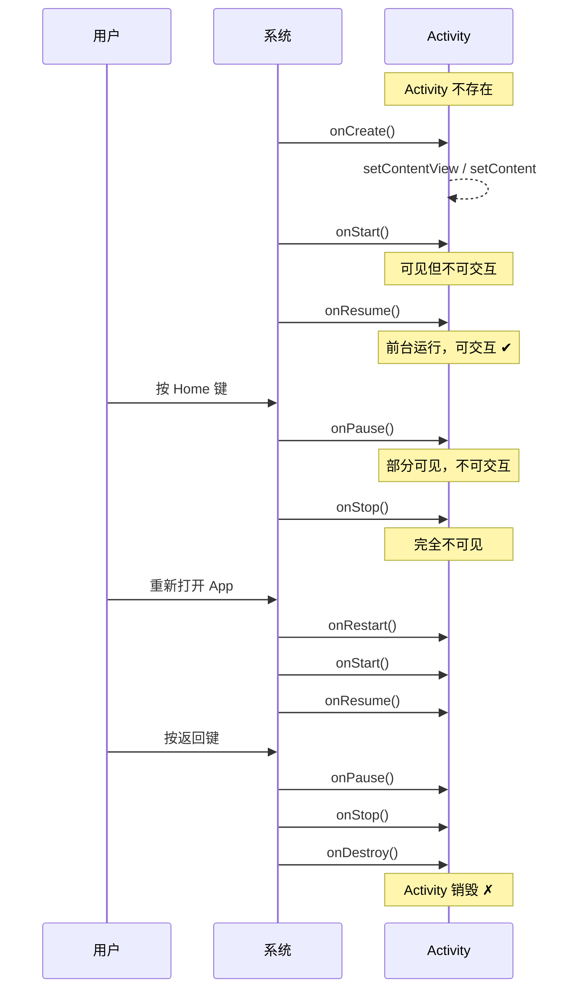
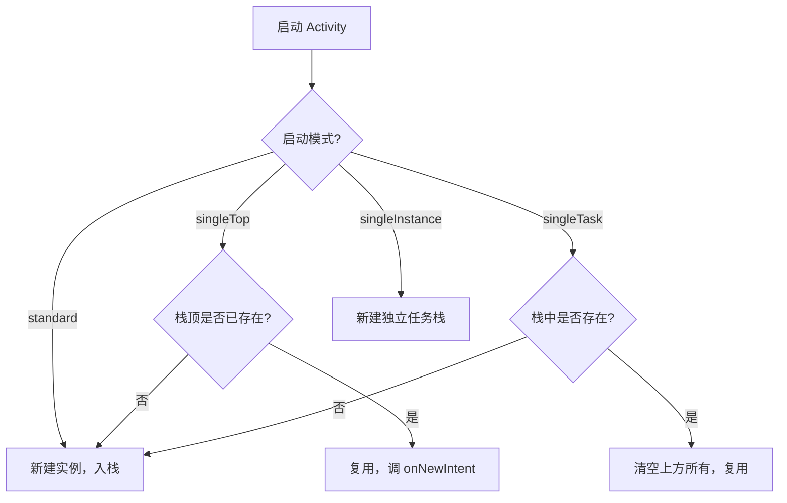
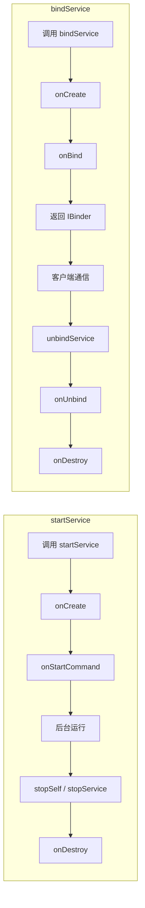
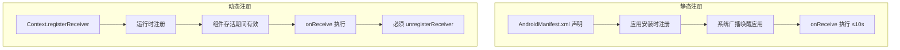
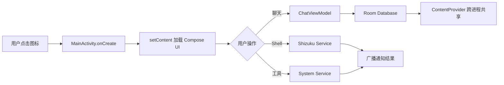

# 01 - Android 四大组件详解

> 结合 Hsiaopu 项目实战，深度剖析 Activity、Service、BroadcastReceiver、ContentProvider。

---

## 一、组件总览



---

## 二、Activity 详解

### 2.1 生命周期（7 个回调）



| 回调 | 触发时机 | 常见操作 |
|------|---------|---------|
| `onCreate()` | Activity 首次创建 | 初始化 UI、绑定 ViewModel |
| `onStart()` | Activity 即将可见 | 注册 BroadcastReceiver |
| `onResume()` | Activity 前台交互 | 开始动画、相机预览 |
| `onPause()` | Activity 失去焦点 | 暂停动画、保存草稿 |
| `onStop()` | Activity 完全不可见 | 释放重资源 |
| `onRestart()` | 从 Stop 回到前台 | — |
| `onDestroy()` | Activity 销毁 | 清理资源、解绑 Service |

### 2.2 Hsiaopu 项目中的 MainActivity

```kotlin
// d:\Hsiaopu\app\src\main\java\com\example\hsiaopu\MainActivity.kt

@AndroidEntryPoint
class MainActivity : ComponentActivity() {
    override fun onCreate(savedInstanceState: Bundle?) {
        installSplashScreen()   // ① SplashScreen API
        super.onCreate(savedInstanceState)
        enableEdgeToEdge()      // ② 边到边显示
        setContent {            // ③ Compose 入口
            HsiaopuTheme {
                MainScreen()    // ④ 根 Composable
            }
        }
    }
}
```

**关键点解析：**
- `@AndroidEntryPoint`：Hilt 依赖注入标记，使 Activity 成为 DI 容器入口
- `installSplashScreen()`：Android 12+ SplashScreen API，在 `super.onCreate()` 之前调用
- `enableEdgeToEdge()`：内容延伸到状态栏和导航栏下方
- `setContent {}`：Compose 声明式 UI 的入口，替代传统 `setContentView()`

### 2.3 启动模式（Launch Mode）



**AndroidManifest.xml 注册方式：**

```xml
<!-- d:\Hsiaopu\app\src\main\AndroidManifest.xml -->
<activity
    android:name=".MainActivity"
    android:exported="true"
    android:launchMode="singleTask"
    android:theme="@style/Theme.Hsiaopu">
    <intent-filter>
        <action android:name="android.intent.action.MAIN" />
        <category android:name="android.intent.category.LAUNCHER" />
    </intent-filter>
</activity>
```

| 属性 | 说明 |
|------|------|
| `android:exported="true"` | 允许外部应用启动（LAUNCHER 必须为 true） |
| `android:launchMode="singleTask"` | 整个系统只有一个实例，适合主界面 |
| `<intent-filter>` | 声明为启动入口，系统桌面可识别 |

---

## 三、Service 详解

### 3.1 startService vs bindService



| 特性 | startService | bindService |
|------|-------------|------------|
| 生命周期 | 独立于启动者 | 随绑定者销毁 |
| 通信方式 | Intent 单向 | IBinder 双向 |
| 停止方式 | stopSelf/stopService | unbindService |
| 适用场景 | 下载、上传 | 音乐播放控制 |

### 3.2 前台服务（Foreground Service）

Android 8.0+ 后台限制严格，长时间运行任务必须使用前台服务：

```kotlin
// 前台服务示例
class DownloadService : Service() {
    override fun onCreate() {
        super.onCreate()
        // 创建通知渠道（Android 8.0+ 必须）
        val channel = NotificationChannel(
            CHANNEL_ID, "下载服务", NotificationManager.IMPORTANCE_LOW
        )
        val manager = getSystemService(NotificationManager::class.java)
        manager.createNotificationChannel(channel)
    }

    override fun onStartCommand(intent: Intent?, flags: Int, startId: Int): Int {
        val notification = NotificationCompat.Builder(this, CHANNEL_ID)
            .setContentTitle("正在下载")
            .setContentText("下载中...")
            .setSmallIcon(R.drawable.ic_launcher_foreground)
            .build()
        startForeground(1, notification) // 提升为前台服务
        // 执行后台任务...
        return START_STICKY
    }
}
```

**AndroidManifest 声明：**

```xml
<service
    android:name=".DownloadService"
    android:foregroundServiceType="dataSync"
    android:exported="false" />
```

Android 14+ 需要显式声明 `foregroundServiceType`。

---

## 四、BroadcastReceiver 详解

### 4.1 静态注册 vs 动态注册



| 对比 | 静态注册 | 动态注册 |
|------|---------|---------|
| 注册方式 | Manifest | `registerReceiver()` |
| 生命周期 | 应用安装后始终有效 | 组件存活期间 |
| 唤醒应用 | 可以（Android 8.0+ 受限） | 不可以 |
| 系统广播限制 | 大部分隐式广播已禁止静态注册 | 不受限 |
| 资源消耗 | 低 | 需手动管理 |

**Hsiaopu 项目中的动态注册示例（网络状态监听）：**

```kotlin
// ChatViewModel.kt 中通过 ConnectivityManager 监听网络
viewModelScope.launch {
    val cm = context.getSystemService(Context.CONNECTIVITY_SERVICE) as? ConnectivityManager
    while (true) {
        val caps = cm?.activeNetwork?.let { cm.getNetworkCapabilities(it) }
        _uiState.update { it.copy(isOnline = caps != null) }
        kotlinx.coroutines.delay(5000)
    }
}
```

### 4.2 有序广播（Ordered Broadcast）

```kotlin
// 发送有序广播
Intent("com.example.ACTION_PROCESS").also { intent ->
    sendOrderedBroadcast(intent, null, object : BroadcastReceiver() {
        override fun onReceive(context: Context, intent: Intent) {
            // 最终结果处理
            val result = getResultData()
        }
    }, null, Activity.RESULT_OK, null, null)
}

// 中间接收者可以修改或中止广播
class MidReceiver : BroadcastReceiver() {
    override fun onReceive(context: Context, intent: Intent) {
        // 优先级通过 android:priority 控制
        setResultData("处理结果")
        // abortBroadcast() // 中止广播
    }
}
```

---

## 五、ContentProvider 详解

### 5.1 URI 结构

```
content://com.example.hsiaopu.provider/conversations/123
  └─┬──┘  └──────────┬──────────────┘ └─────┬──────┘ └┬┘
   Scheme     Authority                   Path       ID
```

### 5.2 CRUD 操作

```kotlin
// ContentProvider 核心方法
class HsiaopuProvider : ContentProvider() {

    override fun onCreate(): Boolean {
        // 初始化数据库
        return true
    }

    override fun query(
        uri: Uri,
        projection: Array<out String>?,
        selection: String?,
        selectionArgs: Array<out String>?,
        sortOrder: String?
    ): Cursor? {
        // 查询操作
        val matcher = buildUriMatcher()
        return when (matcher.match(uri)) {
            CONVERSATIONS -> db.query("conversations", projection, ...)
            CONVERSATION_ID -> db.query("conversations", projection, "id=?", ...)
            else -> null
        }
    }

    override fun insert(uri: Uri, values: ContentValues?): Uri? {
        // 插入操作
        val id = db.insert("conversations", null, values)
        return ContentUris.withAppendedId(uri, id)
    }

    override fun update(uri: Uri, values: ContentValues?, selection: String?, selectionArgs: Array<out String>?): Int {
        return db.update("conversations", values, selection, selectionArgs)
    }

    override fun delete(uri: Uri, selection: String?, selectionArgs: Array<out String>?): Int {
        return db.delete("conversations", selection, selectionArgs)
    }

    override fun getType(uri: Uri): String? {
        // 返回 MIME 类型
        return when (uriMatcher.match(uri)) {
            CONVERSATIONS -> "vnd.android.cursor.dir/vnd.hsiaopu.conversations"
            CONVERSATION_ID -> "vnd.android.cursor.item/vnd.hsiaopu.conversations"
            else -> null
        }
    }
}
```

### 5.3 Hsiaopu 项目中的 ShizukuProvider

Hsiaopu 项目虽然没有自定义 ContentProvider，但利用了 Shizuku 的 `ShizukuProvider` 来获取系统级权限：

```kotlin
// ShizukuHelper.kt
object ShizukuHelper {
    fun isAvailable(): Boolean {
        return try {
            Shizuku.pingBinder() // 检查 Shizuku 服务是否运行
        } catch (_: Exception) { false }
    }

    fun hasPermission(): Boolean {
        return try {
            Shizuku.checkSelfPermission() == PackageManager.PERMISSION_GRANTED
        } catch (_: Exception) { false }
    }
}
```

Shizuku 通过一个内部 ContentProvider (`ShizukuProvider`) 提供跨进程通信，使普通应用可以调用系统级 API。

---

## 六、四大组件在 AndroidManifest 中的注册

```xml
<!-- Hsiaopu 的 AndroidManifest.xml 结构 -->
<manifest xmlns:android="http://schemas.android.com/apk/res/android">

    <!-- 权限声明 -->
    <uses-permission android:name="android.permission.INTERNET" />
    <uses-permission android:name="android.permission.ACCESS_NETWORK_STATE" />
    <uses-permission android:name="android.permission.ACCESS_WIFI_STATE" />
    <uses-permission android:name="android.permission.CHANGE_WIFI_STATE" />
    <uses-permission android:name="android.permission.BLUETOOTH" />
    <uses-permission android:name="android.permission.BLUETOOTH_ADMIN" />
    <uses-permission android:name="moe.shizuku.manager.permission.API_V23" />

    <application
        android:name=".HsiaopuApp"
        android:allowBackup="true"
        android:icon="@mipmap/ic_launcher"
        android:label="Hsiaopu"
        android:theme="@style/Theme.Hsiaopu">

        <!-- Activity -->
        <activity
            android:name=".MainActivity"
            android:exported="true"
            android:launchMode="singleTask"
            android:theme="@style/Theme.Hsiaopu">
            <intent-filter>
                <action android:name="android.intent.action.MAIN" />
                <category android:name="android.intent.category.LAUNCHER" />
            </intent-filter>
        </activity>

        <!-- 如需 Provider 或 Service 在此声明 -->
    </application>
</manifest>
```

---

## 七、面试高频题

### Q1: Activity A 启动 Activity B 的生命周期回调顺序？

**答案：** A.onPause() → B.onCreate() → B.onStart() → B.onResume() → A.onStop()

> Android 保证新 Activity 可见后旧 Activity 才会 Stop，避免出现空白屏幕。

### Q2: singleTask 和 singleInstance 的区别？

- **singleTask**：复用栈内已有实例，清除其上所有 Activity（与主 Activity 同栈）
- **singleInstance**：独占一个新任务栈，该栈只能有这一个 Activity

### Q3: Service 的 onStartCommand 返回值含义？

| 返回值 | 含义 |
|--------|------|
| `START_STICKY` | 被杀后自动重启，Intent 为 null |
| `START_NOT_STICKY` | 被杀后不重启 |
| `START_REDELIVER_INTENT` | 被杀后重启并重新传递 Intent |

### Q4: 为什么 Android 8.0+ 限制静态广播？

**答案：** 防止应用在后台被大量隐式广播唤醒，导致电池消耗。系统广播（如 `ACTION_BOOT_COMPLETED`）仍可静态注册。

### Q5: ContentProvider 的 onCreate() 在什么时候调用？

**答案：** 在 `Application.onCreate()` 之后、首次访问 Provider 时调用，而非应用启动时。可以通过 `android:multiprocess="true"` 让每个进程创建独立实例。

### Q6: App 被杀后如何恢复状态？

- `onSaveInstanceState(Bundle)` 保存临时 UI 状态
- `ViewModel` + `SavedStateHandle` 跨配置变更持久化
- Room / DataStore 持久化关键数据
- 静态注册 `BOOT_COMPLETED` 广播恢复 Service

---

## 八、总结



四大组件是 Android 开发的基石，理解它们的生命周期、通信方式和适用场景，是面试和实际开发的核心能力。