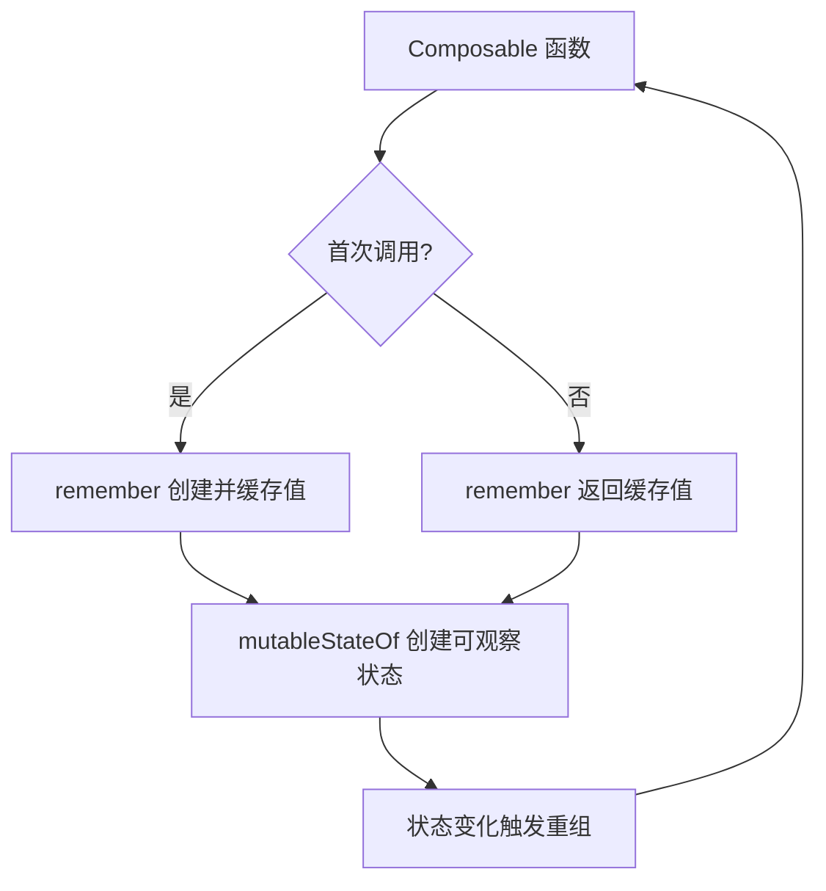
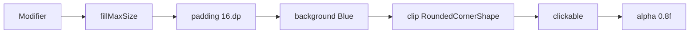
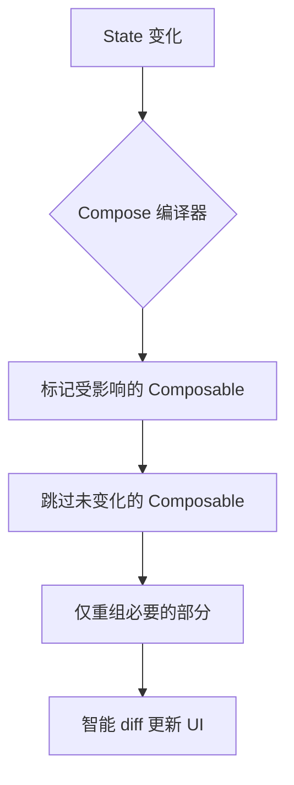
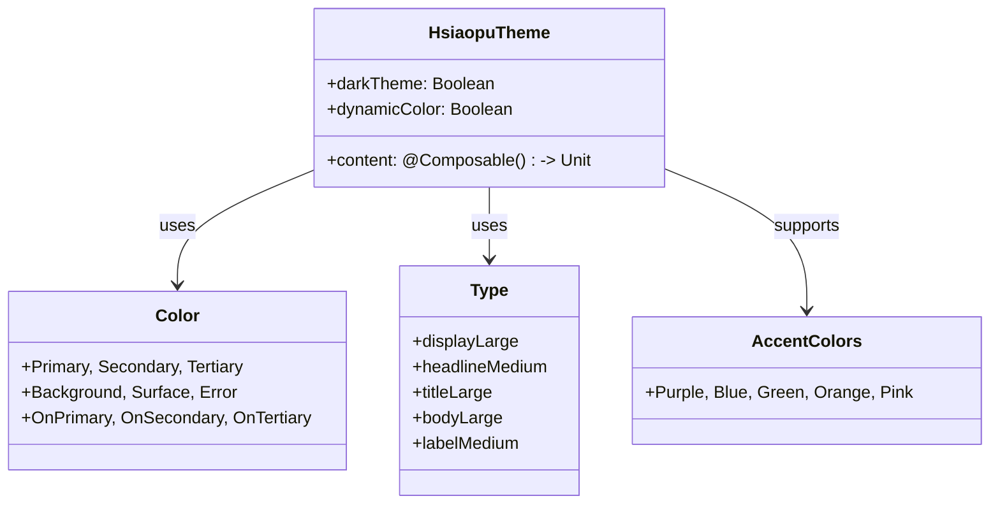
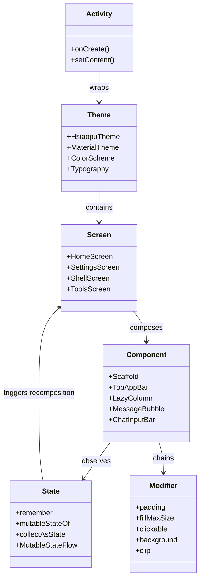

# 02 - Jetpack Compose 声明式 UI

> 结合 Hsiaopu 项目，深入理解 Compose 声明式 UI 的核心概念与实战技巧。

---

## 一、声明式 UI vs 命令式 UI

```mermaid
graph LR
    subgraph 命令式 UI (XML + findViewById)
        A1[XML 布局文件] --> A2[findViewById 获取 View]
        A2 --> A3[手动 setText / setVisibility]
        A3 --> A4[状态变化时逐个更新]
        A4 --> A5[代码冗长，易出错]
    end

    subgraph 声明式 UI (Compose)
        B1[@Composable 函数] --> B2[描述 UI 应该是什么样]
        B2 --> B3[状态变化自动重组]
        B3 --> B4[框架智能 diff 更新]
        B4 --> B5[代码简洁，不易出错]
    end
```

| 对比维度 | 命令式 UI | 声明式 UI |
|---------|----------|----------|
| 编程范式 | 描述"如何做" | 描述"是什么" |
| 状态管理 | 手动同步 | 自动重组 |
| 代码量 | 多（XML + Kotlin/Java） | 少（纯 Kotlin） |
| 性能 | 手动优化 | 框架智能 diff |
| 复用性 | 自定义 View | Composable 函数 |
| 预览 | XML Design 编辑器 | `@Preview` 注解 |

### 代码对比

**命令式：**
```java
TextView textView = findViewById(R.id.textView);
textView.setText("Hello World");
textView.setTextColor(Color.RED);
textView.setVisibility(count > 0 ? View.VISIBLE : View.GONE);
```

**声明式：**
```kotlin
@Composable
fun Greeting(name: String) {
    Text(
        text = "Hello $name",
        color = Color.Red
    )
}
```

---

## 二、Composable 函数与 @Preview

### 2.1 Composable 函数

```kotlin
// Compose 函数以 @Composable 注解标记
@Composable
fun Greeting(name: String, modifier: Modifier = Modifier) {
    Text(
        text = "Hello $name!",
        modifier = modifier.padding(16.dp),
        style = MaterialTheme.typography.headlineMedium
    )
}
```

**核心规则：**
- 必须用 `@Composable` 注解
- 只能从其他 Composable 函数中调用
- 没有返回值（返回 Unit）
- 幂等性：输入相同参数，输出相同 UI
- 可被多次调用（重组）

### 2.2 @Preview 多设备预览

```kotlin
// Hsiaopu 项目中的预览示例
@Preview(showBackground = true, widthDp = 1280)
@Composable
fun MainScreenPreview() {
    HsiaopuTheme {
        MainScreen()
    }
}

// 多设备预览
@Preview(name = "Phone", device = "spec:width=411dp,height=891dp")
@Preview(name = "Tablet", device = "spec:width=1280dp,height=800dp")
@Preview(name = "Dark Mode", uiMode = UI_MODE_NIGHT_YES)
@Composable
fun AdaptivePreview() {
    HsiaopuTheme {
        MainScreen()
    }
}
```

---

## 三、State 与 MutableState

### 3.1 remember 与 mutableStateOf



```kotlin
// 基础用法
@Composable
fun Counter() {
    var count by remember { mutableStateOf(0) }
    // 或: val count = remember { mutableStateOf(0) }

    Column {
        Text("Count: $count")
        Button(onClick = { count++ }) {
            Text("Increment")
        }
    }
}
```

### 3.2 Hsiaopu 中的状态管理

在 `HomeScreen.kt` 中，大量使用了 `remember` + `mutableStateOf`：

```kotlin
// HomeScreen.kt 部分代码
@Composable
fun HomeScreen(viewModel: ChatViewModel) {
    val uiState by viewModel.uiState.collectAsState() // Flow → State
    var inputText by remember { mutableStateOf("") }   // 本地 UI 状态
    var showDrawer by remember { mutableStateOf(false) }
    var showScrollToBottom by remember { mutableStateOf(false) }
    var deleteConfirmId by remember { mutableStateOf<Long?>(null) }

    // 输入框
    ChatInputBar(
        inputText = inputText,
        onInputChange = { inputText = it },
        isLoading = uiState.isLoading,
        onSend = {
            if (inputText.isNotBlank()) {
                viewModel.sendMessage(inputText.trim())
                inputText = ""
            }
        }
    )
}
```

### 3.3 状态提升（State Hoisting）

```kotlin
// ❌ 状态内聚，不可复用
@Composable
fun SelfContainedInput() {
    var text by remember { mutableStateOf("") }
    TextField(value = text, onValueChange = { text = it })
}

// ✔ 状态提升，可复用
@Composable
fun StatefulInput(text: String, onTextChange: (String) -> Unit) {
    TextField(value = text, onValueChange = onTextChange)
}
```

---

## 四、Modifier 链式调用



**Modifier 顺序至关重要：**

```kotlin
@Composable
fun ModifierOrder() {
    // ✔ padding 在外，background 在内
    Box(
        modifier = Modifier
            .padding(16.dp)          // 先应用 padding
            .background(Color.Blue)   // 再绘制背景
            .size(100.dp)
    )

    // ❌ 顺序反了：background 填满，padding 被 background 吃掉
    Box(
        modifier = Modifier
            .background(Color.Blue)
            .padding(16.dp)
            .size(100.dp)
    )
}
```

**Hsiaopu 中的 Modifier 实践：**

```kotlin
// HomeScreen.kt - 消息气泡
Surface(
    color = if (isUser) UserBubble else AssistantBubble,
    shape = RoundedCornerShape(
        topStart = 16.dp, topEnd = 16.dp,
        bottomStart = if (isUser) 16.dp else 4.dp,
        bottomEnd = if (isUser) 4.dp else 16.dp
    ),
    modifier = Modifier
        .widthIn(max = 320.dp)
        .combinedClickable(
            onClick = {},
            onLongClick = { showMenu = true }
        )
) {
    MarkdownText(content = message.content, modifier = Modifier.padding(12.dp))
}
```

---

## 五、重组（Recomposition）与性能优化

### 5.1 重组触发条件



### 5.2 性能优化技巧

```kotlin
// 1. 使用 key 参数避免不必要的重组
LazyColumn {
    items(uiState.messages, key = { "msg_${it.timestamp}" }) { message ->
        MessageBubble(message = message)
    }
}

// 2. 稳定类型（@Stable / @Immutable）
@Immutable
data class ChatMessage(
    val role: String,
    val content: String,
    val timestamp: Long = System.currentTimeMillis()
)

// 3. derivedStateOf 避免无效重组
val isScrolledToBottom by remember {
    derivedStateOf {
        listState.layoutInfo.visibleItemsInfo.lastOrNull()?.index
            == listState.layoutInfo.totalItemsCount - 1
    }
}

// 4. LaunchedEffect 控制副作用
LaunchedEffect(uiState.messages.size, uiState.streamingContent) {
    if (uiState.messages.isNotEmpty() || uiState.streamingContent.isNotEmpty()) {
        listState.animateScrollToItem(listState.layoutInfo.totalItemsCount - 1)
    }
}
```

---

## 六、常用组件

### 6.1 基础组件

```kotlin
// Hsiaopu 项目中使用的核心组件
@Composable
fun ComponentGallery() {
    Column(modifier = Modifier.padding(16.dp)) {
        // Text - 文本显示
        Text(
            text = "Hello Hsiaopu",
            style = MaterialTheme.typography.titleLarge,
            fontWeight = FontWeight.Bold,
            color = MaterialTheme.colorScheme.primary
        )

        // Button - 按钮
        Button(onClick = { /* action */ }) {
            Icon(Icons.Default.Send, contentDescription = null)
            Text("Send")
        }

        // OutlinedTextField - 输入框
        OutlinedTextField(
            value = "text",
            onValueChange = {},
            label = { Text("Message") },
            modifier = Modifier.fillMaxWidth(),
            shape = RoundedCornerShape(20.dp)
        )
    }
}
```

### 6.2 布局组件

```kotlin
// Column - 垂直布局
Column(
    modifier = Modifier.fillMaxSize(),
    verticalArrangement = Arrangement.spacedBy(8.dp)
) { /* children */ }

// Row - 水平布局
Row(
    modifier = Modifier.fillMaxWidth(),
    horizontalArrangement = Arrangement.SpaceBetween,
    verticalAlignment = Alignment.CenterVertically
) { /* children */ }

// Box - 叠加布局
Box(modifier = Modifier.fillMaxSize()) {
    LazyColumn(/* ... */) // 底层
    FloatingActionButton(/* ... */) // 上层
}

// LazyColumn - 高性能列表
LazyColumn(
    modifier = Modifier.fillMaxSize(),
    state = listState,
    contentPadding = PaddingValues(horizontal = 12.dp, vertical = 8.dp),
    verticalArrangement = Arrangement.spacedBy(8.dp)
) {
    items(messages, key = { it.timestamp }) { msg ->
        MessageBubble(message = msg)
    }
}
```

### 6.3 Scaffold 骨架

```kotlin
// Hsiaopu 的 PhoneLayout 使用 Scaffold
Scaffold(
    modifier = Modifier.fillMaxSize(),
    containerColor = MaterialTheme.colorScheme.background,
    bottomBar = {
        NavigationBar {
            navItems.forEach { item ->
                NavigationBarItem(
                    selected = selectedTab == item.index,
                    onClick = { selectedTab = item.index },
                    icon = { Icon(/* ... */) },
                    label = { Text(item.label) }
                )
            }
        }
    }
) { innerPadding ->
    Box(modifier = Modifier.padding(innerPadding)) {
        // 内容区域
    }
}
```

---

## 七、Material3 主题系统

### 7.1 Hsiaopu 主题架构



### 7.2 实际代码

```kotlin
// Theme.kt - 动态主题切换
@Composable
fun HsiaopuTheme(
    darkTheme: String = "dark",
    dynamicColor: Boolean = false,
    content: @Composable () -> Unit
) {
    val darkColorScheme = darkColorScheme(
        primary = AccentColors.Purple,
        secondary = Secondary,
        background = DarkBackground,
        surface = DarkSurface,
        onPrimary = OnPrimary,
        // ...
    )

    val lightColorScheme = lightColorScheme(
        primary = AccentColors.Purple,
        // ...
    )

    val colorScheme = when {
        darkTheme == "dark" -> darkColorScheme
        dynamicColor && Build.VERSION.SDK_INT >= Build.VERSION_CODES.S -> {
            // Material You 动态颜色
            val context = LocalContext.current
            if (darkTheme == "dark") dynamicDarkColorScheme(context)
            else dynamicLightColorScheme(context)
        }
        else -> lightColorScheme
    }

    MaterialTheme(
        colorScheme = colorScheme,
        typography = Typography,
        content = content
    )
}

// Color.kt - 自定义颜色常量
val DarkBackground = Color(0xFF121212)
val DarkSurface = Color(0xFF1E1E1E)
val UserBubble = Color(0xFF7C3AED)
val AssistantBubble = Color(0xFF2D2D2D)
val CodeBlockBg = Color(0xFF1A1A2E)
val SuccessGreen = Color(0xFF4CAF50)
val ErrorRed = Color(0xFFEF4444)

// Type.kt - 字体排版
val Typography = Typography(
    titleLarge = TextStyle(
        fontWeight = FontWeight.Bold,
        fontSize = 22.sp
    ),
    bodyLarge = TextStyle(
        fontSize = 16.sp,
        lineHeight = 24.sp
    )
)
```

---

## 八、Compose 架构总览



---

## 九、面试高频题

### Q1: Compose 的重组机制是什么？什么情况下会重组？

**答案：** 当 Compose 函数读取的 State 对象发生变化时，Compose 会智能地标记该函数及其调用链为"需要重组"，在下一帧只重新执行受影响的 Composable，跳过未变化的节点。

### Q2: remember 和 rememberSaveable 的区别？

- `remember`：数据在重组时保留，但在配置变更（旋转屏幕）或进程死亡后丢失
- `rememberSaveable`：数据通过 `Bundle` 序列化保存，在配置变更和进程死亡后都能恢复

### Q3: LaunchedEffect 和 SideEffect 的区别？

- `LaunchedEffect`：在 Composable 进入组合时启动协程，key 变化时重启，离开组合时取消
- `SideEffect`：每次重组后执行，无协程上下文，适合同步非 Compose 状态

### Q4: 为什么 Modifier 顺序很重要？

Modifier 链是**从外到内**依次应用的。例如 `padding` 在 `background` 之前，padding 区域不会被背景色覆盖；反之背景色会覆盖 padding 区域。

### Q5: 如何优化 Compose 性能？

1. 使用 `key` 参数精确标识列表项
2. 使用 `@Stable` / `@Immutable` 标记数据类
3. 使用 `derivedStateOf` 避免不必要的重组
4. 将大型 Composable 拆分为多个小函数
5. 使用 `remember` 缓存计算结果
6. 避免在 Composable 中直接读取可变集合

### Q6: Compose 如何与 View 系统互操作？

```kotlin
// Compose 中使用 AndroidView
@Composable
fun WebViewComposable(url: String) {
    AndroidView(factory = { context ->
        WebView(context).apply { loadUrl(url) }
    })
}

// View 中使用 ComposeView
class MyActivity : AppCompatActivity() {
    override fun onCreate(savedInstanceState: Bundle?) {
        super.onCreate(savedInstanceState)
        setContentView(R.layout.activity_main)
        findViewById<ComposeView>(R.id.compose_view).setContent {
            MyComposable()
        }
    }
}
```

---

## 十、总结

Jetpack Compose 通过**声明式编程范式**彻底改变了 Android UI 开发方式。在 Hsiaopu 项目中，从 MainActivity 的 `setContent` 入口，到各个 Screen 的 Composable 函数，再到 MessageBubble、ChatInputBar 等可复用组件，整个 UI 层都由 Compose 构建。掌握 Compose 的核心概念——State、Modifier、重组、主题系统——是成为现代 Android 开发者的必备技能。