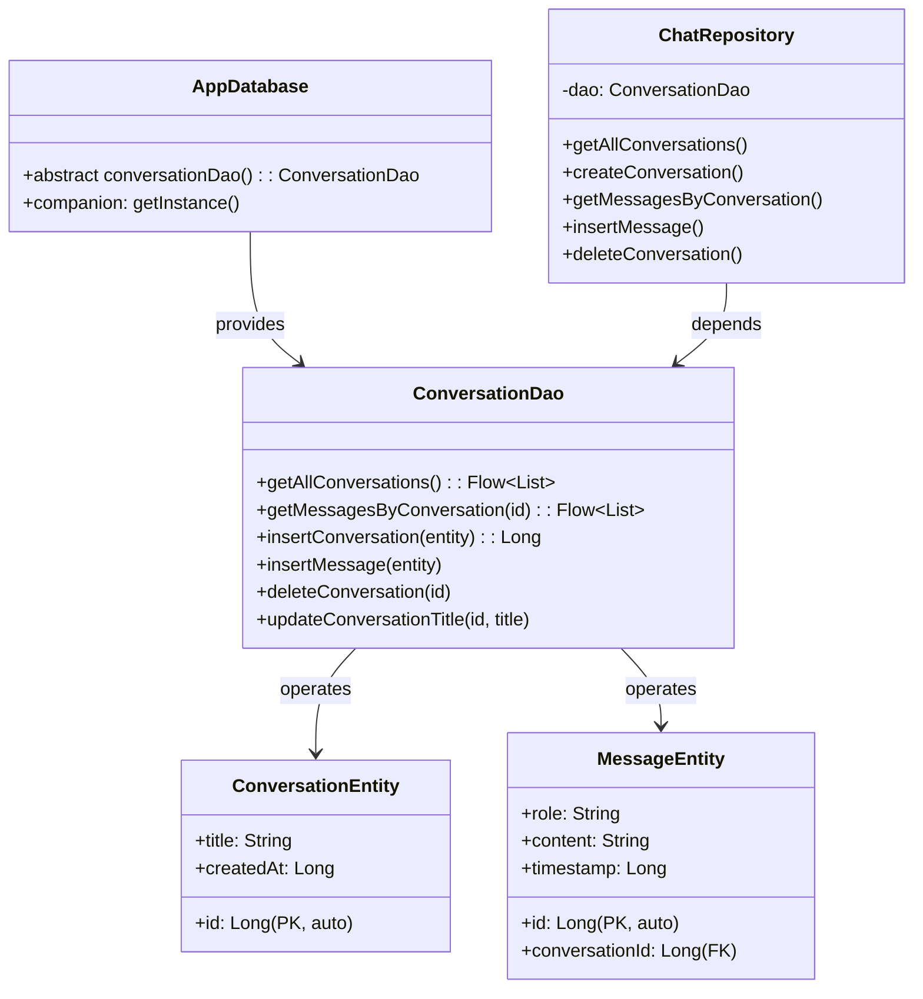
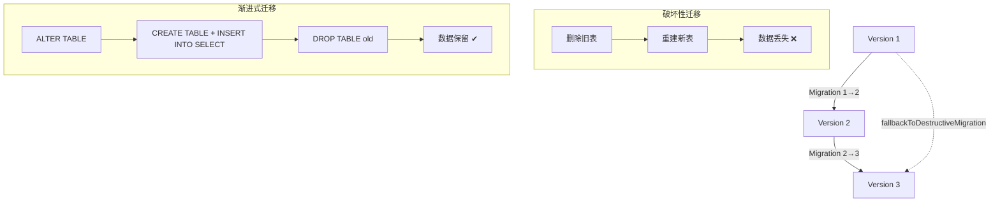
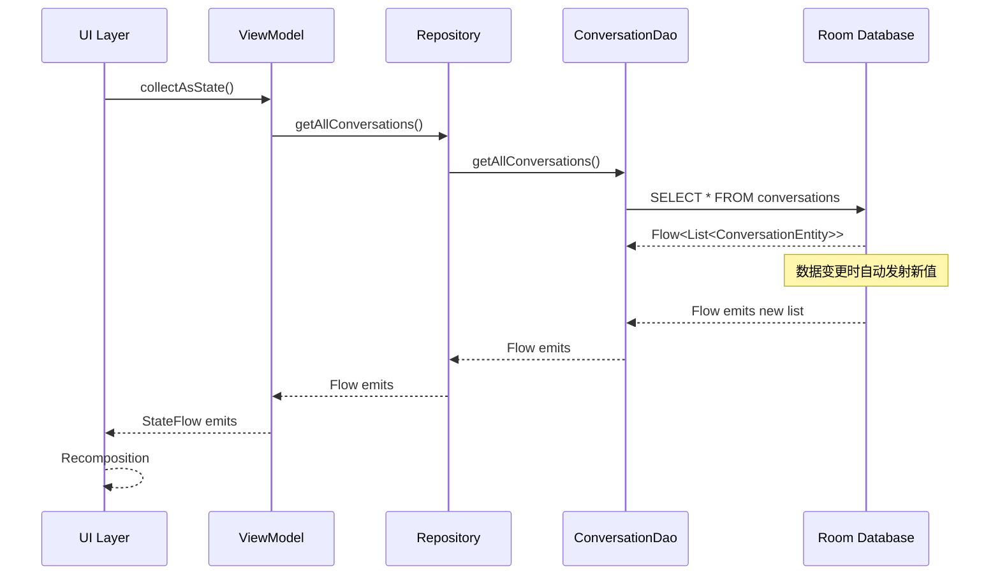
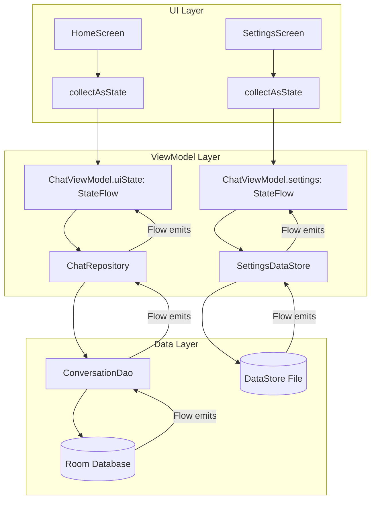
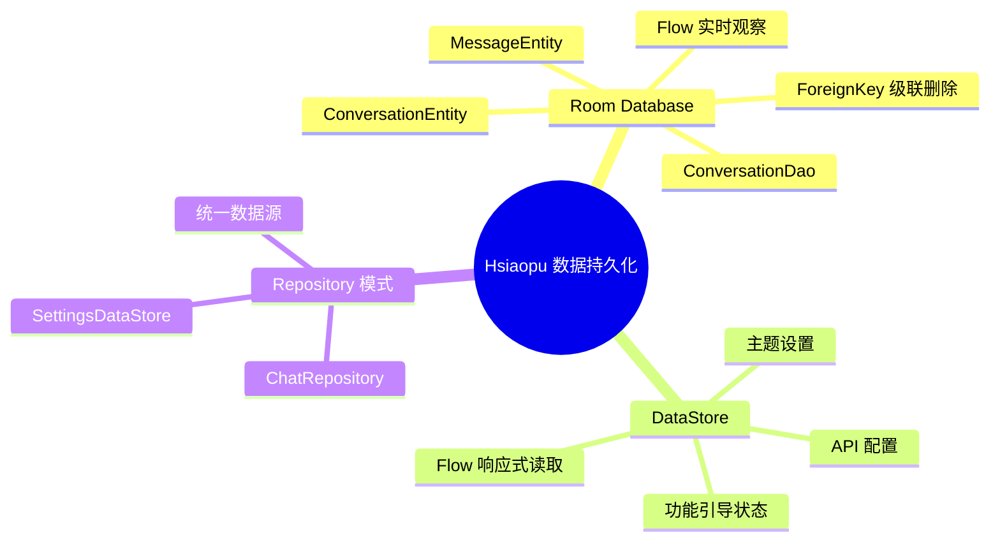

# 03 - 数据持久化：Room 与 DataStore

> 结合 Hsiaopu 项目的 ConversationEntity、MessageEntity、ConversationDao 和 SettingsDataStore，深度剖析 Android 数据持久化方案。

---

## 一、Room 架构概览



---

## 二、Entity 实体定义

### 2.1 ConversationEntity

```kotlin
// d:\Hsiaopu\app\src\main\java\com\example\hsiaopu\data\local\ConversationEntity.kt

@Entity(tableName = "conversations")
data class ConversationEntity(
    @PrimaryKey(autoGenerate = true)
    val id: Long = 0,
    val title: String = "New Conversation",
    val createdAt: Long = System.currentTimeMillis()
)
```

| 注解 | 说明 |
|------|------|
| `@Entity` | 声明为 Room 表，`tableName` 指定表名 |
| `@PrimaryKey` | 主键，`autoGenerate = true` 自动递增 |
| 默认值 | Room 插入时未指定字段使用 Kotlin 默认值 |

### 2.2 MessageEntity

```kotlin
// d:\Hsiaopu\app\src\main\java\com\example\hsiaopu\data\local\MessageEntity.kt

@Entity(
    tableName = "messages",
    foreignKeys = [
        ForeignKey(
            entity = ConversationEntity::class,
            parentColumns = ["id"],
            childColumns = ["conversationId"],
            onDelete = ForeignKey.CASCADE
        )
    ],
    indices = [Index(value = ["conversationId"])]
)
data class MessageEntity(
    @PrimaryKey(autoGenerate = true)
    val id: Long = 0,
    val conversationId: Long,
    val role: String,
    val content: String,
    val timestamp: Long = System.currentTimeMillis()
)
```

**关键设计：**
- `ForeignKey`：`conversationId` 引用 `conversations.id`，`onDelete = CASCADE` 删除会话时级联删除消息
- `Index`：为外键列创建索引，加速 JOIN 查询
- `role`：区分 `"user"` 和 `"assistant"` 消息

---

## 三、DAO 数据访问对象

### 3.1 ConversationDao 完整实现

```kotlin
// d:\Hsiaopu\app\src\main\java\com\example\hsiaopu\data\local\Daos.kt

@Dao
interface ConversationDao {

    // ========== 查询 ==========

    @Query("SELECT * FROM conversations ORDER BY createdAt DESC")
    fun getAllConversations(): Flow<List<ConversationEntity>>

    @Query("SELECT * FROM messages WHERE conversationId = :conversationId ORDER BY timestamp ASC")
    fun getMessagesByConversation(conversationId: Long): Flow<List<MessageEntity>>

    // ========== 插入 ==========

    @Insert
    suspend fun insertConversation(entity: ConversationEntity): Long

    @Insert
    suspend fun insertMessage(entity: MessageEntity)

    // ========== 更新 ==========

    @Query("UPDATE conversations SET title = :title WHERE id = :id")
    suspend fun updateConversationTitle(id: Long, title: String)

    // ========== 删除 ==========

    @Query("DELETE FROM conversations WHERE id = :id")
    suspend fun deleteConversation(id: Long)
}
```

### 3.2 注解详解

| 注解 | 用途 | 示例 |
|------|------|------|
| `@Query` | 自定义 SQL | `@Query("SELECT * FROM users WHERE age > :minAge")` |
| `@Insert` | 插入（返回 rowId） | `@Insert(onConflict = OnConflictStrategy.REPLACE)` |
| `@Update` | 按主键更新 | `@Update(entity = User::class)` |
| `@Delete` | 按主键删除 | `@Delete` |
| `@Transaction` | 事务包裹 | 配合 `@Query` 多表操作 |

### 3.3 关系型查询

```kotlin
// 一对多关系：Conversation → Messages
data class ConversationWithMessages(
    @Embedded val conversation: ConversationEntity,
    @Relation(
        parentColumn = "id",
        entityColumn = "conversationId"
    )
    val messages: List<MessageEntity>
)

@Transaction
@Query("SELECT * FROM conversations WHERE id = :id")
suspend fun getConversationWithMessages(id: Long): ConversationWithMessages?
```

---

## 四、AppDatabase 数据库定义

```kotlin
// d:\Hsiaopu\app\src\main\java\com\example\hsiaopu\data\local\AppDatabase.kt

@Database(
    entities = [ConversationEntity::class, MessageEntity::class],
    version = 1,
    exportSchema = false
)
abstract class AppDatabase : RoomDatabase() {
    abstract fun conversationDao(): ConversationDao

    companion object {
        @Volatile
        private var INSTANCE: AppDatabase? = null

        fun getInstance(context: Context): AppDatabase {
            return INSTANCE ?: synchronized(this) {
                Room.databaseBuilder(
                    context.applicationContext,
                    AppDatabase::class.java,
                    "hsiaopu_db"
                )
                    .fallbackToDestructiveMigration()
                    .build()
                    .also { INSTANCE = it }
            }
        }
    }
}
```

**设计要点：**
- `@Volatile` + `synchronized`：双重检查锁定（DCL）单例模式
- `fallbackToDestructiveMigration()`：开发阶段破坏性迁移，正式版应替换为 `addMigrations()`
- `exportSchema = false`：不导出 schema JSON（生产环境建议开启）

---

## 五、数据库迁移



```kotlin
// 渐进式迁移示例
val MIGRATION_1_2 = object : Migration(1, 2) {
    override fun migrate(db: SupportSQLiteDatabase) {
        db.execSQL("""
            ALTER TABLE conversations 
            ADD COLUMN lastMessage TEXT NOT NULL DEFAULT ''
        """)
    }
}

val MIGRATION_2_3 = object : Migration(2, 3) {
    override fun migrate(db: SupportSQLiteDatabase) {
        db.execSQL("""
            CREATE TABLE conversations_new (
                id INTEGER PRIMARY KEY AUTOINCREMENT,
                title TEXT NOT NULL DEFAULT 'New Conversation',
                createdAt INTEGER NOT NULL DEFAULT 0,
                lastMessage TEXT NOT NULL DEFAULT '',
                isPinned INTEGER NOT NULL DEFAULT 0
            )
        """)
        db.execSQL("""
            INSERT INTO conversations_new (id, title, createdAt, lastMessage)
            SELECT id, title, createdAt, lastMessage FROM conversations
        """)
        db.execSQL("DROP TABLE conversations")
        db.execSQL("ALTER TABLE conversations_new RENAME TO conversations")
    }
}

// 注册迁移
Room.databaseBuilder(context, AppDatabase::class.java, "hsiaopu_db")
    .addMigrations(MIGRATION_1_2, MIGRATION_2_3)
    .build()
```

---

## 六、Room 与 Flow 集成



**Hsiaopu 中的 Flow 集成：**

```kotlin
// ChatViewModel.kt
init {
    // 观察会话列表变化，自动更新 UI
    viewModelScope.launch {
        repository.getAllConversations().collect { conversations ->
            _uiState.update { it.copy(conversations = conversations) }
        }
    }
}

// 选中会话时观察消息变化
fun selectConversation(id: Long) {
    viewModelScope.launch {
        _uiState.update { it.copy(currentConversationId = id, error = null) }
        repository.getMessagesByConversation(id).collect { entities ->
            val messages = entities.map { ChatMessage(it.role, it.content, it.timestamp) }
            _uiState.update { it.copy(messages = messages) }
        }
    }
}
```

**优势：** 当数据库中的消息或会话发生变化时，UI 自动更新，无需手动刷新。

---

## 七、DataStore Preferences

### 7.1 SharedPreferences vs DataStore

| 对比维度 | SharedPreferences | DataStore Preferences |
|---------|-------------------|----------------------|
| API 类型 | 同步（可能在主线程读取） | 异步（Flow / suspend） |
| 线程安全 | 需手动处理 | 内置线程安全 |
| 错误处理 | 可能抛出 RuntimeException | 通过异常机制处理 |
| 类型安全 | 仅支持基本类型 | 支持 Protocol Buffers |
| 数据一致性 | 可能不一致 | 事务性，保证一致性 |
| 迁移 | 不支持 | 支持从 SharedPreferences 迁移 |

### 7.2 Hsiaopu 的 SettingsDataStore

```kotlin
// d:\Hsiaopu\app\src\main\java\com\example\hsiaopu\data\SettingsDataStore.kt

class SettingsDataStore @Inject constructor(
    @ApplicationContext private val context: Context
) {
    private val Context.dataStore by preferencesDataStore(name = "settings")

    companion object {
        val KEY_API_KEY = stringPreferencesKey("api_key")
        val KEY_API_ENDPOINT = stringPreferencesKey("api_endpoint")
        val KEY_MODEL_NAME = stringPreferencesKey("model_name")
        val KEY_SYSTEM_PROMPT = stringPreferencesKey("system_prompt")
        val KEY_TEMPERATURE = doublePreferencesKey("temperature")
        val KEY_MAX_TOKENS = intPreferencesKey("max_tokens")
        val KEY_PROVIDER_ID = stringPreferencesKey("provider_id")
        val KEY_DARK_THEME = stringPreferencesKey("dark_theme")
        val KEY_ACCENT_COLOR = stringPreferencesKey("accent_color")
        // 功能引导键
        val KEY_FEATURE_GUIDE = stringPreferencesKey("feature_guide")
    }

    // ========== 读取 ==========

    val settingsFlow: Flow<AppSettings> = context.dataStore.data.map { prefs ->
        AppSettings(
            apiKey = prefs[KEY_API_KEY] ?: "",
            apiEndpoint = prefs[KEY_API_ENDPOINT] ?: "https://api.deepseek.com/v1",
            modelName = prefs[KEY_MODEL_NAME] ?: "deepseek-chat",
            systemPrompt = prefs[KEY_SYSTEM_PROMPT] ?: "",
            temperature = prefs[KEY_TEMPERATURE] ?: 0.7,
            maxTokens = prefs[KEY_MAX_TOKENS] ?: 4096,
            providerId = prefs[KEY_PROVIDER_ID] ?: "deepseek"
        )
    }

    val themeSettingsFlow: Flow<ThemeSettings> = context.dataStore.data.map { prefs ->
        ThemeSettings(
            isDarkTheme = prefs[KEY_DARK_THEME] ?: "dark",
            accentColor = prefs[KEY_ACCENT_COLOR] ?: "purple"
        )
    }

    // ========== 写入 ==========

    suspend fun updateApiKey(key: String) {
        context.dataStore.edit { it[KEY_API_KEY] = key }
    }

    suspend fun updateApiEndpoint(endpoint: String) {
        context.dataStore.edit { it[KEY_API_ENDPOINT] = endpoint }
    }

    suspend fun updateModelName(model: String) {
        context.dataStore.edit { it[KEY_MODEL_NAME] = model }
    }

    suspend fun updateDarkTheme(isDark: String) {
        context.dataStore.edit { it[KEY_DARK_THEME] = isDark }
    }

    suspend fun updateAccentColor(color: String) {
        context.dataStore.edit { it[KEY_ACCENT_COLOR] = color }
    }

    // 功能引导持久化
    val featureGuideFlow: Flow<Set<String>> = context.dataStore.data.map { prefs ->
        prefs[KEY_FEATURE_GUIDE]?.split(",")?.toSet() ?: emptySet()
    }

    suspend fun markFeatureGuideSeen(key: String) {
        context.dataStore.edit { prefs ->
            val current = prefs[KEY_FEATURE_GUIDE]?.split(",")?.toMutableSet() ?: mutableSetOf()
            current.add(key)
            prefs[KEY_FEATURE_GUIDE] = current.joinToString(",")
        }
    }
}
```

### 7.3 ViewModel 层集成

```kotlin
// ChatViewModel.kt 中读取 DataStore
init {
    viewModelScope.launch {
        settingsDataStore.settingsFlow.collect { _settings.value = it }
    }
    viewModelScope.launch {
        settingsDataStore.themeSettingsFlow.collect { _themeSettings.value = it }
    }
}

// 更新 DataStore
fun updateApiKey(key: String) {
    _settings.update { it.copy(apiKey = key) }
    viewModelScope.launch { settingsDataStore.updateApiKey(key) }
}
```

---

## 八、Room 架构完整数据流



---

## 九、面试高频题

### Q1: Room 的 @Transaction 有什么作用？

确保多个数据库操作在同一个事务中执行，要么全部成功，要么全部回滚。常用于 `@Relation` 查询或需要原子性的多表操作。

### Q2: Room 如何处理数据库迁移？

通过 `Migration(startVersion, endVersion)` 定义迁移逻辑，使用 `addMigrations()` 注册。Room 按版本链依次执行迁移。

### Q3: Flow 返回的 Room 查询有什么优势？

- **实时性**：数据库变更时自动发射新数据
- **生命周期感知**：在 `viewModelScope` 中收集，自动管理订阅
- **线程安全**：Room 内部在后台线程执行查询

### Q4: DataStore 和 Room 有什么区别？何时用哪个？

| 场景 | 推荐方案 |
|------|---------|
| 键值对配置（设置、偏好） | DataStore |
| 结构化数据（列表、关系） | Room |
| 少量简单数据 | DataStore |
| 复杂查询、排序、过滤 | Room |
| 需要跨进程访问 | ContentProvider + Room |

### Q5: 如何在 Room 中实现模糊搜索？

```kotlin
@Query("SELECT * FROM conversations WHERE title LIKE '%' || :query || '%'")
fun searchConversations(query: String): Flow<List<ConversationEntity>>
```

### Q6: Hsiaopu 为什么用 `fallbackToDestructiveMigration()`？

开发阶段快速迭代，数据库结构频繁变更。正式发布前应替换为 `addMigrations()` 并编写迁移逻辑，保护用户数据。

---

## 十、总结

Hsiaopu 项目的数据持久化方案体现了 Android 官方推荐的最佳实践：

- **Room** 存储结构化数据（会话、消息），通过 `Flow` 实现实时响应
- **DataStore** 存储键值对配置（API Key、主题、引导状态），通过 `Flow` 实现响应式读取
- 两者通过 `ChatRepository` 和 `SettingsDataStore` 封装，在 `ChatViewModel` 中统一管理

