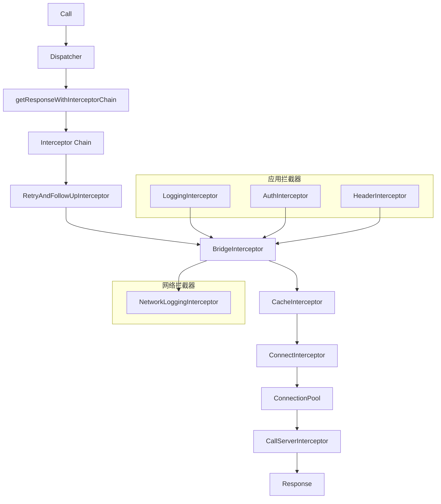
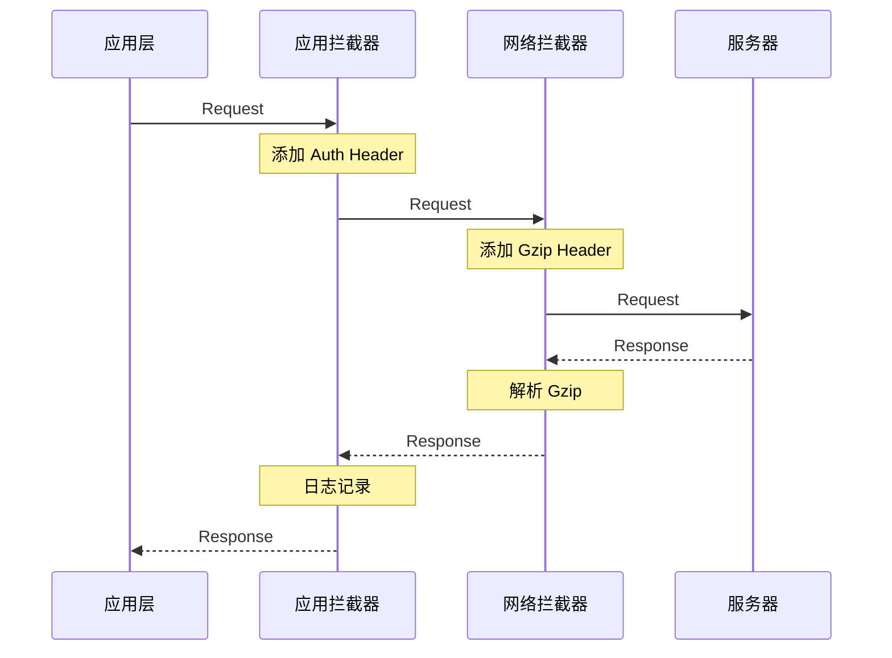
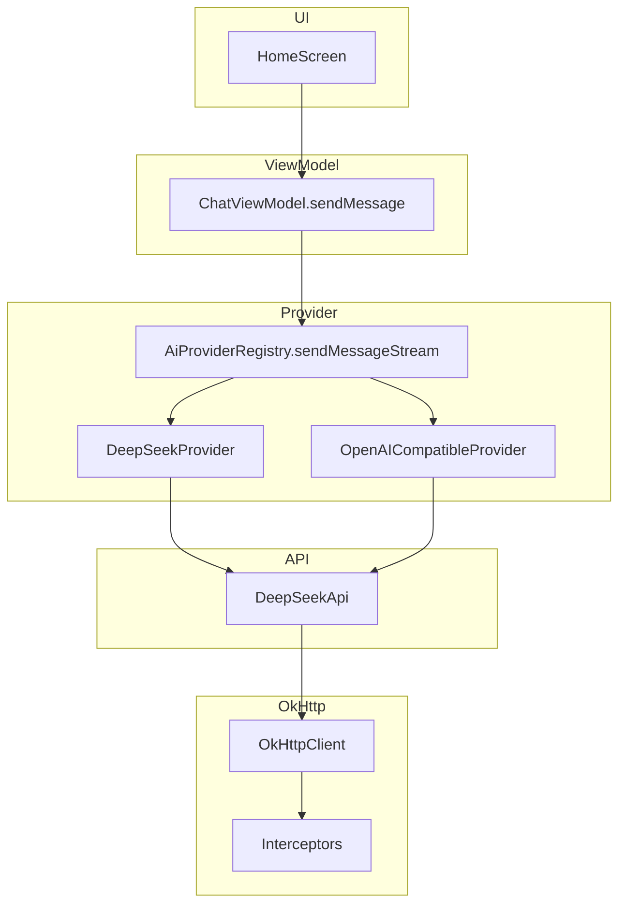
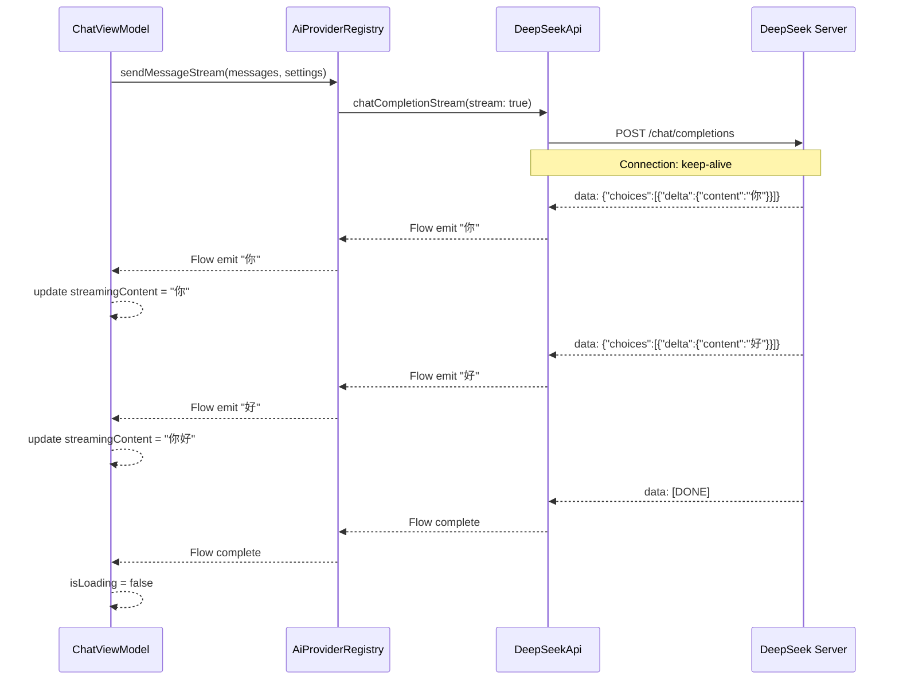
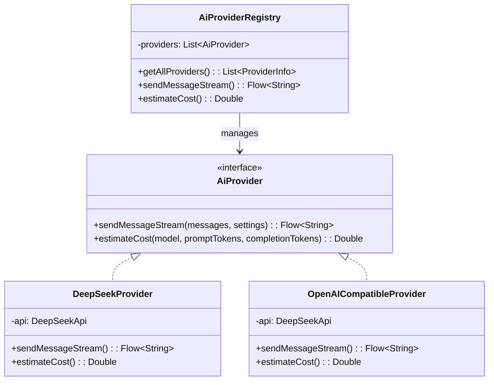
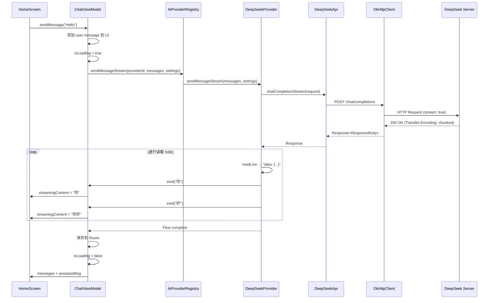

# 04 - 网络请求：OkHttp 与 Retrofit

> 结合 Hsiaopu 项目的 DeepSeekApi、DeepSeekProvider 和 SSE 流式解析，深入剖析 Android 网络层架构。

---

## 一、OkHttp 架构



### 1.1 核心组件

| 组件 | 职责 |
|------|------|
| **OkHttpClient** | 全局配置（超时、拦截器、连接池） |
| **Request** | HTTP 请求（URL、Headers、Body） |
| **Call** | 准备执行的请求 |
| **Dispatcher** | 管理并发请求（默认 64 个请求 / 5 个同主机） |
| **ConnectionPool** | 复用 TCP 连接（默认 5 个空闲连接，存活 5 分钟） |
| **Interceptor** | 拦截器链，处理请求/响应 |

### 1.2 拦截器链



**应用拦截器 vs 网络拦截器：**

| 特性 | 应用拦截器 | 网络拦截器 |
|------|-----------|-----------|
| 注册方式 | `addInterceptor()` | `addNetworkInterceptor()` |
| 重定向 | 不关心 | 可以看到重定向 |
| 缓存 | 可能命中缓存 | 始终看到网络请求 |
| 典型用途 | 日志、认证、Header | 网络监控、Stetho |

```kotlin
// 应用拦截器 - 添加认证头
val authInterceptor = Interceptor { chain ->
    val request = chain.request().newBuilder()
        .addHeader("Authorization", "Bearer $apiKey")
        .build()
    chain.proceed(request)
}

// 网络拦截器 - 日志
val loggingInterceptor = HttpLoggingInterceptor().apply {
    level = HttpLoggingInterceptor.Level.BODY
}
```

---

## 二、Retrofit 注解体系

### 2.1 请求方法注解

```kotlin
// Hsiaopu 项目的 DeepSeekApi 接口
interface DeepSeekApi {

    @POST("chat/completions")
    suspend fun chatCompletion(
        @Body request: ChatCompletionRequest
    ): Response<ChatCompletionResponse>

    @Streaming
    @POST("chat/completions")
    @Headers("Accept: text/event-stream")
    suspend fun chatCompletionStream(
        @Body request: ChatCompletionRequest
    ): Response<ResponseBody>
}
```

| 注解 | 用途 | 示例 |
|------|------|------|
| `@GET` | GET 请求 | `@GET("users/{id}")` |
| `@POST` | POST 请求 | `@POST("users")` |
| `@PUT` | PUT 请求 | `@PUT("users/{id}")` |
| `@DELETE` | DELETE 请求 | `@DELETE("users/{id}")` |
| `@PATCH` | PATCH 请求 | `@PATCH("users/{id}")` |
| `@HEAD` | HEAD 请求 | `@HEAD("users")` |
| `@HTTP` | 自定义方法 | `@HTTP(method = "PURGE", path = "...")` |

### 2.2 参数注解

```kotlin
interface ApiService {
    // @Path - URL 路径参数
    @GET("users/{id}/posts/{postId}")
    suspend fun getPost(
        @Path("id") userId: Long,
        @Path("postId") postId: Long
    ): Post

    // @Query - URL 查询参数
    @GET("users")
    suspend fun getUsers(
        @Query("page") page: Int,
        @Query("per_page") perPage: Int = 20
    ): List<User>

    // @QueryMap - 动态查询参数
    @GET("users")
    suspend fun getUsers(@QueryMap filters: Map<String, String>): List<User>

    // @Body - 请求体（JSON 序列化）
    @POST("users")
    suspend fun createUser(@Body user: User): User

    // @Header - 静态请求头
    @GET("users")
    @Headers("Cache-Control: max-age=640000")
    suspend fun getUsers(): List<User>

    // @Header - 动态请求头
    @GET("users")
    suspend fun getUsers(@Header("Authorization") token: String): List<User>

    // @Url - 动态 URL
    @GET
    suspend fun getUsers(@Url url: String): List<User>
}
```

### 2.3 Retrofit 构建

```kotlin
// Retrofit 实例构建
val retrofit = Retrofit.Builder()
    .baseUrl("https://api.deepseek.com/v1/")
    .client(okHttpClient)
    .addConverterFactory(GsonConverterFactory.create())
    .build()

val api = retrofit.create(DeepSeekApi::class.java)
```

---

## 三、Retrofit 与协程的集成

### 3.1 suspend 函数

```kotlin
// Retrofit 原生支持 suspend 函数
interface DeepSeekApi {
    @POST("chat/completions")
    suspend fun chatCompletion(
        @Body request: ChatCompletionRequest
    ): Response<ChatCompletionResponse>
}

// 调用示例
viewModelScope.launch {
    try {
        val response = api.chatCompletion(request)
        if (response.isSuccessful) {
            val body = response.body()
            // 处理响应
        }
    } catch (e: HttpException) {
        // HTTP 错误
    } catch (e: IOException) {
        // 网络错误
    }
}
```

### 3.2 Hsiaopu 的项目架构



---

## 四、SSE 流式解析详解

### 4.1 SSE 协议格式

```
data: {"id":"chatcmpl-xxx","choices":[{"delta":{"content":"你好"}}]}

data: {"id":"chatcmpl-xxx","choices":[{"delta":{"content":"，我是"}}]}

data: {"id":"chatcmpl-xxx","choices":[{"delta":{"content":"DeepSeek"}}]}

data: [DONE]
```

### 4.2 SSE 请求流程



### 4.3 Hsiaopu 的 SSE 解析实现

```kotlin
// DeepSeekProvider.kt - SSE 流式解析
class DeepSeekProvider @Inject constructor(
    private val api: DeepSeekApi
) : AiProvider {

    override fun sendMessageStream(
        messages: List<ChatMessage>,
        settings: AppSettings
    ): Flow<String> = flow {
        val request = ChatCompletionRequest(
            model = settings.modelName,
            messages = messages.map { it.toApiMessage() },
            stream = true,
            temperature = settings.temperature,
            maxTokens = settings.maxTokens
        )

        val response = api.chatCompletionStream(request)
        if (!response.isSuccessful) {
            throw Exception("HTTP ${response.code()}: ${response.errorBody()?.string()}")
        }

        val body = response.body() ?: throw Exception("Empty response body")
        val reader = body.charStream()
        var buffer = ""

        reader.useLines { lines ->
            lines.forEach { line ->
                // SSE 协议：每行以 "data: " 开头
                if (line.startsWith("data: ")) {
                    val data = line.removePrefix("data: ").trim()

                    // 流结束标志
                    if (data == "[DONE]") return@useLines

                    // 解析 JSON 片段
                    try {
                        val json = JSONObject(data)
                        val choices = json.getJSONArray("choices")
                        if (choices.length() > 0) {
                            val delta = choices.getJSONObject(0).getJSONObject("delta")
                            if (delta.has("content")) {
                                val content = delta.getString("content")
                                emit(content) // 发射文本片段
                            }
                        }
                    } catch (e: Exception) {
                        // 跳过解析失败的片段
                    }
                }
            }
        }
    }
}
```

**SSE 解析关键步骤：**

1. **逐行读取**：使用 `reader.useLines {}` 流式处理
2. **`data:` 前缀匹配**：过滤非数据行（如注释行 `: keep-alive`）
3. **`[DONE]` 检测**：流结束标志，立即退出循环
4. **JSON 解析**：提取 `choices[0].delta.content` 字段
5. **Flow 发射**：每个文本片段通过 `emit()` 发送给 UI

---

## 五、OkHttp 拦截器配置

### 5.1 Hsiaopu 的拦截器配置

```kotlin
// 实际项目中的 OkHttp 配置示例
val okHttpClient = OkHttpClient.Builder()
    .connectTimeout(30, TimeUnit.SECONDS)
    .readTimeout(0, TimeUnit.SECONDS)  // 流式响应无超时限制
    .writeTimeout(30, TimeUnit.SECONDS)
    .addInterceptor { chain ->
        // 应用拦截器：添加认证头
        val original = chain.request()
        val request = original.newBuilder()
            .header("Authorization", "Bearer $apiKey")
            .header("Content-Type", "application/json")
            .build()
        chain.proceed(request)
    }
    .addInterceptor(HttpLoggingInterceptor().apply {
        level = HttpLoggingInterceptor.Level.HEADERS
    })
    .connectionPool(ConnectionPool(5, 5, TimeUnit.MINUTES))
    .build()
```

### 5.2 拦截器实战

```kotlin
// 1. 重试拦截器
class RetryInterceptor(private val maxRetries: Int = 3) : Interceptor {
    override fun intercept(chain: Interceptor.Chain): Response {
        var retryCount = 0
        var response: Response
        do {
            response = chain.proceed(chain.request())
            if (response.isSuccessful || retryCount >= maxRetries) break
            retryCount++
        } while (true)
        return response
    }
}

// 2. 缓存拦截器
val cacheInterceptor = Interceptor { chain ->
    val response = chain.proceed(chain.request())
    val maxAge = 60 // 缓存 60 秒
    response.newBuilder()
        .header("Cache-Control", "public, max-age=$maxAge")
        .build()
}

// 3. 代理拦截器（Hsiaopu 代理脚本支持）
class ProxyInterceptor(private val proxyHost: String, private val proxyPort: Int) : Interceptor {
    override fun intercept(chain: Interceptor.Chain): Response {
        val original = chain.request()
        val proxyUrl = original.url.newBuilder()
            .host(proxyHost)
            .port(proxyPort)
            .build()
        val proxyRequest = original.newBuilder().url(proxyUrl).build()
        return chain.proceed(proxyRequest)
    }
}
```

---

## 六、AiProvider 抽象层



```kotlin
// AiProvider.kt - 抽象接口
data class ChatMessage(
    val role: String,        // "system" | "user" | "assistant"
    val content: String,
    val timestamp: Long = System.currentTimeMillis()
)

interface AiProvider {
    fun sendMessageStream(
        messages: List<ChatMessage>,
        settings: AppSettings
    ): Flow<String>

    fun estimateCost(
        model: String,
        promptTokens: Long,
        completionTokens: Long
    ): Double
}
```

---

## 七、完整网络请求流程



---

## 八、面试高频题

### Q1: OkHttp 的拦截器链是什么？应用拦截器和网络拦截器有什么区别？

OkHttp 通过拦截器链处理请求，顺序为：应用拦截器 → RetryAndFollowUp → Bridge → Cache → Connect → 网络拦截器 → CallServer。应用拦截器在重定向/缓存之前执行，网络拦截器在之后执行。

### Q2: Retrofit 如何实现动态 BaseUrl？

```kotlin
// 使用 @Url 注解
@GET
suspend fun dynamicRequest(@Url url: String): ResponseBody

// 使用拦截器
class BaseUrlInterceptor(private val urlProvider: () -> String) : Interceptor {
    override fun intercept(chain: Interceptor.Chain): Response {
        val original = chain.request()
        val newUrl = HttpUrl.parse(urlProvider())!!
        val request = original.newBuilder().url(newUrl).build()
        return chain.proceed(request)
    }
}
```

### Q3: SSE 和 WebSocket 有什么区别？

| 特性 | SSE | WebSocket |
|------|-----|-----------|
| 方向 | 单向（服务器→客户端） | 双向 |
| 协议 | HTTP | 独立协议 ws:// |
| 自动重连 | 内置 | 需手动实现 |
| 数据格式 | 纯文本 | 文本/二进制 |
| 适用场景 | 实时推送、流式响应 | 聊天、游戏 |

### Q4: 为什么 Hsiaopu 的 `readTimeout` 设为 0？

流式响应（SSE）可能持续数分钟，设置 `readTimeout = 0` 表示无限等待，避免因长时间无数据而超时断开连接。

### Q5: 如何处理网络请求的错误状态？

```kotlin
try {
    val response = api.chatCompletion(request)
    when {
        response.isSuccessful -> handleSuccess(response.body())
        response.code() == 401 -> handleUnauthorized()
        response.code() == 429 -> handleRateLimit()
        response.code() >= 500 -> handleServerError()
        else -> handleError(response.errorBody()?.string())
    }
} catch (e: IOException) {
    handleNetworkError(e)
}
```

### Q6: 如何实现请求缓存？

```kotlin
val cacheDir = File(context.cacheDir, "http_cache")
val cache = Cache(cacheDir, 10 * 1024 * 1024) // 10MB

val okHttpClient = OkHttpClient.Builder()
    .cache(cache)
    .addInterceptor { chain ->
        val response = chain.proceed(chain.request())
        response.newBuilder()
            .header("Cache-Control", "public, max-age=60")
            .build()
    }
    .build()
```

---

## 九、总结

Hsiaopu 的网络层设计体现了清晰的架构分层：

```mermaid
mindmap
  root((网络层架构))
    Retrofit
      DeepSeekApi 接口
      suspend 函数
      @Streaming 注解
      Gson 序列化
    OkHttp
      Interceptor 链
      ConnectionPool
      Timeout 配置
      HttpLoggingInterceptor
    SSE 流式解析
      逐行读取
      data: 前缀匹配
      [DONE] 检测
      JSON 增量解析
      Kotlin Flow 发射
    Provider 抽象
      AiProvider 接口
      DeepSeekProvider
      OpenAICompatibleProvider
      AiProviderRegistry
```