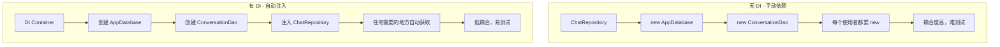
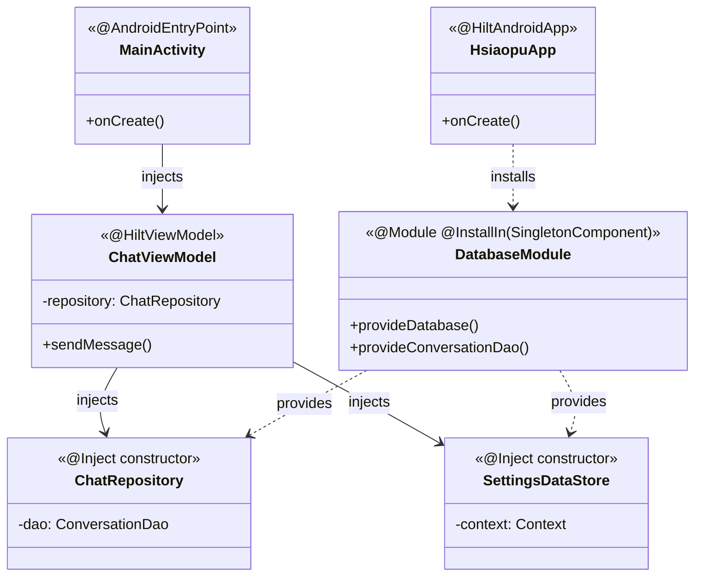
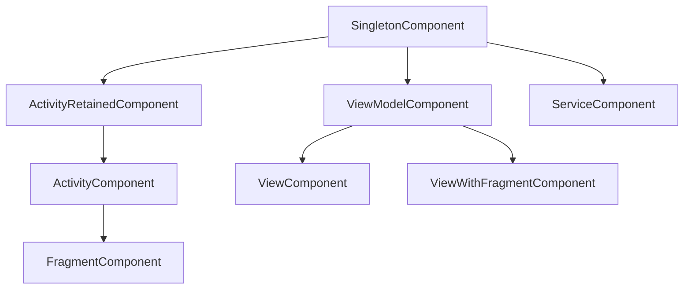
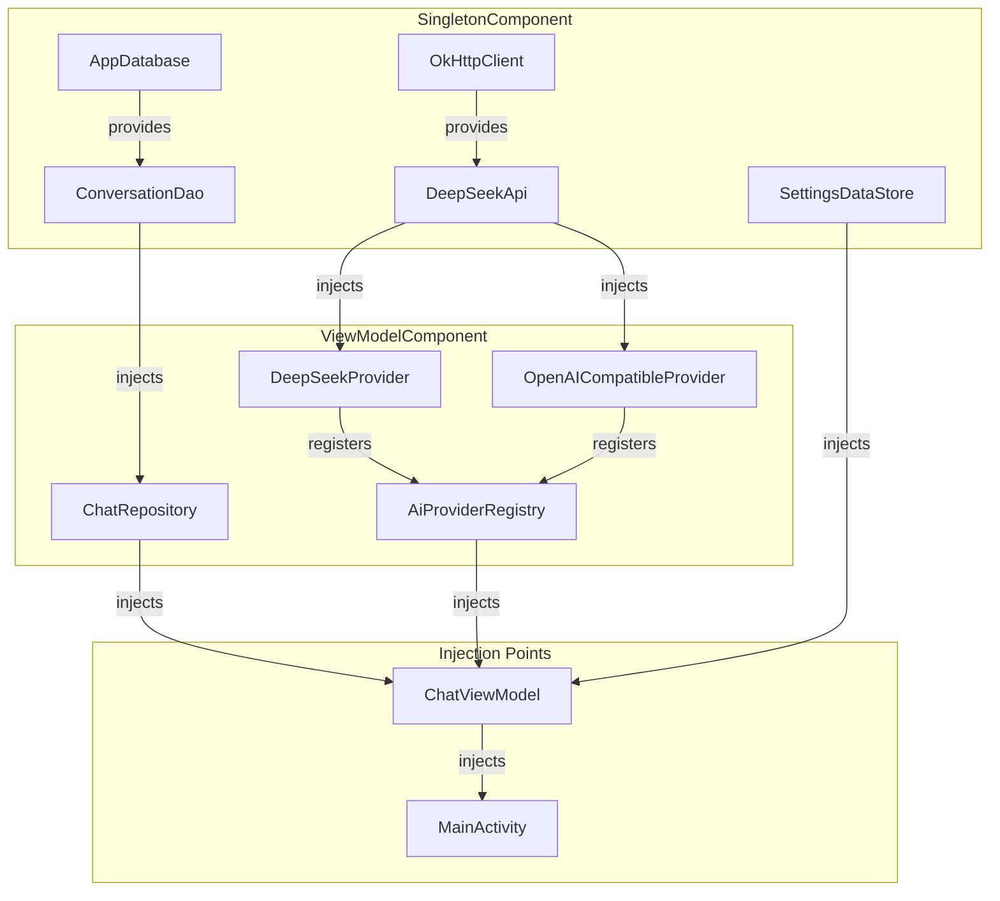
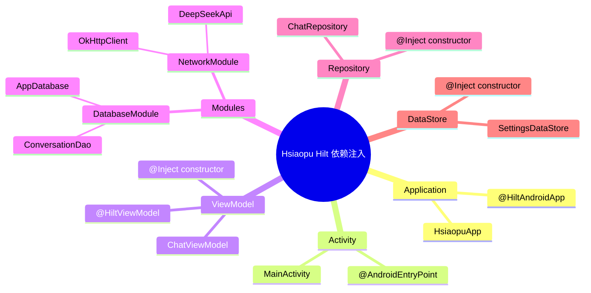

# 05 - 依赖注入：Hilt 与 Dagger

> 结合 Hsiaopu 项目的 HsiaopuApp、DatabaseModule、ChatRepository 等，深入剖析 Hilt 依赖注入。

---

## 一、依赖注入概念

### 1.1 什么是依赖注入？



**核心概念：**
- **DI（Dependency Injection）**：依赖注入，将对象的依赖关系交给外部容器管理
- **IoC（Inversion of Control）**：控制反转，让框架控制对象的创建和生命周期
- **为什么需要 DI？**：解耦、可测试、可维护、可扩展

### 1.2 代码对比

```kotlin
// ❌ 无 DI：手动创建依赖
class ChatViewModel : ViewModel() {
    private val db = AppDatabase.getInstance(context)
    private val dao = db.conversationDao()
    private val repository = ChatRepository(dao)
    // 问题：依赖硬编码，无法替换，难测试
}

// ✔ 有 DI：依赖注入
@HiltViewModel
class ChatViewModel @Inject constructor(
    private val repository: ChatRepository,
    private val providerRegistry: AiProviderRegistry,
    private val settingsDataStore: SettingsDataStore,
    @ApplicationContext private val context: Context
) : ViewModel() {
    // 依赖由 Hilt 自动提供，可替换，易测试
}
```

---

## 二、Dagger 基础

### 2.1 核心注解

```mermaid
graph TD
    subgraph Dagger 核心
        A[@Inject] --> B[标记构造函数]
        A --> C[标记字段]
        D[@Module] --> E[提供依赖实例]
        F[@Provides] --> E
        G[@Binds] --> E
        H[@Component] --> I[连接 Module 和注入点]
        J[@Singleton] --> K[单例作用域]
    end
```

### 2.2 代码示例

```kotlin
// 1. @Inject 标记构造函数
class ChatRepository @Inject constructor(
    private val dao: ConversationDao
) {
    // Dagger 知道如何创建 ChatRepository
}

// 2. @Module + @Provides - 提供第三方库实例
@Module
@InstallIn(SingletonComponent::class)
object DatabaseModule {

    @Provides
    @Singleton
    fun provideDatabase(@ApplicationContext context: Context): AppDatabase {
        return AppDatabase.getInstance(context)
    }

    @Provides
    fun provideConversationDao(database: AppDatabase): ConversationDao {
        return database.conversationDao()
    }
}

// 3. @Component - 连接依赖与注入点
@Singleton
@Component(modules = [DatabaseModule::class])
interface ApplicationComponent {
    fun inject(app: MyApplication)
}
```

---

## 三、Hilt 注解体系

### 3.1 Hilt 核心注解



### 3.2 注解详解

| 注解 | 用途 | 适用位置 |
|------|------|---------|
| `@HiltAndroidApp` | 触发 Hilt 代码生成，创建 Application 级组件 | Application |
| `@AndroidEntryPoint` | 标记可注入的 Android 组件 | Activity/Fragment/Service/BroadcastReceiver |
| `@HiltViewModel` | 标记 ViewModel，支持 `@Inject constructor` | ViewModel |
| `@Module` | 声明为 Hilt 模块 | Object/Class |
| `@InstallIn` | 指定模块安装到哪个组件 | 配合 `@Module` |
| `@Provides` | 提供实例（用于第三方库） | Module 方法 |
| `@Binds` | 绑定接口到实现 | Module 抽象方法 |
| `@Inject` | 标记构造函数或字段 | Constructor/Field |

### 3.3 Hsiaopu 项目中的 Hilt

```kotlin
// 1. Application 入口
// d:\Hsiaopu\app\src\main\java\com\example\hsiaopu\HsiaopuApp.kt
@HiltAndroidApp
class HsiaopuApp : Application() {
    override fun onCreate() {
        super.onCreate()
        // Hilt 在此自动初始化依赖图
    }
}

// 2. Activity 注入
// d:\Hsiaopu\app\src\main\java\com\example\hsiaopu\MainActivity.kt
@AndroidEntryPoint
class MainActivity : ComponentActivity() {
    // Hilt 自动注入依赖
    override fun onCreate(savedInstanceState: Bundle?) {
        installSplashScreen()
        super.onCreate(savedInstanceState)
        enableEdgeToEdge()
        setContent {
            HsiaopuTheme {
                MainScreen()
            }
        }
    }
}

// 3. ViewModel 注入
// d:\Hsiaopu\app\src\main\java\com\example\hsiaopu\viewmodel\ChatViewModel.kt
@HiltViewModel
class ChatViewModel @Inject constructor(
    private val repository: ChatRepository,
    private val providerRegistry: AiProviderRegistry,
    private val settingsDataStore: SettingsDataStore,
    @ApplicationContext private val context: Context
) : ViewModel()

// 4. DatabaseModule
// d:\Hsiaopu\app\src\main\java\com\example\hsiaopu\di\DatabaseModule.kt
@Module
@InstallIn(SingletonComponent::class)
object DatabaseModule {

    @Provides
    @Singleton
    fun provideDatabase(@ApplicationContext context: Context): AppDatabase {
        return AppDatabase.getInstance(context)
    }

    @Provides
    fun provideConversationDao(database: AppDatabase): ConversationDao {
        return database.conversationDao()
    }
}
```

---

## 四、作用域（Scopes）

### 4.1 Hilt 组件层级



| 作用域 | 组件 | 生命周期 |
|--------|------|---------|
| `@Singleton` | SingletonComponent | Application 整个生命周期 |
| `@ActivityRetainedScoped` | ActivityRetainedComponent | 配置变更期间存活 |
| `@ViewModelScoped` | ViewModelComponent | ViewModel 生命周期 |
| `@ActivityScoped` | ActivityComponent | Activity 生命周期 |
| `@FragmentScoped` | FragmentComponent | Fragment 生命周期 |
| `@ViewScoped` | ViewComponent | View 生命周期 |
| `@ServiceScoped` | ServiceComponent | Service 生命周期 |

### 4.2 作用域选择原则

```kotlin
// @Singleton - 全局单例
@Module
@InstallIn(SingletonComponent::class)
object DatabaseModule {
    @Provides
    @Singleton
    fun provideDatabase(@ApplicationContext context: Context): AppDatabase {
        // 整个应用只有一个数据库实例
        return AppDatabase.getInstance(context)
    }
}

// @ViewModelScoped - ViewModel 内共享
@Module
@InstallIn(ViewModelComponent::class)
object ViewModelModule {
    @Provides
    @ViewModelScoped
    fun provideChatRepository(dao: ConversationDao): ChatRepository {
        // 每个 ViewModel 有独立的 Repository 实例
        return ChatRepository(dao)
    }
}

// @ActivityScoped - Activity 内共享
@Module
@InstallIn(ActivityComponent::class)
object ActivityModule {
    @Provides
    @ActivityScoped
    fun provideClipboardManager(@ActivityContext context: Context): ClipboardManager {
        return context.getSystemService(ClipboardManager::class.java)
    }
}
```

---

## 五、Qualifier 限定符

```kotlin
// 当同一类型有多个实现时，用 Qualifier 区分

// 1. 定义 Qualifier
@Qualifier
@Retention(AnnotationRetention.BINARY)
annotation class DeepSeekApi

@Qualifier
@Retention(AnnotationRetention.BINARY)
annotation class OpenAICompatibleApi

// 2. Module 中使用
@Module
@InstallIn(SingletonComponent::class)
object NetworkModule {

    @DeepSeekApi
    @Provides
    @Singleton
    fun provideDeepSeekApi(client: OkHttpClient): DeepSeekApi {
        return Retrofit.Builder()
            .baseUrl("https://api.deepseek.com/v1/")
            .client(client)
            .build()
            .create(DeepSeekApi::class.java)
    }

    @OpenAICompatibleApi
    @Provides
    @Singleton
    fun provideOpenAICompatibleApi(client: OkHttpClient): DeepSeekApi {
        return Retrofit.Builder()
            .baseUrl("https://api.openai.com/v1/")
            .client(client)
            .build()
            .create(DeepSeekApi::class.java)
    }
}

// 3. 注入时指定
class DeepSeekProvider @Inject constructor(
    @DeepSeekApi private val api: DeepSeekApi
) : AiProvider { /* ... */ }

class OpenAICompatibleProvider @Inject constructor(
    @OpenAICompatibleApi private val api: DeepSeekApi
) : AiProvider { /* ... */ }
```

**内置 Qualifier：**

| Qualifier | 说明 |
|-----------|------|
| `@ApplicationContext` | 注入 Application Context |
| `@ActivityContext` | 注入 Activity Context |

---

## 六、Hilt 依赖关系图



---

## 七、Hilt 与 ViewModel 集成

```kotlin
// 1. Hilt 自动绑定 ViewModel
@HiltViewModel
class ChatViewModel @Inject constructor(
    private val repository: ChatRepository,
    // ...
) : ViewModel()

// 2. Compose 中获取
@Composable
fun MainScreen() {
    val chatViewModel: ChatViewModel = hiltViewModel()
    // 自动注入，无需手动创建
}

// 3. 构建依赖
// build.gradle.kts
plugins {
    id("com.google.dagger.hilt.android")
    id("com.google.devtools.ksp")
}

dependencies {
    implementation("com.google.dagger:hilt-android:2.51.1")
    ksp("com.google.dagger:hilt-compiler:2.51.1")
    implementation("androidx.hilt:hilt-navigation-compose:1.2.0")
}
```

---

## 八、面试高频题

### Q1: Dagger 和 Hilt 有什么区别？

| 特性 | Dagger | Hilt |
|------|--------|------|
| 学习曲线 | 陡峭 | 平缓 |
| 配置量 | 大量（Component、Subcomponent、Module） | 少量（标准注解） |
| Android 集成 | 手动 | 自动（@AndroidEntryPoint） |
| ViewModel 支持 | 需手动配置 | @HiltViewModel 一键 |
| 编译时 | 需要 | 需要 |
| 适用场景 | 复杂/非 Android 项目 | Android 标准项目 |

### Q2: @Provides 和 @Binds 的区别？

- `@Provides`：用于创建实例（有函数体），适用于第三方库或需要逻辑的创建
- `@Binds`：用于接口绑定（抽象方法），必须绑定到具体实现，更高效

```kotlin
@Module
@InstallIn(SingletonComponent::class)
abstract class BindingModule {
    @Binds
    @Singleton
    abstract fun bindAiProvider(deepSeekProvider: DeepSeekProvider): AiProvider
}
```

### Q3: Hilt 的作用域是什么？为什么需要作用域？

作用域控制依赖实例的生命周期。例如 `@Singleton` 确保整个应用只有一个数据库实例，`@ViewModelScoped` 确保每个 ViewModel 有独立的 Repository。作用域避免重复创建对象，减少内存开销。

### Q4: 为什么 Hsiaopu 使用 Hilt 而不是手动依赖注入？

1. **编译时安全**：依赖图在编译时验证，错误在编译期暴露
2. **减少样板代码**：无需手动传递依赖
3. **标准化**：Google 官方推荐，与 Jetpack 深度集成
4. **可测试**：轻松替换依赖为 Mock 实现

### Q5: Hilt 如何支持测试？

```kotlin
@HiltAndroidTest
class ChatViewModelTest {
    @get:Rule
    val hiltRule = HiltAndroidRule(this)

    @Inject
    lateinit var repository: ChatRepository

    @Before
    fun setup() {
        hiltRule.inject() // 注入测试依赖
    }

    @Test
    fun testSendMessage() {
        // 使用注入的依赖进行测试
    }
}
```

### Q6: @InstallIn 的组件选择原则？

- 依赖需要全局唯一 → `SingletonComponent`
- 依赖需要配置变更后存活 → `ActivityRetainedComponent`
- 依赖与 ViewModel 同生命周期 → `ViewModelComponent`
- 依赖需要 Activity Context → `ActivityComponent`

---

## 九、总结



Hilt 让 Hsiaopu 项目的依赖管理变得简洁、类型安全且易于测试。通过 `@HiltAndroidApp` → `@AndroidEntryPoint` → `@HiltViewModel` → `@Inject` 的链式注入，整个依赖图清晰可追溯。