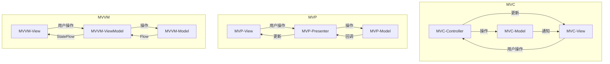
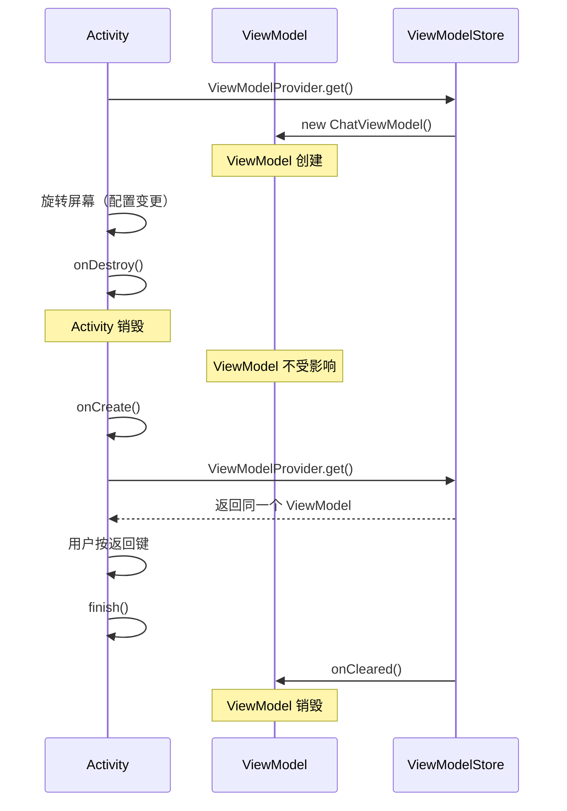
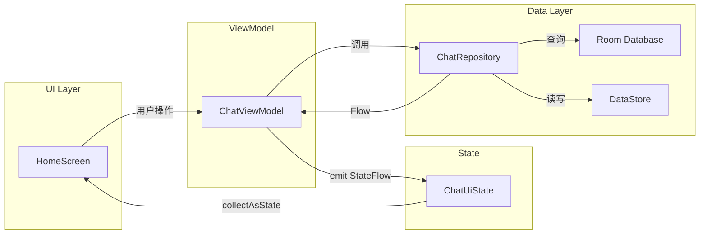
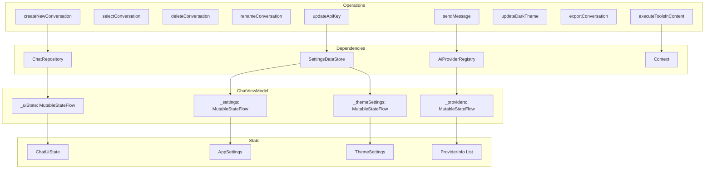
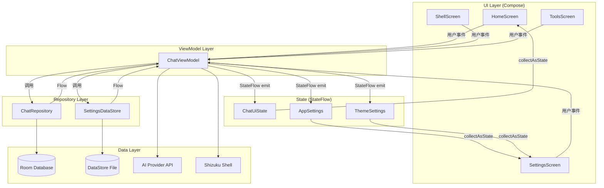
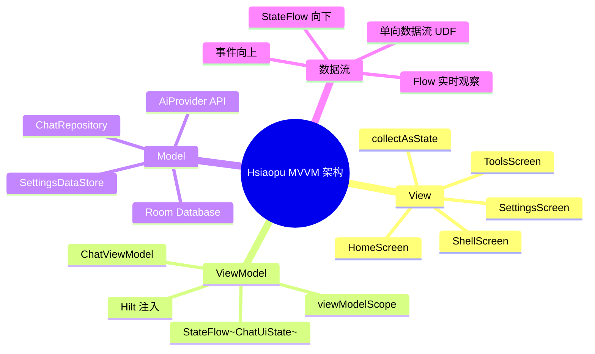

# 06 - MVVM 架构与 ViewModel

> 结合 Hsiaopu 项目的 ChatViewModel 完整分析，深入理解 MVVM 架构、单向数据流和 UI 状态管理。

---

## 一、MVC vs MVP vs MVVM



| 对比维度 | MVC | MVP | MVVM |
|---------|-----|-----|------|
| 核心思想 | Controller 协调 V 和 M | Presenter 驱动 V | ViewModel 驱动 V |
| View 依赖 | 依赖 Model | 依赖 Presenter | 只依赖 ViewModel |
| 通信方式 | 手动通知 | 接口回调 | 观察者模式（Flow/LiveData） |
| 测试难度 | 高（V 和 M 耦合） | 中（Mock Presenter） | 低（ViewModel 无 UI 依赖） |
| Android 适配 | 原生支持 | 需手动实现 | Android Jetpack 原生支持 |
| 生命周期 | 无感知 | 手动管理 | 自动感知 |

---

## 二、ViewModel 生命周期



**ViewModel 的关键特性：**

- **生命周期更长**：不受 Activity 重建（旋转屏幕）影响
- **自动清理**：Activity 真正销毁时（`finish()`）调用 `onCleared()`
- **不持有 View 引用**：避免内存泄漏
- **支持 `SavedStateHandle`**：进程被杀后恢复数据

---

## 三、单向数据流（UDF）



**UDF 核心原则：**
1. **状态向下流动**：ViewModel → UI State → Compose UI
2. **事件向上传递**：UI 事件 → ViewModel 方法 → Data Layer
3. **单一数据源**：UI 状态集中在 `ChatUiState` 中

---

## 四、UI 状态管理（密封类封装）

### 4.1 Hsiaopu 的 ChatUiState

```kotlin
// d:\Hsiaopu\app\src\main\java\com\example\hsiaopu\viewmodel\ChatViewModel.kt

data class ChatUiState(
    val conversations: List<ConversationEntity> = emptyList(),
    val currentConversationId: Long? = null,
    val messages: List<ChatMessage> = emptyList(),
    val isLoading: Boolean = false,
    val streamingContent: String = "",
    val error: String? = null,
    val tokenStats: UsageStats = UsageStats(),
    val isOnline: Boolean = true
)
```

**单一 State 对象的好处：**
- 所有 UI 状态集中管理，避免不一致
- 通过 `copy()` 原子更新，避免部分更新导致的状态错误
- 便于调试和日志记录

### 4.2 更规范的密封类方式

```kotlin
// 推荐：密封类封装 Loading / Success / Error
sealed class ChatUiState {
    data object Loading : ChatUiState()

    data class Success(
        val conversations: List<ConversationEntity>,
        val currentConversationId: Long?,
        val messages: List<ChatMessage>,
        val streamingContent: String = "",
        val tokenStats: UsageStats = UsageStats(),
        val isOnline: Boolean = true
    ) : ChatUiState()

    data class Error(
        val message: String,
        val conversations: List<ConversationEntity> = emptyList(),
        val messages: List<ChatMessage> = emptyList()
    ) : ChatUiState()
}

// UI 中使用
@Composable
fun ChatContent(state: ChatUiState) {
    when (state) {
        is ChatUiState.Loading -> LoadingScreen()
        is ChatUiState.Success -> ChatScreen(state)
        is ChatUiState.Error -> ErrorScreen(state.message)
    }
}
```

### 4.3 状态更新方式

```kotlin
// ChatViewModel 中的状态更新
private val _uiState = MutableStateFlow(ChatUiState())
val uiState: StateFlow<ChatUiState> = _uiState.asStateFlow()

// 1. 原子更新单个字段
_uiState.update { it.copy(isLoading = true) }

// 2. 原子更新多个字段
_uiState.update { it.copy(
    messages = it.messages + userMsg,
    isLoading = true,
    streamingContent = "",
    error = null
) }

// 3. 在 Compose 中收集
val uiState by chatViewModel.uiState.collectAsState()
```

---

## 五、LiveData vs StateFlow

| 对比维度 | LiveData | StateFlow |
|---------|----------|-----------|
| 生命周期感知 | 自动感知 | 需手动 `repeatOnLifecycle` |
| 初始值 | 可选 | 必须有初始值 |
| 线程安全 | 主线程更新 | 任意线程 |
| 操作符 | 有限的（map/switchMap） | 丰富的 Flow 操作符 |
| Compose 支持 | `observeAsState()` | `collectAsState()` |
| 粘性事件 | 是 | 是（需 SharedFlow 处理） |
| 推荐场景 | View 系统中维持 | Compose 中首选 |

```kotlin
// StateFlow 在 Compose 中
@Composable
fun HomeScreen(viewModel: ChatViewModel) {
    val uiState by viewModel.uiState.collectAsState()
    // 自动订阅，离开组合时自动取消
}

// StateFlow 在 View 系统中
class MainActivity : AppCompatActivity() {
    override fun onCreate(savedInstanceState: Bundle?) {
        super.onCreate(savedInstanceState)
        lifecycleScope.launch {
            repeatOnLifecycle(Lifecycle.State.STARTED) {
                viewModel.uiState.collect { state ->
                    // 更新 UI
                }
            }
        }
    }
}
```

---

## 六、SavedStateHandle

```kotlin
// 进程被杀后恢复状态
@HiltViewModel
class ChatViewModel @Inject constructor(
    private val savedStateHandle: SavedStateHandle,
    private val repository: ChatRepository
) : ViewModel() {

    // 保存到 SavedStateHandle
    fun saveDraft(draft: String) {
        savedStateHandle["draft"] = draft
    }

    // 从 SavedStateHandle 恢复
    val draft: String
        get() = savedStateHandle["draft"] ?: ""

    // 也可以保存复杂对象
    fun saveConversationId(id: Long) {
        savedStateHandle["convId"] = id
    }

    val currentConversationId: Long?
        get() = savedStateHandle.get<Long>("convId")
}
```

**SavedStateHandle vs onSaveInstanceState：**

| 特性 | SavedStateHandle | onSaveInstanceState |
|------|-----------------|---------------------|
| 使用位置 | ViewModel | Activity/Fragment |
| 数据大小限制 | 无严格限制 | Bundle 限制（~1MB） |
| 生命周期 | 进程死亡后恢复 | 配置变更 + 进程死亡 |
| 推荐场景 | ViewModel 中持久化 | 临时 UI 状态 |

---

## 七、Hsiaopu 的 ChatViewModel 完整分析



### 7.1 初始化流程

```kotlin
@HiltViewModel
class ChatViewModel @Inject constructor(
    private val repository: ChatRepository,
    private val providerRegistry: AiProviderRegistry,
    private val settingsDataStore: SettingsDataStore,
    @ApplicationContext private val context: Context
) : ViewModel() {

    /** 公开 DataStore 给 UI 层使用（功能引导持久化） */
    val dataStore: SettingsDataStore get() = settingsDataStore

    private val _uiState = MutableStateFlow(ChatUiState())
    val uiState: StateFlow<ChatUiState> = _uiState.asStateFlow()

    private val _settings = MutableStateFlow(AppSettings())
    val settings: StateFlow<AppSettings> = _settings.asStateFlow()

    private val _themeSettings = MutableStateFlow(ThemeSettings())
    val themeSettings: StateFlow<ThemeSettings> = _themeSettings.asStateFlow()

    private val _providers = MutableStateFlow<List<ProviderInfo>>(emptyList())
    val providers: StateFlow<List<ProviderInfo>> = _providers.asStateFlow()

    init {
        // ① 初始化 Provider 列表
        _providers.value = providerRegistry.getAllProviders()

        // ② 观察 DataStore 设置变化
        viewModelScope.launch {
            settingsDataStore.settingsFlow.collect { _settings.value = it }
        }
        viewModelScope.launch {
            settingsDataStore.themeSettingsFlow.collect { _themeSettings.value = it }
        }

        // ③ 观察数据库会话列表变化
        viewModelScope.launch {
            repository.getAllConversations().collect { conversations ->
                _uiState.update { it.copy(conversations = conversations) }
            }
        }

        // ④ 网络状态监控
        viewModelScope.launch {
            val cm = context.getSystemService(Context.CONNECTIVITY_SERVICE) as? ConnectivityManager
            while (true) {
                val caps = cm?.activeNetwork?.let { cm.getNetworkCapabilities(it) }
                _uiState.update { it.copy(isOnline = caps != null) }
                kotlinx.coroutines.delay(5000)
            }
        }
    }
}
```

### 7.2 发送消息流程

```kotlin
fun sendMessage(content: String) {
    val currentSettings = _settings.value
    val convId = _uiState.value.currentConversationId

    // ① 前置检查
    if (currentSettings.apiKey.isBlank()) {
        _uiState.update { it.copy(error = "Please set API Key in Settings") }
        return
    }
    if (!_uiState.value.isOnline) {
        _uiState.update { it.copy(error = "Network unavailable.") }
    }

    // ② 如果没有当前会话，自动创建
    if (convId == null) {
        viewModelScope.launch {
            val id = repository.createConversation(getConversationTitle(content))
            _uiState.update { it.copy(currentConversationId = id) }
            doSendWithTools(id, content, currentSettings)
        }
        return
    }

    doSendWithTools(convId, content, currentSettings)
}
```

### 7.3 工具调用流程

```kotlin
private fun doSendWithTools(convId: Long, content: String, settings: AppSettings) {
    // ① 添加用户消息到 UI
    val userMsg = ChatMessage(role = "user", content = content)
    _uiState.update { it.copy(
        messages = it.messages + userMsg,
        isLoading = true,
        streamingContent = "",
        error = null
    ) }

    // ② 持久化用户消息
    viewModelScope.launch {
        repository.insertMessage(MessageEntity(conversationId = convId, role = "user", content = content))
    }

    // ③ 发送流式请求
    viewModelScope.launch {
        try {
            // 构建消息列表（含系统提示词）
            val systemPrompt = buildToolSystemPrompt(settings.systemPrompt)
            val messages = buildList {
                add(ChatMessage(role = "system", content = systemPrompt))
                addAll(_uiState.value.messages)
            }

            // 第 1 轮：获取 AI 响应
            var fullContent = ""
            providerRegistry.sendMessageStream(settings.providerId, messages, settings).collect { chunk ->
                fullContent += chunk
                _uiState.update { it.copy(streamingContent = fullContent) }
            }

            // 解析并执行工具调用
            val (processedContent, toolResults) = executeToolsInContent(fullContent)

            // 如果有工具执行结果，第 2 轮让 AI 总结
            val finalContent = if (toolResults.isNotEmpty()) {
                // 将工具结果发回给 AI
                secondRoundWithTools(messages, processedContent, toolResults, settings)
            } else {
                processedContent
            }

            // ④ 持久化 AI 消息
            repository.insertMessage(MessageEntity(
                conversationId = convId, role = "assistant", content = finalContent
            ))

            // ⑤ 更新 UI
            val assistantMsg = ChatMessage(role = "assistant", content = finalContent)
            _uiState.update { it.copy(
                messages = it.messages + assistantMsg,
                isLoading = false,
                streamingContent = ""
            ) }
        } catch (e: Exception) {
            _uiState.update { it.copy(
                isLoading = false,
                streamingContent = "",
                error = e.message ?: "Network error"
            ) }
        }
    }
}
```

---

## 八、MVVM 数据流架构图



---

## 九、面试高频题

### Q1: ViewModel 为什么能在旋转屏幕后存活？

ViewModel 存储在 `ViewModelStore` 中，`ViewModelStore` 由 `Activity` 的 `NonConfigurationInstances` 持有。配置变更时，系统保存 `NonConfigurationInstances`，新建 Activity 时恢复，ViewModel 因此存活。

### Q2: ViewModel 和 onSaveInstanceState 的区别？

- **ViewModel**：处理配置变更（旋转屏幕），数据在内存中，进程死亡后丢失
- **onSaveInstanceState**：处理进程死亡，数据通过 Bundle 序列化到磁盘

### Q3: 为什么 ViewModel 不能持有 View 引用？

ViewModel 的生命周期比 View 长，持有 View 引用会导致内存泄漏。如果 View 在 ViewModel 存活期间被销毁，ViewModel 持有已销毁 View 的引用。

### Q4: StateFlow 和 SharedFlow 的区别？

| 特性 | StateFlow | SharedFlow |
|------|-----------|------------|
| 初始值 | 必须 | 可选 |
| 重放 | 1（当前值） | 可配置 replay |
| 粘性 | 是 | 可配置 |
| 去重 | 自动（equals） | 不自动 |
| 适用场景 | UI 状态 | 事件（Toast、导航） |

### Q5: 为什么 Hsiaopu 使用 `_uiState.update { it.copy(...) }` 而不是直接赋值？

`copy()` 创建新的不可变对象，`StateFlow` 通过 `equals()` 比较去重，只有值真正变化时才触发重组。此外，`copy()` 确保原子性更新，避免多线程环境下的竞态条件。

### Q6: MVVM 中 Repository 的职责是什么？

1. **统一数据源**：封装 Room、DataStore、网络等不同数据源
2. **数据转换**：将 Entity 转为 Domain Model
3. **缓存策略**：决定何时从网络获取、何时从本地获取
4. **解耦 ViewModel 和 Data Layer**：ViewModel 不关心数据来源

---

## 十、总结

