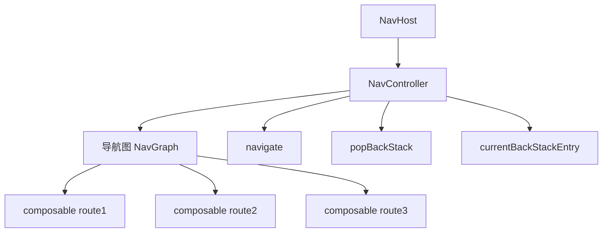
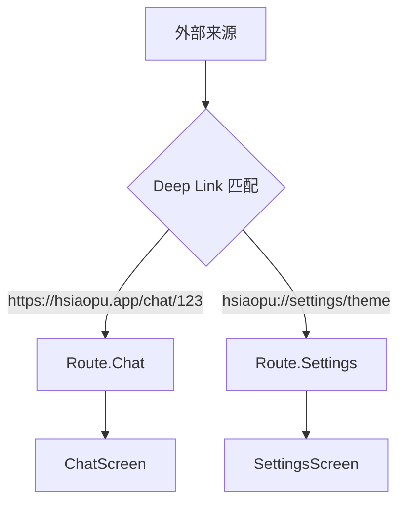
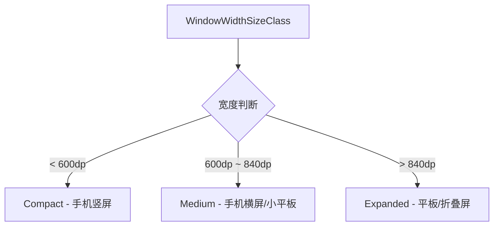
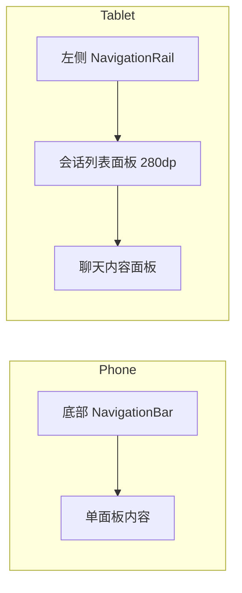
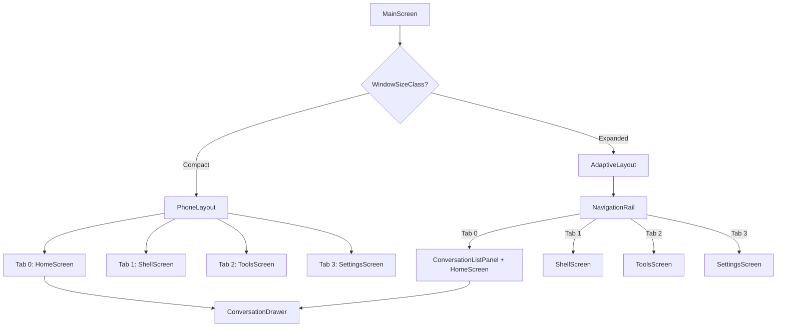
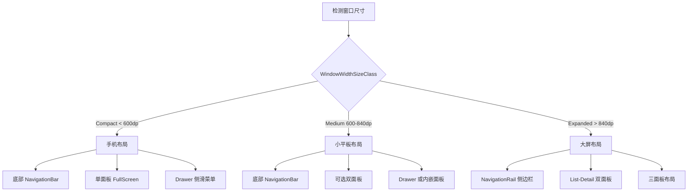
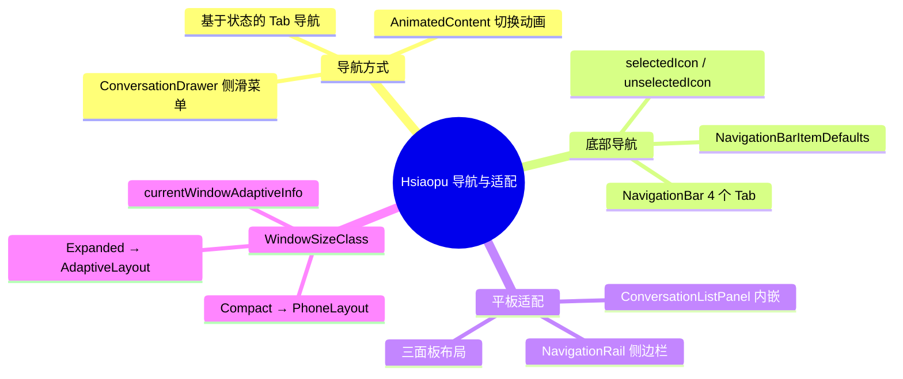

# 07 - Navigation 导航与自适应布局

> 结合 Hsiaopu 项目的底部导航、平板侧边栏和 Material3 Adaptive，深入理解 Navigation 与多设备适配。

---

## 一、Navigation Compose

### 1.1 核心概念



| 组件 | 职责 |
|------|------|
| **NavHost** | 导航宿主，关联 NavController 和 NavGraph |
| **NavController** | 导航控制器，执行导航操作 |
| **NavGraph** | 导航图，定义所有路由和参数 |
| **composable()** | 定义路由与 Composable 的映射 |
| **navigate()** | 导航到指定路由 |
| **popBackStack()** | 返回上一页 |

### 1.2 基本用法

```kotlin
@Composable
fun AppNavigation() {
    val navController = rememberNavController()

    NavHost(
        navController = navController,
        startDestination = "home"
    ) {
        composable("home") {
            HomeScreen(onNavigate = { navController.navigate("detail/$it") })
        }
        composable(
            route = "detail/{itemId}",
            arguments = listOf(navArgument("itemId") { type = NavType.IntType })
        ) { backStackEntry ->
            val itemId = backStackEntry.arguments?.getInt("itemId") ?: 0
            DetailScreen(itemId = itemId)
        }
    }
}
```

---

## 二、类型安全的导航参数传递

### 2.1 传统方式 vs 类型安全

```kotlin
// ❌ 传统方式：字符串拼接，易出错
navController.navigate("detail/$itemId?name=$name")

// ✔ 类型安全（Kotlin Serialization）
@Serializable
sealed class Route {
    @Serializable
    data object Home : Route()

    @Serializable
    data class Detail(val itemId: Int, val name: String) : Route()

    @Serializable
    data class Settings(val section: String = "general") : Route()
}

@Composable
fun AppNavigation() {
    val navController = rememberNavController()

    NavHost(
        navController = navController,
        startDestination = Route.Home
    ) {
        composable<Route.Home> {
            HomeScreen(onNavigate = {
                navController.navigate(Route.Detail(itemId = 123, name = "Test"))
            })
        }
        composable<Route.Detail> { backStackEntry ->
            val route: Route.Detail = backStackEntry.toRoute()
            DetailScreen(itemId = route.itemId, name = route.name)
        }
        composable<Route.Settings> { backStackEntry ->
            val route: Route.Settings = backStackEntry.toRoute()
            SettingsScreen(section = route.section)
        }
    }
}
```

### 2.2 Hsiaopu 的项目导航方式

Hsiaopu 使用**基于状态的导航**而非 NavHost，因为它的 Tab 结构简单，不需要复杂的导航栈：

```kotlin
// MainActivity.kt - 基于状态的 Tab 导航
@Composable
fun PhoneLayout(chatViewModel: ChatViewModel) {
    val navItems = listOf(
        BottomNavItem("对话", Icons.Filled.Chat, Icons.Outlined.Chat, 0),
        BottomNavItem("Shell", Icons.Filled.Terminal, Icons.Outlined.Terminal, 1),
        BottomNavItem("工具", Icons.Filled.Build, Icons.Outlined.Build, 2),
        BottomNavItem("设置", Icons.Filled.Settings, Icons.Outlined.Settings, 3)
    )

    var selectedTab by remember { mutableIntStateOf(0) }

    Scaffold(
        bottomBar = {
            NavigationBar {
                navItems.forEach { item ->
                    NavigationBarItem(
                        selected = selectedTab == item.index,
                        onClick = { selectedTab = item.index },
                        icon = { /* ... */ },
                        label = { Text(item.label) }
                    )
                }
            }
        }
    ) { innerPadding ->
        Box(modifier = Modifier.padding(innerPadding)) {
            when (selectedTab) {
                0 -> HomeScreen(viewModel = chatViewModel)
                1 -> ShellScreen(settingsDataStore = chatViewModel.dataStore)
                2 -> ToolsScreen(settingsDataStore = chatViewModel.dataStore)
                3 -> SettingsScreen(viewModel = chatViewModel)
            }
        }
    }
}
```

---

## 三、深层链接（Deep Link）



```kotlin
// 在 NavHost 中定义 Deep Link
composable(
    route = "chat/{conversationId}",
    arguments = listOf(
        navArgument("conversationId") { type = NavType.LongType }
    ),
    deepLinks = listOf(
        navDeepLink {
            uriPattern = "https://hsiaopu.app/chat/{conversationId}"
        },
        navDeepLink {
            uriPattern = "hsiaopu://chat/{conversationId}"
        }
    )
) { backStackEntry ->
    val conversationId = backStackEntry.arguments?.getLong("conversationId") ?: 0
    ChatScreen(conversationId = conversationId)
}

// AndroidManifest.xml 中声明
// <activity android:name=".MainActivity">
//     <intent-filter>
//         <action android:name="android.intent.action.VIEW" />
//         <category android:name="android.intent.category.DEFAULT" />
//         <category android:name="android.intent.category.BROWSABLE" />
//         <data android:scheme="https" android:host="hsiaopu.app" />
//     </intent-filter>
// </activity>
```

---

## 四、BottomNavigation 与 NavigationBar 集成

### 4.1 Hsiaopu 的底部导航

```kotlin
// 完整的底部导航实现
NavigationBar(
    containerColor = MaterialTheme.colorScheme.surface,
    contentColor = MaterialTheme.colorScheme.onSurface,
    tonalElevation = 0.dp
) {
    navItems.forEach { item ->
        NavigationBarItem(
            selected = selectedTab == item.index,
            onClick = { selectedTab = item.index },
            icon = {
                Icon(
                    imageVector = if (selectedTab == item.index)
                        item.selectedIcon else item.unselectedIcon,
                    contentDescription = item.label
                )
            },
            label = { Text(item.label) },
            colors = NavigationBarItemDefaults.colors(
                selectedIconColor = MaterialTheme.colorScheme.primary,
                selectedTextColor = MaterialTheme.colorScheme.primary,
                indicatorColor = MaterialTheme.colorScheme.primary.copy(alpha = 0.15f),
                unselectedIconColor = MaterialTheme.colorScheme.onSurfaceVariant,
                unselectedTextColor = MaterialTheme.colorScheme.onSurfaceVariant
            )
        )
    }
}
```

### 4.2 带动画的 Tab 切换

```kotlin
// Hsiaopu 使用 AnimatedContent 实现 Tab 切换动画
AnimatedContent(
    targetState = selectedTab,
    transitionSpec = {
        val direction = if (targetState > initialState) 80 else -80
        (slideInHorizontally { direction } + fadeIn()) togetherWith
            (slideOutHorizontally { -direction } + fadeOut())
    },
    label = "tab_content"
) { tab ->
    when (tab) {
        0 -> HomeScreen(viewModel = chatViewModel)
        1 -> ShellScreen(settingsDataStore = chatViewModel.dataStore)
        2 -> ToolsScreen(settingsDataStore = chatViewModel.dataStore)
        3 -> SettingsScreen(viewModel = chatViewModel)
    }
}
```

---

## 五、Material3 Adaptive

### 5.1 WindowSizeClass



```kotlin
// Hsiaopu 的响应式布局
@OptIn(ExperimentalMaterial3AdaptiveApi::class)
@Composable
fun MainScreen() {
    val adaptiveInfo = currentWindowAdaptiveInfo()
    val isExpanded = adaptiveInfo.windowSizeClass.windowWidthSizeClass
        == WindowWidthSizeClass.EXPANDED

    if (isExpanded) {
        AdaptiveLayout(chatViewModel = chatViewModel)
    } else {
        PhoneLayout(chatViewModel = chatViewModel)
    }
}
```

### 5.2 手机布局 vs 平板布局

```kotlin
// ======== 手机布局：底部导航 + 单面板 ========
@Composable
fun PhoneLayout(chatViewModel: ChatViewModel) {
    Scaffold(
        bottomBar = {
            NavigationBar { /* 4 个 Tab */ }
        }
    ) { innerPadding ->
        Box(modifier = Modifier.padding(innerPadding)) {
            // 单一内容区域
            when (selectedTab) {
                0 -> HomeScreen(viewModel = chatViewModel)
                1 -> ShellScreen(/* ... */)
                2 -> ToolsScreen(/* ... */)
                3 -> SettingsScreen(viewModel = chatViewModel)
            }
        }
    }
}

// ======== 平板布局：侧边导航 + 双面板 ========
@Composable
fun AdaptiveLayout(chatViewModel: ChatViewModel) {
    val uiState by chatViewModel.uiState.collectAsState()
    var selectedTab by remember { mutableIntStateOf(0) }

    Row(modifier = Modifier.fillMaxSize()) {
        // 左侧：NavigationRail（侧边导航栏）
        NavigationRail(
            modifier = Modifier.fillMaxHeight(),
            containerColor = MaterialTheme.colorScheme.surface
        ) {
            NavigationRailItem(
                selected = selectedTab == 0,
                onClick = { selectedTab = 0 },
                icon = { Icon(/* Chat */) },
                label = { Text("Chat") }
            )
            NavigationRailItem(/* Shell */)
            NavigationRailItem(/* Tools */)
            NavigationRailItem(/* Settings */)

            Spacer(modifier = Modifier.weight(1f))

            // 新建按钮
            NavigationRailItem(
                selected = false,
                onClick = { chatViewModel.createNewConversation() },
                icon = { Icon(Icons.Outlined.Add, contentDescription = "New") },
                label = { Text("New") }
            )
        }

        VerticalDivider(modifier = Modifier.fillMaxHeight())

        // 对话 Tab：三面板布局
        if (selectedTab == 0) {
            // 左侧：会话列表
            ConversationListPanel(
                conversations = uiState.conversations,
                currentId = uiState.currentConversationId,
                onSelect = { chatViewModel.selectConversation(it) },
                onDelete = { chatViewModel.deleteConversation(it) },
                onRename = { id, title -> chatViewModel.renameConversation(id, title) },
                onNewChat = { chatViewModel.createNewConversation() },
                modifier = Modifier.fillMaxHeight().width(280.dp)
            )
            VerticalDivider(modifier = Modifier.fillMaxHeight())
            // 右侧：聊天内容
            HomeScreen(viewModel = chatViewModel)
        } else {
            // 其他 Tab：单面板
            Box(modifier = Modifier.fillMaxSize()) {
                when (selectedTab) {
                    1 -> ShellScreen(/* ... */)
                    2 -> ToolsScreen(/* ... */)
                    3 -> SettingsScreen(viewModel = chatViewModel)
                }
            }
        }
    }
}
```

### 5.3 布局对比



---

## 六、导航路由图



---

## 七、NavigationRail 详解

```kotlin
// NavigationRail 是 Material3 的侧边导航组件
NavigationRail(
    modifier = Modifier.fillMaxHeight(),
    containerColor = MaterialTheme.colorScheme.surface,
    contentColor = MaterialTheme.colorScheme.onSurface
) {
    // 导航项
    NavigationRailItem(
        selected = selectedTab == 0,
        onClick = { selectedTab = 0 },
        icon = {
            Icon(
                imageVector = if (selectedTab == 0)
                    Icons.Filled.Chat else Icons.Outlined.Chat,
                contentDescription = "Chat"
            )
        },
        label = { Text("Chat") },
        colors = NavigationRailItemDefaults.colors(
            selectedIconColor = MaterialTheme.colorScheme.primary,
            selectedTextColor = MaterialTheme.colorScheme.primary,
            indicatorColor = MaterialTheme.colorScheme.primary.copy(alpha = 0.15f)
        )
    )
    // 更多导航项...

    // 弹性空间，将"新建"按钮推到底部
    Spacer(modifier = Modifier.weight(1f))

    // 底部操作按钮
    NavigationRailItem(
        selected = false,
        onClick = { chatViewModel.createNewConversation() },
        icon = { Icon(Icons.Outlined.Add, contentDescription = "New") },
        label = { Text("New") }
    )
}
```

---

## 八、手机 vs 平板/折叠屏布局适配

### 8.1 适配策略



### 8.2 实际代码中的适配

```kotlin
// Hsiaopu 的完整适配方案
@Composable
fun MainScreen() {
    val chatViewModel: ChatViewModel = hiltViewModel()
    val uiState by chatViewModel.uiState.collectAsState()
    val adaptiveInfo = currentWindowAdaptiveInfo()

    var showOnboarding by remember { mutableStateOf(true) }

    if (showOnboarding) {
        OnboardingScreen(onComplete = { showOnboarding = false })
        return
    }

    val isExpanded = adaptiveInfo.windowSizeClass.windowWidthSizeClass
        == WindowWidthSizeClass.EXPANDED

    if (isExpanded) {
        // 平板/折叠屏：NavigationRail + 多面板
        AdaptiveLayout(chatViewModel = chatViewModel)
    } else {
        // 手机：NavigationBar + 单面板 + Drawer
        PhoneLayout(chatViewModel = chatViewModel)
    }
}
```

### 8.3 会话列表的两种展示方式

```kotlin
// 手机：侧滑 Drawer
@Composable
fun ConversationDrawer(
    showDrawer: Boolean,
    conversations: List<ConversationEntity>,
    onDismiss: () -> Unit,
    // ...
) {
    if (!showDrawer) return
    Box(modifier = Modifier.fillMaxSize().clickable(onClick = onDismiss)) {
        Surface(
            modifier = Modifier.fillMaxHeight().fillMaxWidth(0.78f),
            tonalElevation = 8.dp
        ) {
            ConversationListPanel(/* ... */)
        }
    }
}

// 平板：内嵌面板
@Composable
fun ConversationListPanel(
    conversations: List<ConversationEntity>,
    currentId: Long?,
    modifier: Modifier = Modifier
) {
    Column(modifier = modifier) {
        // 搜索栏 + 会话列表
        OutlinedTextField(/* 搜索 */)
        LazyColumn {
            items(filtered, key = { it.id }) { conv ->
                // 会话项
            }
        }
    }
}
```

---

## 九、面试高频题

### Q1: Navigation Compose 和传统 Fragment Navigation 有什么区别？

| 特性 | Navigation Compose | Fragment Navigation |
|------|-------------------|---------------------|
| 目标 | Composable | Fragment |
| 类型安全 | 支持（Kotlin Serialization） | 需手动处理 |
| 生命周期 | 无需管理 | 需管理 Fragment 生命周期 |
| Deep Link | 原生支持 | 原生支持 |
| 动画 | Compose Animation | Transition API |

### Q2: 如何在 Navigation 中传递复杂对象？

```kotlin
// 方法1：类型安全路由（推荐）
@Serializable
data class Route(val id: Int, val name: String, val data: String)

// 方法2：通过 ViewModel 共享（同一 Activity 内）
// 方法3：使用 SavedStateHandle 传递
```

### Q3: WindowSizeClass 的三个级别分别是什么？

- **Compact**（< 600dp）：手机竖屏
- **Medium**（600dp ~ 840dp）：手机横屏、小平板
- **Expanded**（> 840dp）：大平板、折叠屏展开态

### Q4: 为什么要区分 PhoneLayout 和 AdaptiveLayout？

不同屏幕尺寸需要不同的交互模式：
- 手机：底部导航 + 侧滑抽屉，节省空间
- 平板：侧边导航栏 + 双面板，充分利用大屏空间

### Q5: NavigationRail 和 NavigationBar 有什么区别？

| 特性 | NavigationRail | NavigationBar |
|------|---------------|---------------|
| 位置 | 侧边（左侧/右侧） | 底部 |
| 方向 | 垂直 | 水平 |
| 适用场景 | 大屏（平板） | 小屏（手机） |
| 标签位置 | 图标下方 | 图标下方 |
| Material3 推荐 | Expanded 宽度 | Compact 宽度 |

### Q6: 如何实现折叠屏的状态适配？

```kotlin
@Composable
fun FoldableAwareLayout() {
    val windowInfo = currentWindowAdaptiveInfo()
    val isBookPosture = windowInfo.windowPosture.isTabletop

    if (isBookPosture) {
        // 书本模式：双面板
        Row { /* 左侧面板 + 右侧面板 */ }
    } else {
        // 普通模式：单面板
        Column { /* 单面板 */ }
    }
}
```

---

## 十、总结

Hsiaopu 的导航和自适应布局方案展示了现代 Android 应用的最佳实践：

