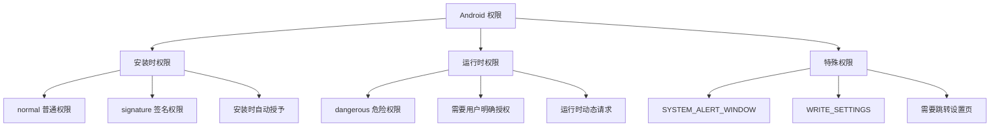
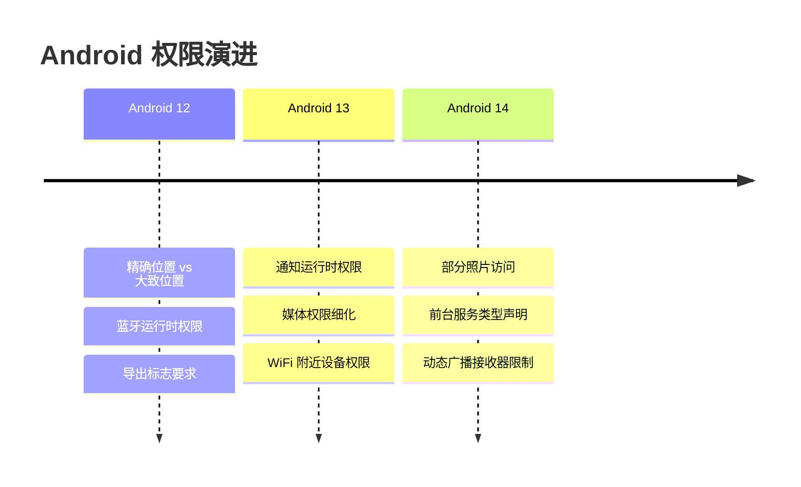
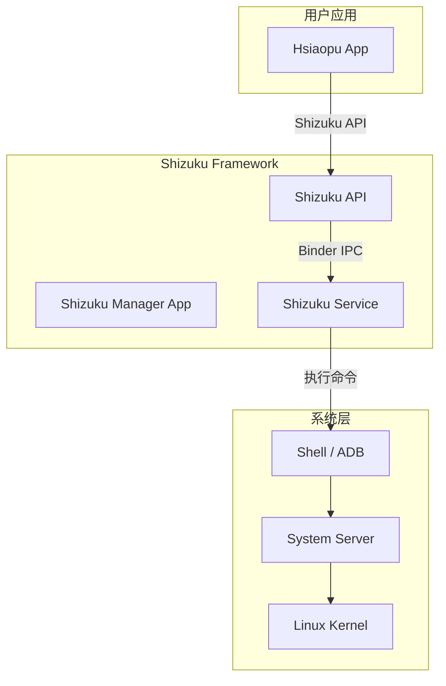
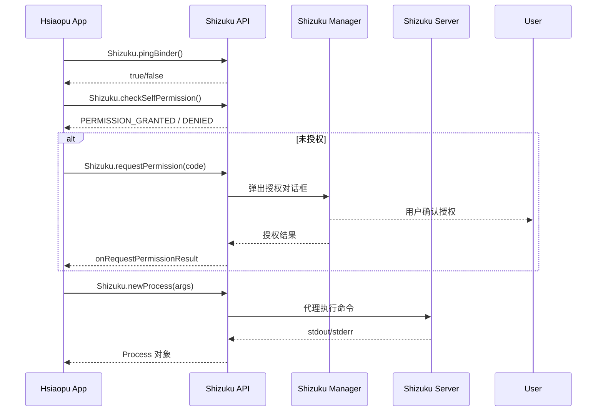
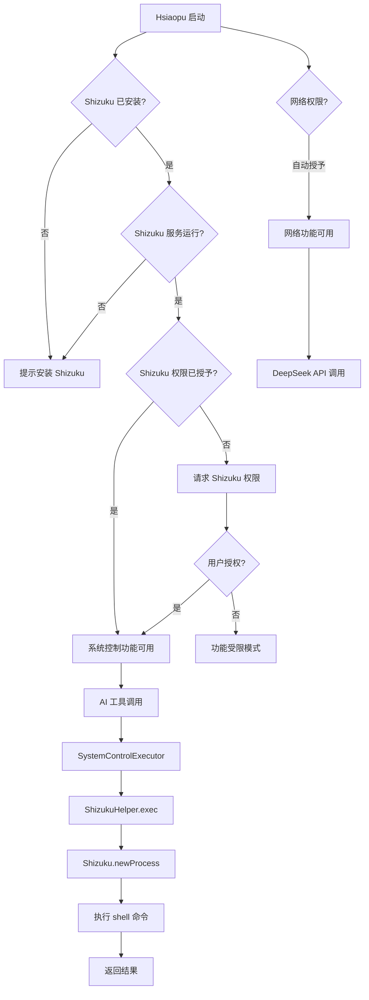
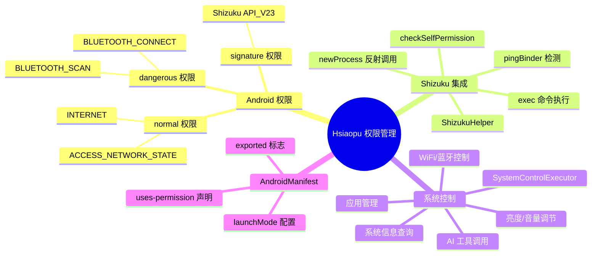

# 08 - 权限管理与系统 API

> 结合 Hsiaopu 项目的 AndroidManifest 权限声明、ShizukuHelper、SystemControlExecutor 和 ToolsScreen，深入理解 Android 权限机制。

---

## 一、Android 权限机制

### 1.1 权限分类



### 1.2 权限保护级别

| 级别 | 描述 | 示例 | 授权方式 |
|------|------|------|---------|
| **normal** | 低风险，不影响用户隐私 | `INTERNET`、`ACCESS_NETWORK_STATE` | 安装时自动授予 |
| **dangerous** | 高风险，涉及隐私数据 | `CAMERA`、`LOCATION`、`READ_CONTACTS` | 运行时弹窗请求 |
| **signature** | 仅同签名应用可获取 | 系统级 API | 签名匹配自动授予 |
| **signatureOrSystem** | 签名或系统应用 | `WRITE_SECURE_SETTINGS` | 签名或预装应用 |

---

## 二、运行时权限请求

### 2.1 权限请求流程

```mermaid
graph TD
    A[发起权限请求] --> B{权限已授予?}
    B -->|是| C[执行敏感操作]
    B -->|否| D{用户之前拒绝过?}
    D -->|否| E[弹出系统权限对话框]
    D -->|是| F{shouldShowRationale?}
    F -->|true| G[展示解释对话框]
    G --> H{用户确认?}
    H -->|是| E
    H -->|否| I[操作取消]
    F -->|false| J[用户勾选"不再询问"]
    J --> K[引导用户到设置页]
    E --> L{用户选择}
    L -->|允许| C
    L -->|拒绝| I
```

### 2.2 ActivityResultContracts

```kotlin
// 方式一：单个权限请求
class MainActivity : ComponentActivity() {

    private val requestPermissionLauncher = registerForActivityResult(
        ActivityResultContracts.RequestPermission()
    ) { isGranted ->
        if (isGranted) {
            // 权限已授予，执行操作
            openCamera()
        } else {
            // 权限被拒绝，提示用户
            showPermissionDeniedMessage()
        }
    }

    private fun requestCameraPermission() {
        when {
            ContextCompat.checkSelfPermission(
                this, Manifest.permission.CAMERA
            ) == PackageManager.PERMISSION_GRANTED -> {
                openCamera()
            }
            shouldShowRequestPermissionRationale(Manifest.permission.CAMERA) -> {
                // 展示解释对话框
                showRationaleDialog("需要相机权限来拍照") {
                    requestPermissionLauncher.launch(Manifest.permission.CAMERA)
                }
            }
            else -> {
                requestPermissionLauncher.launch(Manifest.permission.CAMERA)
            }
        }
    }
}

// 方式二：多个权限同时请求
private val requestMultiplePermissions = registerForActivityResult(
    ActivityResultContracts.RequestMultiplePermissions()
) { permissions ->
    val allGranted = permissions.values.all { it }
    if (allGranted) {
        // 所有权限已授予
    } else {
        // 部分权限被拒绝
    }
}

// 方式三：请求多个权限
private fun requestPermissions() {
    requestMultiplePermissions.launch(
        arrayOf(
            Manifest.permission.CAMERA,
            Manifest.permission.ACCESS_FINE_LOCATION
        )
    )
}
```

---

## 三、Android 12/13/14 新权限变化

### 3.1 版本变更总结



### 3.2 各版本关键变化

| 版本 | API | 变化 | 影响 |
|------|-----|------|------|
| Android 12 | 31 | `BLUETOOTH_SCAN/CONNECT/ADVERTISE` 运行时权限 | 蓝牙不再需要位置权限 |
| Android 12 | 31 | 位置权限区分精确/大致 | 用户可选择只给大致位置 |
| Android 13 | 33 | `POST_NOTIFICATIONS` 运行时权限 | 通知需要用户明确授权 |
| Android 13 | 33 | `READ_MEDIA_IMAGES/VIDEO/AUDIO` | 替代 `READ_EXTERNAL_STORAGE` |
| Android 13 | 33 | `NEARBY_WIFI_DEVICES` | 无需位置权限即可扫描 WiFi |
| Android 14 | 34 | 部分照片访问（Selected Photos） | 用户可选择只分享部分照片 |
| Android 14 | 34 | `foregroundServiceType` 必须声明 | 前台服务必须声明类型 |

### 3.3 代码适配

```kotlin
// 通知权限（Android 13+）
private fun requestNotificationPermission() {
    if (Build.VERSION.SDK_INT >= Build.VERSION_CODES.TIRAMISU) {
        requestPermissionLauncher.launch(Manifest.permission.POST_NOTIFICATIONS)
    }
}

// 媒体权限（Android 13+）
private fun requestMediaPermission() {
    val permission = if (Build.VERSION.SDK_INT >= Build.VERSION_CODES.TIRAMISU) {
        Manifest.permission.READ_MEDIA_IMAGES
    } else {
        Manifest.permission.READ_EXTERNAL_STORAGE
    }
    requestPermissionLauncher.launch(permission)
}

// 蓝牙权限（Android 12+）
private fun requestBluetoothPermission() {
    if (Build.VERSION.SDK_INT >= Build.VERSION_CODES.S) {
        requestMultiplePermissions.launch(
            arrayOf(
                Manifest.permission.BLUETOOTH_SCAN,
                Manifest.permission.BLUETOOTH_CONNECT
            )
        )
    } else {
        requestPermissionLauncher.launch(Manifest.permission.ACCESS_FINE_LOCATION)
    }
}
```

---

## 四、Shizuku 权限提升原理

### 4.1 Shizuku 架构



**Shizuku 核心原理：**
1. 用户通过 ADB 或 root 启动 Shizuku Server
2. Shizuku Server 以 `shell` 或 `root` 权限运行
3. 普通应用通过 Shizuku API 绑定到 Shizuku Server
4. Shizuku Server 代理执行系统级命令

### 4.2 Hsiaopu 的 Shizuku 集成

```kotlin
// d:\Hsiaopu\app\src\main\java\com\example\hsiaopu\system\ShizukuHelper.kt

object ShizukuHelper {

    // 反射获取 newProcess 方法（Shizuku 13+ API 限制）
    private val newProcessMethod by lazy {
        Shizuku::class.java.getDeclaredMethod(
            "newProcess",
            Array<String>::class.java,
            Array<String>::class.java,
            String::class.java
        ).also { it.isAccessible = true }
    }

    /** 检查 Shizuku 是否可用 */
    fun isAvailable(): Boolean {
        return try {
            Shizuku.pingBinder()  // ping Shizuku 服务
        } catch (_: Exception) {
            false
        }
    }

    /** 检查权限是否授予 */
    fun hasPermission(): Boolean {
        return try {
            Shizuku.checkSelfPermission() == PackageManager.PERMISSION_GRANTED
        } catch (_: Exception) {
            false
        }
    }

    /** 请求权限 */
    fun requestPermission(requestCode: Int) {
        if (Shizuku.isPreV11()) return
        if (hasPermission()) return
        Shizuku.requestPermission(requestCode)
    }

    /** 是否应该显示权限说明 */
    fun shouldShowRationale(): Boolean {
        return try {
            Shizuku.shouldShowRequestPermissionRationale()
        } catch (_: Exception) {
            false
        }
    }

    /**
     * 通过 Shizuku 执行 shell 命令，返回 stdout
     *
     * 使用反射调用 Shizuku.newProcess() 绕过 @RestrictTo 限制。
     */
    fun exec(command: String): String {
        if (!isAvailable() || !hasPermission()) {
            throw IllegalStateException("Shizuku not available or permission not granted")
        }

        val args = arrayOf("sh", "-c", command)
        // 反射调用 newProcess
        val process = newProcessMethod.invoke(null, args, null, null) as java.lang.Process
        val output = StringBuilder()

        try {
            BufferedReader(InputStreamReader(process.inputStream)).use { reader ->
                var line: String? = reader.readLine()
                while (line != null) {
                    output.appendLine(line)
                    line = reader.readLine()
                }
            }
            process.waitFor()
        } finally {
            process.destroy()
        }

        return output.toString().trim()
    }
}
```

### 4.3 Shizuku 权限请求流程



---

## 五、系统服务 API

### 5.1 常用系统服务

```kotlin
// 获取系统服务的方式
val context: Context = /* ... */

// 1. WifiManager
val wifiManager = context.getSystemService(Context.WIFI_SERVICE) as WifiManager
val wifiEnabled = wifiManager.isWifiEnabled
val wifiInfo = wifiManager.connectionInfo
val ssid = wifiInfo.ssid

// 2. BluetoothManager
val bluetoothManager = context.getSystemService(Context.BLUETOOTH_SERVICE) as BluetoothManager
val bluetoothAdapter = bluetoothManager.adapter
val isEnabled = bluetoothAdapter?.isEnabled ?: false

// 3. BatteryManager
val batteryManager = context.getSystemService(Context.BATTERY_SERVICE) as BatteryManager
val batteryLevel = batteryManager.getIntProperty(BatteryManager.BATTERY_PROPERTY_CAPACITY)
val isCharging = batteryManager.isCharging // Android 8.0+

// 4. ConnectivityManager
val connectivityManager = context.getSystemService(Context.CONNECTIVITY_SERVICE) as ConnectivityManager
val activeNetwork = connectivityManager.activeNetwork
val capabilities = connectivityManager.getNetworkCapabilities(activeNetwork)
val isOnline = capabilities != null

// 5. StorageManager
val storageManager = context.getSystemService(Context.STORAGE_SERVICE) as StorageManager
val storageVolumes = storageManager.storageVolumes
```

### 5.2 SystemControlExecutor 系统控制

```kotlin
// d:\Hsiaopu\app\src\main\java\com\example\hsiaopu\system\SystemControlExecutor.kt

object SystemControlExecutor {

    // ========== WiFi 控制 ==========
    fun enableWifi(): SysResult {
        return exec("svc wifi enable")
    }

    fun disableWifi(): SysResult {
        return exec("svc wifi disable")
    }

    // ========== 蓝牙控制 ==========
    fun enableBluetooth(): SysResult {
        return exec("service call bluetooth_manager 6")
    }

    fun disableBluetooth(): SysResult {
        return exec("service call bluetooth_manager 8")
    }

    // ========== 亮度控制 ==========
    fun setBrightness(level: Int): SysResult {
        val clamped = level.coerceIn(1, 255)
        return exec("settings put system screen_brightness $clamped")
    }

    fun getBrightness(): Int {
        return try {
            val output = ShizukuHelper.exec("settings get system screen_brightness")
            output.trim().toIntOrNull() ?: 128
        } catch (_: Exception) { 128 }
    }

    // ========== 系统信息查询 ==========
    fun getCpuInfo(): SysResult {
        return execQuery("cat /proc/cpuinfo | grep -E 'processor|model name|cpu cores'")
    }

    fun getMemoryInfo(): SysResult {
        return execQuery("cat /proc/meminfo | grep -E 'MemTotal|MemFree|MemAvailable'")
    }

    fun getBatteryInfo(): SysResult {
        return execQuery("dumpsys battery")
    }

    fun getDiskUsage(): SysResult {
        return execQuery("df -h /data /sdcard")
    }

    fun getTopProcesses(): SysResult {
        return execQuery("top -b -n 1 -o %CPU | head -15")
    }

    // ========== 应用管理 ==========
    fun forceStopApp(packageName: String): SysResult {
        return exec("am force-stop $packageName")
    }

    fun clearAppData(packageName: String): SysResult {
        return exec("pm clear $packageName")
    }

    // ========== 系统操作 ==========
    fun reboot(): SysResult {
        return exec("reboot")
    }

    fun shutdown(): SysResult {
        return exec("reboot -p")
    }

    // ========== 内部工具 ==========
    private fun exec(command: String): SysResult {
        return try {
            val output = ShizukuHelper.exec(command)
            SysResult(
                action = command.take(50),
                success = true,
                message = "执行成功",
                output = output,
                isDangerous = false
            )
        } catch (e: Exception) {
            SysResult(
                action = command.take(50),
                success = false,
                message = e.message ?: "Unknown error",
                output = "",
                isDangerous = false
            )
        }
    }
}
```

---

## 六、AndroidManifest 权限声明

```xml
<!-- d:\Hsiaopu\app\src\main\AndroidManifest.xml -->
<manifest xmlns:android="http://schemas.android.com/apk/res/android">

    <!-- ========== 网络权限 ========== -->
    <uses-permission android:name="android.permission.INTERNET" />
    <uses-permission android:name="android.permission.ACCESS_NETWORK_STATE" />

    <!-- ========== WiFi 权限 ========== -->
    <uses-permission android:name="android.permission.ACCESS_WIFI_STATE" />
    <uses-permission android:name="android.permission.CHANGE_WIFI_STATE" />

    <!-- ========== 蓝牙权限 ========== -->
    <uses-permission android:name="android.permission.BLUETOOTH" />
    <uses-permission android:name="android.permission.BLUETOOTH_ADMIN" />
    <!-- Android 12+ 新增蓝牙权限 -->
    <uses-permission android:name="android.permission.BLUETOOTH_SCAN" />
    <uses-permission android:name="android.permission.BLUETOOTH_CONNECT" />

    <!-- ========== Shizuku 权限 ========== -->
    <uses-permission android:name="moe.shizuku.manager.permission.API_V23" />

    <!-- ========== 前台服务 ========== -->
    <uses-permission android:name="android.permission.FOREGROUND_SERVICE" />

    <application
        android:name=".HsiaopuApp"
        android:allowBackup="true"
        android:icon="@mipmap/ic_launcher"
        android:label="Hsiaopu"
        android:theme="@style/Theme.Hsiaopu">

        <activity
            android:name=".MainActivity"
            android:exported="true"
            android:launchMode="singleTask">
            <intent-filter>
                <action android:name="android.intent.action.MAIN" />
                <category android:name="android.intent.category.LAUNCHER" />
            </intent-filter>
        </activity>
    </application>
</manifest>
```

### 权限声明要点

| 权限 | 保护级别 | 用途 |
|------|---------|------|
| `INTERNET` | normal | 网络请求 |
| `ACCESS_NETWORK_STATE` | normal | 检测网络状态 |
| `BLUETOOTH` | normal | 蓝牙控制（Android 11 以下） |
| `BLUETOOTH_SCAN` | dangerous | 蓝牙扫描（Android 12+） |
| `ACCESS_WIFI_STATE` | normal | 读取 WiFi 状态 |
| `CHANGE_WIFI_STATE` | normal | 控制 WiFi 开关 |
| `moe.shizuku.manager.permission.API_V23` | signature | Shizuku 服务通信 |

---

## 七、Hsiaopu 的权限使用场景

### 7.1 ToolsScreen 中的系统控制

```kotlin
// d:\Hsiaopu\app\src\main\java\com\example\hsiaopu\ui\screen\ToolsScreen.kt
// ToolsScreen 中通过 Shizuku 执行系统控制命令

// 典型操作流程：
// 1. 检查 Shizuku 是否可用
// 2. 检查 Shizuku 权限是否授予
// 3. 执行系统命令
// 4. 显示执行结果

// 示例：WiFi 开关
fun enableWifi() {
    if (!ShizukuHelper.isAvailable()) {
        showError("Shizuku 未连接")
        return
    }
    if (!ShizukuHelper.hasPermission()) {
        showError("Shizuku 权限未授予")
        return
    }
    val result = SystemControlExecutor.enableWifi()
    showResult(result)
}
```

### 7.2 ChatViewModel 中的工具调用

```kotlin
// ChatViewModel 中 AI 可以通过 [TOOL:xxx] 标签调用系统命令
private suspend fun executeToolAction(action: String, params: Map<String, String>): SysResult {
    return when (action) {
        "enable_wifi" -> SystemControlExecutor.enableWifi()
        "disable_wifi" -> SystemControlExecutor.disableWifi()
        "enable_bluetooth" -> SystemControlExecutor.enableBluetooth()
        "disable_bluetooth" -> SystemControlExecutor.disableBluetooth()
        "set_brightness" -> SystemControlExecutor.setBrightness(
            params["level"]?.toIntOrNull() ?: 128
        )
        "get_battery_info" -> SystemControlExecutor.getBatteryInfo()
        "get_cpu_info" -> SystemControlExecutor.getCpuInfo()
        "get_memory_info" -> SystemControlExecutor.getMemoryInfo()
        "reboot" -> SystemControlExecutor.reboot()
        // ... 更多命令
        else -> SysResult(action, false, "未知命令: $action", "", false)
    }
}
```

---

## 八、权限请求完整流程图



---

## 九、面试高频题

### Q1: Android 权限机制从哪个版本开始引入运行时权限？

**答案：** Android 6.0（API 23）引入了运行时权限（Runtime Permissions）。在此之前，所有权限在安装时一次性授予。

### Q2: `shouldShowRequestPermissionRationale()` 什么时候返回 true？

- 用户**首次拒绝**权限后返回 `true`（此时可以展示解释对话框）
- 用户**勾选"不再询问"并拒绝**后返回 `false`（需要引导用户到设置页）
- 用户**首次请求**时返回 `false`（没有拒绝历史）

### Q3: Shizuku 和 Root 有什么区别？

| 特性 | Shizuku | Root |
|------|---------|------|
| 权限级别 | shell/ADB 级别 | 最高系统权限 |
| 安全性 | 较高（Binder 隔离） | 较低（所有应用可获取 root） |
| 安装方式 | 下载 Shizuku App + ADB 启动 | 刷入 SuperSU/Magisk |
| 系统完整性 | 不修改系统分区 | 修改系统分区 |
| 适用场景 | 开发调试、系统控制 | 深度系统修改 |

### Q4: Android 12+ 蓝牙权限有什么变化？

Android 12 将蓝牙权限从 `ACCESS_FINE_LOCATION` 中分离出来，引入了 `BLUETOOTH_SCAN`、`BLUETOOTH_CONNECT`、`BLUETOOTH_ADVERTISE` 三个运行时权限，使蓝牙扫描不再需要位置权限。

### Q5: 如何判断权限是否被永久拒绝？

```kotlin
fun isPermissionPermanentlyDenied(permission: String): Boolean {
    return ContextCompat.checkSelfPermission(context, permission)
        == PackageManager.PERMISSION_DENIED
        && !ActivityCompat.shouldShowRequestPermissionRationale(activity, permission)
    // 如果 denied 且 shouldShowRationale 返回 false，说明用户勾选了"不再询问"
}
```

### Q6: 前台服务在 Android 14 中需要注意什么？

Android 14 要求每个前台服务必须声明 `android:foregroundServiceType`，如 `dataSync`、`location`、`camera` 等。同时需要声明对应的权限。

```xml
<service
    android:name=".MyService"
    android:foregroundServiceType="dataSync|location"
    android:exported="false" />
```

---

## 十、总结



Hsiaopu 通过 **Shizuku** 巧妙地绕过了 Android 对系统级 API 的权限限制，使普通应用能够执行 shell 命令级别的系统控制。同时，项目遵循 Android 权限最佳实践，正确声明所需权限，并在运行时检测 Shizuku 可用性，为用户提供优雅的降级体验。