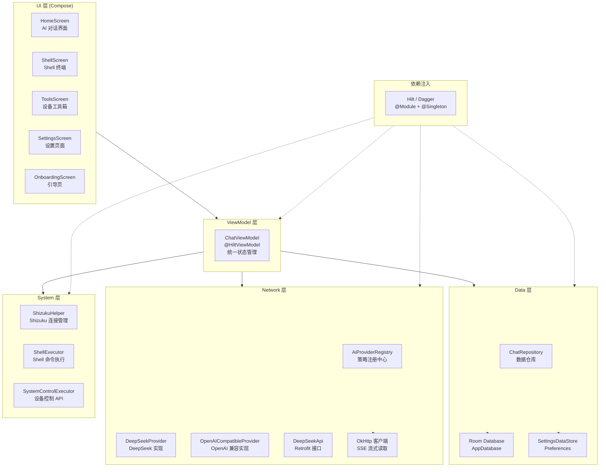
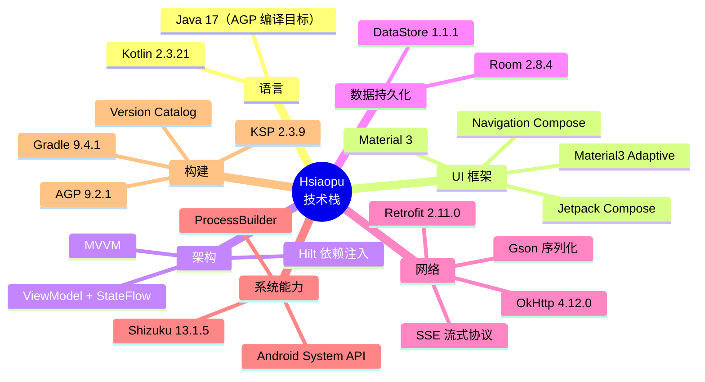
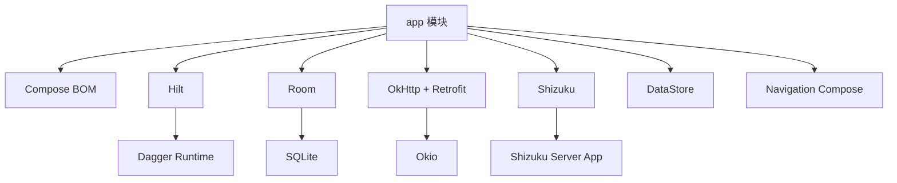
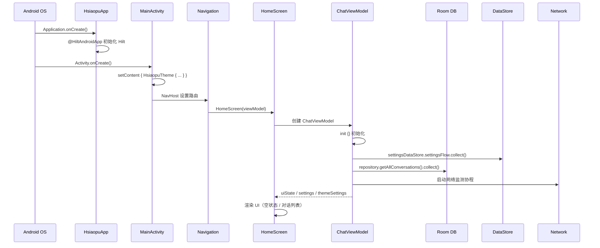
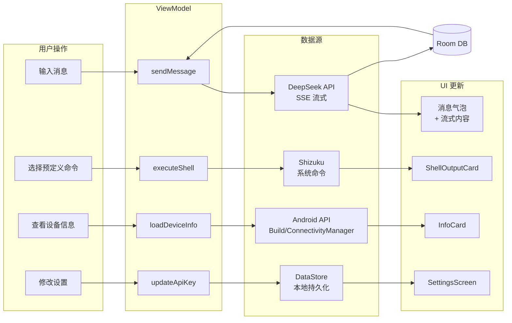

# 01 — 项目架构总览与代码结构

> **对应源码**：`HsiaopuApp.kt` / `MainActivity.kt` / `build.gradle.kts` / `libs.versions.toml` / `AndroidManifest.xml`
> **难度**：⭐⭐⭐ | **阅读时间**：40 分钟

---

## 1. 项目简介

**Hsiaopu** 是一款面向 Android 极客的「全功能 AI 工作台」，核心功能包括：

- 🤖 **AI 对话**：支持 DeepSeek、Ollama 等主流模型，SSE 流式输出，自研 Markdown 渲染
- 🖥️ **Shizuku Shell 终端**：通过 Shizuku 提权执行系统级命令，20+ 预定义命令
- 🔧 **设备工具箱**：实时查看设备信息、网络状态、存储空间、电池健康度
- 🎨 **Material 3 设计**：暗色/亮色主题、5 种强调色、自适应布局
- 🛠️ **AI 设备控制**：AI 可直接调用系统 API 控制 WiFi、蓝牙、亮度等

---

## 2. 整体架构图（MVVM + 分层）



### 架构分层职责

| 层级 | 包路径 | 职责 | 关键类 |
|------|--------|------|--------|
| **UI 层** | `ui/screen/` | Compose 声明式 UI，负责界面渲染和用户交互 | `HomeScreen`, `ShellScreen`, `ToolsScreen`, `SettingsScreen` |
| **ViewModel 层** | `viewmodel/` | 持有 UI 状态，处理业务逻辑，协调 Repository 和 Provider | `ChatViewModel`（唯一的 ViewModel） |
| **Data 层** | `data/` | 数据模型定义、Room 数据库、DataStore 偏好存储、Repository | `ChatMessage`, `AppDatabase`, `ChatRepository`, `SettingsDataStore` |
| **Network 层** | `network/` | API 调用、SSE 流式解析、多 Provider 策略模式 | `AiProvider`, `DeepSeekApi`, `AiProviderRegistry` |
| **System 层** | `system/` | Shizuku 集成、Shell 命令执行、设备控制 | `ShizukuHelper`, `ShellExecutor`, `SystemControlExecutor` |
| **DI 层** | `di/` | Hilt 依赖注入配置 | `DatabaseModule` |

---

## 3. 技术栈全景图



### 版本目录（`libs.versions.toml`）核心配置

```toml
[versions]
agp = "9.2.1"
kotlin = "2.3.21"
composeBom = "2026.02.01"
hilt = "2.60.1"
room = "2.8.4"
okhttp = "4.12.0"
retrofit = "2.11.0"
shizuku = "13.1.5"
datastore = "1.1.1"
ksp = "2.3.9"

[plugins]
android-application = { id = "com.android.application", version.ref = "agp" }
kotlin-android = { id = "org.jetbrains.kotlin.android", version.ref = "kotlin" }
kotlin-compose = { id = "org.jetbrains.kotlin.plugin.compose", version.ref = "kotlin" }
kotlin-ksp = { id = "com.google.devtools.ksp", version.ref = "ksp" }
hilt-android = { id = "com.google.dagger.hilt.android", version.ref = "hilt" }
```

> 💡 **面试要点**：Version Catalog 是 Gradle 7.0+ 引入的依赖管理方式，统一在 `libs.versions.toml` 中声明版本，避免多模块版本不一致。

---

## 4. 包结构详解

```
com.example.hsiaopu/
├── HsiaopuApp.kt              # @HiltAndroidApp Application 入口
├── MainActivity.kt            # 主 Activity，Compose 宿主
│
├── data/                      # ── 数据层 ──
│   ├── Models.kt              # 数据模型：AppSettings, ChatMessage, ChatRequest, ChatResponse
│   ├── FeatureGuide.kt        # 功能引导 key 常量
│   ├── SettingsDataStore.kt   # DataStore Preferences 封装
│   ├── local/
│   │   ├── AppDatabase.kt     # Room 数据库定义
│   │   ├── ConversationEntity.kt  # 对话实体
│   │   ├── MessageEntity.kt   # 消息实体
│   │   └── Daos.kt            # DAO 接口
│   └── repository/
│       └── ChatRepository.kt  # 数据仓库
│
├── network/                   # ── 网络层 ──
│   ├── AiProvider.kt          # AI Provider 接口 + ProviderInfo + UsageStats
│   ├── AiProviderRegistry.kt  # 策略注册中心
│   ├── DeepSeekApi.kt         # Retrofit API 接口
│   ├── DeepSeekProvider.kt    # DeepSeek Provider 实现（SSE 流式）
│   └── OpenAICompatibleProvider.kt  # OpenAI 兼容 Provider
│
├── system/                    # ── 系统层 ──
│   ├── ShizukuHelper.kt       # Shizuku 连接管理
│   ├── ShellExecutor.kt       # Shell 命令执行 + 预定义命令
│   └── SystemControlExecutor.kt  # 设备控制 API（WiFi/蓝牙/亮度等）
│
├── viewmodel/                 # ── ViewModel 层 ──
│   └── ChatViewModel.kt       # 统一 ViewModel（Chat + Settings + Shell + Tools）
│
├── ui/                        # ── UI 层 ──
│   ├── screen/
│   │   ├── HomeScreen.kt      # AI 对话主界面
│   │   ├── ShellScreen.kt     # Shell 终端界面
│   │   ├── ToolsScreen.kt     # 设备工具箱界面
│   │   ├── SettingsScreen.kt  # 设置页面
│   │   ├── OnboardingScreen.kt # 引导页
│   │   └── FeatureTooltip.kt  # 功能引导提示组件
│   └── theme/
│       ├── Color.kt           # 颜色定义
│       ├── Theme.kt           # 主题配置
│       └── Type.kt            # 字体排版
│
└── di/                        # ── 依赖注入层 ──
    └── DatabaseModule.kt      # Room 数据库 Hilt Module
```

### 各层职责深度解析

#### 4.1 Data 层

**Models.kt** — 核心数据模型：

```kotlin
// 应用设置（持久化到 DataStore）
data class AppSettings(
    val apiKey: String = "",
    val apiEndpoint: String = "https://api.deepseek.com/v1/chat/completions",
    val modelName: String = "deepseek-chat",
    val systemPrompt: String = "你是一个智能AI助手...",
    val temperature: Double = 0.7,
    val maxTokens: Int = 2048,
    val providerId: String = "deepseek"
)

// 网络请求/响应模型
data class ChatRequest(
    val model: String,
    val messages: List<Message>,
    val temperature: Double = 0.7,
    @SerializedName("max_tokens") val maxTokens: Int = 2048,
    val stream: Boolean = true
)

// UI 层使用的消息模型
data class ChatMessage(
    val role: String,       // "user" | "assistant" | "system"
    val content: String,
    val timestamp: Long = System.currentTimeMillis()
)
```

#### 4.2 Network 层 — 策略模式

```kotlin
// 核心接口
interface AiProvider {
    val info: ProviderInfo
    suspend fun sendMessage(messages: List<ChatMessage>, settings: AppSettings): String
    fun sendMessageStream(messages: List<ChatMessage>, settings: AppSettings): Flow<String>
    fun estimateCost(model: String, promptTokens: Long, completionTokens: Long): Double
}

// 注册中心（策略模式）
@Singleton
class AiProviderRegistry @Inject constructor(
    private val deepSeekProvider: DeepSeekProvider,
    private val openAICompatibleProvider: OpenAICompatibleProvider
) {
    fun getProvider(id: String): AiProvider? = providers.find { it.info.id == id }
    fun sendMessageStream(...): Flow<String> { ... }
}
```

#### 4.3 System 层 — Shizuku 集成

```kotlin
object ShizukuHelper {
    fun isAvailable(): Boolean    // 检查 Shizuku 服务是否运行
    fun hasPermission(): Boolean  // 检查是否已授权
    fun exec(command: String): String  // 通过 Shizuku 执行命令
}
```

#### 4.4 ViewModel 层 — 统一状态管理

```kotlin
@HiltViewModel
class ChatViewModel @Inject constructor(
    private val repository: ChatRepository,
    private val providerRegistry: AiProviderRegistry,
    private val settingsDataStore: SettingsDataStore,
    @ApplicationContext private val context: Context
) : ViewModel() {
    // 单一 UI 状态
    data class ChatUiState(
        val conversations: List<ConversationEntity> = emptyList(),
        val currentConversationId: Long? = null,
        val messages: List<ChatMessage> = emptyList(),
        val isLoading: Boolean = false,
        val streamingContent: String = "",
        val error: String? = null,
        val tokenStats: UsageStats = UsageStats(),
        val isOnline: Boolean = true
    )
}
```

---

## 5. Gradle 构建配置解析

### 5.1 项目级 `build.gradle.kts`

```kotlin
plugins {
    alias(libs.plugins.android.application) apply false
    alias(libs.plugins.kotlin.android) apply false
    alias(libs.plugins.kotlin.compose) apply false
    alias(libs.plugins.kotlin.ksp) apply false
    alias(libs.plugins.hilt.android) apply false
}
```

### 5.2 模块级 `app/build.gradle.kts`

```kotlin
plugins {
    alias(libs.plugins.android.application)
    alias(libs.plugins.kotlin.android)
    alias(libs.plugins.kotlin.compose)
    alias(libs.plugins.kotlin.ksp)
    alias(libs.plugins.hilt.android)
}

android {
    namespace = "com.example.hsiaopu"
    compileSdk = 36

    defaultConfig {
        applicationId = "com.example.hsiaopu"
        minSdk = 26
        targetSdk = 36
        versionCode = 1
        versionName = "1.0"
    }

    buildFeatures {
        compose = true
    }
}

dependencies {
    // Compose BOM — 统一管理 Compose 版本
    implementation(platform(libs.androidx.compose.bom))
    implementation(libs.androidx.compose.ui)
    implementation(libs.androidx.compose.material3)
    implementation(libs.androidx.compose.material3.adaptive)
    implementation(libs.androidx.compose.material.icons.extended)

    // Hilt 依赖注入
    implementation(libs.hilt.android)
    ksp(libs.hilt.compiler)
    implementation(libs.hilt.navigation.compose)

    // Room 数据库
    implementation(libs.room.runtime)
    implementation(libs.room.ktx)
    ksp(libs.room.compiler)

    // 网络
    implementation(libs.okhttp)
    implementation(libs.okhttp.logging)
    implementation(libs.retrofit2)
    implementation(libs.converter.gson)

    // Shizuku
    implementation(libs.shizuku.api)
    implementation(libs.shizuku.provider)

    // DataStore
    implementation(libs.datastore.preferences)

    // Navigation
    implementation(libs.androidx.navigation.compose)
}
```

> 💡 **面试要点**：KSP（Kotlin Symbol Processing）替代了 KAPT，编译速度更快。Hilt 和 Room 都需要注解处理器，这里都用 KSP。

---

## 6. 模块间依赖关系



Hsiaopu 是**单模块**项目，所有代码都在 `app` 模块中。这也是中小型项目的常见做法——当功能模块边界清晰时，可以先通过**包结构**（package）分层，后续按需拆分为多模块（如 `:core:network`、`:feature:chat` 等）。

---

## 7. 项目启动流程



### 关键代码 — `HsiaopuApp.kt`

```kotlin
@HiltAndroidApp
class HsiaopuApp : Application()
```

只需要一行 `@HiltAndroidApp` 注解，Hilt 就会自动生成依赖注入的组件代码。这是 Hilt 的入口点。

### 关键代码 — `MainActivity.kt`

```kotlin
@AndroidEntryPoint
class MainActivity : ComponentActivity() {
    override fun onCreate(savedInstanceState: Bundle?) {
        super.onCreate(savedInstanceState)
        setContent {
            HsiaopuTheme {
                // NavHost + 路由配置
                // HomeScreen / ShellScreen / ToolsScreen / SettingsScreen
            }
        }
    }
}
```

---

## 8. 数据流全景图



### 单向数据流（UDF）

Hsiaopu 严格遵循 **单向数据流** 模式：

```
User Action → ViewModel → Repository/Provider → Data Source → StateFlow → UI Recomposition
```

- 用户操作触发 ViewModel 方法
- ViewModel 通过 Repository 或 Provider 获取数据
- 数据写入 `MutableStateFlow`
- Compose UI 通过 `collectAsState()` 订阅变化
- UI 自动重组（Recomposition）

---

## 9. 面试中如何介绍项目架构

### 推荐回答结构（3 分钟版本）

> **"我开发了一个名为 Hsiaopu 的 Android AI 工作台应用，采用 MVVM 架构 + Hilt 依赖注入。"**
>
> **"架构上分为五层：UI 层使用 Jetpack Compose + Material 3 实现声明式界面；ViewModel 层用 ChatViewModel 统一管理所有 UI 状态，通过 StateFlow 实现单向数据流；Data 层使用 Room 存储对话历史，DataStore 保存用户设置；Network 层采用策略模式，定义了 AiProvider 接口，支持 DeepSeek 和 OpenAI 兼容两种 Provider，通过 OkHttp 实现 SSE 流式读取；System 层集成 Shizuku，实现系统级 Shell 命令执行和设备控制。"**
>
> **"技术选型方面，我用了 Version Catalog 统一管理依赖版本，KSP 替代 KAPT 加速编译，最小 SDK 设为 26 以覆盖 95% 以上的设备。"**

### 面试官追问应对

| 追问方向 | 回答要点 |
|----------|----------|
| **为什么选 MVVM？** | Google 官方推荐，与 Compose 天然契合，StateFlow 驱动 UI 重组 |
| **为什么用 Hilt？** | 基于 Dagger，编译期验证，比 Koin 更安全，比手动 DI 更简洁 |
| **为什么单模块？** | 项目规模适中，包结构已清晰分层，后续可平滑拆分为多模块 |
| **为什么 minSdk 26？** | Android 8.0+ 覆盖绝大多数设备，无需处理旧版兼容性问题 |
| **SSE 怎么实现的？** | OkHttp 发起流式 POST 请求，逐行读取 `data:` 前缀的 JSON 行，解析 `delta.content` 字段 |

---

## 10. 总结

| 维度 | 关键技术 | 作用 |
|------|----------|------|
| 架构 | MVVM + UDF | 单向数据流，状态驱动 UI |
| 语言 | Kotlin 2.3 | 协程、Flow、扩展函数 |
| UI | Compose + Material 3 | 声明式 UI，Material 3 设计 |
| DI | Hilt | 编译期 DI，@Singleton 管理生命周期 |
| 数据 | Room + DataStore | 结构化数据 + 偏好设置 |
| 网络 | OkHttp + Retrofit | REST API + SSE 流式 |
| 系统 | Shizuku | 提权执行系统命令 |
| 构建 | Gradle + Version Catalog | 统一版本管理 |

---

> **下一章**：[02 — AI 对话模块深度解析](./02-AI对话模块深度解析.md)