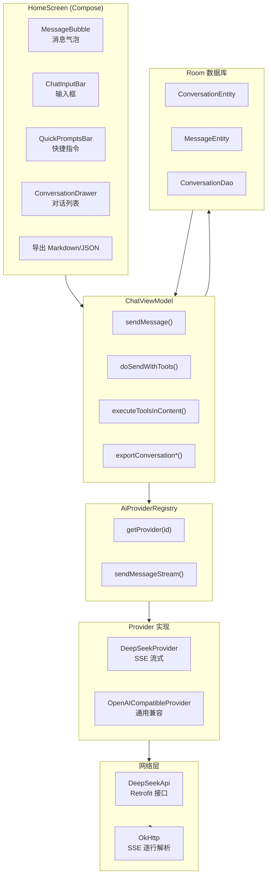
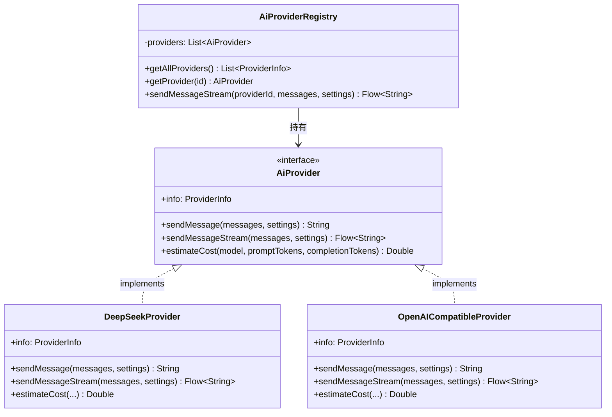
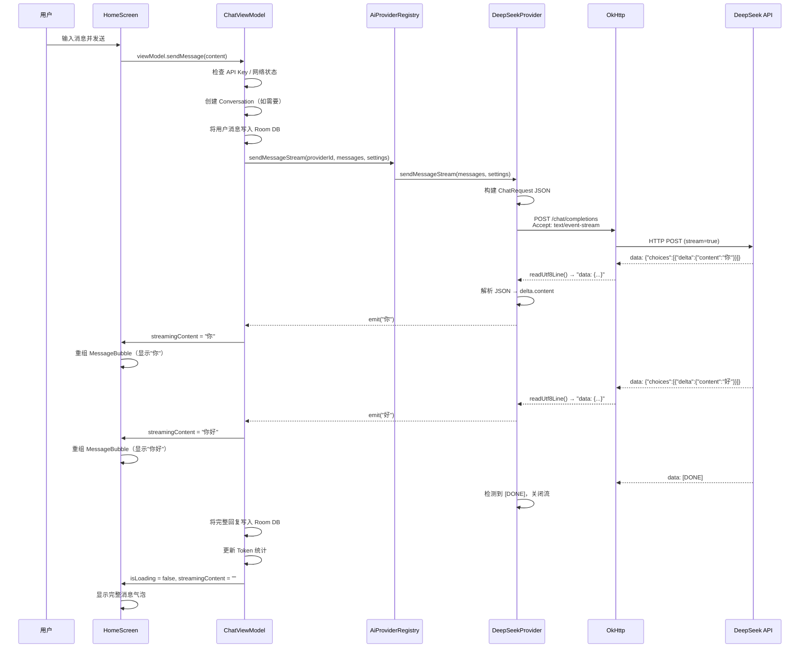
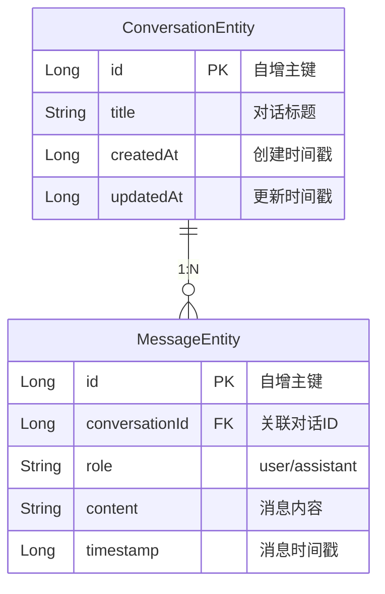
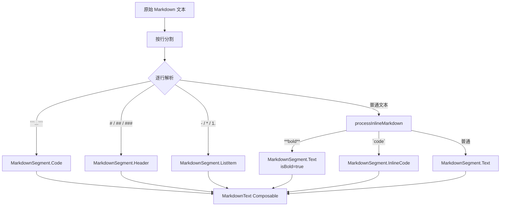

# 02 — AI 对话模块深度解析

> **对应源码**：`network/AiProvider.kt` / `DeepSeekProvider.kt` / `DeepSeekApi.kt` / `AiProviderRegistry.kt` / `OpenAICompatibleProvider.kt` / `ChatViewModel.kt` / `HomeScreen.kt` / `ChatRepository.kt`
> **难度**：⭐⭐⭐⭐⭐ | **阅读时间**：60 分钟

---

## 1. AI 对话模块整体架构



---

## 2. 策略模式实现 — 多 Provider 支持

### 2.1 核心接口定义

```kotlin
// 文件: network/AiProvider.kt

data class ProviderInfo(
    val id: String,           // "deepseek" | "openai_compatible"
    val name: String,         // "DeepSeek" | "OpenAI Compatible"
    val description: String,
    val defaultEndpoint: String,
    val defaultModel: String,
    val models: List<String>
)

data class UsageStats(
    val promptTokens: Long = 0,
    val completionTokens: Long = 0,
    val totalTokens: Long = 0,
    val estimatedCost: Double = 0.0
)

interface AiProvider {
    val info: ProviderInfo

    /** 非流式发送消息 */
    suspend fun sendMessage(
        messages: List<ChatMessage>,
        settings: AppSettings
    ): String

    /** 流式发送消息，返回 Flow<String> 逐块推送 */
    fun sendMessageStream(
        messages: List<ChatMessage>,
        settings: AppSettings
    ): Flow<String>

    /** 估算费用 */
    fun estimateCost(
        model: String,
        promptTokens: Long,
        completionTokens: Long
    ): Double
}
```

### 2.2 Provider 注册中心

```kotlin
// 文件: network/AiProviderRegistry.kt

@Singleton
class AiProviderRegistry @Inject constructor(
    private val deepSeekProvider: DeepSeekProvider,
    private val openAICompatibleProvider: OpenAICompatibleProvider
) {
    private val providers: List<AiProvider> =
        listOf(deepSeekProvider, openAICompatibleProvider)

    fun getAllProviders(): List<ProviderInfo> = providers.map { it.info }

    fun getProvider(id: String): AiProvider? =
        providers.find { it.info.id == id }

    fun getDefaultProvider(): AiProvider = deepSeekProvider

    fun sendMessageStream(
        providerId: String,
        messages: List<ChatMessage>,
        settings: AppSettings
    ): Flow<String> {
        return getProvider(providerId)?.sendMessageStream(messages, settings)
            ?: throw Exception("Unknown provider: $providerId")
    }
}
```

### 2.3 策略模式类图



> 💡 **面试要点**：策略模式的核心是「定义算法族，分别封装，让它们之间可以互相替换」。这里 `AiProvider` 是策略接口，`DeepSeekProvider` 和 `OpenAICompatibleProvider` 是具体策略，`AiProviderRegistry` 是上下文。

---

## 3. DeepSeek API 调用流程

### 3.1 Retrofit 接口定义

```kotlin
// 文件: network/DeepSeekApi.kt

interface DeepSeekApi {
    /** 非流式请求 */
    @POST("chat/completions")
    suspend fun sendMessage(@Body request: ChatRequest): ChatResponse

    /** SSE 流式请求 */
    @Streaming
    @POST("chat/completions")
    @Headers("Accept: text/event-stream")
    suspend fun sendMessageStream(@Body request: ChatRequest): Response<ResponseBody>
}
```

### 3.2 请求体构建

```kotlin
// 文件: data/Models.kt

data class ChatRequest(
    val model: String,              // "deepseek-chat"
    val messages: List<Message>,    // [{"role":"system","content":"..."}, {"role":"user",...}]
    val temperature: Double = 0.7,
    @SerializedName("max_tokens") val maxTokens: Int = 2048,
    val stream: Boolean = true      // 始终开启流式
)

data class Message(
    val role: String,    // "system" | "user" | "assistant"
    val content: String
)
```

HTTP 请求体实际 JSON 格式：

```json
{
  "model": "deepseek-chat",
  "messages": [
    { "role": "system", "content": "你是一个智能AI助手..." },
    { "role": "user", "content": "你好，请介绍一下自己" }
  ],
  "temperature": 0.7,
  "max_tokens": 2048,
  "stream": true
}
```

---

## 4. SSE 流式解析 — 完整实现

### 4.1 SSE 协议简介

**SSE（Server-Sent Events）** 是一种服务器向客户端推送事件的技术。AI API 使用 SSE 实现逐 token 返回：

```
data: {"id":"chatcmpl-xxx","choices":[{"delta":{"content":"你"},"index":0}]}

data: {"id":"chatcmpl-xxx","choices":[{"delta":{"content":"好"},"index":0}]}

data: {"id":"chatcmpl-xxx","choices":[{"delta":{"content":"！"},"index":0}]}

data: [DONE]
```

### 4.2 DeepSeekProvider 流式实现

```kotlin
// 文件: network/DeepSeekProvider.kt（简化展示核心逻辑）

@Singleton
class DeepSeekProvider @Inject constructor(
    private val okHttpClient: OkHttpClient
) : AiProvider {

    override val info = ProviderInfo(
        id = "deepseek",
        name = "DeepSeek",
        description = "DeepSeek AI 模型",
        defaultEndpoint = "https://api.deepseek.com/v1/chat/completions",
        defaultModel = "deepseek-chat",
        models = listOf("deepseek-chat", "deepseek-reasoner")
    )

    override fun sendMessageStream(
        messages: List<ChatMessage>,
        settings: AppSettings
    ): Flow<String> = flow {
        // 构建请求体
        val requestBody = ChatRequest(
            model = settings.modelName,
            messages = messages.map { Message(it.role, it.content) },
            temperature = settings.temperature,
            maxTokens = settings.maxTokens,
            stream = true
        )

        // 构建 OkHttp 请求
        val jsonBody = Gson().toJson(requestBody)
        val request = Request.Builder()
            .url(settings.apiEndpoint)
            .post(jsonBody.toRequestBody("application/json".toMediaType()))
            .header("Authorization", "Bearer ${settings.apiKey}")
            .header("Accept", "text/event-stream")
            .build()

        // 执行请求
        val response = okHttpClient.newCall(request).execute()
        val source = response.body?.source() ?: throw IOException("Empty body")

        // 逐行读取 SSE 数据
        while (!source.exhausted()) {
            val line = source.readUtf8Line() ?: break

            if (line.startsWith("data: ")) {
                val data = line.removePrefix("data: ").trim()

                if (data == "[DONE]") break  // 流结束标记

                try {
                    val delta = Gson().fromJson(data, ChatResponse::class.java)
                    val content = delta.choices
                        .firstOrNull()
                        ?.delta
                        ?.content ?: ""
                    if (content.isNotEmpty()) {
                        emit(content)  // 发射每一块 token
                    }
                } catch (_: Exception) {
                    // 忽略解析失败的行
                }
            }
        }
    }.flowOn(Dispatchers.IO)
}
```

### 4.3 SSE 流式流程图



---

## 5. Room 数据库 — 对话历史存储

### 5.1 数据库 Schema



### 5.2 实体定义

```kotlin
// ConversationEntity.kt
@Entity(tableName = "conversations")
data class ConversationEntity(
    @PrimaryKey(autoGenerate = true) val id: Long = 0,
    val title: String,
    val createdAt: Long = System.currentTimeMillis(),
    val updatedAt: Long = System.currentTimeMillis()
)

// MessageEntity.kt
@Entity(tableName = "messages")
data class MessageEntity(
    @PrimaryKey(autoGenerate = true) val id: Long = 0,
    val conversationId: Long,
    val role: String,
    val content: String,
    val timestamp: Long = System.currentTimeMillis()
)
```

### 5.3 DAO 接口

```kotlin
@Dao
interface ConversationDao {
    @Query("SELECT * FROM conversations ORDER BY updatedAt DESC")
    fun getAllConversations(): Flow<List<ConversationEntity>>

    @Query("SELECT * FROM messages WHERE conversationId = :convId ORDER BY timestamp ASC")
    fun getMessagesByConversation(convId: Long): Flow<List<MessageEntity>>

    @Insert
    suspend fun insertConversation(conversation: ConversationEntity): Long

    @Insert
    suspend fun insertMessage(message: MessageEntity)

    @Query("UPDATE conversations SET title = :title WHERE id = :id")
    suspend fun updateTitle(id: Long, title: String)

    @Query("DELETE FROM conversations WHERE id = :id")
    suspend fun deleteConversation(id: Long)
}
```

---

## 6. ChatViewModel — 对话状态管理

### 6.1 UI 状态定义

```kotlin
data class ChatUiState(
    val conversations: List<ConversationEntity> = emptyList(),
    val currentConversationId: Long? = null,
    val messages: List<ChatMessage> = emptyList(),
    val isLoading: Boolean = false,
    val streamingContent: String = "",     // 流式传输中的部分内容
    val error: String? = null,
    val tokenStats: UsageStats = UsageStats(),
    val isOnline: Boolean = true
)
```

### 6.2 发送消息核心流程

```kotlin
fun sendMessage(content: String) {
    // 1. 校验 API Key
    if (currentSettings.apiKey.isBlank()) {
        _uiState.update { it.copy(error = "Please set API Key in Settings") }
        return
    }

    // 2. 检查网络状态
    if (!_uiState.value.isOnline) { /* 提示离线 */ }

    // 3. 确保有对话
    if (convId == null) {
        viewModelScope.launch {
            val id = repository.createConversation(title)
            _uiState.update { it.copy(currentConversationId = id) }
            doSendWithTools(id, content, currentSettings)
        }
        return
    }

    doSendWithTools(convId, content, currentSettings)
}

private fun doSendWithTools(convId: Long, content: String, settings: AppSettings) {
    // 1. 添加用户消息到 UI 状态
    _uiState.update { it.copy(
        messages = it.messages + userMsg,
        isLoading = true,
        streamingContent = "",
        error = null
    ) }

    // 2. 写入数据库
    viewModelScope.launch {
        repository.insertMessage(MessageEntity(convId, "user", content))
    }

    // 3. 调用 AI 流式 API
    viewModelScope.launch {
        var fullContent = ""
        providerRegistry.sendMessageStream(settings.providerId, messages, settings)
            .collect { chunk ->
                fullContent += chunk
                _uiState.update { it.copy(streamingContent = fullContent) }
            }

        // 4. 解析工具调用（如果有 [TOOL:xxx]）
        val (processed, toolResults) = executeToolsInContent(fullContent)

        // 5. 保存到数据库
        repository.insertMessage(MessageEntity(convId, "assistant", finalContent))

        // 6. 更新 UI 状态
        _uiState.update { it.copy(
            messages = it.messages + assistantMsg,
            isLoading = false,
            streamingContent = ""
        ) }
    }
}
```

### 6.3 AI 工具调用（AI → Shizuku）

Hsiaopu 的一大特色是 **AI 可以直接控制设备**。AI 在回复中输出 `[TOOL:action_name]` 标记，ChatViewModel 解析后调用 SystemControlExecutor 执行系统命令。

```kotlin
// AI 回复示例：
// "好的，我来帮你打开 WiFi。[TOOL:enable_wifi]"

private suspend fun executeToolsInContent(content: String):
    Pair<String, List<SysResult>> {

    val toolRegex = Regex("""\[TOOL:([a-z_]+)(?::([^\]]*))?\]""")
    val matches = toolRegex.findAll(content)

    for (match in matches) {
        val action = match.groupValues[1]       // "enable_wifi"
        val params = parseParams(paramsStr)      // {}

        val result = executeToolAction(action, params)  // 执行命令
        // 替换 [TOOL:xxx] 为执行结果
        processed = processed.replace(match.value, """
            ---
            **✓ WiFi 开启**: WiFi 已成功开启
            ---
        """.trimIndent())
    }

    return Pair(processed, results)
}
```

---

## 7. 消息气泡 UI 实现

```kotlin
@Composable
fun MessageBubble(
    message: ChatMessage,
    isStreaming: Boolean = false,
    onCopy: (() -> Unit)? = null
) {
    val isUser = message.role == "user"

    Column(
        modifier = Modifier.fillMaxWidth(),
        horizontalAlignment = if (isUser) Alignment.End else Alignment.Start
    ) {
        // 角色标签 + 时间戳
        Row {
            Text(if (isUser) "You" else "AI")
            Text(SimpleDateFormat("HH:mm").format(Date(message.timestamp)))
        }

        // 消息内容气泡
        Surface(
            color = if (isUser) UserBubble else AssistantBubble,
            shape = RoundedCornerShape(
                topStart = 16.dp, topEnd = 16.dp,
                bottomStart = if (isUser) 16.dp else 4.dp,
                bottomEnd = if (isUser) 4.dp else 16.dp
            ),
            modifier = Modifier.widthIn(max = 320.dp)
                .combinedClickable(
                    onClick = {},
                    onLongClick = { onCopy?.invoke() }  // 长按复制
                )
        ) {
            // 自研 Markdown 渲染
            MarkdownText(content = message.content)
        }

        // 流式指示器（闪烁光标）
        if (isStreaming) {
            Box(
                modifier = Modifier.size(4.dp, 16.dp)
                    .clip(RoundedCornerShape(2.dp))
                    .background(MaterialTheme.colorScheme.primary.copy(alpha = animatedAlpha))
            )
        }
    }
}
```

---

## 8. 自研 Markdown 解析器

### 8.1 架构设计



### 8.2 核心代码

```kotlin
// 解析结果类型
sealed class MarkdownSegment {
    data class Text(val text: String, val isBold: Boolean = false) : MarkdownSegment()
    data class Code(val code: String) : MarkdownSegment()
    data class InlineCode(val code: String) : MarkdownSegment()
    data class Header(val text: String) : MarkdownSegment()
    data class ListItem(val bullet: String, val text: String) : MarkdownSegment()
}

// 渲染器
@Composable
fun MarkdownText(content: String, modifier: Modifier = Modifier) {
    val segments = remember(content) { parseMarkdown(content) }
    Column(modifier = modifier) {
        segments.forEach { segment ->
            when (segment) {
                is MarkdownSegment.Text -> Text(
                    text = segment.text,
                    fontWeight = if (segment.isBold) FontWeight.Bold else FontWeight.Normal
                )
                is MarkdownSegment.Code -> Surface(
                    color = CodeBlockBg,
                    shape = RoundedCornerShape(8.dp)
                ) {
                    Text(
                        text = segment.code,
                        fontFamily = FontFamily.Monospace,
                        fontSize = 13.sp
                    )
                }
                is MarkdownSegment.InlineCode -> Surface(
                    color = InlineCodeBg,
                    shape = RoundedCornerShape(4.dp)
                ) {
                    Text(segment.code, fontFamily = FontFamily.Monospace)
                }
                is MarkdownSegment.Header -> Text(
                    segment.text,
                    style = MaterialTheme.typography.titleMedium,
                    fontWeight = FontWeight.Bold,
                    color = MaterialTheme.colorScheme.primary
                )
                is MarkdownSegment.ListItem -> Row {
                    Text("  ${segment.bullet} ", color = primary)
                    Text(segment.text)
                }
            }
        }
    }
}
```

---

## 9. 导出功能

### 9.1 Markdown 导出

```kotlin
fun exportConversationAsMarkdown(id: Long): String {
    val messages = _uiState.value.messages
    val conv = _uiState.value.conversations.find { it.id == id }
    return buildString {
        appendLine("# ${conv?.title ?: "Conversation"}")
        appendLine()
        messages.forEach { msg ->
            val role = if (msg.role == "user") "You" else "AI"
            appendLine("**$role**:")
            appendLine(msg.content)
            appendLine()
        }
    }
}
```

### 9.2 JSON 导出

```kotlin
fun exportConversationAsJson(id: Long): String {
    return """{"title":"${conv?.title}","messages":[${
        messages.joinToString(",") { msg ->
            """{"role":"${msg.role}","content":${escapeJson(msg.content)},"timestamp":${msg.timestamp}}"""
        }
    }]}"""
}
```

---

## 10. 对话历史管理

### 功能清单

| 功能 | 实现方式 | 说明 |
|------|----------|------|
| **搜索** | `conversations.filter { it.title.contains(query, ignoreCase = true) }` | 内存过滤，实时搜索 |
| **重命名** | `repository.updateConversationTitle(id, title)` | Room UPDATE 操作 |
| **删除** | `repository.deleteConversation(id)` + SwipeToDismissBox | 滑动删除 + 确认对话框 |
| **新建对话** | `repository.createConversation()` | 自动用首条消息前 30 字作为标题 |
| **自动标题** | `getConversationTitle(content).take(30)` | 取消息前 30 字符 |

---

## 11. 面试中如何讲解 AI 对话模块

### 推荐回答结构（3 分钟版本）

> **"AI 对话模块是 Hsiaopu 的核心功能，我采用了策略模式来支持多 Provider 切换。"**
>
> **"首先定义了 AiProvider 接口，包含 sendMessage、sendMessageStream 和 estimateCost 三个方法。DeepSeekProvider 和 OpenAICompatibleProvider 分别实现该接口，通过 AiProviderRegistry 统一管理。"**
>
> **"流式输出方面，我使用 OkHttp 直接发起 POST 请求，设置 Accept: text/event-stream 头，然后逐行读取 SSE 数据。每行以 'data: ' 开头，解析 JSON 取出 delta.content 字段，通过 Kotlin Flow 的 emit 逐块推送给 UI 层。"**
>
> **"消息存储使用 Room 数据库，ConversationEntity 和 MessageEntity 是一对多关系，通过 Flow 实现实时查询。"**
>
> **"我还自研了一个轻量级 Markdown 解析器，支持标题、粗体、代码块、列表等语法，使用 Compose 的 sealed class 模式进行分段渲染。"**
>
> **"另外，AI 还可以通过 [TOOL:xxx] 标记调用设备的系统能力，实现 AI 控制 WiFi、蓝牙、亮度等功能。"**

### 面试官追问应对

| 追问方向 | 回答要点 |
|----------|----------|
| **为什么不用 Retrofit 的 @Streaming？** | Retrofit 的 @Streaming 返回 Response<ResponseBody>，需要手动处理 SSE 协议。直接用 OkHttp 更灵活，对 SSE 逐行解析更友好 |
| **Flow 与 LiveData 的对比？** | Flow 支持冷流/热流、背压、操作符链，与协程天然集成；LiveData 是热流，与生命周期绑定，但冷流场景不如 Flow |
| **SSE 断线重连？** | 当前版本未实现自动重连，但已预留扩展点。可以在 Flow 中 catch 异常后重新发起请求 |
| **Markdown 解析为什么不引入三方库？** | 减少依赖体积，核心需求简单（标题、粗体、代码块），自研可完全控制渲染行为 |
| **AI 工具调用的安全性？** | 危险操作（重启、关机）需要 AI 先向用户确认。可扩展为白名单模式限制 AI 可执行的操作 |

---

> **上一章**：[01 — 项目架构总览与代码结构](./01-项目架构总览与代码结构.md)
> **下一章**：[03 — Shell 终端与 Shizuku 集成](./03-Shell终端与Shizuku集成.md)