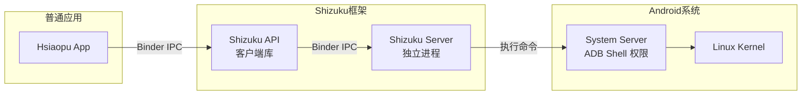
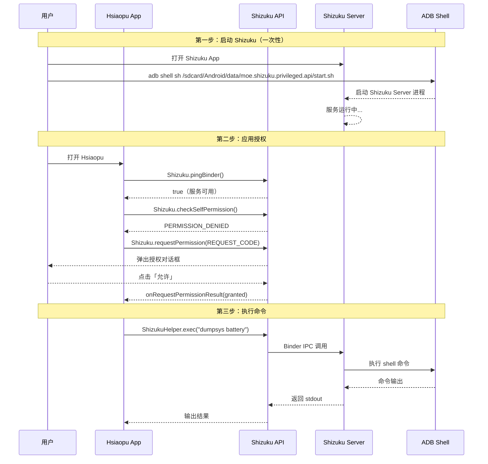
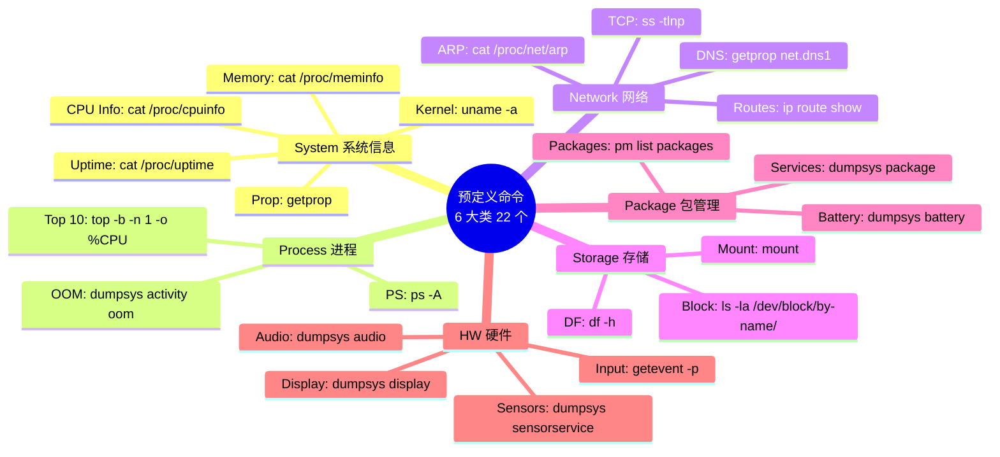
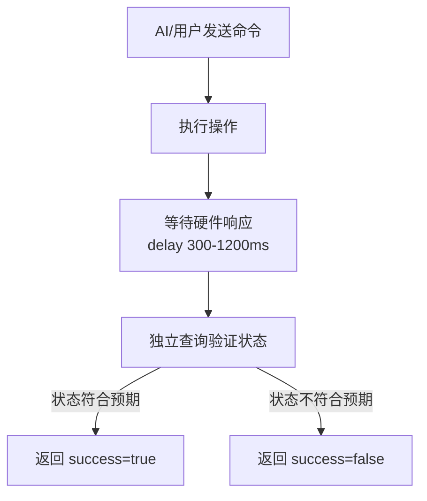
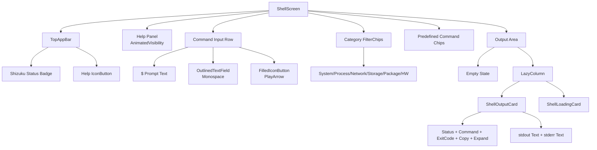

# 03 — Shell 终端与 Shizuku 集成

> **对应源码**：`system/ShizukuHelper.kt` / `ShellExecutor.kt` / `SystemControlExecutor.kt` / `ui/screen/ShellScreen.kt`
> **难度**：⭐⭐⭐⭐⭐ | **阅读时间**：60 分钟

---

## 1. Shizuku 是什么？

### 1.1 核心概念

**Shizuku** 是一个开源的 Android 权限管理工具，允许普通应用通过 **Binder IPC** 机制以 ADB/root 权限执行系统命令。



### 1.2 为什么需要 Shizuku？

| 场景 | 普通应用 | 使用 Shizuku |
|------|----------|-------------|
| 执行 `dumpsys` | ❌ 需要系统签名 | ✅ 通过 ADB 权限 |
| 修改系统设置 | ❌ 需要 root | ✅ 通过 ADB 权限 |
| 读取 `/proc` 信息 | ❌ 权限受限 | ✅ 完整访问 |
| 控制 WiFi/蓝牙 | ❌ 受限于 SDK API | ✅ 直接调用 `svc` |
| 无需 root 设备 | — | ✅ 仅需 ADB 授权一次 |

### 1.3 Shizuku 授权流程



---

## 2. ShizukuHelper — 连接管理

### 2.1 完整代码解析

```kotlin
// 文件: system/ShizukuHelper.kt

object ShizukuHelper {

    /**
     * 反射获取 Shizuku.newProcess() 方法
     *
     * Shizuku 13+ 中 newProcess() 被标记为 @RestrictTo(LIBRARY_GROUP)，
     * Kotlin 编译器禁止直接调用。通过反射绕过此限制。
     */
    private val newProcessMethod by lazy {
        Shizuku::class.java.getDeclaredMethod(
            "newProcess",
            Array<String>::class.java,   // 命令参数
            Array<String>::class.java,   // 环境变量
            String::class.java           // 工作目录
        ).also { it.isAccessible = true }
    }

    /** 检查 Shizuku 服务是否运行 */
    fun isAvailable(): Boolean {
        return try {
            Shizuku.pingBinder()  // 发送 Binder ping 探测
        } catch (_: Exception) {
            false
        }
    }

    /** 检查是否已授权 */
    fun hasPermission(): Boolean {
        return try {
            Shizuku.checkSelfPermission() == PackageManager.PERMISSION_GRANTED
        } catch (_: Exception) {
            false
        }
    }

    /** 请求 Shizuku 权限 */
    fun requestPermission(requestCode: Int) {
        if (Shizuku.isPreV11()) return   // 旧版本不支持
        if (hasPermission()) return       // 已有权限
        Shizuku.requestPermission(requestCode)
    }

    /**
     * 通过 Shizuku 执行 shell 命令
     *
     * 核心流程：
     * 1. 反射调用 Shizuku.newProcess() 创建进程
     * 2. 读取进程 stdout（BufferedReader 逐行读取）
     * 3. 等待进程结束（waitFor）
     * 4. 销毁进程（destroy）
     */
    fun exec(command: String): String {
        if (!isAvailable() || !hasPermission()) {
            throw IllegalStateException(
                "Shizuku not available or permission not granted"
            )
        }

        // 实际执行: sh -c <command>
        val args = arrayOf("sh", "-c", command)
        val process = newProcessMethod.invoke(
            null, args, null, null
        ) as java.lang.Process

        val output = StringBuilder()
        try {
            BufferedReader(InputStreamReader(process.inputStream)).use { reader ->
                var line: String? = reader.readLine()
                while (line != null) {
                    output.appendLine(line)
                    line = reader.readLine()
                }
            }
            process.waitFor()
        } finally {
            process.destroy()
        }

        return output.toString().trim()
    }
}
```

> 💡 **面试要点**：反射调用 `newProcess` 是因为 Shizuku 13+ 将该方法标记为 `@RestrictTo`，但这并非安全问题，而是 Shizuku 官方希望开发者使用更高级的 API。在 Hsiaopu 中，我们通过反射确保与 Shizuku 13+ 的兼容性。

---

## 3. ShellExecutor — 命令执行引擎

### 3.1 数据模型

```kotlin
// 命令执行结果
data class ShellResult(
    val command: String,       // 原始命令
    val stdout: String,        // 标准输出
    val stderr: String,        // 标准错误
    val exitCode: Int = -1,    // 退出码
    val timestamp: Long = System.currentTimeMillis()
) {
    val isSuccess: Boolean get() = exitCode == 0
}

// 预定义命令
data class PredefinedCommand(
    val label: String,         // 显示名称，如 "CPU Info"
    val command: String,       // 实际命令，如 "cat /proc/cpuinfo"
    val description: String,   // 描述
    val category: String       // 分类：System/Process/Network/Storage/Package/HW
)
```

### 3.2 执行流程

```kotlin
object ShellExecutor {

    fun execute(command: String): Flow<ShellResult> = flow {
        val result = runCommand(command)
        emit(result)
    }.flowOn(Dispatchers.IO)

    private suspend fun runCommand(command: String): ShellResult =
        withContext(Dispatchers.IO) {
            try {
                // 1. 检查 Shizuku 可用性
                if (!ShizukuHelper.isAvailable()) {
                    return@withContext ShellResult(
                        command = command,
                        stdout = "",
                        stderr = "Shizuku is not available. Please start Shizuku first.",
                        exitCode = 127  // 命令未找到
                    )
                }

                // 2. 检查权限
                if (!ShizukuHelper.hasPermission()) {
                    return@withContext ShellResult(
                        command = command,
                        stdout = "",
                        stderr = "Shizuku permission not granted.",
                        exitCode = 126  // 权限不足
                    )
                }

                // 3. 执行命令
                val stdout = ShizukuHelper.exec(command)
                return@withContext ShellResult(
                    command = command,
                    stdout = stdout,
                    stderr = "",
                    exitCode = 0
                )
            } catch (e: Exception) {
                return@withContext ShellResult(
                    command = command,
                    stdout = "",
                    stderr = "Error: ${e.message}",
                    exitCode = 1
                )
            }
        }
}
```

### 3.3 退出码语义

| 退出码 | 含义 | 场景 |
|--------|------|------|
| `0` | 成功 | 命令正常执行 |
| `1` | 一般错误 | 命令执行异常 |
| `126` | 权限不足 | Shizuku 未授权 |
| `127` | 命令未找到 | Shizuku 服务不可用 |

---

## 4. 20+ 预定义命令分类



### 命令定义源码

```kotlin
val predefinedCommands: List<PredefinedCommand> = listOf(
    // System Info
    PredefinedCommand("CPU Info", "cat /proc/cpuinfo", "CPU 详细信息", "System"),
    PredefinedCommand("Memory", "cat /proc/meminfo", "内存信息", "System"),
    PredefinedCommand("Uptime", "cat /proc/uptime", "系统运行时间", "System"),
    PredefinedCommand("Kernel", "uname -a", "内核版本信息", "System"),
    PredefinedCommand("Prop", "getprop", "系统属性", "System"),

    // Process
    PredefinedCommand("Top 10", "top -b -n 1 -o %CPU | head -17",
        "CPU 占用前 10 进程", "Process"),
    PredefinedCommand("PS", "ps -A -o PID,USER,NAME,%CPU,%MEM",
        "进程列表", "Process"),
    PredefinedCommand("OOM", "dumpsys activity oom", "OOM 调整信息", "Process"),

    // Network
    PredefinedCommand("DNS", "getprop net.dns1 && getprop net.dns2",
        "DNS 服务器", "Network"),
    PredefinedCommand("Routes", "ip route show", "路由表", "Network"),
    PredefinedCommand("ARP", "cat /proc/net/arp", "ARP 缓存表", "Network"),
    PredefinedCommand("TCP", "ss -tlnp", "监听端口", "Network"),

    // Storage
    PredefinedCommand("Mount", "mount", "挂载点", "Storage"),
    PredefinedCommand("DF", "df -h", "磁盘使用", "Storage"),
    PredefinedCommand("Block", "ls -la /dev/block/by-name/",
        "分区列表", "Storage"),

    // Package
    PredefinedCommand("Packages", "pm list packages", "已安装应用", "Package"),
    PredefinedCommand("Services", "dumpsys package", "包服务信息", "Package"),
    PredefinedCommand("Battery", "dumpsys battery", "电池状态", "Package"),

    // Sensors / Hardware
    PredefinedCommand("Sensors", "dumpsys sensorservice", "传感器列表", "HW"),
    PredefinedCommand("Input", "getevent -p", "输入设备", "HW"),
    PredefinedCommand("Display", "dumpsys display", "显示信息", "HW"),
    PredefinedCommand("Audio", "dumpsys audio", "音频信息", "HW")
)
```

---

## 5. SystemControlExecutor — 设备控制 API

### 5.1 设计哲学



**核心原则**：
1. 每个操作都是独立的函数，可自由组合调用
2. **操作命令 → 等待硬件响应 → 独立查询验证状态 → 返回真实结果**
3. 成功就是成功，失败就是失败，不带模糊的「可能」
4. 只读命令直接返回结果，写操作命令强制执行状态验证

### 5.2 功能矩阵

| 类别 | 操作 | 实现方式 | 验证方式 |
|------|------|----------|----------|
| **WiFi** | 开启/关闭 | `svc wifi enable/disable` | `cmd wifi status` |
| **蓝牙** | 开启/关闭 | `svc bluetooth enable/disable` | `settings get global bluetooth_on` |
| **热点** | 开启/关闭 | `cmd wifi start-softap/stop-softap` | `dumpsys wifi` 检查 SoftAp |
| **移动数据** | 开启/关闭 | `svc data enable/disable` | `settings get global mobile_data` |
| **飞行模式** | 开启/关闭 | `settings put + am broadcast` | `settings get global airplane_mode_on` |
| **NFC** | 开启/关闭 | `svc nfc enable/disable` | `dumpsys nfc` |
| **亮度** | 设置/查询 | `settings put system screen_brightness` | 回读验证 |
| **音量** | 设置/查询 | `media volume --stream --set` | 回读验证 |
| **截屏** | 保存截图 | `screencap -p` | 检查文件是否存在 |
| **重启/关机** | 系统操作 | `reboot` / `reboot -p` | 无需验证 |
| **查询** | 18 种只读查询 | `cat /proc/xxx` / `dumpsys` | 直接返回 |
| **应用管理** | 强制停止/清除数据/卸载 | `am force-stop` / `pm clear` / `pm uninstall` | 检查输出 |
| **文件操作** | 列表/读取/删除 | `ls -lah` / `cat` / `rm -f` | 检查输出 |

### 5.3 核心代码示例

```kotlin
// WiFi 控制示例
suspend fun enableWifi(): SysResult = withContext(Dispatchers.IO) {
    if (!ensureShizuku()) return@withContext shizukuUnavailable("WiFi 开启")

    exec("svc wifi enable")          // 1. 执行操作
    delay(600)                        // 2. 等待硬件响应
    val ok = isWifiEnabled()          // 3. 独立验证状态

    SysResult("WiFi 开启", ok,
        if (ok) "WiFi 已成功开启" else "WiFi 开启失败：命令已执行但状态未改变",
        "", true)
}

// 亮度控制示例
suspend fun setBrightness(level: Int): SysResult = withContext(Dispatchers.IO) {
    val clamped = level.coerceIn(1, 255)        // 参数校验
    exec("settings put system screen_brightness $clamped")
    delay(300)
    val actual = getBrightness()                 // 回读验证
    val ok = actual == clamped
    SysResult("亮度设置", ok,
        if (ok) "屏幕亮度已设为 $clamped/255"
        else "亮度设置失败：期望 $clamped，实际 $actual", "", true)
}
```

---

## 6. ShellScreen — 完整 UI 分析

### 6.1 UI 组件树



### 6.2 核心 UI 组件

```kotlin
@Composable
fun ShellScreen(settingsDataStore: SettingsDataStore) {
    // 状态管理
    var command by remember { mutableStateOf("") }
    var output by remember { mutableStateOf<ShellResult?>(null) }
    var isRunning by remember { mutableStateOf(false) }
    var selectedCategory by remember { mutableStateOf("System") }
    val shizukuAvailable = remember { mutableStateOf(ShizukuHelper.isAvailable()) }
    val shizukuPermission = remember { mutableStateOf(ShizukuHelper.hasPermission()) }
    val history = remember { mutableStateListOf<ShellResult>() }

    Column(modifier = Modifier.fillMaxSize()) {
        // === TopAppBar ===
        TopAppBar(
            title = { Text("Shell", fontWeight = FontWeight.Bold) },
            actions = {
                // Shizuku 状态指示器
                Surface(
                    color = if (available && permitted)
                        SuccessGreen.copy(alpha = 0.15f)
                    else ErrorRed.copy(alpha = 0.15f),
                    shape = RoundedCornerShape(8.dp)
                ) {
                    Text(
                        text = if (!available) "Shizuku 未连接"
                        else if (!permitted) "无权限"
                        else "Shizuku 已连接",
                        color = if (available && permitted) SuccessGreen else ErrorRed
                    )
                }
            }
        )

        // === 命令输入行 ===
        Row {
            Text("$", fontFamily = FontFamily.Monospace, color = SuccessGreen)
            OutlinedTextField(
                value = command,
                placeholder = { Text("输入 shell 命令…") },
                textStyle = MonospaceFont,
                shape = RoundedCornerShape(10.dp)
            )
            FilledIconButton(
                onClick = {
                    scope.launch {
                        ShellExecutor.execute(command).collect { result ->
                            history.add(result)
                        }
                    }
                },
                enabled = command.isNotBlank() && shizukuAvailable && shizukuPermission
            ) {
                Icon(Icons.Default.PlayArrow, contentDescription = "Execute")
            }
        }

        // === 分类标签 + 预定义命令胶囊 ===
        FilterChip/InputChip 横向滚动列表

        // === 输出区域 ===
        LazyColumn {
            items(history) { result ->
                ShellOutputCard(result = result, context = context)
            }
        }
    }
}
```

### 6.3 ShellOutputCard — 结果卡片

```kotlin
@Composable
private fun ShellOutputCard(result: ShellResult, context: Context) {
    var expanded by remember { mutableStateOf(true) }

    Card(
        colors = CardDefaults.cardColors(
            containerColor = if (result.isSuccess) CodeBlockBg
                             else Color(0xFF2D1518)  // 红色背景（失败）
        ),
        shape = RoundedCornerShape(12.dp)
    ) {
        // === Header ===
        Row {
            // 状态指示点（绿色/红色圆点）
            Box(Modifier.size(8.dp).clip(RoundedCornerShape(4.dp))
                .background(if (result.isSuccess) SuccessGreen else ErrorRed))

            // 命令文本（绿色/红色）
            Text(result.command, fontFamily = FontFamily.Monospace,
                 color = if (result.isSuccess) SuccessGreen else ErrorRed)

            // 退出码标签
            Surface { Text("[${result.exitCode}]") }

            // 复制按钮
            IconButton(onClick = { copyToClipboard(result.stdout) }) {
                Icon(Icons.Outlined.ContentCopy)
            }

            // 展开/折叠箭头
            Icon(if (expanded) ExpandLess else ExpandMore)
        }

        // === Body（可折叠） ===
        AnimatedVisibility(visible = expanded) {
            Column {
                // stdout 输出
                if (result.stdout.isNotEmpty()) {
                    Surface(color = DarkSurface) {
                        Text(result.stdout, fontFamily = FontFamily.Monospace,
                             fontSize = 12.sp, lineHeight = 18.sp)
                    }
                }
                // stderr 输出（红色）
                if (result.stderr.isNotEmpty()) {
                    Surface(color = Color(0xFF3D1A1C)) {
                        Text(result.stderr, color = ErrorRed,
                             fontFamily = FontFamily.Monospace)
                    }
                }
            }
        }
    }
}
```

---

## 7. 安全注意事项

| 安全维度 | 实现方式 | 说明 |
|----------|----------|------|
| **权限检查** | `ShizukuHelper.isAvailable()` + `hasPermission()` | 双重校验，命令执行前必须通过 |
| **参数校验** | `level.coerceIn(1, 255)` | 亮度范围限制，防止越界 |
| **危险操作确认** | AI 模式下，重启/关机需先确认 | 白名单机制，危险操作需二次确认 |
| **进程销毁** | `process.destroy()` in finally block | 确保子进程被正确回收 |
| **异常捕获** | 所有 shell 调用包裹 try-catch | 防止单次命令失败导致应用崩溃 |
| **Shizuku 版本兼容** | 反射调用 `newProcess` | 绕过 @RestrictTo 限制，兼容 13+ |

---

## 8. 面试中如何讲解 Shell 模块

### 推荐回答结构（3 分钟版本）

> **"Hsiaopu 的 Shell 模块通过 Shizuku 框架实现了系统级命令执行能力。"**
>
> **"Shizuku 的原理是：通过 ADB 启动一个独立的 Server 进程，该进程拥有 ADB Shell 权限。普通应用通过 Binder IPC 与 Server 通信，获得执行系统命令的能力，无需 root。"**
>
> **"我封装了 ShizukuHelper 单例，提供 isAvailable、hasPermission、requestPermission、exec 四个核心方法。其中 exec 方法通过反射调用 Shizuku.newProcess() 创建子进程，再通过 BufferedReader 读取 stdout 输出。"**
>
> **"在之上，ShellExecutor 提供了 22 个预定义命令，分 6 个类别：System、Process、Network、Storage、Package、HW。用户可以直接点击胶囊执行。"**
>
> **"更上层的 SystemControlExecutor 提供了设备控制能力，包括 WiFi、蓝牙、热点的开关控制、亮度/音量调节、截屏、重启关机等。每个写操作都遵循「执行 → 等待 → 验证」的三步流程，确保返回真实状态。"**
>
> **"UI 层面，ShellScreen 使用 Compose 构建，包含命令输入行、分类标签、预定义命令胶囊、以及带状态指示和可折叠输出的结果卡片。"**

### 面试官追问应对

| 追问方向 | 回答要点 |
|----------|----------|
| **Shizuku vs Root？** | Shizuku 只需 ADB 授权一次，重启后需重新 ADB 授权；Root 是永久提权但风险更高。Shizuku 更安全，适合普通用户 |
| **为什么反射调用 newProcess？** | Shizuku 13+ 将 newProcess 标记为 @RestrictTo，但功能完全可用。反射是权宜之计，也可用 Shizuku 提供的 UserService 替代 |
| **如何保证命令执行的安全性？** | 权限校验 + 参数校验 + 危险操作白名单 + 异常捕获。AI 工具调用模式下，危险操作需用户确认 |
| **ProcessBuilder vs Runtime.exec？** | 两者底层相同，但 Shizuku 的 newProcess 返回的是经过 Binder IPC 代理的 Process 对象，不能直接用 ProcessBuilder |
| **如何处理长时间运行的命令？** | 当前版本是同步等待，未来可扩展为超时机制 + 取消 Token。使用 Kotlin 协程的 `withTimeout` 可以轻松实现 |

---

> **上一章**：[02 — AI 对话模块深度解析](./02-AI对话模块深度解析.md)
> **下一章**：[04 — 设备工具箱与系统 API](./04-设备工具箱与系统API.md)