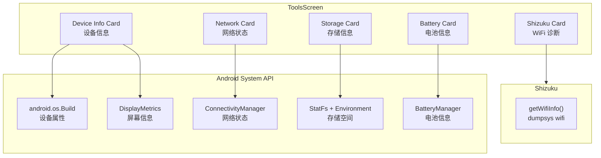
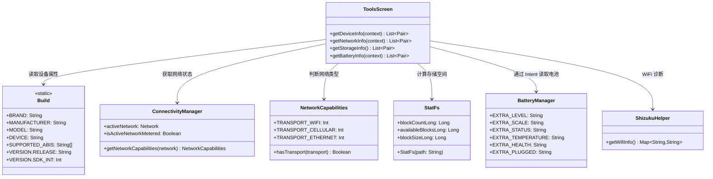
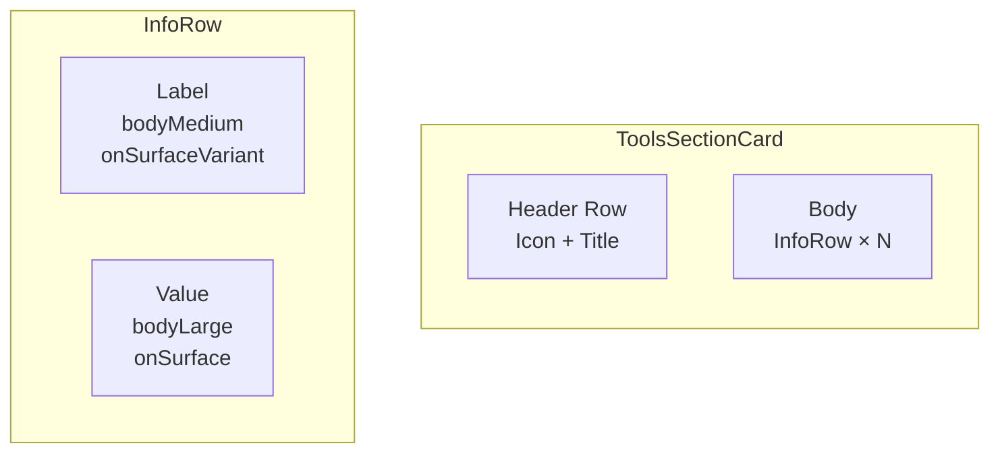

# 04 — 设备工具箱与系统 API

> **对应源码**：`ui/screen/ToolsScreen.kt` / `system/ShizukuHelper.kt`（getWifiInfo）
> **难度**：⭐⭐⭐ | **阅读时间**：40 分钟

---

## 1. 工具箱模块概述

设备工具箱（ToolsScreen）是 Hsiaopu 的「设备诊断面板」，通过 Android 系统 API 和 Shizuku 获取设备实时信息，以卡片形式展示。



---

## 2. 设备信息获取 — 五大核心 API

### 2.1 设备硬件信息（Build 类）

```kotlin
private fun getDeviceInfo(context: Context): List<Pair<String, String>> {
    val density = context.resources.displayMetrics.densityDpi
    val width = context.resources.displayMetrics.widthPixels
    val height = context.resources.displayMetrics.heightPixels

    return listOf(
        "Brand"         to Build.BRAND,           // 品牌：Xiaomi / Samsung
        "Model"         to Build.MODEL,            // 型号：Mi 13 / Galaxy S24
        "Device"        to Build.DEVICE,           // 设备代号：houji / r8q
        "Android"       to Build.VERSION.RELEASE,  // Android 版本：14 / 15
        "SDK"           to Build.VERSION.SDK_INT.toString(),  // SDK 级别：34 / 35
        "CPU"           to Build.SUPPORTED_ABIS.firstOrNull().orEmpty(),  // CPU 架构：arm64-v8a
        "Resolution"    to "${width}x${height}",   // 屏幕分辨率：1080x2400
        "DPI"           to "${density}dpi",        // 屏幕密度：440dpi
        "Manufacturer"  to Build.MANUFACTURER      // 制造商：Xiaomi / Samsung
    )
}
```

#### Build 类常用属性速查

| 属性 | 含义 | 示例值 |
|------|------|--------|
| `Build.BRAND` | 消费品牌 | `Xiaomi` |
| `Build.MANUFACTURER` | 制造商 | `Xiaomi` |
| `Build.MODEL` | 型号 | `23127PN0CC` |
| `Build.DEVICE` | 设备代号 | `houji` |
| `Build.VERSION.RELEASE` | Android 版本 | `14` |
| `Build.VERSION.SDK_INT` | SDK 级别 | `34` |
| `Build.SUPPORTED_ABIS` | 支持的 CPU 架构 | `[arm64-v8a, armeabi-v7a]` |
| `Build.PRODUCT` | 产品名 | `houji` |
| `Build.HARDWARE` | 硬件平台 | `qcom`（高通） |
| `Build.BOARD` | 主板 | `kalama` |

> 💡 **面试要点**：`Build.BRAND` vs `Build.MANUFACTURER` — 大多数情况下两者相同，但有些设备（如 Google Pixel）BRAND=google，MANUFACTURER=Google/Foxconn。

### 2.2 网络状态（ConnectivityManager）

```kotlin
private fun getNetworkInfo(context: Context): List<Pair<String, String>> {
    val cm = context.getSystemService(Context.CONNECTIVITY_SERVICE)
        as? ConnectivityManager

    val network = cm?.activeNetwork          // 当前活跃网络
    val caps = network?.let { cm.getNetworkCapabilities(it) }

    return listOf(
        "Connected" to if (caps != null) "Yes" else "No",
        "Type" to when {
            caps?.hasTransport(NetworkCapabilities.TRANSPORT_WIFI) == true
                -> "WiFi"
            caps?.hasTransport(NetworkCapabilities.TRANSPORT_CELLULAR) == true
                -> "Cellular"
            caps?.hasTransport(NetworkCapabilities.TRANSPORT_ETHERNET) == true
                -> "Ethernet"
            else -> "Unknown"
        },
        "Metered" to if (cm?.isActiveNetworkMetered == true) "Yes" else "No"
    )
}
```

#### NetworkCapabilities 传输类型

| 常量 | 含义 |
|------|------|
| `TRANSPORT_WIFI` | WiFi 网络 |
| `TRANSPORT_CELLULAR` | 移动网络（4G/5G） |
| `TRANSPORT_ETHERNET` | 有线网络 |
| `TRANSPORT_BLUETOOTH` | 蓝牙网络共享 |
| `TRANSPORT_VPN` | VPN 连接 |

### 2.3 存储信息（StatFs）

```kotlin
private fun getStorageInfo(): List<Pair<String, String>> {
    try {
        val stat = StatFs(Environment.getDataDirectory().path)
        val totalBytes = stat.blockCountLong * stat.blockSizeLong
        val availableBytes = stat.availableBlocksLong * stat.blockSizeLong
        val usedBytes = totalBytes - availableBytes

        return listOf(
            "Total"     to formatBytes(totalBytes),
            "Used"      to formatBytes(usedBytes),
            "Available" to formatBytes(availableBytes),
            "Usage"     to if (totalBytes > 0) "${(usedBytes * 100 / totalBytes)}%" else "N/A"
        )
    } catch (_: Exception) {
        return listOf("Status" to "Unavailable")
    }
}

private fun formatBytes(bytes: Long): String {
    val units = arrayOf("B", "KB", "MB", "GB", "TB")
    var value = bytes.toDouble()
    var unitIndex = 0
    while (value >= 1024 && unitIndex < units.size - 1) {
        value /= 1024
        unitIndex++
    }
    return "${String.format("%.1f", value)} ${units[unitIndex]}"
}
```

#### StatFs 核心方法

| 方法 | 含义 | 说明 |
|------|------|------|
| `blockCountLong` | 总块数 | API 18+，替代 `blockCount` |
| `availableBlocksLong` | 可用块数 | 非 root 用户可用的空间 |
| `blockSizeLong` | 块大小（字节） | 通常为 4096 |
| `freeBlocksLong` | 空闲块数 | 包括保留块 |

> 💡 **面试要点**：`availableBlocksLong` vs `freeBlocksLong` — available 是非 root 用户可用的空间（已扣除系统保留），free 是物理空闲空间。一般用 available。

### 2.4 电池信息（BatteryManager + Intent）

```kotlin
private fun getBatteryInfo(context: Context): List<Pair<String, String>> {
    // 注册 null receiver 获取 sticky intent（无需 BroadcastReceiver）
    val intent = context.registerReceiver(
        null,
        IntentFilter(Intent.ACTION_BATTERY_CHANGED)
    )
    if (intent == null) return listOf("Status" to "Unavailable")

    // 电量百分比
    val level = intent.getIntExtra(BatteryManager.EXTRA_LEVEL, -1)
    val scale = intent.getIntExtra(BatteryManager.EXTRA_SCALE, -1)
    val pct = if (scale > 0) (level * 100 / scale) else 0

    // 充电状态
    val status = when (intent.getIntExtra(BatteryManager.EXTRA_STATUS, -1)) {
        BatteryManager.BATTERY_STATUS_CHARGING     -> "Charging"
        BatteryManager.BATTERY_STATUS_DISCHARGING  -> "Discharging"
        BatteryManager.BATTERY_STATUS_FULL         -> "Full"
        BatteryManager.BATTERY_STATUS_NOT_CHARGING -> "Not Charging"
        else -> "Unknown"
    }

    // 充电方式
    val plugged = when (intent.getIntExtra(BatteryManager.EXTRA_PLUGGED, -1)) {
        BatteryManager.BATTERY_PLUGGED_AC       -> "AC"
        BatteryManager.BATTERY_PLUGGED_USB      -> "USB"
        BatteryManager.BATTERY_PLUGGED_WIRELESS -> "Wireless"
        else -> "None"
    }

    // 温度（需要除以 10）
    val temp = intent.getIntExtra(BatteryManager.EXTRA_TEMPERATURE, 0) / 10f

    // 健康度
    val health = when (intent.getIntExtra(BatteryManager.EXTRA_HEALTH, -1)) {
        BatteryManager.BATTERY_HEALTH_GOOD                -> "Good"
        BatteryManager.BATTERY_HEALTH_OVERHEAT            -> "Overheat"
        BatteryManager.BATTERY_HEALTH_DEAD                -> "Dead"
        BatteryManager.BATTERY_HEALTH_OVER_VOLTAGE        -> "Over Voltage"
        BatteryManager.BATTERY_HEALTH_UNSPECIFIED_FAILURE -> "Failure"
        else -> "Unknown"
    }

    return listOf(
        "Level"       to "${pct}%",
        "Status"      to status,
        "Plugged"     to plugged,
        "Temperature" to "${String.format("%.1f", temp)}°C",
        "Health"      to health
    )
}
```

#### BatteryManager Intent Extra 速查

| Extra Key | 类型 | 含义 |
|-----------|------|------|
| `EXTRA_LEVEL` | Int | 当前电量值 |
| `EXTRA_SCALE` | Int | 电量满格值（通常 100） |
| `EXTRA_STATUS` | Int | 充电状态 |
| `EXTRA_PLUGGED` | Int | 充电方式（AC/USB/Wireless） |
| `EXTRA_TEMPERATURE` | Int | 温度（需 ÷10 得到°C） |
| `EXTRA_HEALTH` | Int | 电池健康度 |
| `EXTRA_VOLTAGE` | Int | 电压（mV） |
| `EXTRA_TECHNOLOGY` | String | 电池技术（Li-ion/Li-poly） |

> 💡 **面试要点**：`registerReceiver(null, IntentFilter)` 传入 null receiver 可以接收 **sticky broadcast**（粘性广播），`ACTION_BATTERY_CHANGED` 就是典型的 sticky intent，无需动态注册 BroadcastReceiver。

### 2.5 Shizuku WiFi 诊断

```kotlin
// ShizukuHelper.kt
fun getWifiInfo(): Map<String, String> {
    val result = mutableMapOf<String, String>()
    if (!isAvailable() || !hasPermission())
        return mapOf("Error" to "Shizuku not available")

    try {
        val output = exec("dumpsys wifi")
        output.lines().forEach { line ->
            when {
                line.contains("SSID:") && !line.contains("unknown") ->
                    result["SSID"] = line.substringAfter("SSID:").trim()
                        .removeSurrounding("\"")
                line.contains("BSSID:") ->
                    result["BSSID"] = line.substringAfter("BSSID:").trim()
                        .removeSurrounding("\"")
                line.contains("IP:") ->
                    result["IP"] = line.substringAfter("IP:").trim()
                        .removeSurrounding("\"")
                line.contains("Link speed:") ->
                    result["Speed"] = line.substringAfter("Link speed:").trim()
                line.contains("RSSI:") ->
                    result["RSSI"] = line.substringAfter("RSSI:").trim()
                line.contains("freq:") ->
                    result["Frequency"] = line.substringAfter("freq:").trim()
            }
        }
    } catch (_: Exception) {
        result["Error"] = "Failed to read WiFi info"
    }
    return result.ifEmpty { mapOf("Info" to "No WiFi data available") }
}
```

---

## 3. 系统 API 类图



---

## 4. ToolsScreen UI 卡片设计

### 4.1 卡片结构



### 4.2 卡片组件代码

```kotlin
@Composable
private fun ToolsSectionCard(
    title: String,
    icon: ImageVector,
    content: @Composable ColumnScope.() -> Unit
) {
    Card(
        modifier = Modifier.fillMaxWidth(),
        colors = CardDefaults.cardColors(
            containerColor = MaterialTheme.colorScheme.surface
        ),
        shape = RoundedCornerShape(16.dp)
    ) {
        Column(modifier = Modifier.padding(16.dp)) {
            // === Header ===
            Row(verticalAlignment = Alignment.CenterVertically) {
                Icon(icon, contentDescription = null,
                    tint = MaterialTheme.colorScheme.primary,
                    modifier = Modifier.size(20.dp))
                Spacer(modifier = Modifier.width(8.dp))
                Text(title,
                    style = MaterialTheme.typography.titleMedium,
                    fontWeight = FontWeight.SemiBold,
                    color = MaterialTheme.colorScheme.primary)
            }
            Spacer(modifier = Modifier.height(12.dp))

            // === Body ===
            content()
        }
    }
}

@Composable
private fun InfoRow(label: String, value: String) {
    Row(
        modifier = Modifier.fillMaxWidth().padding(vertical = 4.dp),
        horizontalArrangement = Arrangement.SpaceBetween
    ) {
        Text(label,
            style = MaterialTheme.typography.bodyMedium,
            color = MaterialTheme.colorScheme.onSurfaceVariant,
            modifier = Modifier.weight(0.4f))
        Text(value,
            style = MaterialTheme.typography.bodyLarge,
            color = MaterialTheme.colorScheme.onSurface,
            modifier = Modifier.weight(0.6f),
            fontWeight = FontWeight.Medium)
    }
}
```

### 4.3 五张卡片布局

| 卡片 | 图标 | 数据来源 | 内容 |
|------|------|----------|------|
| **Device Info** | `PhoneAndroid` | `Build` + `DisplayMetrics` | 品牌、型号、Android 版本、SDK、CPU、分辨率、DPI |
| **Network** | `Language` | `ConnectivityManager` | 连接状态、网络类型、是否计费 |
| **Storage** | `Storage` | `StatFs` | 总容量、已用、可用、使用率 |
| **Battery** | `BatteryFull` | `BatteryManager`（Intent） | 电量、状态、充电方式、温度、健康度 |
| **Shizuku** | `Shield` | `ShizukuHelper` | 连接状态 + WiFi 诊断按钮 |

---

## 5. 数据刷新策略

```mermaid
flowchart TD
    START[ToolsScreen 首次渲染] --> REMEMBER[remember {} 块<br/>一次性获取数据]
    REMEMBER --> DIC[getDeviceInfo]
    REMEMBER --> NIC[getNetworkInfo]
    REMEMBER --> SIC[getStorageInfo]
    REMEMBER --> BIC[getBatteryInfo]

    REMEMBER --> SH_CHECK[ShizukuHelper.isAvailable]
    SH_CHECK --> SH_STATE[remember { mutableStateOf }]

    LaunchedEffect --> SH_CHECK2[再次检查 Shizuku 状态]

    STYLE[点击按钮] --> WIFI[getWifiInfo<br/>手动触发]
```

### 当前刷新策略

| 数据类型 | 刷新策略 | 原因 |
|----------|----------|------|
| 设备信息 | 页面打开时一次性获取 | 设备信息不会变化（除非 OTA 升级） |
| 网络状态 | 页面打开时一次性获取 | 可扩展为实时监听 |
| 存储信息 | 页面打开时一次性获取 | 变化频率低 |
| 电池信息 | 页面打开时一次性获取 | 可扩展为定时刷新 |
| Shizuku 状态 | `LaunchedEffect` 检查 | 需要确认权限状态 |
| WiFi 诊断 | 用户手动点击按钮 | 避免不必要的 dumpsys 调用 |

> 💡 **可扩展点**：可添加下拉刷新（`pullRefresh`）、定时刷新（`LaunchedEffect` + `delay`）、或使用 `ConnectivityManager.NetworkCallback` 监听网络变化。

---

## 6. 权限要求

| 权限 | 用途 | 是否需要动态申请 |
|------|------|-----------------|
| `INTERNET` | 网络访问 | 否（普通权限） |
| `ACCESS_NETWORK_STATE` | 获取网络状态 | 否（普通权限） |
| `ACCESS_WIFI_STATE` | WiFi 信息 | 否（普通权限） |
| Shizuku 权限 | 执行系统命令 | 通过 Shizuku 授权流程 |

Hsiaopu 的 `AndroidManifest.xml` 中声明的权限：

```xml
<uses-permission android:name="android.permission.INTERNET" />
<uses-permission android:name="android.permission.ACCESS_NETWORK_STATE" />
```

---

## 7. 面试中如何讲解工具箱模块

### 推荐回答结构（2 分钟版本）

> **"设备工具箱模块通过 Android 系统 API 和 Shizuku 获取设备实时信息，以 Material 3 卡片形式展示。"**
>
> **"设备信息通过 android.os.Build 类获取，包括品牌、型号、Android 版本、SDK 级别、CPU 架构等。网络状态使用 ConnectivityManager 和 NetworkCapabilities 判断连接类型和计费状态。存储信息通过 StatFs 计算总容量、已用空间和使用率。电池信息通过接收 ACTION_BATTERY_CHANGED 粘性广播获取电量、充电状态、温度和健康度。"**
>
> **"UI 层面，我封装了 ToolsSectionCard 组件，统一了卡片的 Header（图标 + 标题）和 Body（InfoRow 键值对）的样式。数据获取使用 Compose 的 remember 块在首次渲染时执行，避免不必要的重复计算。"**
>
> **"Shizuku 卡片提供 WiFi 诊断功能，通过 dumpsys wifi 输出解析 SSID、BSSID、IP 地址、链路速度和 RSSI 信号强度。"**

### 面试官追问应对

| 追问方向 | 回答要点 |
|----------|----------|
| **StatFs 为什么要用 Long 版本？** | `blockCount` 返回 int，32 位最大值约 2TB。`blockCountLong` 返回 long，支持大容量存储。API 18+ 才可用 |
| **粘性广播的原理？** | 系统发送后保留在 ActivityManagerService 中，后续注册的接收者可以立即收到最后一次广播。`ACTION_BATTERY_CHANGED` 就是粘性广播 |
| **如何实现实时刷新？** | 可以用 `ConnectivityManager.NetworkCallback` 监听网络变化，用 `BatteryManager.BATTERY_PROPERTY_CAPACITY` 定时轮询电池，用 `FileObserver` 监听存储变化 |
| **为什么不用 WifiManager 获取 WiFi 信息？** | `WifiManager.getConnectionInfo()` 在 Android 10+ 中返回的信息受限（BSSID 为 `02:00:00:00:00:00`），通过 Shizuku 执行 `dumpsys wifi` 可以获取完整信息 |

---

> **上一章**：[03 — Shell 终端与 Shizuku 集成](./03-Shell终端与Shizuku集成.md)
> **下一章**：[05 — 面试模拟与项目答辩](./05-面试模拟与项目答辩.md)