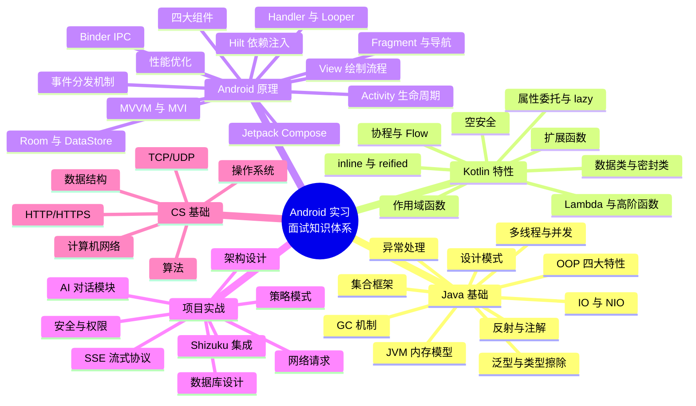
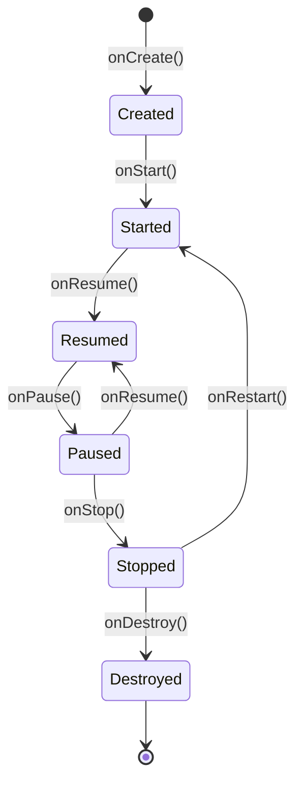
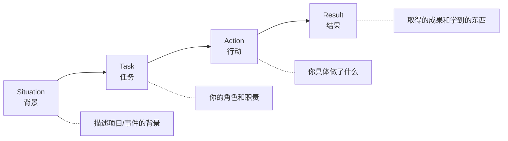
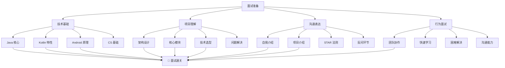

# 05 — 面试模拟与项目答辩

> **难度**：⭐⭐⭐⭐ | **阅读时间**：90 分钟
> **建议**：面试前反复练习本章内容，至少模拟 3 次完整面试流程

---

## 1. 面试知识体系脑图



---

## 2. 自我介绍模板（3 分钟版本）

### 模板结构

| 时间段 | 内容 | 占比 |
|--------|------|------|
| 0-30s | 基本信息 + 教育背景 | 15% |
| 30s-1.5min | 技术栈 + 核心能力 | 40% |
| 1.5min-2.5min | 项目经历（Hsiaopu 重点） | 35% |
| 2.5min-3min | 个人优势 + 求职意向 | 10% |

### 实战模板

> 面试官您好，我叫 **[你的名字]**，目前在 **[学校]** 读 **[专业]**，**[年级]**。
>
> 我主要使用 **Kotlin** 进行 Android 开发，熟悉 **Jetpack Compose** 声明式 UI、**MVVM 架构**、**Hilt 依赖注入** 等现代 Android 开发技术栈。同时掌握 **Java** 基础，了解面向对象、集合框架、多线程等核心知识。
>
> 最近我独立开发了一个名为 **Hsiaopu** 的 Android 全功能 AI 工作台。这个项目集成了三个核心模块：
>
> 第一是 **AI 对话模块**，我采用策略模式支持 DeepSeek 和 OpenAI 兼容两种 AI Provider，通过 OkHttp 实现 SSE 流式输出，自研了 Markdown 解析器，使用 Room 数据库存储对话历史。
>
> 第二是 **Shizuku Shell 终端**，我通过 Shizuku 框架实现了系统级命令执行，封装了 22 个预定义命令，覆盖系统、网络、进程、存储等 6 个类别，还实现了 AI 直接控制设备（WiFi、蓝牙、亮度等）的功能。
>
> 第三是 **设备工具箱**，通过 Android 系统 API 和 Shizuku 获取设备信息、网络状态、存储空间和电池健康度，以 Material 3 卡片形式展示。
>
> 整个项目使用 **MVVM 架构 + Hilt 依赖注入**，UI 层使用 **Jetpack Compose + Material 3**，严格遵循单向数据流。
>
> 我擅长快速学习新技术，对代码质量有追求，希望能在贵公司实习期间深入参与真实项目，提升工程能力。

---

## 3. 项目介绍模板（STAR 法则）

### STAR 法则公式

| 字母 | 含义 | 要点 |
|------|------|------|
| **S**ituation | 背景 | 为什么做这个项目？解决了什么问题？ |
| **T**ask | 任务 | 你的角色和职责是什么？ |
| **A**ction | 行动 | 你具体做了什么？用了什么技术？ |
| **R**esult | 结果 | 取得了什么成果？学到了什么？ |

### 实战模板

> **S**：作为一名 Android 开发者，我发现市面上的 AI 助手应用大多功能单一，缺乏对设备层面的深度控制。同时，我在学习 Android 系统开发时，需要一个能直接执行系统命令的工具。
>
> **T**：我决定独立开发一个集 AI 对话、Shell 终端和设备诊断于一体的 Android 应用，以此实践现代 Android 开发技术栈并展示我的工程能力。
>
> **A**：
> - 使用 **MVVM + Hilt + Compose** 搭建项目架构，严格遵循单向数据流
> - 采用**策略模式**设计 AI Provider 接口，支持 DeepSeek 和 OpenAI 兼容两种后端
> - 通过 **OkHttp 直接处理 SSE 流式协议**，实现逐 token 实时渲染
> - 集成 **Shizuku** 框架实现系统级权限提升，封装 22 个预定义命令
> - 使用 **Room + DataStore** 实现对话历史持久化和用户偏好存储
> - 自研轻量级 **Markdown 解析器**，支持标题、代码块、列表等语法
>
> **R**：
> - 完成了从 0 到 1 的全流程开发，包含 3 个核心功能模块
> - 掌握了 Kotlin 协程与 Flow 在 Android 中的实际应用
> - 深入理解了 Binder IPC、SSE 协议、Shizuku 权限模型等底层原理
> - 代码结构清晰，分层合理，具备良好的可扩展性

---

## 4. 高频面试问题清单

### 4.1 Java 基础（10 题）

#### Q1: Java 中 == 和 equals 的区别？

**参考答案**：
- `==` 比较的是**引用地址**（栈内存中的地址值）
- `equals()` 默认也是比较引用地址，但 `String`、`Integer` 等包装类重写了 `equals()`，比较的是**内容**
- 自定义类需要重写 `equals()` 和 `hashCode()` 才能实现内容比较

```java
String a = new String("hello");
String b = new String("hello");
a == b;      // false（不同对象）
a.equals(b); // true（内容相同）
```

#### Q2: HashMap 的底层原理？

**参考答案**：
- JDK 1.8 之前：数组 + 链表
- JDK 1.8+：数组 + 链表/红黑树（链表长度 ≥ 8 且数组长度 ≥ 64 时转为红黑树）
- 通过 `hash(key) % capacity` 计算桶位置
- 非线程安全，多线程下可用 `ConcurrentHashMap`
- 默认容量 16，负载因子 0.75，扩容时容量翻倍

#### Q3: Java 中创建线程有几种方式？

**参考答案**：
1. 继承 `Thread` 类，重写 `run()` 方法
2. 实现 `Runnable` 接口
3. 实现 `Callable` 接口 + `FutureTask`（有返回值）
4. 使用线程池 `ExecutorService`

```java
// 线程池（推荐）
ExecutorService executor = Executors.newFixedThreadPool(4);
executor.submit(() -> { /* task */ });
```

#### Q4: synchronized 和 Lock 的区别？

**参考答案**：

| 维度 | synchronized | Lock（ReentrantLock） |
|------|-------------|----------------------|
| 类型 | Java 关键字 | 接口 |
| 锁获取 | 自动获取/释放 | 手动 `lock()`/`unlock()` |
| 公平性 | 非公平锁 | 可指定公平/非公平 |
| 可中断 | 不可中断 | `lockInterruptibly()` |
| 条件变量 | `wait()/notify()` | `Condition` |
| 性能 | JDK 1.6+ 优化后接近 | 略高（灵活） |

#### Q5: Java 内存模型（JMM）是什么？

**参考答案**：
- JMM 定义了**主内存**和**工作内存**的抽象关系
- 所有变量存储在主内存中，线程操作变量时需先从主内存拷贝到工作内存
- `volatile` 保证可见性（修改立即刷回主内存）和有序性（禁止指令重排序）
- `synchronized` 保证原子性、可见性、有序性

#### Q6: String、StringBuilder、StringBuffer 的区别？

**参考答案**：
- `String`：不可变类，每次修改创建新对象，适合少量字符串操作
- `StringBuilder`：可变，非线程安全，性能高，适合单线程大量拼接
- `StringBuffer`：可变，线程安全（方法用 `synchronized` 修饰），性能较低

#### Q7: 什么是泛型擦除？

**参考答案**：
- Java 泛型在编译后会**擦除类型信息**，变成原始类型
- `List<String>` 和 `List<Integer>` 在运行时都是 `List`
- 好处：兼容旧版本 JVM
- 坏处：无法在运行时获取泛型类型（可通过反射绕过）

#### Q8: 抽象类和接口的区别？

**参考答案**：

| 维度 | 抽象类 | 接口 |
|------|--------|------|
| 关键字 | `abstract class` | `interface` |
| 构造方法 | 有 | 无 |
| 成员变量 | 任意类型 | 只能 `public static final` |
| 方法 | 抽象 + 具体 | 抽象 + `default` + `static`（JDK 8+） |
| 多继承 | 单继承 | 多实现 |
| 设计理念 | "is-a" 关系 | "can-do" 能力 |

#### Q9: 什么是反射？有什么应用场景？

**参考答案**：
- 反射是在运行时动态获取类信息和操作对象的能力
- 核心类：`Class`、`Field`、`Method`、`Constructor`
- 应用场景：框架开发（Spring、Hilt）、注解处理、动态代理、插件化
- 在 Hsiaopu 中，ShizukuHelper 通过反射调用 `newProcess()` 绕过 `@RestrictTo` 限制

```java
// 反射示例
Class<?> clazz = Class.forName("com.example.MyClass");
Method method = clazz.getDeclaredMethod("myMethod");
method.setAccessible(true);
method.invoke(instance);
```

#### Q10: 单例模式的几种实现方式？

**参考答案**：
1. **饿汉式**：类加载时创建，线程安全，浪费内存
2. **懒汉式**：首次调用时创建，需加锁保证线程安全
3. **双重检查锁（DCL）**：`volatile` + `synchronized`，推荐
4. **静态内部类**：利用类加载机制，优雅且线程安全
5. **枚举**：最安全，防止反射和序列化破坏

```java
// 静态内部类（推荐）
public class Singleton {
    private Singleton() {}
    private static class Holder {
        static final Singleton INSTANCE = new Singleton();
    }
    public static Singleton getInstance() {
        return Holder.INSTANCE;
    }
}
```

---

### 4.2 Kotlin 特性（8 题）

#### Q11: Kotlin 的空安全机制是怎样的？

**参考答案**：
- 类型分为可空（`String?`）和非空（`String`），编译期检查
- 安全调用：`str?.length`（为 null 时返回 null）
- Elvis 操作符：`str?.length ?: 0`（为 null 时返回默认值）
- 非空断言：`str!!`（为 null 时抛 NPE，慎用）
- `let` 安全调用：`str?.let { println(it) }`
- 平台类型：来自 Java 的类型默认是可空的（`String!`）

#### Q12: Kotlin 协程的挂起（suspend）原理？

**参考答案**：
- `suspend` 函数可以被挂起，不阻塞线程
- 编译器会将 `suspend` 函数转换为状态机（CPS 变换）
- 挂起点通过 `Continuation` 传递，恢复时从上次挂起点继续执行
- 协程在 `Dispatchers.IO` 等调度器上运行，由线程池执行

```kotlin
// 编译前
suspend fun fetchData(): String {
    delay(1000)  // 挂起点
    return "data"
}

// 编译后（伪代码）
fun fetchData(continuation: Continuation<String>): Any? {
    // 状态机：state=0 → delay → state=1 → return
}
```

#### Q13: Flow 和 LiveData 的区别？

**参考答案**：

| 维度 | Flow | LiveData |
|------|------|----------|
| 类型 | 冷流/热流 | 热流 |
| 生命周期感知 | 需配合 `repeatOnLifecycle` | 自动感知 |
| 操作符 | 丰富（map/filter/flatMap 等） | 有限（map/switchMap） |
| 线程切换 | `flowOn(Dispatchers.IO)` | 自动在主线程 |
| 用途 | 复杂异步数据流 | 简单 UI 数据绑定 |

#### Q14: 数据类（data class）和普通类的区别？

**参考答案**：
- `data class` 自动生成 `equals()`、`hashCode()`、`toString()`、`copy()`、`componentN()`
- 必须至少有一个主构造函数参数
- 不能是 abstract、open、sealed、inner
- 解构声明：`val (name, age) = person`

```kotlin
data class User(val name: String, val age: Int)

// 自动生成的方法
val u1 = User("Alice", 20)
val u2 = u1.copy(age = 21)   // copy()
println(u1)                   // toString(): User(name=Alice, age=20)
u1 == User("Alice", 20)      // true
```

#### Q15: 密封类（sealed class）的作用？

**参考答案**：
- 限制子类必须在同一文件中定义
- `when` 表达式可以穷举所有分支，无需 `else`
- 适合表示有限状态（如网络请求的 Success/Error/Loading）

```kotlin
// Hsiaopu 中的 Markdown 解析
sealed class MarkdownSegment {
    data class Text(val text: String, val isBold: Boolean = false) : MarkdownSegment()
    data class Code(val code: String) : MarkdownSegment()
    data class Header(val text: String) : MarkdownSegment()
    data class ListItem(val bullet: String, val text: String) : MarkdownSegment()
}
```

#### Q16: Kotlin 中的作用域函数有哪些？

**参考答案**：

| 函数 | 对象引用 | 返回值 | 典型场景 |
|------|----------|--------|----------|
| `let` | `it` | Lambda 结果 | 空安全调用、变量作用域限制 |
| `run` | `this` | Lambda 结果 | 对象配置 + 计算结果 |
| `with` | `this` | Lambda 结果 | 对同一对象多次操作 |
| `apply` | `this` | 对象本身 | 对象初始化配置 |
| `also` | `it` | 对象本身 | 附加操作（日志、校验） |

```kotlin
// apply：配置对象
val intent = Intent().apply {
    putExtra("key", "value")
    flags = Intent.FLAG_ACTIVITY_NEW_TASK
}

// let：空安全
val length = nullableString?.let { it.length } ?: 0

// also：附加操作
val result = fetchData().also { Log.d("TAG", "result: $it") }
```

#### Q17: inline 和 reified 的作用？

**参考答案**：
- `inline`：将函数体直接复制到调用处，避免函数调用开销
- `reified`：配合 `inline` 使用，在运行时保留泛型类型信息
- 应用场景：简化泛型代码，避免传递 `Class<T>` 参数

```kotlin
// 普通泛型（类型擦除）
fun <T> foo(item: T) {
    // 无法获取 T 的类型
}

// reified（类型保留）
inline fun <reified T> foo(item: T) {
    println(T::class.java)  // 可以获取类型
}
```

#### Q18: Kotlin 的 lazy 委托原理？

**参考答案**：
- `by lazy` 是**属性委托**，第一次访问时执行 lambda 并缓存结果
- 默认线程安全（`LazyThreadSafetyMode.SYNCHRONIZED`）
- 底层使用 `SynchronizedLazyImpl`，通过 `synchronized` + `volatile` 保证线程安全
- 实际应用：`ShizukuHelper.newProcessMethod` 使用 `by lazy` 延迟初始化反射方法

```kotlin
// Hsiaopu 中的实际使用
private val newProcessMethod by lazy {
    Shizuku::class.java.getDeclaredMethod(
        "newProcess",
        Array<String>::class.java,
        Array<String>::class.java,
        String::class.java
    ).also { it.isAccessible = true }
}
```

---

### 4.3 Android 原理（12 题）

#### Q19: Activity 的生命周期？

**参考答案**：



- **onCreate**：初始化（布局、ViewModel、数据绑定），只调用一次
- **onStart**：Activity 即将可见
- **onResume**：Activity 获得焦点，用户可交互
- **onPause**：失去焦点（部分可见），保存轻量数据
- **onStop**：完全不可见，释放重资源
- **onDestroy**：销毁前，清理资源

#### Q20: 四大组件分别是什么？各自的作用？

**参考答案**：

| 组件 | 作用 | 注册方式 | 生命周期 |
|------|------|----------|----------|
| **Activity** | 用户界面 | Manifest | 由系统管理 |
| **Service** | 后台任务 | Manifest | 独立于 Activity |
| **BroadcastReceiver** | 接收广播 | Manifest/动态 | 极短（onReceive） |
| **ContentProvider** | 数据共享 | Manifest | 应用启动时初始化 |

#### Q21: Handler 机制的原理？

**参考答案**：
- 核心三要素：`Handler`（发送/处理消息）、`MessageQueue`（消息队列）、`Looper`（循环取消息）
- 每个线程最多一个 Looper，主线程默认有 `Looper.mainLooper()`
- `Handler.sendMessage()` → 消息入队 → Looper 循环取出 → Handler.dispatchMessage() 处理
- 作用：线程间通信（子线程 → 主线程更新 UI）

#### Q22: View 的绘制流程？

**参考答案**：
1. **Measure**：测量 View 的宽高（`measure()` → `onMeasure()`）
2. **Layout**：确定 View 的位置（`layout()` → `onLayout()`）
3. **Draw**：绘制 View 的内容（`draw()` → `onDraw()`）
- 入口：`ViewRootImpl.performTraversals()`
- MeasureSpec 模式：`EXACTLY`（精确）、`AT_MOST`（不超过）、`UNSPECIFIED`（无限制）

#### Q23: ANR 是什么？如何避免？

**参考答案**：
- ANR（Application Not Responding）：应用无响应
- 触发条件：主线程阻塞超过 5s（输入事件）/ 10s（BroadcastReceiver）/ 20s（Service）
- 避免方法：
  - 耗时操作放子线程（协程、线程池）
  - BroadcastReceiver 中避免耗时操作
  - 使用 `AsyncTask`（已废弃）或协程

#### Q24: Binder IPC 的原理？

**参考答案**：
- Binder 是 Android 的进程间通信（IPC）机制
- 基于 C/S 架构：Client → Binder Driver → Server
- 数据只拷贝一次（`copy_from_user`），性能优于 Socket/Pipe
- 所有系统服务（AMS、WMS、PMS）都是通过 Binder 通信
- Shizuku 也是基于 Binder IPC 实现权限提升

#### Q25: Jetpack Compose 的重组（Recomposition）机制？

**参考答案**：
- 当 `State` 变化时，Compose 标记依赖该 State 的 Composable 为「失效」
- 下一帧重组这些 Composable，跳过未变化的
- 智能跳过：位置没变、参数没变、key 没变 → 跳过重组
- `remember`：在重组中保留值
- `derivedStateOf`：仅当依赖变化时才重新计算

#### Q26: Room 数据库的 Migration 如何处理？

**参考答案**：
- Room 支持版本迁移：`@Database(version = 2)`
- 定义 Migration：`Migration(1, 2) { database -> ... }`
- 破坏性迁移（开发阶段）：`fallbackToDestructiveMigration()`
- Hsiaopu 当前版本为 1，未涉及迁移

```kotlin
val MIGRATION_1_2 = object : Migration(1, 2) {
    override fun migrate(database: SupportSQLiteDatabase) {
        database.execSQL("ALTER TABLE conversations ADD COLUMN summary TEXT")
    }
}
```

#### Q27: Hilt 的组件层次和生命周期？

**参考答案**：

| 组件 | 作用域 | 生命周期 |
|------|--------|----------|
| `@Singleton` | 全局 | Application 整个生命周期 |
| `@ViewModelScoped` | ViewModel | ViewModel 存活期间 |
| `@ActivityScoped` | Activity | Activity 存活期间 |
| `@FragmentScoped` | Fragment | Fragment 存活期间 |
| 无作用域 | 每次注入新建 | 用完即弃 |

```kotlin
// Hsiaopu 中的实际使用
@Singleton           // 全局单例
class AiProviderRegistry @Inject constructor(...)

@HiltViewModel       // ViewModel 作用域
class ChatViewModel @Inject constructor(...)
```

#### Q28: OkHttp 拦截器的作用？

**参考答案**：
- 拦截器链：Application Interceptor → Network Interceptor
- 应用拦截器：在请求发送前/响应返回后处理（添加 Header、日志）
- 网络拦截器：在网络层处理（重定向、缓存、重试）
- 可添加自定义拦截器（如添加 API Key、Token 刷新）

```kotlin
// 常见用法：添加认证 Header
val client = OkHttpClient.Builder()
    .addInterceptor { chain ->
        val request = chain.request().newBuilder()
            .addHeader("Authorization", "Bearer $apiKey")
            .build()
        chain.proceed(request)
    }
    .build()
```

#### Q29: Android 中的内存泄漏常见场景？

**参考答案**：
1. **非静态内部类持有外部类引用**（Handler、Thread）
2. **静态变量持有 Context/Activity**
3. **单例持有 Context**（用 ApplicationContext 代替）
4. **未取消的注册**（BroadcastReceiver、Listener）
5. **资源未关闭**（Cursor、InputStream、Bitmap）
6. **WebView 内存泄漏**（独立进程或手动销毁）

#### Q30: ProGuard/R8 混淆的作用？

**参考答案**：
- 代码压缩（移除无用代码）
- 资源压缩（移除无用资源）
- 混淆（类名/方法名改为无意义名称）
- 优化（内联、简化代码）
- Hsiaopu 中配置了 `proguard-rules.pro`，但当前为默认配置

---

### 4.4 项目相关（15 题）

#### Q31: 请介绍一下 Hsiaopu 的整体架构？

**参考答案**：
> 采用 MVVM 架构 + Hilt 依赖注入。分为五层：UI 层（Compose + Material 3）、ViewModel 层（ChatViewModel 统一状态管理）、Data 层（Room + DataStore）、Network 层（策略模式 + OkHttp SSE）、System 层（Shizuku）。严格遵循单向数据流：User Action → ViewModel → Repository/Provider → StateFlow → UI Recomposition。

#### Q32: 为什么选择 MVVM 架构？

**参考答案**：
- Google 官方推荐的 Android 架构
- ViewModel 与 Compose 天然契合，StateFlow 驱动 UI 重组
- 解耦 UI 和业务逻辑，便于单元测试
- 相比 MVP，减少了 View 接口定义
- 相比 MVI，降低了学习成本和模板代码

#### Q33: 你的 AI 对话模块如何支持多种 AI Provider？

**参考答案**：
> 使用策略模式。定义 `AiProvider` 接口（sendMessage、sendMessageStream、estimateCost），`DeepSeekProvider` 和 `OpenAICompatibleProvider` 分别实现。`AiProviderRegistry` 作为注册中心，根据 `providerId` 路由到对应 Provider。用户可以在设置页面切换 Provider，无需修改业务代码。

#### Q34: SSE 流式输出是如何实现的？

**参考答案**：
> 使用 OkHttp 直接发起 POST 请求，设置 `Accept: text/event-stream` 头。从 ResponseBody 的 source 逐行读取，每行以 `data: ` 开头，解析 JSON 中的 `delta.content` 字段，通过 Kotlin Flow 的 `emit` 逐块推送给 UI。当遇到 `data: [DONE]` 时关闭流。

#### Q35: 为什么不用 Retrofit 的 @Streaming 注解？

**参考答案**：
> Retrofit 的 `@Streaming` 返回 `Response<ResponseBody>`，需要手动处理 SSE 协议。直接用 OkHttp 更灵活，对 SSE 的逐行解析（`readUtf8Line()`）更友好，且可以精确控制流式读取的细节。

#### Q36: 你的 Markdown 解析器支持哪些语法？

**参考答案**：
> 自研轻量级解析器，支持：标题（#/##/###）、粗体（**text**）、行内代码（`code`）、代码块（```...```）、列表（-/*/1.）。解析结果用密封类 `MarkdownSegment` 表示，Compose 渲染时根据类型分发到不同组件。

#### Q37: Shizuku 的工作原理是什么？

**参考答案**：
> Shizuku 通过 ADB 启动一个独立 Server 进程（拥有 ADB Shell 权限），普通应用通过 Binder IPC 与 Server 通信，调用 `newProcess()` 创建子进程执行系统命令。授权流程：启动 Shizuku → ADB 激活 → 应用请求权限 → 用户授权 → 执行命令。

#### Q38: 你的 ShizukuHelper 为什么用反射？

**参考答案**：
> Shizuku 13+ 将 `newProcess()` 方法标记为 `@RestrictTo(LIBRARY_GROUP)`，Kotlin 编译器禁止直接调用。通过反射获取该方法并调用，功能完全一致。这是为了兼容 Shizuku 最新版本的权宜之计。

#### Q39: 你是如何实现 AI 控制设备的？

**参考答案**：
> 在系统提示词中注入工具列表，告知 AI 可用的命令格式 `[TOOL:action_name:param=value]`。AI 回复中如果包含此标记，ChatViewModel 通过正则解析后调用 SystemControlExecutor 执行对应操作。执行结果替换回消息中，必要时再发起第二轮 AI 对话让 AI 总结执行结果。

#### Q40: Room 数据库的 Schema 设计是怎样的？

**参考答案**：
> 两张表：`conversations`（id、title、createdAt、updatedAt）和 `messages`（id、conversationId、role、content、timestamp）。一对多关系，通过 `conversationId` 外键关联。查询使用 `Flow<List<>>` 实现实时观察。

#### Q41: 应用中如何处理网络错误？

**参考答案**：
- 网络监测：通过 `ConnectivityManager` 每 5 秒轮询一次，UI 显示离线状态条
- API 调用：try-catch 包裹，错误信息写入 `ChatUiState.error`
- 优雅降级：离线时消息仍可查看（Room 缓存），仅阻止发送
- 用户提示：Snackbar 显示错误信息，可手动关闭

#### Q42: 如果让你重新设计，你会做哪些改进？

**参考答案**：
1. **多模块拆分**：将 network、data、system 拆分为独立 Gradle 模块
2. **单元测试**：为 ViewModel、Repository、Provider 添加 JUnit + MockK 测试
3. **CI/CD**：接入 GitHub Actions 自动构建和测试
4. **SSE 断线重连**：实现自动重连和重试机制
5. **离线支持**：消息队列缓存未发送的消息
6. **性能优化**：添加 Baseline Profile 和 R8 完整配置
7. **无障碍**：添加 contentDescription 和语义标注

#### Q43: 项目中遇到的最大挑战是什么？

**参考答案**：
> 最大的挑战是 Shizuku 13+ 的兼容性问题。`newProcess()` 被标记为 `@RestrictTo` 后无法直接调用。我通过阅读 Shizuku 源码和 API 文档，决定使用反射绕过限制。这个过程中我深入理解了 Binder IPC 和 Shizuku 的权限模型，也学会了如何在框架限制下找到替代方案。

#### Q44: 项目中哪些地方用到了设计模式？

**参考答案**：

| 设计模式 | 应用位置 | 说明 |
|----------|----------|------|
| 策略模式 | `AiProvider` + `AiProviderRegistry` | 多 Provider 切换 |
| 单例模式 | `ShizukuHelper`、`ShellExecutor`、`SystemControlExecutor` | Kotlin `object` |
| 观察者模式 | `StateFlow` + `collectAsState()` | 数据驱动 UI |
| 工厂模式 | `AiProviderRegistry.getProvider()` | 根据 ID 创建 Provider |
| 建造者模式 | `OkHttpClient.Builder()` | 构建 OkHttp 客户端 |
| 仓库模式 | `ChatRepository` | 统一数据访问接口 |

#### Q45: 你对 Kotlin 协程的理解？在项目中怎么用的？

**参考答案**：
> 协程是 Kotlin 的轻量级并发框架，核心是「挂起而非阻塞」。在 Hsiaopu 中，所有网络请求（SSE 流式读取）、数据库操作（Room）、Shell 命令执行都使用协程。通过 `viewModelScope` 管理协程生命周期，`Dispatchers.IO` 执行耗时操作，`Flow` 实现响应式数据流。

---

## 5. 面试反问环节

### 你可以问面试官的问题

一个好的反问能展示你的思考深度和对公司的兴趣。以下是推荐的反问清单：

#### 技术方向

| 问题 | 为什么这样问 |
|------|------------|
| 团队目前的技术栈是什么？主要使用 Kotlin 还是 Java？ | 展示你对技术选型的关注 |
| 团队在 Compose 和 View 体系的占比如何？ | 了解团队的技术演进方向 |
| 项目的代码审查流程是怎样的？有 CI/CD 吗？ | 展示你对工程质量的重视 |
| 团队的架构是 MVVM 还是 MVI？ | 了解团队的技术深度 |

#### 成长方向

| 问题 | 为什么这样问 |
|------|------------|
| 实习生通常会参与什么样的工作？ | 了解实习内容的含金量 |
| 公司对实习生有 mentor 机制吗？ | 展示你对成长的重视 |
| 团队的技术分享氛围如何？ | 了解团队文化 |
| 转正的标准和流程是怎样的？ | 展示你的长期规划 |

#### 业务方向

| 问题 | 为什么这样问 |
|------|------------|
| 我负责的模块大概有多少用户？ | 了解业务规模 |
| 团队目前在攻克什么技术难题？ | 了解团队的技术挑战 |
| 这个季度/年度的技术目标是什么？ | 了解团队方向 |

> ⚠️ **不要问的问题**：
> - 薪资待遇（HR 面再问）
> - 加班多不多（太早问显得消极）
> - 公司是做什么的（说明你没做功课）
> - 我表现怎么样（让面试官为难）

---

## 6. 行为面试准备

### 6.1 常见行为问题

#### 团队协作

> **问题**：你有过团队协作的经历吗？遇到冲突怎么解决？

**参考答案**（STAR 法则）：
> **S**：在一次课程项目中，我和队友对技术选型有分歧。我想用 Kotlin + Compose，他想用传统 View 体系。
> **T**：我们需要在 3 天内确定技术方案并开始开发。
> **A**：我主动整理了两套方案的对比文档（开发效率、学习成本、可维护性），发起了一个 15 分钟的讨论会。最终我们达成共识：用 Compose 作为主要方案，但对复杂自定义 View 保留降级方案。
> **R**：项目按时完成，我们也在过程中互相学习了对方的技术栈。

#### 快速学习

> **问题**：举一个你快速学习新技术的例子？

**参考答案**：
> **S**：在开发 Hsiaopu 时，我需要集成 Shizuku，但之前完全不了解 Binder IPC 和 Shizuku 的权限模型。
> **T**：需要在 3 天内从零实现 Shizuku 连接和命令执行。
> **A**：我花了半天阅读 Shizuku 官方文档和源码，理解了 `pingBinder`、`checkSelfPermission`、`newProcess` 的调用链。然后用半天搭建了 ShizukuHelper 的基础框架，最后 2 天完成了完整的 ShellExecutor 和 22 个预定义命令。
> **R**：不仅完成了功能，还深入理解了 Binder IPC 机制和 Android 权限系统。

#### 困难解决

> **问题**：遇到一个你解决不了的技术问题，你会怎么办？

**参考答案**：
> 1. **先自己排查**：阅读源码、看日志、搜索错误信息
> 2. **缩小问题范围**：写最小复现代码，排除无关因素
> 3. **寻求帮助**：Stack Overflow、GitHub Issues、开源社区
> 4. **总结记录**：解决后记录问题原因和解决方案，避免重复踩坑

### 6.2 行为面试 STAR 框架



---

## 7. 面试 Checklist

### 面试前 1 天

- [ ] 复习 Java 基础（集合、多线程、JVM）
- [ ] 复习 Kotlin 特性（协程、Flow、作用域函数）
- [ ] 复习 Android 原理（四大组件、Handler、Binder）
- [ ] 熟读 Hsiaopu 项目代码，能画出架构图
- [ ] 准备 3 分钟自我介绍（脱稿练习 3 遍）
- [ ] 准备项目介绍（STAR 法则，脱稿练习 3 遍）
- [ ] 准备 3 个反问问题
- [ ] 了解目标公司的业务和技术栈

### 面试前 1 小时

- [ ] 检查网络和设备（线上面试）
- [ ] 准备好简历和项目代码（打开 IDE）
- [ ] 准备好白纸和笔（手写代码环节）
- [ ] 调整心态：深呼吸，你是来交流的，不是来考试的

### 面试中

- [ ] 听清问题再回答，不确定可以请面试官澄清
- [ ] 回答用 STAR 法则结构化
- [ ] 不会的问题坦诚说「不太了解」，但补充相关知识点
- [ ] 回答完可以说「这是我的理解，您看有没有遗漏」
- [ ] 保持微笑和眼神交流

### 面试后

- [ ] 记录面试中的问题（特别是没答好的）
- [ ] 发送感谢邮件（24 小时内）
- [ ] 复盘：哪些问题可以回答得更好？

---

## 8. 总结



---

> **核心建议**：面试不是考试，而是一次技术交流。展现你的思考过程比给出正确答案更重要。祝面试顺利！🎉

> **上一章**：[04 — 设备工具箱与系统 API](./04-设备工具箱与系统API.md)