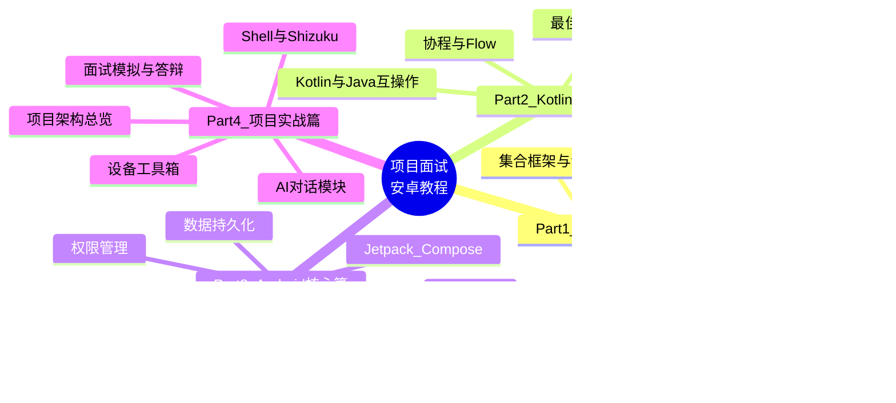
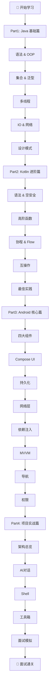
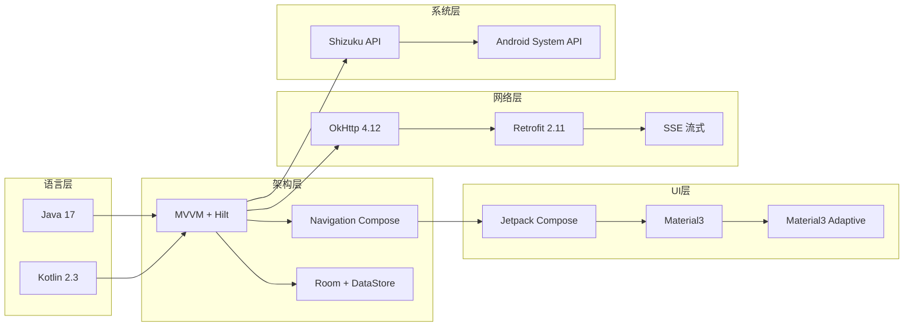

# 🎓 项目面试安卓教程 DS版本

> 基于 **Hsiaopu 全功能 AI 工作台** 项目，从 Java / Kotlin / Android / 项目实战 四个维度，系统化学习 Android 开发，备战实习面试。

---

## 📖 教程概览

本教程以真实项目 `Hsiaopu` 为蓝本，覆盖从 Java 基础到 Android 高级开发的完整知识体系，帮助你在实习面试中脱颖而出。

---

## 🗺️ 学习路线图

---

## 📚 目录结构

### Part1: Java 基础篇（5 章）
| 章节 | 标题 | 核心内容 |
|------|------|----------|
| 01 | [Java 基础语法与面向对象](./Part1-Java基础篇/01-Java基础语法与面向对象.md) | 变量、流程控制、类与对象、继承、多态、接口 |
| 02 | [集合框架与泛型](./Part1-Java基础篇/02-集合框架与泛型.md) | List、Set、Map、泛型擦除、比较器 |
| 03 | [多线程与并发编程](./Part1-Java基础篇/03-多线程与并发编程.md) | Thread、Runnable、线程池、锁、volatile |
| 04 | [IO流与网络编程](./Part1-Java基础篇/04-IO流与网络编程.md) | 字节流、字符流、Socket、NIO |
| 05 | [设计模式与面试高频题](./Part1-Java基础篇/05-设计模式与面试高频题.md) | 单例、工厂、策略、观察者、代理模式 |

### Part2: Kotlin 进阶篇（5 章）
| 章节 | 标题 | 核心内容 |
|------|------|----------|
| 01 | [Kotlin 基础语法与空安全](./Part2-Kotlin进阶篇/01-Kotlin基础语法与空安全.md) | val/var、data class、密封类、?、!!、let/apply |
| 02 | [扩展函数与高阶函数](./Part2-Kotlin进阶篇/02-扩展函数与高阶函数.md) | 扩展函数、lambda、inline、DSL |
| 03 | [协程与 Flow](./Part2-Kotlin进阶篇/03-协程与Flow.md) | suspend、launch、async、Flow、StateFlow |
| 04 | [Kotlin 与 Java 互操作](./Part2-Kotlin进阶篇/04-Kotlin与Java互操作.md) | 混合编译、@JvmStatic、伴生对象 |
| 05 | [Kotlin 最佳实践与面试题](./Part2-Kotlin进阶篇/05-Kotlin最佳实践与面试题.md) | 惯用写法、作用域函数、面试汇总 |

### Part3: Android 核心篇（8 章）
| 章节 | 标题 | 核心内容 |
|------|------|----------|
| 01 | [Android 四大组件详解](./Part3-Android核心篇/01-Android四大组件详解.md) | Activity、Service、BroadcastReceiver、ContentProvider |
| 02 | [Jetpack Compose 声明式 UI](./Part3-Android核心篇/02-Jetpack-Compose声明式UI.md) | Composable、State、Modifier、重组 |
| 03 | [数据持久化 Room 与 DataStore](./Part3-Android核心篇/03-数据持久化-Room与DataStore.md) | Entity、DAO、Migration、Preferences |
| 04 | [网络请求 OkHttp 与 Retrofit](./Part3-Android核心篇/04-网络请求-OkHttp与Retrofit.md) | 拦截器、SSE流式、协程适配 |
| 05 | [依赖注入 Hilt 与 Dagger](./Part3-Android核心篇/05-依赖注入-Hilt与Dagger.md) | @HiltAndroidApp、@Module、@Singleton |
| 06 | [MVVM 架构与 ViewModel](./Part3-Android核心篇/06-MVVM架构与ViewModel.md) | 单向数据流、StateFlow、UI 状态管理 |
| 07 | [Navigation 导航与自适应布局](./Part3-Android核心篇/07-Navigation导航与自适应布局.md) | NavHost、WindowSizeClass、Material3 Adaptive |
| 08 | [权限管理与系统 API](./Part3-Android核心篇/08-权限管理与系统API.md) | 运行时权限、Shizuku、系统服务 |

### Part4: 项目实战篇（5 章）
| 章节 | 标题 | 核心内容 |
|------|------|----------|
| 01 | [项目架构总览与代码结构](./Part4-项目实战篇/01-项目架构总览与代码结构.md) | 分层架构、模块划分、技术选型 |
| 02 | [AI 对话模块深度解析](./Part4-项目实战篇/02-AI对话模块深度解析.md) | SSE流式、策略模式、Markdown解析 |
| 03 | [Shell 终端与 Shizuku 集成](./Part4-项目实战篇/03-Shell终端与Shizuku集成.md) | 进程执行、权限提升、命令分类 |
| 04 | [设备工具箱与系统 API](./Part4-项目实战篇/04-设备工具箱与系统API.md) | 设备信息、网络、存储、电池监控 |
| 05 | [面试模拟与项目答辩](./Part4-项目实战篇/05-面试模拟与项目答辩.md) | 自我介绍、项目介绍、高频问题、STAR法则 |

---

## 🎯 学习建议

| 阶段 | 时间 | 内容 | 目标 |
|------|------|------|------|
| 第 1 周 | 5-7 天 | Part1 Java 基础 | 掌握 Java 核心语法和设计模式 |
| 第 2 周 | 5-7 天 | Part2 Kotlin 进阶 | 熟练 Kotlin 特性，理解协程 |
| 第 3-4 周 | 10-14 天 | Part3 Android 核心 | 掌握现代 Android 开发技术栈 |
| 第 5 周 | 5-7 天 | Part4 项目实战 | 能独立讲解项目架构和实现细节 |

---

## 🛠️ 技术栈速览

---

## 📝 如何使用本教程

1. **按顺序学习**：四部分由浅入深，建议按顺序阅读
2. **对照源码**：每章都标注了对应 Hsiaopu 项目中的源码位置
3. **动手实践**：每章末尾有练习题和思考题
4. **面试准备**：Part4 第 5 章提供完整的面试模拟流程
5. **Mermaid 图表**：所有流程图、脑图均可直接渲染，也可在 [mermaid.live](https://mermaid.live) 中编辑

---

> 💡 **提示**：本教程假设你已有基本的编程基础。如有疑问，建议先阅读对应章节的 Java/Kotlin 基础知识部分。