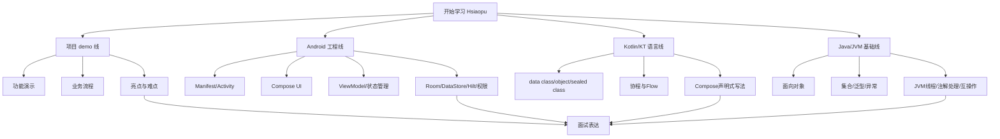
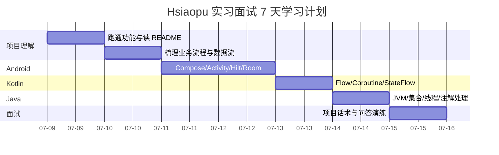

# 00 学习路线总览

本教程从四个角度组织：Java、KT/Kotlin、Android、项目 demo。学习目标是面试能讲、代码能读、问题能定位。

## 四条学习线

## 7 天学习安排

## 每章学习方式

1. 先看“这个项目里怎么用”。
2. 再看“面试官会问什么”。
3. 最后用自己的话复述，要求能不看文档讲出来。

## 你应该重点阅读的源码

| 模块 | 文件 | 面试意义 |
|---|---|---|
| 入口 | `MainActivity.kt` | 单 Activity、Compose、导航、宽屏适配 |
| 应用 | `HsiaopuApp.kt` | Hilt Application 入口 |
| 状态中枢 | `ChatViewModel.kt` | MVVM、StateFlow、协程、业务流程 |
| 数据库 | `data/local/*` | Room Entity、Dao、Database、外键 |
| 数据仓库 | `ChatRepository.kt` | Repository 封装数据访问 |
| 设置 | `SettingsDataStore.kt` | DataStore 保存配置 |
| 网络 | `network/*` | Provider 抽象、Retrofit、OkHttp、SSE 流式响应 |
| 系统能力 | `system/*` | Shizuku、Shell、系统命令 |
| 页面 | `ui/screen/*` | Compose 页面拆分 |
| 主题 | `ui/theme/*` | Material3、动态主题、字体缩放 |

## 面试学习验收标准

- 能画出“用户发送消息到 AI 回复展示”的流程图。
- 能说出 Room 表结构和为什么 messages 要有 conversationId 外键。
- 能解释 `StateFlow` 为什么适合 Compose 状态驱动 UI。
- 能说明 Hilt 注入链路：Application、Activity、ViewModel、Repository、DAO。
- 能讲清 Shizuku 的作用、权限失败路径、系统命令风险。
- 能指出至少 5 个项目可优化点。

