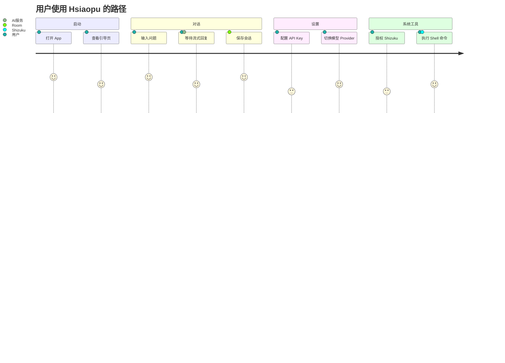
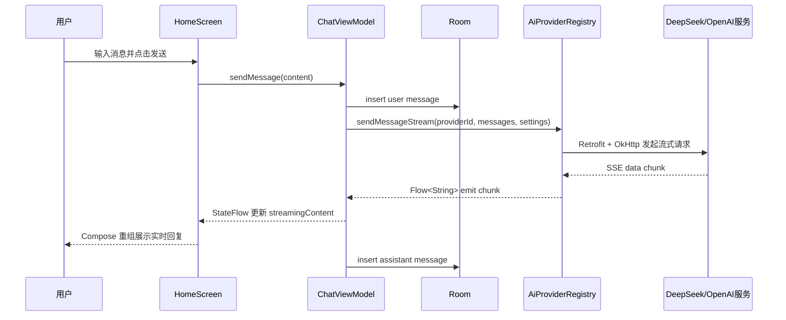

# 01 项目 Demo 业务讲解

## 面试版项目介绍

Hsiaopu 是一个 Android AI 助手 demo，使用 Kotlin 和 Jetpack Compose 开发。它包含 AI 聊天、会话管理、模型服务配置、流式回复、Shell 命令执行、设备信息查看和 Shizuku 高权限系统控制。项目采用 MVVM 思路，UI 通过 Compose 声明式构建，状态由 `ChatViewModel` 的 `StateFlow` 驱动，本地会话用 Room 保存，用户设置用 DataStore 保存，网络层通过 Provider 抽象支持 DeepSeek 和 OpenAI 兼容接口。

## 功能模块

| 页面 | 对应文件 | 功能 |
|---|---|---|
| 启动与主框架 | `MainActivity.kt` | Splash、Onboarding、底部导航、NavigationRail |
| 对话页 | `HomeScreen.kt` | 消息列表、输入框、快速提示、Markdown 展示、复制/导出 |
| Shell 页 | `ShellScreen.kt` | 预置命令、自定义命令、输出复制、Shizuku 状态 |
| 工具页 | `ToolsScreen.kt` | 设备、网络、存储、电池信息 |
| 设置页 | `SettingsScreen.kt` | API Key、Endpoint、Model、主题、Provider、Token 统计 |
| 引导提示 | `FeatureTooltip.kt`、`FeatureGuide.kt` | 首次功能引导与已读状态 |

## Demo 演示脚本

面试中你可以按这个顺序演示：

1. 打开应用，说明这是单 Activity + Compose 的结构。
2. 进入对话页，输入问题，展示流式 AI 回复。
3. 打开设置页，说明 API Key、模型、Endpoint 存在 DataStore。
4. 新建/切换/删除会话，说明 Room 保存 conversations 和 messages。
5. 打开 Shell 页，说明通过 Shizuku 执行系统命令。
6. 打开工具页，说明读取设备信息和网络状态。
7. 讲一个亮点：AI 回复里可包含 `[TOOL:xxx]` 标记，ViewModel 解析后执行系统工具。

## 用户路径图

## 核心业务闭环

## 项目亮点

- 用 `AiProvider` 接口屏蔽不同 AI 服务差异，方便扩展 Provider。
- 用 `StateFlow` 把业务状态集中在 ViewModel，Compose 只负责渲染。
- 用 Room 保存会话和消息，支持历史对话。
- 用 DataStore 保存设置，比 SharedPreferences 更适合协程和 Flow 场景。
- 用 Shizuku 执行高权限系统命令，扩展普通 App 难以完成的系统能力。
- 支持手机底部导航和大屏 NavigationRail + 会话侧栏。

## 当前 demo 的可优化点

- `selectConversation` 每次调用都会新开一个 `collect`，应保存 Job 并取消旧收集，避免多会话切换后重复监听。
- 网络层 DeepSeek 和 OpenAI Compatible 代码重复较多，可抽取 BaseProvider。
- `HttpLoggingInterceptor.Level.BODY` 可能泄露 API Key 或请求内容，发布版应关闭。
- `exportConversationAsJson` 手写 JSON，建议使用 Gson/Moshi 序列化。
- 工具调用用正则解析 `[TOOL:...]`，复杂参数中包含逗号时容易出错，可改成 JSON function calling。
- 危险操作如重启、关机虽然系统提示词要求确认，但代码层没有二次确认防护。
- Room `exportSchema=false` 方便 demo，但正式项目建议导出 schema 并写迁移。

