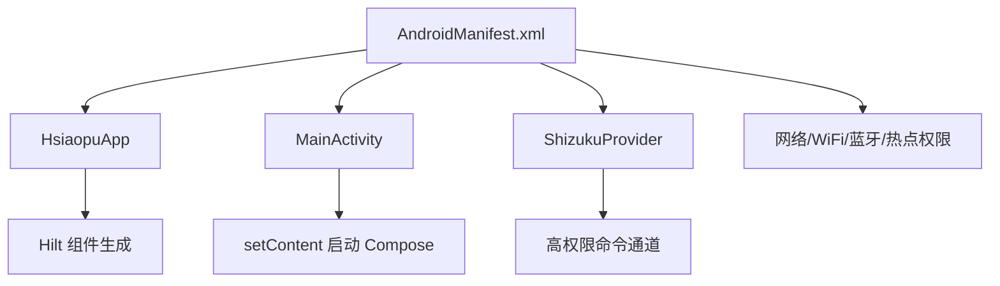
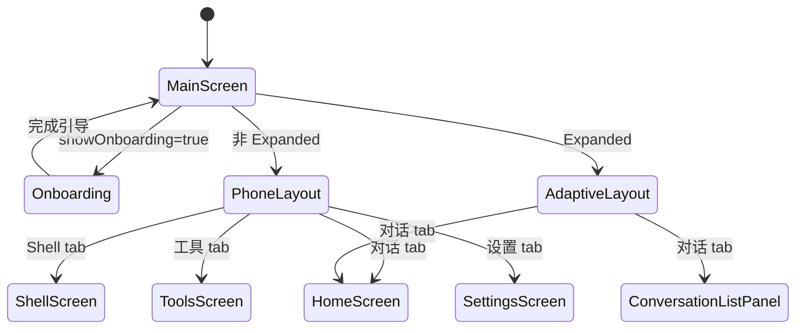

# 02 Android 工程基础

## 工程配置

项目使用 Gradle Kotlin DSL：

- 根目录：`build.gradle.kts`、`settings.gradle.kts`
- 版本目录：`gradle/libs.versions.toml`
- App 模块：`app/build.gradle.kts`

关键配置：

| 配置 | 当前项目 |
|---|---|
| namespace/applicationId | `com.example.hsiaopu` |
| minSdk | 30 |
| compileSdk | 35 |
| targetSdk | 36 |
| UI | Jetpack Compose + Material3 |
| DI | Hilt + KSP |
| DB | Room + KSP |
| 网络 | Retrofit + OkHttp + Gson |
| 设置 | DataStore Preferences |
| 系统权限 | Shizuku |

## Manifest 要点

`AndroidManifest.xml` 声明了：

- `INTERNET`：AI 请求必须联网。
- `ACCESS_NETWORK_STATE`：ViewModel 检测网络状态。
- Wi-Fi、蓝牙、热点相关权限：系统控制能力相关。
- `android:name=".HsiaopuApp"`：Hilt Application 入口。
- `MainActivity`：桌面启动入口。
- `ShizukuProvider`：Shizuku 框架所需 Provider。

## 单 Activity + Compose

项目只有一个主要 Activity：`MainActivity`。

它做了几件事：

1. `installSplashScreen()` 安装启动屏。
2. `enableEdgeToEdge()` 启用沉浸式边缘布局。
3. `setContent { HsiaopuTheme { MainScreen() } }` 启动 Compose。
4. `@AndroidEntryPoint` 让 Activity 能获取 Hilt 注入的 ViewModel。

面试回答：

> 我们采用单 Activity 架构，页面由 Compose Composable 函数拆分。这样可以减少 Fragment 管理复杂度，UI 状态由 ViewModel 和 Compose state 驱动，适合中小型 demo 和现代 Android 开发。

## 响应式布局

`MainScreen` 使用 `currentWindowAdaptiveInfo()` 判断屏幕宽度：

- 小屏：`PhoneLayout` + `NavigationBar`
- 大屏：`AdaptiveLayout` + `NavigationRail` + 会话侧栏

## Android 面试重点

### Activity 生命周期

你需要知道：

- `onCreate` 初始化 UI 和依赖。
- Compose 中状态变化会触发重组，不等于 Activity 重建。
- 横竖屏/配置变化可能导致 Activity 重建，ViewModel 可保留业务状态。

### 权限

普通 Android 权限和 Shizuku 权限要区分：

- Manifest 权限是系统声明。
- 运行时权限需要用户授权。
- Shizuku 是借助外部服务获得 shell/system 级能力。

### 本项目安全点

- API Key 保存在本地 DataStore，但不应打印日志。
- Shell 命令和系统控制能力属于高风险能力，应限制输入和加确认。
- `TETHER_PRIVILEGED` 属于特权权限，普通应用未必能直接获得。

## 常见追问

**为什么不用 XML？**

Compose 可以用 Kotlin 直接描述 UI，状态变化后自动重组，和 `StateFlow` 配合更自然。XML 更成熟，但状态和 UI 更新通常需要更多样板代码。

**为什么要 ViewModel？**

ViewModel 把 UI 状态和业务逻辑从 Activity/Composable 中抽离出来，生命周期比 Activity 配置变化更稳定，适合保存聊天列表、加载状态、错误信息等。

**为什么用 Room？**

Room 在 SQLite 上提供类型安全 DAO、编译期 SQL 校验、Flow 查询支持，适合保存结构化会话和消息。

**为什么用 DataStore？**

DataStore 基于协程和 Flow，异步、安全，适合保存 API Key、模型名、主题等键值配置。

