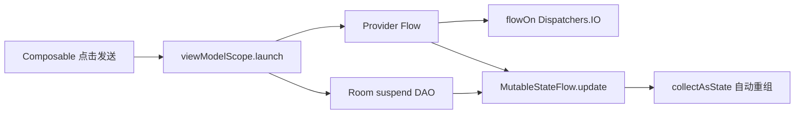
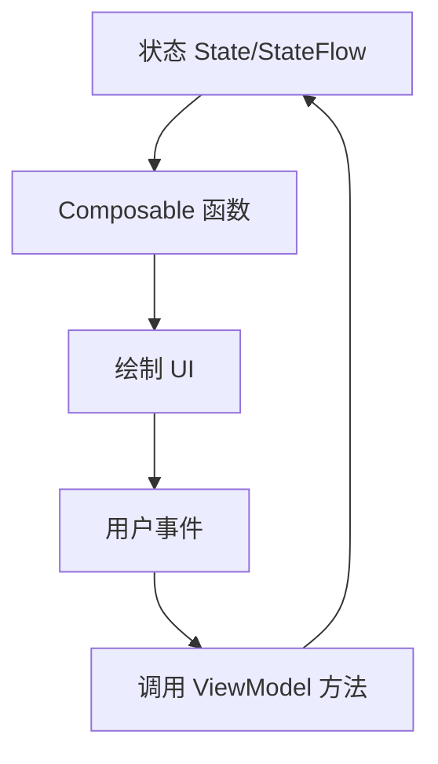

# 03 Kotlin/KT 专项

这个项目虽然源码目录叫 `java`，但实际主代码是 `.kt`。面试时可以说明：Android 项目历史上默认源码目录常叫 `java`，里面可以同时放 Java 和 Kotlin 文件，关键取决于文件后缀和 Gradle Kotlin 插件。

## 项目中用到的 Kotlin 特性

| Kotlin 特性 | 项目例子 | 作用 |
|---|---|---|
| `data class` | `ChatMessage`、`AppSettings`、`ChatUiState` | 承载不可变数据，自动生成 copy/toString/equals |
| `object` | `ShellExecutor`、`SystemControlExecutor` | 单例工具类 |
| `interface` | `AiProvider` | 定义 Provider 抽象 |
| `sealed class` | `MarkdownSegment` | 表示有限类型集合 |
| 扩展/委托 | `Context.dataStore by preferencesDataStore` | 简化 DataStore 创建 |
| 协程 | `viewModelScope.launch`、`withContext(Dispatchers.IO)` | 异步任务 |
| Flow | `StateFlow`、`settingsFlow`、`sendMessageStream` | 响应式数据流 |
| Lambda | `onClick = { ... }` | Compose 事件处理 |

## data class 与不可变状态

`ChatUiState` 是典型 UI 状态对象：

```kotlin
data class ChatUiState(
    val conversations: List<ConversationEntity> = emptyList(),
    val currentConversationId: Long? = null,
    val messages: List<ChatMessage> = emptyList(),
    val isLoading: Boolean = false,
    val streamingContent: String = "",
    val error: String? = null
)
```

更新时用 `copy`：

```kotlin
_uiState.update { it.copy(isLoading = true, error = null) }
```

面试解释：

> Compose 更适合不可变状态。每次状态变化都产生新对象，UI 可以更清晰地感知变化并重组，减少手动刷新 UI 的代码。

## Coroutine 与 Dispatchers

项目中常见三种场景：

- `viewModelScope.launch`：启动和 ViewModel 生命周期绑定的协程。
- `withContext(Dispatchers.IO)`：把数据库、网络、Shell 命令放到 IO 线程。
- `flowOn(Dispatchers.IO)`：指定 Flow 上游执行线程。



## Flow、StateFlow、普通 suspend 的区别

| 类型 | 特点 | 项目使用 |
|---|---|---|
| `suspend fun` | 返回一次结果 | DAO 插入、获取单个会话 |
| `Flow<T>` | 可连续发射多个值 | Room 查询、DataStore 设置、流式 AI chunk |
| `StateFlow<T>` | 永远有当前值的状态流 | `uiState`、`settings`、`themeSettings` |

面试回答：

> Room 的会话列表和消息列表用 Flow，因为数据库变化后 UI 要自动更新。AI 流式回复也用 Flow，因为服务端会不断返回 chunk。ViewModel 暴露 StateFlow，因为 UI 需要随时拿到当前状态。

## Compose 中的 Kotlin 写法

项目里常见：

- `@Composable fun HomeScreen(...)`
- `remember { mutableStateOf(...) }`
- `val uiState by viewModel.uiState.collectAsState()`
- `AnimatedContent(targetState = selectedTab)`
- 事件回调 `onClick = { selectedTab = item.index }`

核心思想：



## Kotlin 面试高频问题

**`val` 和 `var` 区别？**

`val` 引用不可重新赋值，`var` 可以。项目里 UI 状态大多用 `val` 放在 data class 中，避免无意修改。

**`object` 和 `class` 区别？**

`object` 声明单例，项目的 Shell 和系统控制 executor 没有实例状态，适合用单例。

**`Flow` 冷流是什么意思？**

只有被 collect 时才开始执行。比如 `sendMessageStream` 返回 Flow，只有 ViewModel `collect` 后才真正读取网络响应。

**为什么 `StateFlow` 要用私有可变、公开不可变？**

`private val _uiState = MutableStateFlow(...)` 只允许 ViewModel 内部修改；`val uiState: StateFlow` 暴露给 UI 只读，避免 UI 直接改业务状态。

**协程会不会造成内存泄漏？**

如果用 `viewModelScope`，ViewModel 清理时协程会自动取消。但如果在 `selectConversation` 中多次 collect Room Flow 而不取消旧 Job，可能造成重复监听，这是本项目一个可改进点。

