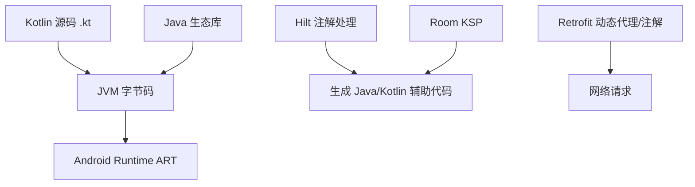
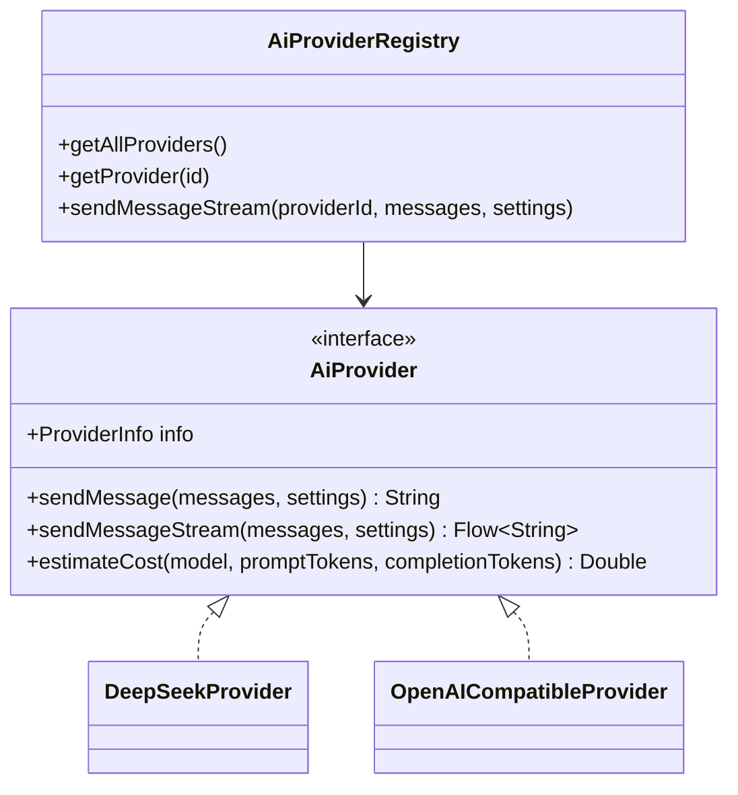
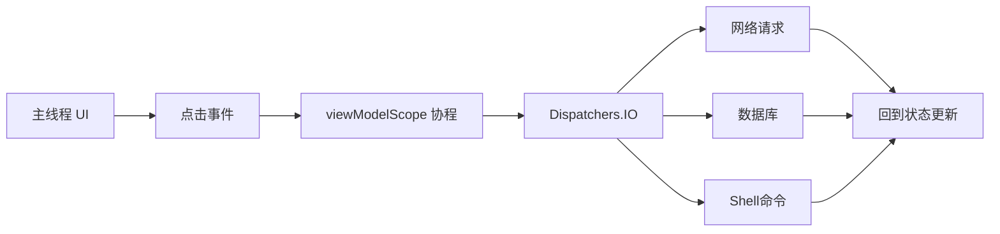

# 04 Java 基础与 JVM 视角

这个项目主要是 Kotlin，但 Android 面试仍然会考 Java，因为 Kotlin 运行在 JVM/ART 上，Hilt、Room、Retrofit 大量依赖 Java 注解、反射、泛型、接口和线程模型。

## Java 和本项目的关系

## 面向对象基础

项目中最典型的 OOP 是 `AiProvider`：

- `AiProvider` 是接口，规定发送消息、流式发送、估算成本等能力。
- `DeepSeekProvider` 和 `OpenAICompatibleProvider` 是实现类。
- `AiProviderRegistry` 持有 Provider 列表，根据 id 选择具体实现。

Java 角度要能讲：

- 接口定义能力，不关心实现。
- 多态让调用方只依赖抽象。
- 这样新增 Provider 时不用改 ViewModel 主流程。

## 集合与泛型

项目里常见类型：

- `List<ChatMessage>`
- `Flow<List<ConversationEntity>>`
- `Map<String, String>`
- `Response<ResponseBody>`

面试要点：

- 泛型让集合有类型约束，减少强转。
- Kotlin 的 `List` 默认只读视图，`MutableList` 才可变。
- Java 泛型有类型擦除，运行时通常拿不到完整泛型信息。

## 异常处理

项目中网络和 Shizuku 操作都可能失败：

- API 请求失败：抛出异常，ViewModel 捕获后写入 `uiState.error`。
- Shizuku 不可用：返回 `SysResult(success=false)` 或 ShellResult 错误。
- JSON 流式解析失败：当前代码忽略单个 chunk 解析异常。

面试表达：

> 异常不应该直接让 App 崩溃。网络层或系统层失败后，ViewModel 会转换成 UI 可展示的 error 或结果对象，让界面提示用户。

## 线程模型

Java/Android 线程基础要知道：

- 主线程负责 UI，不能做耗时操作。
- 网络、数据库、Shell 命令应放到 IO 线程。
- Kotlin 协程不是线程，但会调度到线程池。
- Room 的 `suspend` DAO 和 Flow 查询适合和协程配合。

## 注解与注解处理

项目中的注解：

- `@HiltAndroidApp`
- `@AndroidEntryPoint`
- `@HiltViewModel`
- `@Inject`
- `@Module`
- `@Provides`
- `@Singleton`
- `@Database`
- `@Entity`
- `@Dao`
- `@Query`
- `@Insert`
- `@Composable`

面试解释：

> 注解本身只是元数据，Hilt 和 Room 会通过 KSP/注解处理在编译期生成代码。这样可以减少手写工厂、DAO 实现等样板，同时在编译期发现一部分错误。

## Java 面试高频题

**接口和抽象类区别？**

接口强调能力契约，可以多实现；抽象类适合抽取共同状态和部分实现。本项目 Provider 用接口，因为 DeepSeek 和 OpenAI Compatible 只需要统一能力，不需要共享父类状态。

**HashMap 原理要怎么答？**

HashMap 通过 hash 定位桶，冲突时链表或红黑树处理。面试答到 hash、扩容、负载因子、equals/hashCode 即可。

**线程安全怎么理解？**

多个线程访问同一可变数据时可能出现竞态。项目里大部分 UI 状态集中通过 `MutableStateFlow.update` 修改，数据库交给 Room 管理，降低了手动锁的需求。

**反射是什么？项目哪里有？**

`ShizukuHelper` 通过反射调用 `Shizuku.newProcess()`，绕过库 API 的可见性限制。反射灵活但有风险，可能受库升级影响，也比直接调用更难被编译期检查。

