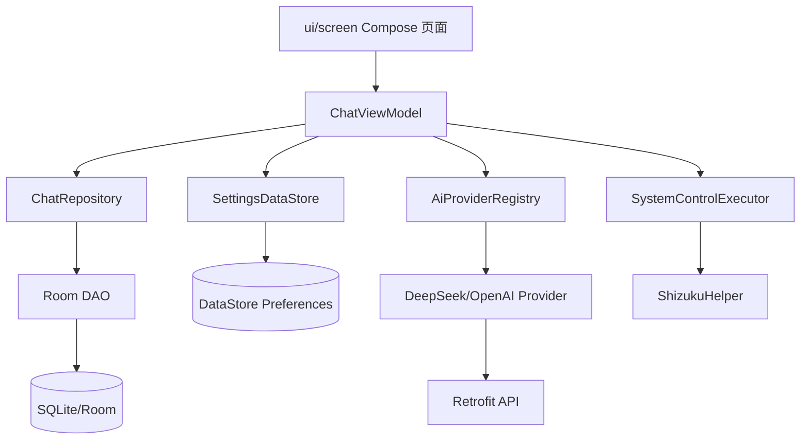
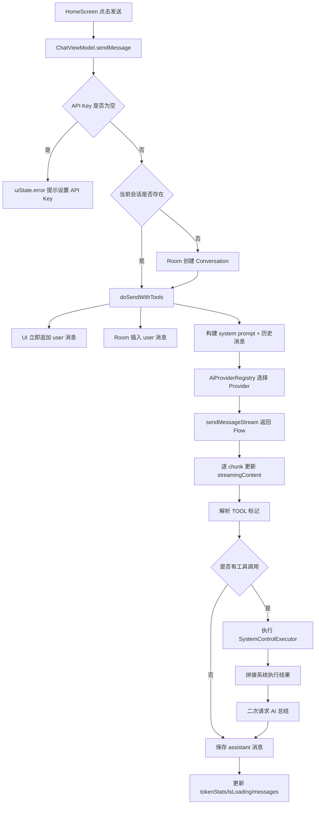
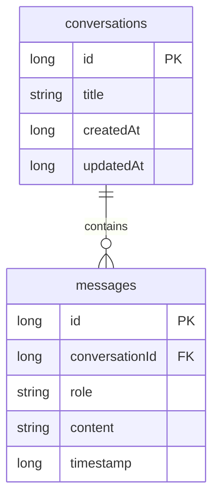
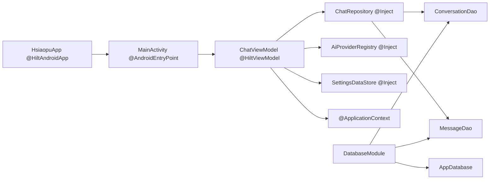

# 05 架构与数据流

## 分层结构

## 角色划分

| 层 | 文件 | 职责 |
|---|---|---|
| UI | `ui/screen/*` | 展示界面、收集输入、调用 ViewModel |
| ViewModel | `ChatViewModel.kt` | 业务流程、状态管理、协程、错误处理 |
| Repository | `ChatRepository.kt` | 封装 Room 数据访问 |
| Local Data | `data/local/*` | Entity、Dao、Database |
| Settings | `SettingsDataStore.kt` | 用户配置持久化 |
| Network | `network/*` | Provider 抽象、请求发送、流式解析 |
| System | `system/*` | Shizuku、Shell、系统命令 |

## UI 状态模型

`ChatUiState` 是这个项目的状态中心：

- `conversations`：左侧/抽屉会话列表。
- `currentConversationId`：当前会话。
- `messages`：当前会话消息。
- `isLoading`：AI 请求中。
- `streamingContent`：流式回复未完成内容。
- `error`：错误提示。
- `tokenStats`：估算 token 和成本。
- `isOnline`：网络状态。

## 发送消息完整流程

## Room 数据模型

设计原因：

- 一个会话对应多条消息。
- `messages.conversationId` 外键关联会话。
- `onDelete = CASCADE` 删除会话时自动删除消息。
- `Index("conversationId")` 提升按会话查消息的速度。

## Hilt 注入链路

## 架构优点

- UI 和业务逻辑分离，方便测试和维护。
- Repository 屏蔽数据库细节。
- Provider 抽象让 AI 服务可扩展。
- StateFlow 和 Compose 配合，状态变化自动更新 UI。
- Hilt 管理依赖，减少手动创建对象。

## 架构风险

- `ChatViewModel` 责任过重，既管聊天、设置、工具调用、导出、网络状态，可后续拆分。
- `SystemControlExecutor` 是全局单例，测试替换不方便，可抽接口并注入。
- 网络 Provider 内部缓存 `_api` 与 `_currentSettings`，多配置快速切换时要关注一致性。
- 工具调用缺少结构化协议和权限确认，正式产品需要更强安全边界。

