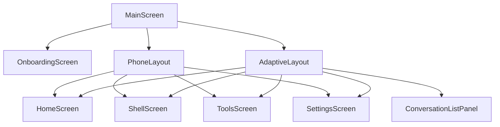
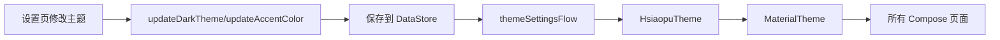

# 06 Compose UI 与主题

## 页面组成

## Compose 的核心思想

传统 View/XML 关注“找到控件然后修改”，Compose 关注“状态是什么，UI 就是什么”。

本项目例子：

- `selectedTab` 改变后，`AnimatedContent` 展示不同页面。
- `uiState.messages` 改变后，消息列表自动重组。
- `streamingContent` 不断更新，界面实时显示 AI 回复。
- `themeSettings` 改变后，Material3 色彩方案更新。

## 状态分类

| 状态 | 位置 | 生命周期 |
|---|---|---|
| 页面临时状态 | `remember { mutableStateOf(...) }` | Composable 存活期间 |
| 业务状态 | `ChatViewModel.uiState` | ViewModel 生命周期 |
| 持久化设置 | `SettingsDataStore` | App 重启后仍在 |
| 数据库状态 | Room Flow | 本地数据库持久化 |

## 主题系统

`HsiaopuTheme` 做了三件事：

1. 从 `ChatViewModel.themeSettings` 读取主题配置。
2. 根据 dark/light/system 决定色彩方案。
3. 使用 `AppTypography()` 根据系统字体缩放生成字体。

## UI 面试表达

**为什么 Compose 适合聊天页？**

聊天页是典型状态驱动界面：消息列表、加载状态、流式内容、错误提示都会频繁变化。Compose 可以直接把状态映射为 UI，减少手动 notify 和控件引用。

**`remember` 和 ViewModel 状态怎么选？**

- 只影响当前 Composable 的临时 UI 状态，用 `remember`。
- 业务状态、网络结果、数据库结果，用 ViewModel。
- 重启后还要保存的，用 Room 或 DataStore。

**为什么要区分 PhoneLayout 和 AdaptiveLayout？**

手机屏幕适合底部导航；大屏有更多横向空间，可以用 NavigationRail 和会话侧栏，提高信息密度。

## Markdown 渲染

`HomeScreen.kt` 中有简化 Markdown 解析：

- `MarkdownSegment.Text`
- `MarkdownSegment.Code`
- `MarkdownSegment.InlineCode`
- `MarkdownSegment.Header`
- `MarkdownSegment.ListItem`

面试可以讲：

> 当前是 demo 级解析，能支持常见回答格式；正式项目可接入成熟 Markdown 渲染库，支持表格、链接、代码高亮和更完整的语法。

## Compose 常见坑

- 在 Composable 中直接做耗时操作会卡 UI，应放 ViewModel/协程。
- `remember` 不适合保存业务长期状态。
- 列表项缺少稳定 key 时，频繁更新可能带来滚动和重组问题。
- 状态对象过大或更新太频繁会增加重组成本。
- `collectAsState()` 适合 UI 层观察 Flow，但 Flow 的生产逻辑应在 ViewModel/Repository。

