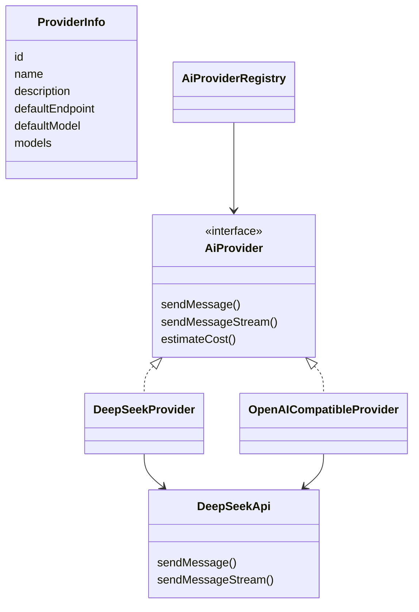
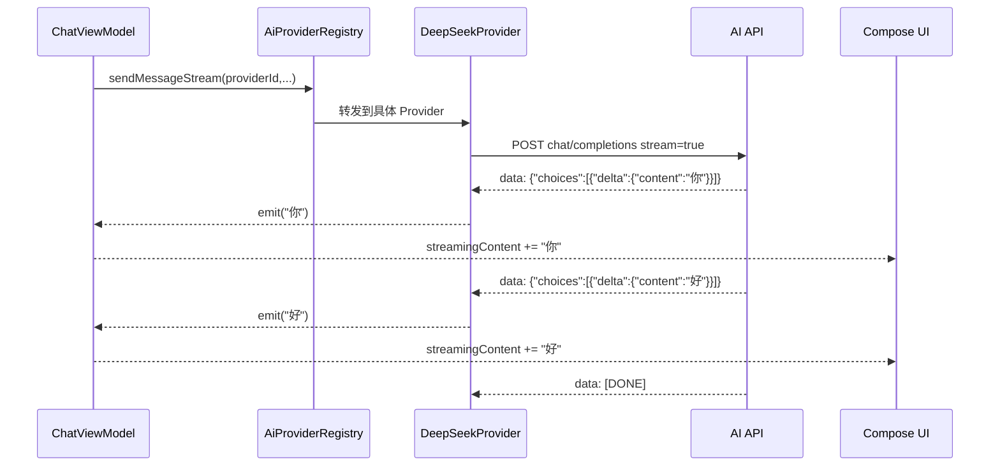

# 07 网络、AI Provider 与流式响应

## 网络层结构

## Provider 抽象

`AiProvider` 统一了三种能力：

- 普通请求：`sendMessage`
- 流式请求：`sendMessageStream`
- 成本估算：`estimateCost`

`AiProviderRegistry` 根据 `providerId` 查找具体 Provider。这样 ViewModel 不需要知道 DeepSeek 和 OpenAI Compatible 的细节。

## Retrofit 请求

`DeepSeekApi` 定义两个接口：

- `sendMessage`：非流式，一次返回完整 `ChatResponse`。
- `sendMessageStream`：加 `@Streaming` 和 `Accept: text/event-stream`，返回 `ResponseBody`。

## OkHttp 配置

Provider 中创建 OkHttpClient：

- 添加 Authorization Header。
- 添加 HttpLoggingInterceptor。
- 设置 connect/read timeout。

面试注意：

> 日志拦截器 BODY 级别能帮助调试，但正式发布要关闭或降级，因为可能打印 API Key、用户输入和模型回复。

## 流式响应流程

## SSE 解析逻辑

当前代码读取 ResponseBody 的每一行：

1. 只处理 `data: ` 开头的行。
2. 遇到 `[DONE]` 结束。
3. 用 Gson 解析 chunk。
4. 取 `choices.firstOrNull()?.delta?.content`。
5. 非空则 `emit(content)`。

## Token 统计

项目中 token 统计是估算：

- prompt 字符数 / 4
- completion 字符数 / 4
- 根据模型单价估算成本

面试要点：

> 这是 demo 级估算，不等于真实 API usage。正式项目应优先读取服务端返回的 usage 字段，或者接入 tokenizer。

## 网络错误处理

可能错误：

- API Key 为空。
- 网络不可用。
- HTTP 非 2xx。
- ResponseBody 为空。
- JSON chunk 解析失败。
- Provider id 不存在。

ViewModel 会 catch 异常并写入 `uiState.error`。

## 可优化方向

- 抽取 BaseOpenAICompatibleProvider，减少 DeepSeek 和 OpenAI Compatible 重复代码。
- 使用拦截器隐藏敏感 Header。
- 增加重试、取消请求、超时 UI。
- 将工具调用协议改成结构化 JSON。
- 支持真实 token usage。
- 使用依赖注入提供 OkHttp/Retrofit，便于测试和复用。

