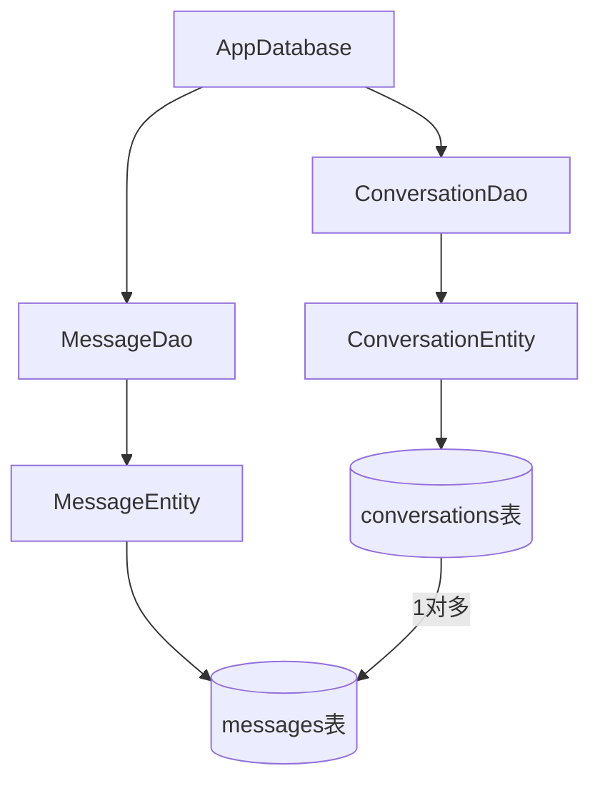
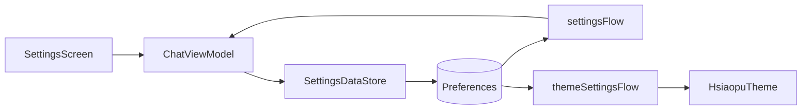
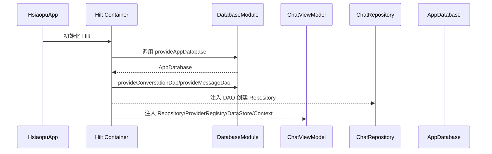

# 08 Room、DataStore、Hilt

## 三者分别解决什么

| 技术 | 解决问题 | 本项目保存什么 |
|---|---|---|
| Room | 结构化关系数据 | 会话、消息 |
| DataStore | 键值配置 | API Key、Endpoint、模型、主题、引导已读 |
| Hilt | 依赖创建与注入 | Database、Dao、Repository、ViewModel 依赖 |

## Room 设计

`ConversationEntity`：

- `id` 主键，自增。
- `title` 会话标题。
- `createdAt` 创建时间。
- `updatedAt` 更新时间。

`MessageEntity`：

- `id` 主键，自增。
- `conversationId` 外键。
- `role`：user/assistant/system。
- `content`：消息内容。
- `timestamp`：时间戳。

## DAO 设计

`ConversationDao`：

- 查询所有会话，按更新时间倒序。
- 按 id 查询。
- 插入、更新、删除。

`MessageDao`：

- 按 conversationId 查询消息，按时间正序。
- 插入单条/多条。
- 删除会话下所有消息。

## Repository 意义

`ChatRepository` 封装 DAO：

- UI/ViewModel 不直接依赖 SQL 和 DAO 细节。
- 后续如果数据来源改成云同步，可以先在 Repository 层扩展。
- 面试中这是 MVVM 常见分层。

## DataStore 设计

`SettingsDataStore` 使用 Preferences DataStore。

配置项：

- `api_key`
- `api_endpoint`
- `model_name`
- `system_prompt`
- `temperature`
- `max_tokens`
- `provider_id`
- `dark_theme`
- `accent_color`
- 功能引导已读 key

## Hilt 注入

关键注解：

- `@HiltAndroidApp`：应用入口，生成 Hilt 组件。
- `@AndroidEntryPoint`：Activity 可使用 Hilt。
- `@HiltViewModel`：ViewModel 可注入构造参数。
- `@Inject constructor`：声明构造注入。
- `@Module + @Provides`：告诉 Hilt 如何创建 Room Database 和 DAO。
- `@Singleton`：单例作用域。

## 依赖创建流程

## 面试常见问答

**Room 和 SQLite 区别？**

SQLite 是底层数据库，Room 是官方 ORM/抽象层，提供注解、DAO、编译期 SQL 校验、Flow 支持。

**DataStore 和 SharedPreferences 区别？**

DataStore 是异步、基于 Flow、类型更安全的现代方案；SharedPreferences 容易主线程阻塞，异步提交语义也不够清晰。

**Hilt 为什么比手动 new 好？**

依赖关系集中管理，生命周期清晰，测试更方便，也减少重复创建和样板代码。

**什么时候用 `@Singleton`？**

全局共享且创建成本较高或需要统一状态的对象，如 Database、Repository、DataStore、ProviderRegistry。

## 本项目改进建议

- Room 添加 migration，正式项目不要一直使用 `exportSchema=false`。
- API Key 可进一步加密保存，例如 Android Keystore。
- Repository 可加入事务，例如删除会话时显式删除消息或依赖外键级联。
- Hilt 可注入 OkHttpClient/Retrofit，避免每个 Provider 重建。

