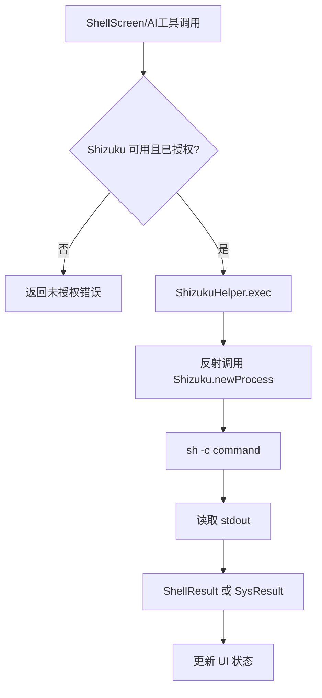
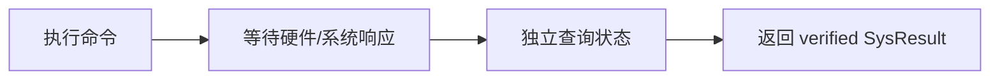
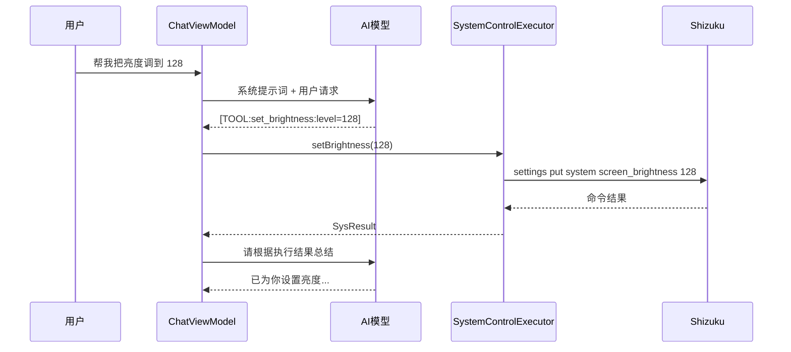

# 09 系统权限、Shell 与 Shizuku

## 为什么需要 Shizuku

普通 Android App 权限有限，很多系统级操作不能直接做，例如：

- 执行 `svc wifi enable`
- 读取 `dumpsys`
- 强制停止应用
- 修改系统设置
- 截屏、重启、关机等命令

Shizuku 通过一个高权限服务，让普通 App 在用户授权后调用系统 API 或执行 shell 命令。

## 当前项目系统模块

| 文件 | 职责 |
|---|---|
| `ShizukuHelper.kt` | 检查 Shizuku 可用性、权限、执行命令 |
| `ShellExecutor.kt` | Shell 页面执行预置/自定义命令 |
| `SystemControlExecutor.kt` | AI 工具可调用的系统控制能力 |

## Shizuku 执行流程



## ShellExecutor

`ShellExecutor` 提供：

- 预置命令列表，如 CPU、内存、进程、网络、存储、包信息。
- `execute(command): Flow<ShellResult>`。
- 在 IO 线程执行命令。
- 对 Shizuku 不可用、未授权、异常分别返回错误。

## SystemControlExecutor

它是 AI 工具调用的执行器，分为：

- 开关控制：WiFi、蓝牙、热点、移动数据、飞行模式、NFC。
- 调节：亮度、音量。
- 查询：CPU、内存、网络、磁盘、电池、传感器、包列表。
- 应用管理：强停、清数据、卸载。
- 文件操作：列表、读取、删除。
- 系统操作：截屏、重启、关机。

写操作通常是：



这个设计比只看命令返回值更可靠，因为很多 Android shell 命令成功执行不代表状态真的改变。

## AI 工具调用机制

`ChatViewModel` 会在系统提示词中告诉 AI 可用工具格式：

```text
[TOOL:action_name:param1=value1,param2=value2]
```

例如：

```text
[TOOL:set_brightness:level=128]
```

ViewModel 用正则解析工具标记，映射到 `SystemControlExecutor` 对应函数，执行后把结果拼进回复。如果执行了工具，还会让 AI 进行第二轮总结。



## 面试风险点

- 高权限命令必须有明确授权和用户确认。
- 命令字符串拼接可能有注入风险，文件路径、包名等参数应校验。
- 反射调用 Shizuku 内部方法对库版本敏感。
- 重启、关机、卸载、删除文件等危险操作应在代码层二次确认。
- 不同 Android 版本和厂商 ROM 对命令支持不同。

## 面试回答模板

> 这个项目里 Shizuku 是系统能力扩展层。普通 App 不能直接执行很多系统命令，所以我先检查 Shizuku 是否可用和授权，再通过统一的 helper 执行 shell。写操作不会只依赖命令返回值，而是执行后再查询状态进行验证，最后用统一的 SysResult 返回给 UI 或 AI 总结流程。

