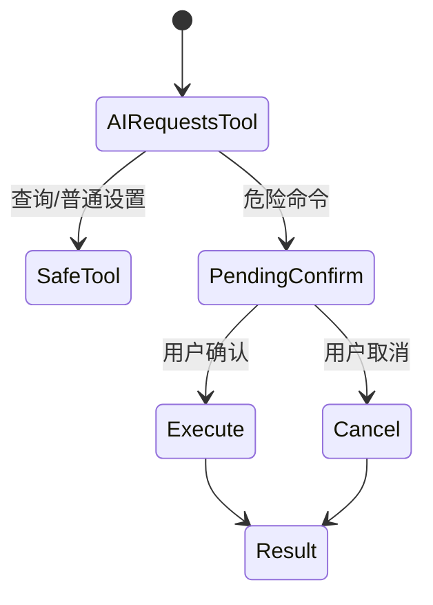
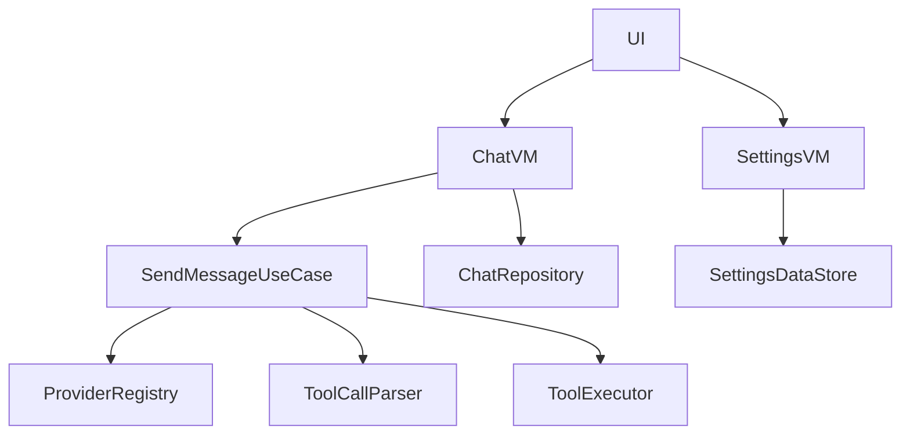

# 11 实战任务清单

这一章用于把“看懂”变成“会改”。每个任务都可以成为面试中的项目复盘素材。

## 初级任务

### 任务 1：给会话标题增加“未命名会话”兜底

目标：

- 熟悉 `ChatRepository`、`ConversationEntity`、`ChatViewModel`。

思路：

- 创建会话时检查 title 是否为空。
- `getConversationTitle` 对空白输入返回默认标题。

面试讲法：

> 我处理了边界输入，避免空白标题影响会话列表展示。

### 任务 2：关闭发布版网络 BODY 日志

目标：

- 熟悉 OkHttp 拦截器和安全意识。

思路：

- 根据 BuildConfig.DEBUG 设置日志级别。
- release 设置为 NONE。

面试讲法：

> 调试日志可能包含 API Key 和用户消息，所以发布版必须关闭敏感日志。

### 任务 3：用 Gson 改写导出 JSON

目标：

- 避免手写 JSON 转义错误。

思路：

- 定义 ExportConversation data class。
- 使用 Gson 序列化。

## 中级任务

### 任务 4：修复切换会话重复 collect

当前风险：

`selectConversation` 每次都会启动新的 `viewModelScope.launch { repository.getMessagesByConversation(id).collect { ... } }`，旧的 collect 没取消。

建议：

```kotlin
private var messagesJob: Job? = null

fun selectConversation(id: Long) {
    messagesJob?.cancel()
    messagesJob = viewModelScope.launch {
        repository.getMessagesByConversation(id).collect { ... }
    }
}
```

面试价值：

- 能讲协程 Job 管理。
- 能讲 Flow collect 生命周期。
- 能体现你不只是会写功能，也会发现隐性问题。

### 任务 5：抽取 Base Provider

当前问题：

`DeepSeekProvider` 和 `OpenAICompatibleProvider` 很多代码重复。

建议：

- 抽取公共的 Retrofit 创建逻辑。
- 抽取 SSE 解析逻辑。
- 子类只提供 `ProviderInfo` 和计费策略。

### 任务 6：工具调用改成 JSON

当前格式：

```text
[TOOL:set_brightness:level=128]
```

建议格式：

```json
{"tool":"set_brightness","args":{"level":128}}
```

收益：

- 参数解析更可靠。
- 可以支持数组、字符串转义、嵌套参数。
- 更接近真实大模型 function calling 思路。

## 高级任务

### 任务 7：危险命令二次确认

危险操作：

- `reboot`
- `shutdown`
- `uninstall`
- `delete_file`
- `clear_data`

设计：



面试价值：

> 高权限能力必须有安全边界，不能完全相信模型输出。

### 任务 8：为 Repository 写单元测试

目标：

- 使用 Room in-memory database。
- 测试创建会话、插入消息、删除会话级联删除。

面试价值：

- 能展示测试意识。
- 能讲数据库行为验证。

### 任务 9：拆分 ChatViewModel

当前职责：

- 会话管理
- 发送消息
- 设置更新
- 主题更新
- token 统计
- 工具调用
- 网络状态轮询

可拆：

- `ChatViewModel`
- `SettingsViewModel`
- `SystemToolViewModel`
- `ChatUseCase`
- `ToolCallParser`



## 面试复盘模板

```text
我在这个项目里遇到的一个问题是：____。
最开始的现象是：____。
我定位到原因是：____。
我的解决方案是：____。
这个方案的权衡是：____。
如果后续继续优化，我会：____。
```

## 最终自测清单

- 能独立跑通项目。
- 能指出每个主页面对应的文件。
- 能画出发送消息流程。
- 能解释 Room 表关系。
- 能解释 DataStore 保存哪些配置。
- 能解释 Hilt 注入链路。
- 能解释 Flow/StateFlow/Coroutine。
- 能解释 Shizuku 权限和风险。
- 能说出 5 个优化点。
- 能用 2 分钟完整介绍项目。

