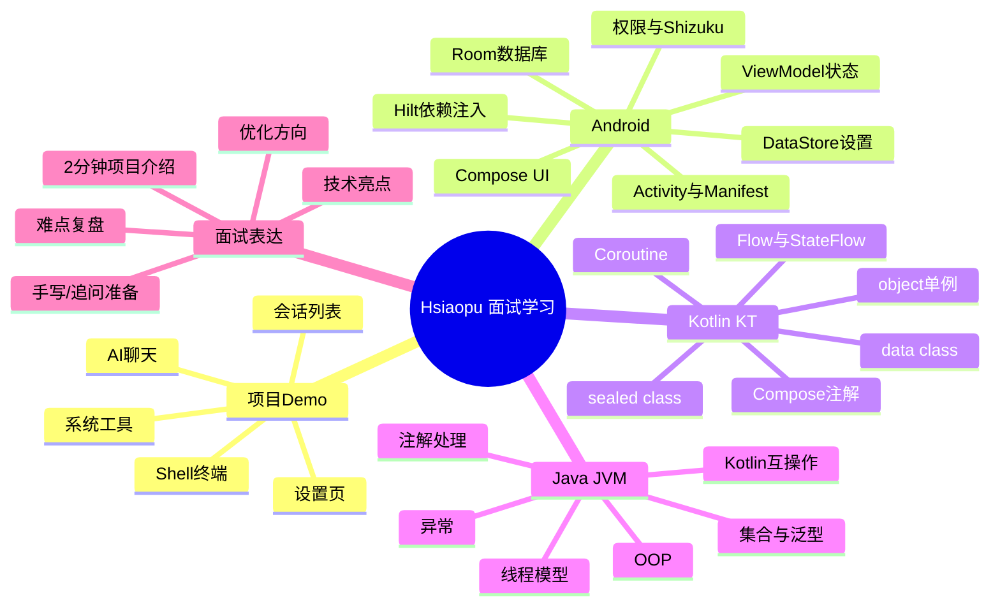
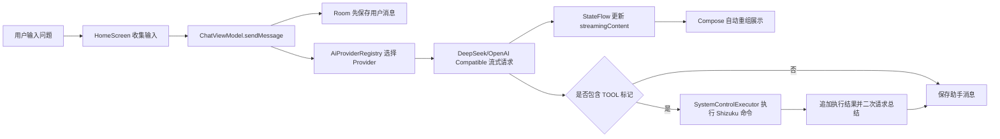

# Hsiaopu 项目实习面试学习教程

这套教程基于当前项目 `D:\Hsiaopu\app\src\main\java\com\example\hsiaopu` 编写，目标不是泛泛学习 Android，而是让你能围绕这个 demo 在实习面试中讲清楚：项目做了什么、用了什么技术、为什么这样设计、代码流程怎么跑、遇到问题怎么定位。

## 学习顺序

1. 先读 `00_学习路线总览.md`，建立项目地图和面试准备路线。
2. 再读 `01_项目Demo业务讲解.md`，学会用 2 分钟讲清项目。
3. 然后按 `02_Android工程基础.md`、`03_Kotlin_KT专项.md`、`04_Java基础与JVM视角.md` 补技术底座。
4. 接着读 `05_架构与数据流.md` 到 `09_系统权限Shell与Shizuku.md`，把项目核心链路吃透。
5. 最后用 `10_实习面试题库与回答模板.md` 和 `11_实战任务清单.md` 做面试演练。

## 项目一句话

Hsiaopu 是一个基于 Jetpack Compose 的 Android AI 助手 demo，支持聊天、多模型 Provider、会话持久化、设置持久化、流式 AI 回复、Shell 命令执行、Shizuku 高权限系统工具和设备信息查看。

## 总体脑图



## 当前源码地图

```text
app/src/main/java/com/example/hsiaopu
├── MainActivity.kt                 # 单 Activity 入口，Compose 内容、手机/宽屏适配
├── HsiaopuApp.kt                   # Hilt Application 入口
├── viewmodel/ChatViewModel.kt      # 业务中枢：状态、会话、发送消息、工具调用
├── data/
│   ├── Models.kt                   # 网络模型、UI消息模型、设置模型
│   ├── SettingsDataStore.kt        # DataStore 设置持久化
│   ├── FeatureGuide.kt             # 功能引导 Key
│   ├── repository/ChatRepository.kt
│   └── local/                      # Room Entity / Dao / Database
├── network/                        # AI Provider、Retrofit API、流式响应解析
├── system/                         # Shizuku、Shell、系统控制命令
├── ui/screen/                      # Compose 页面
└── ui/theme/                       # Material3 主题、颜色、字体
```

## 面试时的核心主线



## 你最终要能回答

- 这个项目的功能边界是什么？
- 为什么用 Compose 而不是 XML？
- 为什么用 ViewModel + StateFlow 管理状态？
- Room 和 DataStore 分别保存什么？
- Hilt 在项目里注入了哪些对象？
- AI 流式响应是怎么解析并展示的？
- Shizuku 为什么需要，权限失败怎么处理？
- 这个项目有哪些风险和可优化点？

